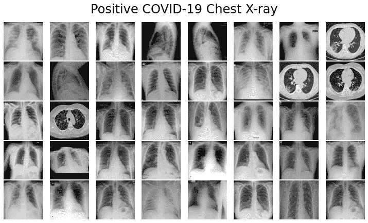
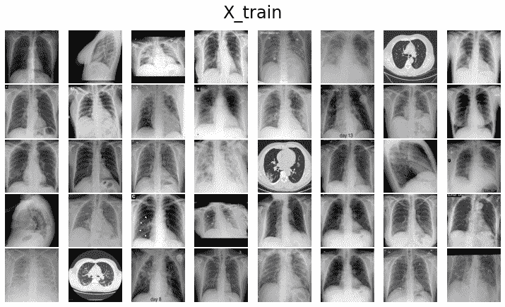
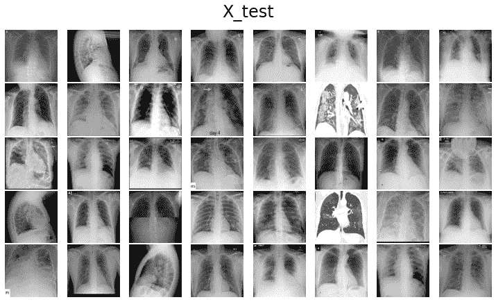
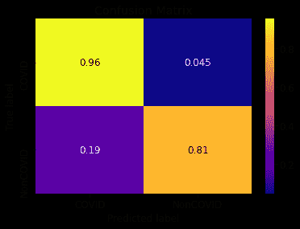

# 迁移学习:来自胸部 x 光分类器的新冠肺炎

> 原文：<https://towardsdatascience.com/transfer-learning-covid-19-from-chest-x-rays-classifier-66d6c483fb03?source=collection_archive---------11----------------------->


照片由[泰在](https://unsplash.com/@taiscaptures?utm_source=medium&utm_medium=referral) [Unsplash](https://unsplash.com?utm_source=medium&utm_medium=referral) 上抓拍

## 关于如何进行迁移学习的详细概述以及每一步背后的一些理论。

# **简介**

冠状病毒病(新冠肺炎)是一种由新发现的冠状病毒引起的传染病。大多数感染新冠肺炎病毒的人会经历轻度至中度的呼吸道疾病，无需特殊治疗即可康复。老年人以及那些患有心血管疾病、糖尿病、慢性呼吸系统疾病和癌症等潜在疾病的人更有可能患上严重疾病。(世卫组织，2020 年)。虽然大多数新冠肺炎患者康复并恢复正常健康，但一些患者在急性疾病康复后可能会出现持续数周甚至数月的症状。即使是没有住院的人和病情较轻的人也可能出现持续或晚期症状。(美国疾病预防控制中心，2020 年)。

正在进行多年的研究以进一步调查，并且目前进行这些实验的一种方式是通过分析以前的新冠肺炎患者根据时间肺部和胸腔其他方面的变化。这需要时间和大量资源。然而，机器学习技术不仅可以用于测试目的，还可以用于对延迟效应的长期研究。因此，这个项目的目的是建立一个二元分类器来确定 X 射线图像中新冠肺炎的存在。

本文中使用的数据集可以在[这里](https://github.com/ieee8023/covid-chestxray-dataset)找到，这是一个由 441 个正面和 505 个正常图像组成的开源存储库。然而，来自卡塔尔多哈的卡塔尔大学和孟加拉国达卡大学的一组研究人员与他们来自巴基斯坦和马来西亚的合作者一起，与医生合作，为新冠肺炎阳性病例和正常图像创建了一个胸部 X 射线图像数据库，可在 Kaggle 上以“[新冠肺炎射线照相数据库](https://www.kaggle.com/tawsifurrahman/covid19-radiography-database)的名称获得。在当前版本中，有 1143 个新冠肺炎阳性图像和 1341 个正常图像。类似于这里介绍的方法也可以应用于后一个数据集，这似乎比本例中使用的方法更加健壮和可靠。

# 一些 ML 伦理

本文的主要目的是在一个有趣的话题中展示迁移学习的方法。这种方法不应该被认为是对病人的诊断，因为它是在这里提出的。为了让它服务于大规模的预测，必须进行额外的研究和改进。这篇文章的发现和方法并不意味着鼓励读者自我诊断或诊断其他人对新冠肺炎的看法。如果你有任何症状，或者与被诊断患有新冠肺炎的人有过接触，请遵循你所在国家制定的方案，并从你所在地区更准确的检测方法中寻求安慰。最重要的是，请保持安全。

# **数据预处理**

这个项目利用深度学习来建立胸部 x 光图像的二元分类器，并预测新冠肺炎的存在。这些图像经过预处理并调整到 150528 尺寸(224，224，3)，这意味着它们从 BGR 转换为 RGB 颜色格式。这在使用 [OpenCV 库](https://opencv.org/releases/)的 imread()方法时尤其必要，因为它的颜色顺序是 BGR，不同于 [Pillow](https://pillow.readthedocs.io/en/stable/) 假定颜色顺序为 RGB。图像被转换成像素矩阵，然后归一化到 0 和 1 之间的区间。在预处理之后，根据它们的原始目录给每个图像分配标签。下面可以看到这些图像的概述。



**图片 1(作者):**根据数据集，显示了使用和不使用新冠肺炎的胸部 x 光图像。标签是根据从公共数据集下载的原始目录分配的。假设图像被适当地分类，因为我缺乏医疗保健科学方面的专业知识，不允许我对图像是否被正确标记做出准确的推断。

在预处理之后，大约 20%的数据集被留出用于测试，剩下 80%的图像用于训练。下面可以看到这两个数据集的一瞥。请注意，有些图像似乎来自核磁共振成像研究，而不是胸部 x 光片。此外，一些 x 光片似乎是侧面图像和 CT 扫描。这是该模型的一个缺点，因为几乎不可能有一个完美的公共数据集。然而，在训练之前，可以采取额外的预处理步骤来分割每种类型的扫描。鉴于该数据集中可用的图像数量有限，这种预处理步骤将被取消，但可能会在该实验的未来迭代中重新考虑。



**图 2(作者):**数据集被分割用于训练和测试后的一瞥。

# **型号**

[具有 imagenet 权重的 VGG19 卷积神经网络](https://iq.opengenus.org/vgg19-architecture/) (CNN)被用作我们的模型的核心。 [Keras](https://keras.io/) 应用程序类允许我们导入 CNN，有一个 [2D 最大池输出层](https://keras.io/api/layers/pooling_layers/max_pooling2d/)的形状(7，7，512)并且没有参数。因此，[转移学习](/what-is-deep-transfer-learning-and-why-is-it-becoming-so-popular-91acdcc2717a)用于使输出层适应二元分类器，因为我们只有两个分类类，Covid19 和 No-Covid19。输出从最后一层提取，并作为参数添加到[展平层](https://medium.com/@PK_KwanG/cnn-step-2-flattening-50ee0af42e3e)。这一层将数据转换成一维数组作为单个长特征向量，用于将其输入到下一层作为完全连接的层。在我们的示例中，由于该层位于 shape (7，7，512)的 2D 最大池输出层之后，因此展平数组的维数为 7*7*512 = 25088。这通常在 CNN 的最后阶段完成，因为矩形或立方体形状不能直接输入。

接下来，增加一个[脱落层](https://machinelearningmastery.com/dropout-for-regularizing-deep-neural-networks/)主要作为一种有效的正则化方法来减少[过拟合](https://machinelearningmastery.com/introduction-to-regularization-to-reduce-overfitting-and-improve-generalization-error/)和改善泛化误差。由于我们的目标是建立一个二元分类器，层的输出被丢弃的概率被设置为 0.5，这实际上是一个常见的值。这是在假设相对较小的数据集上的大型神经网络通常会过度拟合训练数据，从而降低我们的验证准确性的情况下完成的。当模型过度拟合时，模型会学习训练数据中的统计噪声，导致在新数据(主要是我们的验证数据集)上评估模型时性能不佳。

然后，添加两个单位(用于分类两个不同的对象)的密集层作为输出层，并使用 [softmax](https://machinelearningmastery.com/softmax-activation-function-with-python/) 函数作为激活函数。Softmax 通常用于预测多项式概率分布的神经网络模型的输出层。换句话说，它可以用于多类分类。然而，它仍然适用于两个单元密集层中的二元分类器。

最后，使用[分类交叉熵损失函数](https://peltarion.com/knowledge-center/documentation/modeling-view/build-an-ai-model/loss-functions/categorical-crossentropy)(因为模型的输出是分类的)和[亚当优化器](https://machinelearningmastery.com/adam-optimization-algorithm-for-deep-learning/)来编译模型。交叉熵损失允许训练 CNN，使得它输出每个图像的类的概率，这有助于从概率上区分一个图像和另一个图像。作为随机梯度下降的扩展，Adam 优化器应用 Adam 优化算法来基于训练数据迭代地更新网络权重。它保持每个参数的学习率，该学习率提高了在具有稀疏梯度的问题上的性能，并且基于权重的梯度的最近幅度的平均值(例如，它变化得有多快)进行调整。这意味着这个优化器在有噪声的问题上表现很好，考虑到我们之前提到的数据集的缺点，这一点很重要。有关模型的摘要，请参见下面的输出。

```
Model: "model" _________________________________________________________________ Layer (type)                 Output Shape              Param #    ================================================================= input_1 (InputLayer)         [(None, 224, 224, 3)]     0          _________________________________________________________________ block1_conv1 (Conv2D)        (None, 224, 224, 64)      1792       _________________________________________________________________ block1_conv2 (Conv2D)        (None, 224, 224, 64)      36928      _________________________________________________________________ block1_pool (MaxPooling2D)   (None, 112, 112, 64)      0          _________________________________________________________________ block2_conv1 (Conv2D)        (None, 112, 112, 128)     73856      _________________________________________________________________ block2_conv2 (Conv2D)        (None, 112, 112, 128)     147584     _________________________________________________________________ block2_pool (MaxPooling2D)   (None, 56, 56, 128)       0          _________________________________________________________________ block3_conv1 (Conv2D)        (None, 56, 56, 256)       295168     _________________________________________________________________ block3_conv2 (Conv2D)        (None, 56, 56, 256)       590080     _________________________________________________________________ block3_conv3 (Conv2D)        (None, 56, 56, 256)       590080     _________________________________________________________________ block3_conv4 (Conv2D)        (None, 56, 56, 256)       590080     _________________________________________________________________ block3_pool (MaxPooling2D)   (None, 28, 28, 256)       0          _________________________________________________________________ block4_conv1 (Conv2D)        (None, 28, 28, 512)       1180160    _________________________________________________________________ block4_conv2 (Conv2D)        (None, 28, 28, 512)       2359808    _________________________________________________________________ block4_conv3 (Conv2D)        (None, 28, 28, 512)       2359808    _________________________________________________________________ block4_conv4 (Conv2D)        (None, 28, 28, 512)       2359808    _________________________________________________________________ block4_pool (MaxPooling2D)   (None, 14, 14, 512)       0          _________________________________________________________________ block5_conv1 (Conv2D)        (None, 14, 14, 512)       2359808    _________________________________________________________________ block5_conv2 (Conv2D)        (None, 14, 14, 512)       2359808    _________________________________________________________________ block5_conv3 (Conv2D)        (None, 14, 14, 512)       2359808    _________________________________________________________________ block5_conv4 (Conv2D)        (None, 14, 14, 512)       2359808    _________________________________________________________________ block5_pool (MaxPooling2D)   (None, 7, 7, 512)         0          _________________________________________________________________ flatten (Flatten)            (None, 25088)             0          _________________________________________________________________ dropout (Dropout)            (None, 25088)             0          _________________________________________________________________ dense (Dense)                (None, 2)                 50178      ================================================================= Total params: 20,074,562 Trainable params: 50,178 Non-trainable params: 20,024,384 _________________________________________________________________
```

# **测试和分析**

在我们的 VGG19 CNN 上进行迁移学习后，该模型使用 250 个时期的 32 个批次大小进行训练。基于 F-1 分数，其准确度为 0.88，并且能够在第一个 50 个时期后达到类似的验证和训练准确度，这可以从下图的模型准确度图中看出。之所以选择这一精确度指标，是因为它也被称为精确度和召回率的调和平均值。它是根据测试的精确度和召回率计算的，其中精确度是正确识别的阳性结果的数量除以所有阳性结果的数量，包括那些没有正确识别的阳性结果，而召回率是正确识别的阳性结果的数量除以本应被识别为阳性的所有样本的数量。


**图 1(作者):**我们的二元分类器相对于历元数的训练和验证(测试)精度。

还绘制了受试者操作特征曲线(ROC 曲线),其说明了当其辨别阈值变化时我们的二元分类器的诊断能力。ROC 曲线是通过在各种阈值设置下绘制真阳性率(TPR)对假阳性率(FPR)来创建的。真阳性率也称为回忆灵敏度，而假阳性率也称为虚警概率，可以计算为(1 特异性)。因此，ROC 曲线是灵敏度或回忆作为脱落的函数。因此，一个好的分类器能够具有高召回率和低假阳性率。如图 2 所示，我们的模型在假阳性率低于 0.1 时达到了高于 0.8 的真阳性率，表明性能良好。


**图 2(作者):**我们模型的 ROC 曲线。请注意如何在低假阳性率的情况下达到高召回率(真阳性率)。

最后，还绘制了归一化混淆矩阵来评估我们的模型的性能。注意大多数图像是如何被正确分类为真阳性和真阴性的。此外，假阴性率低于假阳性率，这对于新冠肺炎的环境是合乎需要的。换句话说，更保守的做法是出现假阳性，要求患者隔离，而不是错误地将阳性病例归类为阴性，允许患者外出聚会，同时传播病毒。



**图 3(作者):**预测图像的归一化混淆矩阵。

# **优化**

请注意图 1 中的**验证准确度有时会高于训练准确度。在这种情况下，假设模型不会过度拟合，但是，可能是丢弃层导致了一些奇怪的现象，其中验证精度高于某些时期的训练精度。验证集可能由比训练集“更容易”的例子组成。然而，我们需要一个非常大的差异才能产生这样的差异。交叉验证是帮助解决这一问题的好方法，因为它会尝试不同的训练和验证数据集组合。**

VGG19 是图像分类的一个很好的架构选择。例如，VGGNet 是首批获得错误率低于 10%的深度学习模型之一，更具体地说，是在困难的 ILSVRC 2014 期间。尽管这种方法是有效的并且提供了良好的结果，但是它具有某些缺点，这些缺点可以通过其他方法更好地解决。虽然这里没有探讨，但是类似的方法可以展示支持向量分类器(SVC)，特别是当使用径向基函数核(RBF)时，如何能够以更低的计算开销实现与 VGG16 CNN 二元分类器类似的结果。另外，一些改进甚至可能包括一些降维技术，如 PCA。此外，其他神经网络体系结构可能具有以较低的计算和存储开销实现类似结果的潜力。这方面的例子有 ResNet-50，它在 2015 年以 3.6%的错误率赢得了 ImageNet 大规模视觉识别挑战赛(ILSVRC)，被认为比人类感知或 Inception-V3 更好，被认为比 VGG19 更有效。可以进行额外的研究来测试不同架构在同一数据集中进行二进制分类的性能。

该模型还可能受益于附加的预处理步骤，这些步骤倾向于增加验证结果的准确性。其中一些方法可能包括[数据扩充](https://nanonets.com/blog/data-augmentation-how-to-use-deep-learning-when-you-have-limited-data-part-2/)和[渐进调整大小](https://github.com/ResidentMario/progressive-resizing)。这些可能会在这个项目的未来迭代中被探索。

# **链接**

**Github:**[https://Github . com/alfonsonatcruz/covid 19-chest-x-ray-detector](https://github.com/alfonsosantacruz/covid19-chest-xray-detector)

# **参考文献**

*   j . brown lee(2019 年 08 月 06 日)。正则化深度神经网络的退出的温和介绍。检索于 2020 年 12 月 18 日，来自[https://machine learning mastery . com/dropout-for-regulating-deep-neural-networks/](https://machinelearningmastery.com/dropout-for-regularizing-deep-neural-networks/)
*   j . brown lee(2019 年 08 月 06 日)。深度学习神经网络如何避免过拟合？检索于 2020 年 12 月 18 日，来自[https://machine learning mastery . com/introduction-to-regulation-to-reduce-over fitting-and-improve-generalization-error/](https://machinelearningmastery.com/introduction-to-regularization-to-reduce-overfitting-and-improve-generalization-error/)
*   布朗利，J. (2020 年 8 月 20 日)。深度学习的 Adam 优化算法简介。检索于 2020 年 12 月 18 日，来自[https://machine learning mastery . com/Adam-optimization-algorithm-for-deep-learning/](https://machinelearningmastery.com/adam-optimization-algorithm-for-deep-learning/)
*   冠状病毒。(未注明)。检索于 2020 年 12 月 18 日，发自 https://www.who.int/health-topics/coronavirus
*   “使用 ROC 曲线进行检测器性能分析— MATLAB 和 Simulink 示例”。【www.mathworks.com】T4。检索于 2016 年 8 月 11 日。
*   Jeong，J. (2019，7 月 17 日)。CNN 最直观最简单的指南。2020 年 12 月 18 日，从 https://towards data science . com/the-most-intuitive-and-easy-guide-for-convolutionary-neural-network-3607 be 47480 中检索
*   帕特尔，K. (2020，08 年 3 月)。AlexNet，VGGNet，ResNet，Inception，DenseNet 的架构比较。2020 年 12 月 18 日检索，来自[https://towardsdatascience . com/architecture-comparison-of-Alex net-vggnet-resnet-inception-dense net-beb8b 116866d](/architecture-comparison-of-alexnet-vggnet-resnet-inception-densenet-beb8b116866d)
*   SACHAN，A. (2017 年 12 月 14 日)。使用 Keras Tensorflow 根据自己的数据微调卷积神经网络。检索于 2020 年 12 月 18 日，来自[https://cv-tricks.com/keras/fine-tuning-tensorflow/](https://cv-tricks.com/keras/fine-tuning-tensorflow/)
*   Simonyan 和 a . zisser man(2014 年)。用于大规模图像识别的非常深的卷积网络。arXiv 预印本 arXiv:1409.1556。
*   塔库尔河(2020 年 11 月 24 日)。使用 Keras 从零开始转移学习。2020 年 12 月 18 日检索，来自[https://medium . com/@ 1297 rohit/transfer-learning-from-scratch-using-keras-339834 b 153 b 9](https://medium.com/@1297rohit/transfer-learning-from-scratch-using-keras-339834b153b9)