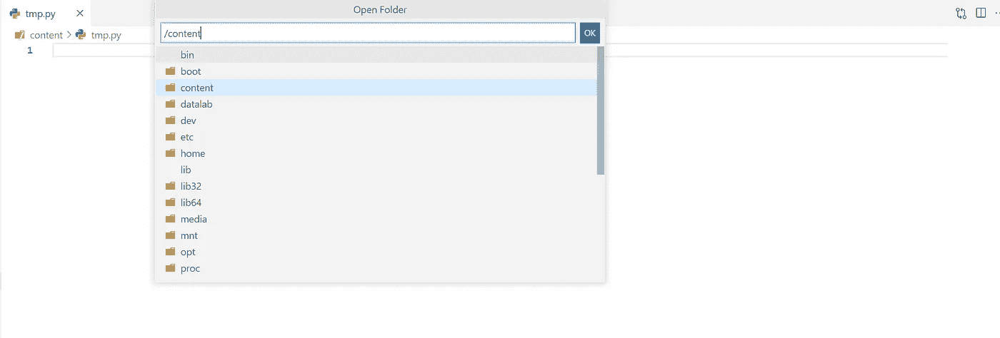
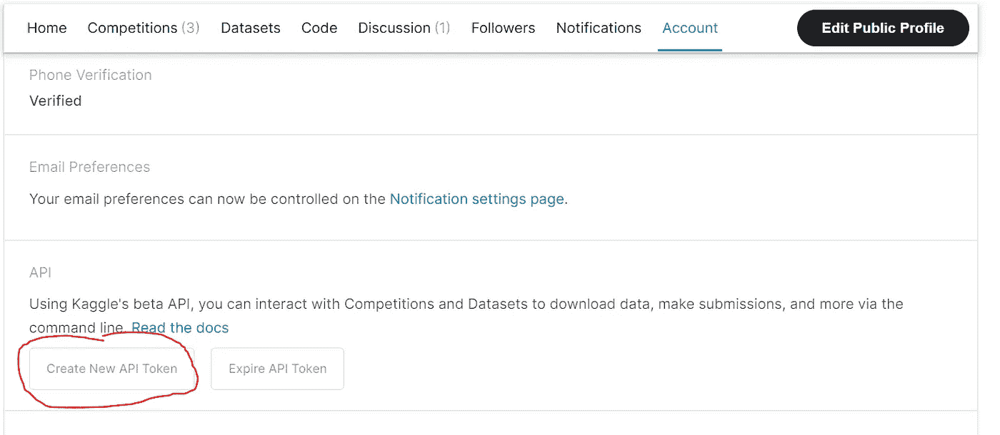
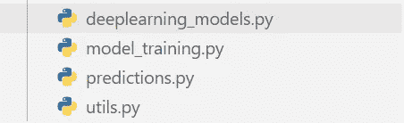
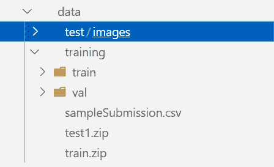
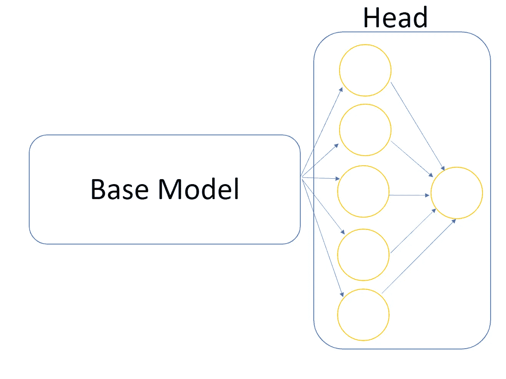

# 鲁棒图像分类的迁移学习

> 原文：<https://towardsdatascience.com/transfer-learning-data-augmentation-for-robust-image-classification-643ca88b3175?source=collection_archive---------12----------------------->

亨特·哈里特在 [Unsplash](https://unsplash.com?utm_source=medium&utm_medium=referral) 上的照片

## 了解如何将 Google Colab 与 VScode 结合使用，并将您的解决方案提交给 Kaggle

众所周知，Google Colab 是一个非常有用的工具，可以使用 Google 提供的硬件来开发机器学习项目。的确，在 Colab 上使用单个页面构建项目有时很复杂，而使用像 VScode 这样的 IDE 来管理一切会容易得多。嗯，有解决的办法！

打开一个新的 Colab 笔记本，输入以下命令

现在在已经启动的网页编辑器中选择并打开*内容*文件夹。

作者图片

你已经正式在 Google Colab 上使用 VScode 了！

## 资料组

我们将使用 *dogs vs cats* 数据集(它有一个免费的许可证)，您可以在下面的链接中找到:[*https://www . ka ggle . com/c/dogs-vs-cats-redux-kernels-edition/overview*](https://www.kaggle.com/c/dogs-vs-cats-redux-kernels-edition/overview)。我将向您展示如何创建一个模型来解决这个二元分类任务，并提交您的解决方案。

为了下载该数据集，首先要做的是使用您的凭证访问 Kaggle，然后下载 *kaggle.json* 文件，您可以通过单击*创建新的 API 令牌*按钮来获得该文件。

作者图片

您现在必须将我们下载的 *kaggle.json* 文件加载到您的*内容*工作目录中。那我们来创建下面的*。这个项目需要的 py* 文件

作者图片

## 实用工具

让我们从 *utils.py* 文件开始。我们首先定义一个函数来下载包含图像的压缩文件夹，并适当地提取它们。

您现在应该会看到这样的目录结构

作者图片

您将在培训文件夹中找到的所有图像必须被分割并放入子文件夹 *train* 和 *val* 中，它们分别包含我们的培训和验证集的图像。基于 sklearn 库，我们编写了一个执行这种分割的函数。

在同一个文件中，我们还需要两个函数。第一个是 *get_avg_size* ，它将迭代训练集的所有图像，以计算所有图像的平均*高度*和*宽度*。这是需要的，因为我们应该指定卷积网络的输入大小，因为每个图像的输入是不同的，取平均值似乎是一个很好的妥协。

现在，我们已经清理了文件系统 e，知道了图片的平均大小，我们可以使用我们的数据来实际创建训练、验证和测试集，以提供给我们的网络。TensorFlow 为我们提供了 *ImageDataGenerator* 类以非常简单的方式编写基本的数据处理。

以下代码中的训练和验证预处理程序将对输入图像像素执行缩放，将它们除以 255。

*ImageDataGenerator* 的后续输入参数允许我们通过添加现有数据的稍微修改的副本来修改和增加数据量(**数据增加**)。例如， *rotation_range* 将图像旋转 0 到 360 度之间的任意角度。

您可以通过阅读 Tensorflow 文档了解用于数据扩充的所有参数:[https://www . tensor flow . org/API _ docs/python/TF/keras/preprocessing/image/image Data generator](https://www.tensorflow.org/api_docs/python/tf/keras/preprocessing/image/ImageDataGenerator)

请注意，验证数据的预处理器没有数据扩充特性，因为我们希望保持不变，以便更好地验证我们的模型。

对于*测试装置发生器*自然也应该做同样的事情。

## 深度学习模型

我们现在继续在 d*eeplearning _ models . py*文件中创建我们的模型。
在解决大多数 Kaggle 任务时，你不会从头开始编写一个网络，而是使用一个名为 *base_model* 的预训练模型，并使其适应手头的任务。把 *base_model* 想象成一个已经学会识别图像中重要特征的模型。我们想做的是通过添加一个由其他密集层组成的*头*来适应它。在我们的例子中，最后的密集层将由单个神经元组成，该神经元将使用 *sigmoid* 激活函数，以便我们将具有为 0 或 1(猫或狗)的输出概率。

作者图片

我们必须小心不要训练之前已经训练过的基础模型。
我们要导入的 base_model 是 ***MobileNetV2*** 非常常用于图像分类任务的任务。([https://www . tensor flow . org/API _ docs/python/TF/keras/applications/mobilenet _ v2/mobilenet v2](https://www.tensorflow.org/api_docs/python/tf/keras/applications/mobilenet_v2/MobileNetV2))

**训练模型**

现在让我们来处理 *model_training.py* 文件。

在训练步骤中，我们将使用回调*模型检查点*,它允许我们不时地保存在每个时期找到的最佳模型(根据验证损失进行评估)。如果在*耐心=x* 次之后没有改善，则*提前停止*回调用于中断训练阶段。我们照常编译和拟合模型。记得包括两个回调。

现在让我们处理一下 *model_training.py* 文件。
在训练步骤中，我们将使用回调*模型检查点*，它允许我们不时地保存在每个时期找到的最佳模型(根据验证损失进行评估)。如果在*耐心=x* 次后没有改善，则*提前停止*回调用于中断训练阶段。所以让我们像往常一样编译和拟合模型。记得包括两个回调。

## 预言

让我们在 *predictions.py* 中编写我们的预测过程。

预测完测试图像后，下载生成的 *submission.csv* 文件，上传到 Kaggle，才能完成挑战！

你在排行榜上排到了什么位置？

## 结束了

*马赛洛·波利蒂*

[Linkedin](https://www.linkedin.com/in/marcello-politi/) ， [Twitter](https://twitter.com/_March08_) ， [CV](https://march-08.github.io/digital-cv/)