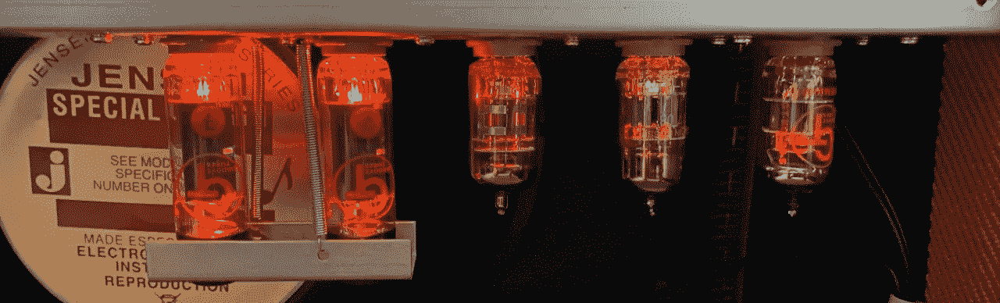
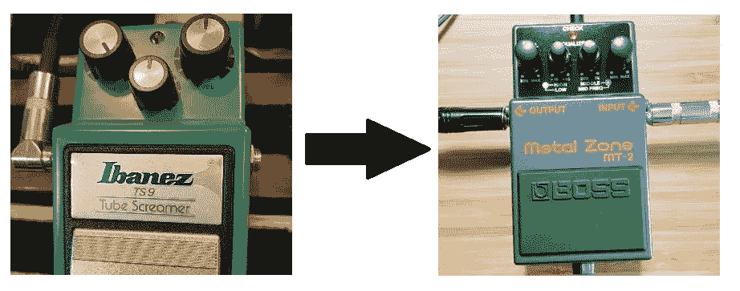
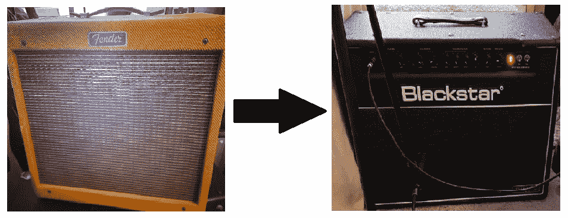
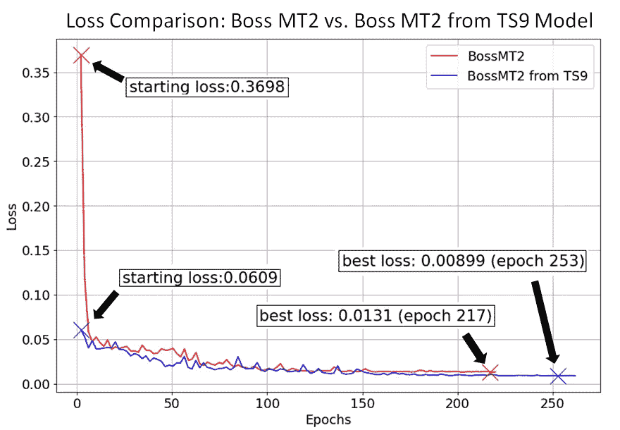
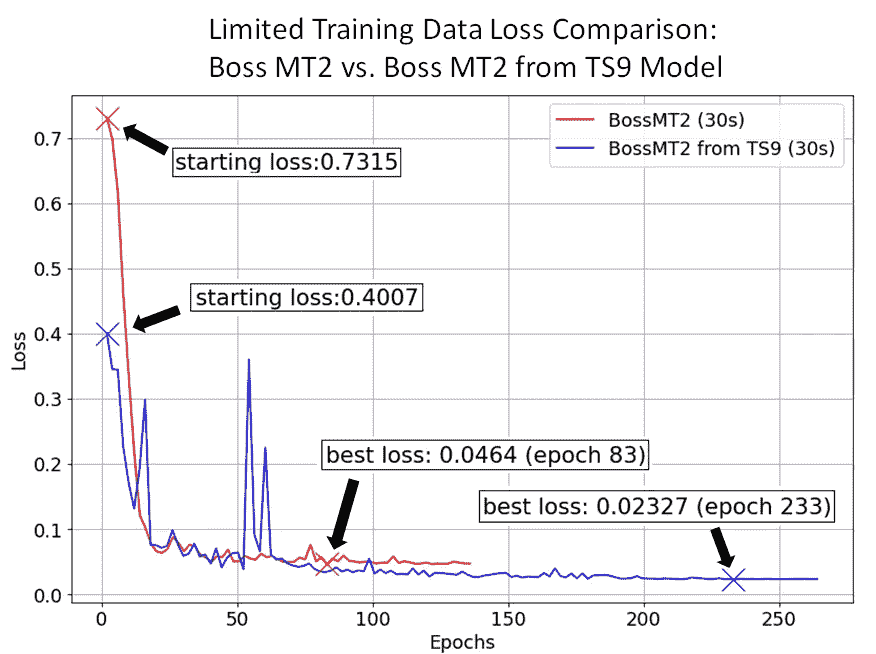
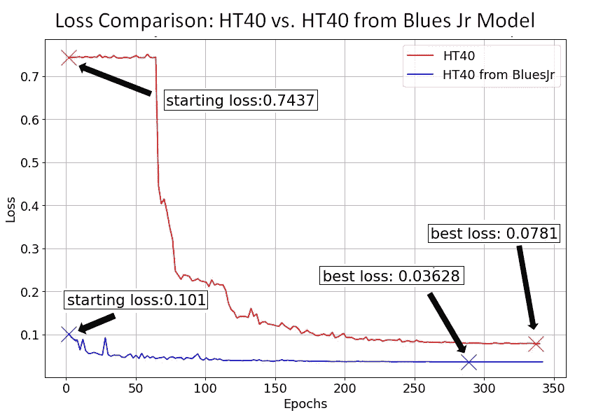
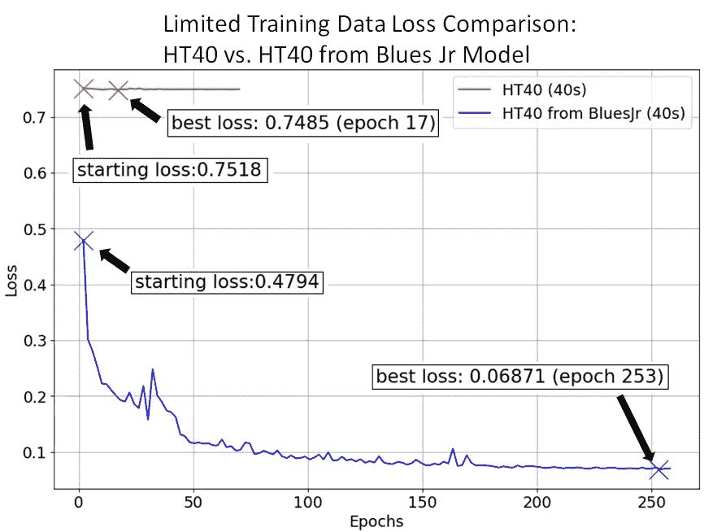
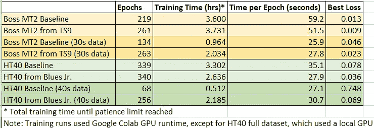

# 吉他效果的迁移学习

> 原文：<https://towardsdatascience.com/transfer-learning-for-guitar-effects-4af50609dce1?source=collection_archive---------13----------------------->

挡泥板布鲁斯 Jr .放大器中的真空管(图片由作者提供)

## [实践教程](https://towardsdatascience.com/tagged/hands-on-tutorials)

如果每一件新事物都要从头学起，生活会有多艰难？如果你曾经学过“狗”这个词，你必须再次学习字母是有声音的符号，你可以把它们放在一起组成单词，而“c-a-t”是一种不同的有尾巴的四条腿的动物？

谢天谢地，我们的大脑非常擅长识别模式。如果你已经知道“狗”这个词表示一种动物，那么不难理解“猫”这个词代表一种不同的动物。使用我们已经知道的东西来解决类似的问题是人工神经网络中的*转移学习*背后的概念。

迁移学习是机器学习中的一种技术，其中从解决一个问题中获得的信息被应用到类似但不同的问题中。实际上，当训练神经网络时，这种技术可用于获得更快的收敛或更低的损失。当缺少特定问题的训练数据时，也可以使用它。

本文介绍了使用迁移学习来模拟吉他效果和放大器的几个实验的结果。(关于使用神经网络模拟模拟吉他效果和放大器的介绍，请从这里的[开始。)](https://medium.com/nerd-for-tech/neural-networks-for-real-time-audio-introduction-ed5d575dc341)

# 实验设置

这些测试有几个假设。首先，原始模型和“迁移学习增强”模型使用完全相同的层和层大小(LSTM 大小为 20，接着是密集层)。迁移学习的一个棘手部分是考虑模型架构的差异，并保持相关信息的完整性。使用相同的模型可以大大简化事情。

*注:有关该特定神经网络实现的更多信息，请在此处阅读***。**

*第二，每个迁移学习测试只使用相似声音(失真水平)的设备。测试了一个失真踏板对另一个失真踏板和一个放大器对另一个放大器的相似超速传动水平。每个目标设备首先从头开始训练(基线)。接下来，使用预先训练的模型作为起点(迁移学习增强)。*

*每个设备对进行两次运行:完整数据集运行(3 分钟以上的音频)和有限数据集运行(30 秒的音频)。对于数据不足的模型，使用大约相同长度的验证数据(~30 秒)来提供与完整数据集模型的合理损失比较。每 2 个时期进行一次验证，并使用 Matplotlib 绘制验证损失。*

*选择的失真踏板是依班娜 TS9 电子管扬声器踏板和 Boss MT-2 失真踏板。TS9 用作起始模型，MT-2 用作迁移学习模型。*

**

*TS9 模型用作 MT2 模型的起点(图片由作者提供)*

*选择的放大器是 Fender Blues Jr 和 Blackstar HT40。蓝调 Jr .作为起步机型，HT40 作为转移学习机型。*

**

*小布鲁斯模型被用作 HT40 模型的起点(图片由作者提供)*

**注意:开始的模型都是在完整的 3-4 分钟数据集上训练的(TS9 和 Blues Jr)。**

*使用的训练代码是 Github 上的[Automated-guitar amp modeling](https://github.com/Alec-Wright/Automated-GuitarAmpModelling)项目，具体是同一项目的 [GuitarML](https://github.com/GuitarML) fork 中包含的 [Colab 脚本](https://github.com/GuitarML/Automated-GuitarAmpModelling/blob/main/colab_training.ipynb)。允许训练运行至完成，每次运行的周期数根据“验证耐心”设置 25 而变化，这意味着在 25 个周期没有改善后，训练自动停止。应当注意，在该代码中还实现了自适应学习率。*

# *失真踏板测试*

***Boss MT-2 全数据集***

*进行的第一次测试是从 TS9 型号开始的 Boss MT-2。即使这些是相似的踏板，它们的失真质量在音乐上是不同的。MT-2 驱动器被拨回，以更紧密地匹配 TS9 的较轻失真，这是在全驱动设置。验证损失比较如下所示。*

**

*图 1: Boss MT2 与来自 TS9 的 Boss MT2，完整数据集(作者提供的图)*

*最显著的差异是起始损失，这是在前两个时期之后测量的。迁移学习模型能够从 0.37 快速下降到 0.06。总体趋势显示，转移模型的损失略低，持续到运行结束。0.004 的整体损失改善(对我的耳朵来说)不是听觉上的更好。在这种情况下，最佳点似乎就在第 50 时段之前，此时损耗差约为 0.02。*

***Boss MT-2 精简数据集***

*第二个测试使用 30 秒的相同 MT-2 数据进行训练，而不是完整的 150 秒。30 秒的音频仍然用于验证，因为较短长度的验证数据可能导致看似较低的损失值。*

**

*图 2:来自 TS9 的 Boss MT2 与 Boss MT2，有限的训练数据集(30 秒)(图由作者提供)*

*由于训练数据集更小，训练时间减少了一半，如果使用更小的验证集，时间会更短。(同样，为了更准确的比较，验证集保持与完整数据训练中相同的长度，大约 30 秒)。*

*开始的损失要低得多，在迁移学习模型持续改进的 60 年代前后，趋势相似。迁移学习模型也继续在更多的时期有非常小的改进，直到在时期 263 停止。与完整数据集测试相比，从头开始模型和迁移学习模型之间的损失差异在 60 代左右开始更显著。0.023 的总损耗差足以让受过训练的耳朵(和高质量扬声器)识别更精确的模型。*

# *放大器测试*

*接下来进行组合放大器的迁移学习测试。小布鲁斯驱动器被设置为最大与“脂肪”推进按钮接合。HT40 的驱动旋钮从最大值减少到大约 25%,以接近相同的嘎吱声水平。两个放大器都具有全电子管前置放大器和功率放大器电路，但 HT-40 也有一个带有电子管扬声器风格声音的过驱动限幅电路。两个样本都是使用位于扬声器锥体中部的 SM57 动圈麦克风录制的。一般来说，使用带麦克风的放大器进行训练比使用带直接输出功能的放大器更困难。扬声器和麦克风增加了信号的力度，听起来悦耳，但对于训练来说更复杂。*

***HT40 完整数据集(带声音样本)***

*第一个 amp 测试使用了全套数据，这次使用了 4 分钟的音频(3' 20 "用于训练，40 秒用于验证)。*

**

*图 3:来自 Blues Jr .的 HT40 与 HT40 的比较，完整数据集(图由作者提供)*

*HT40 放大器在整个训练过程中的损耗差异比 MT-2 失真踏板更加极端。从零开始的 HT40 在损失开始减少之前需要大约 60 个时期。然而，迁移学习增强模型的起点低得多，并在整个运行过程中不断取得小的改进。*

**注意:HT40 从零开始的训练在纪元 340 附近被中断，但是看起来它自己接近完成。**

*完整数据集 HT40 放大器测试的声音样本在此分享，以供比较。目标是听起来尽可能接近目标音频。这是目标音频，即从 SM57 麦克风录制的 25%增益的 HT40 放大器(过驱动通道):*

*这是从零开始训练的模型(无迁移学习，损失值 0.078):*

*这是以 Blues Jr. amp 为起点的模型(迁移学习增强，损失值为 0.036):*

*即使没有录音室显示器或昂贵的耳机，迁移学习模式也明显更接近目标。使用迁移学习的损失改善约为 0.04。*

***HT40 精简数据集***

*接下来，使用有限的数据集；40 秒用于培训，40 秒用于验证。*

**

*图 4:来自 Blues Jr 的 HT40 与 HT40 对比，有限训练数据集(40 秒)(作者图)*

*这项测试显示了使用迁移学习最显著的好处。从头开始训练 HT-40 的有限数据集未收敛，验证损失未低于 0.74。在达到耐心极限和训练自动停止之前，跑步持续了 68 个时期。然而，当从小布鲁斯模型开始时，损失立即开始减少，并在整个过程中继续改善。*

*下表 1 中比较了所有测试的损失和培训时间。当在 Colab 上训练时，减少的训练集的每个时期的时间大约减少了一半。由于达到了 Colab 限制，HT40 的完整数据集必须在本地 GPU 上进行训练，因此 HT40 的训练时间不应与缩减后的数据集进行比较。转移学习模型的最终损失值较小，在放大器测试与失真踏板的情况下，差异更明显。在 HT-40 放大器缩减数据集的情况下，需要使用转移学习来对模型进行训练。除了 HT40 缩减数据集之外，转移模型的最佳损失大约减半。*

**

*表 1:所有运行比较(作者图片)*

# *结论和未来工作*

*这些初始测试表明，使用迁移学习可以减少训练时间，因为达到可接受的准确度需要更少的训练数据。当训练过驱的麦克风放大器等困难信号时，这也是有益的。在数据有限的情况下，可能需要迁移学习才能使模型收敛，就像 HT40 有限的数据集一样。使用转移学习来训练一个"容易的"信号，如直接输出轻度失真踏板似乎对最终模型的影响最小。需要进行更多测试，以确定这些结论是否适用于其他效应和放大器。*

*在上述测试中，确定什么构成了类似的发声装置是基于简单地听它，这是主观的。有可能使用人工智能(或其他 DSP 技术)来首先分析来自目标设备的音频，然后从预训练模型库中确定哪个最接近，以获得最佳结果。*

*所有测试都是在特定设置(增益水平、均衡器、音量)下对每个设备的“快照”进行的。可以使用每个设置的训练数据来调节给定参数或参数集的模型。例如，您可以训练增益或驱动旋钮全范围的单个模型。但是，使用模型调节会增加所需的数据量和训练时间。迁移学习可能是减少条件模型训练所需的训练时间和数据量的好方法。*

*我希望你喜欢阅读这篇文章！关于问题和反馈，你可以发电子邮件到 smartguitarml@gmail.com 给我。*