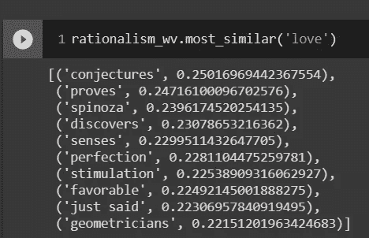
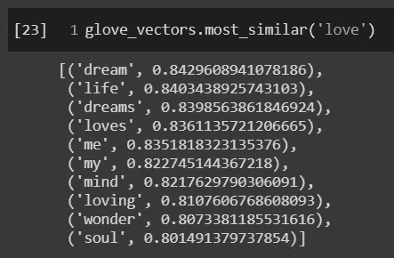
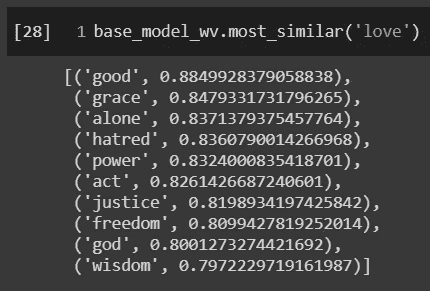
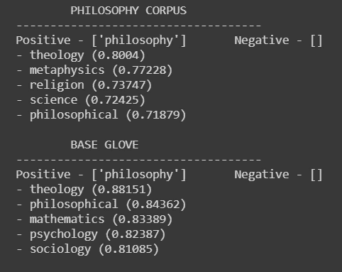

# 用手套词向量进行迁移学习

> 原文：<https://towardsdatascience.com/transfer-learning-with-glove-word-vectors-7652456ae269?source=collection_archive---------18----------------------->

这是一个向量，好吗？？塔曼娜·茹米在 [Unsplash](https://unsplash.com?utm_source=medium&utm_medium=referral) 拍摄的照片

过去，我在为我的一个[项目](http://philosophydata.com/w2v.html)训练单词向量，但是我一直碰壁。我在研究哲学史上的文本，试图找到可以揭示作者如何使用一个词的向量。但是我一直得到这样的结果:

我是说，我确实喜欢斯宾诺莎…

如果你非常努力地眯着眼睛，那么这可能是有意义的。毕竟，爱情的确与完美有关，而且很刺激……对吗？

但是相似性分数很小，我们不想为了让结果有意义而眯着眼睛看。他们应该给我们带来启发——我们不应该给他们带来启发。

为了解决这个问题，我尝试调整太阳下的超参数，但是尽管感觉像是一个字面上的工作时代，结果从来没有比这更好。

但后来我灵机一动。我不会单独在我的数据集上训练数据，而是使用 GloVe 预先训练的单词向量作为基线。这意味着我的机器基本上已经知道基本的英语，然后只需进行微调，以更准确地匹配我的数据。

这个过程比我想象的要困难一些，而且我也没有找到任何完整的指南，所以我想我应该为你写一份。这个过程基本上有三个步骤，我将按顺序逐一介绍。如果你想得到一个可以完成所有工作的功能，可以直接跳到最后或者看看这个[笔记本](https://github.com/kcalizadeh/phil_nlp/blob/master/Notebooks/3_w2v.ipynb)。

本教程需要 Gensim Word2Vec 库。

# 步骤 1:加载手套向量

为了训练手套嵌入，你需要(大惊喜)加载嵌入到你的系统。你可以在这里下载它们。

一旦有了文件，就可以使用下面的代码来加载它。

这实际上需要。txt 文件，并将其以适当的格式加载到 Gensim Word2Vec 库中。在这一点上，你可以做通常的相似性搜索，以测试是否一切都正确加载。

爱情真的是一场梦，❤

如你所见，手套的嵌入比我们之前得到的更有意义。

# 第二步:建立一个玩具模型来更新

在这一步中，您实际上是在没有使用 GloVe 的情况下根据您的数据构建了一个 Word2Vec 模型。该模型使您能够捕获新单词并构建包含特定数据集的词汇，如果您处理的文本不仅仅是普通英语，这将非常有用。

很好，现在你有了一个蹩脚的模型可以作为基础。现在来了很酷的东西。

# 第三步:增加手套重量并重新训练

在这里，您将使用现有模型，添加手套词汇和起始重量，并在数据集上对其进行重新训练。

结果将是一组新的单词向量，使用 GloVe 的原始权重，但现在也调整为包含您自己的数据。下面是一个结果示例:

请注意，这是在理性主义哲学学派上训练出来的

你可能不太了解理性主义哲学，但是相信我，这非常有道理。他们的主要焦点之一是上帝，我们可以看到，几乎所有这些在讨论上帝之爱的背景下都是有意义的——上帝爱我们，因为他是好的，他的恩典是这种爱的表现，他给我们自由，因为他爱我们，等等。事实上，仅仅是“爱”的用法围绕着上帝的概念这一事实就表明，这种用法效果很好，而且相似性得分要高得多。

另一个更好的测试你的结果的方法是通过运行`.most_similar`一个你知道在你的特定数据集中有不同含义的词来检查你的新向量和原始的手套向量。这是我得到的结果的一个例子:

哲学家和口语如何使用“哲学”

你可以看到，在哲学文集里，‘哲学’是与科学和形而上学联系在一起的，而在基手套文集里，却没有这样的联系。

这很有道理。玄学在口语中有着非常不同的含义(在口语中，它与占星术和超自然现象联系在一起),而在哲学中，它是一个主要的分支。所以当哲学家谈论哲学的时候，形而上学总是在讨论之中，但是正常人谈论哲学的时候，几乎不会把它和形而上学联系在一起。哲学家也认为自己是科学的，或者在与自然科学的对话中，公众通常看不到哲学和科学之间的紧密联系。

# 额外的一步:把所有的都集中在一起

嗯，太好了！此时，您现在有了一个漂亮的单词嵌入，它可以独立使用来生成对您的语料库的见解，或者可以用于深度学习或其他应用程序。

剩下的工作就是将所有这些整合到一个功能中:

如果你想看到实际的结果，你可以查看哲学数据项目的[单词使用分析页面](http://philosophydata.com/w2v.html)。对于包含此工作和其他 NLP 工作的回购，请在此处查看。

感谢您的宝贵时间，如果您遇到任何问题，请随时联系我们:)