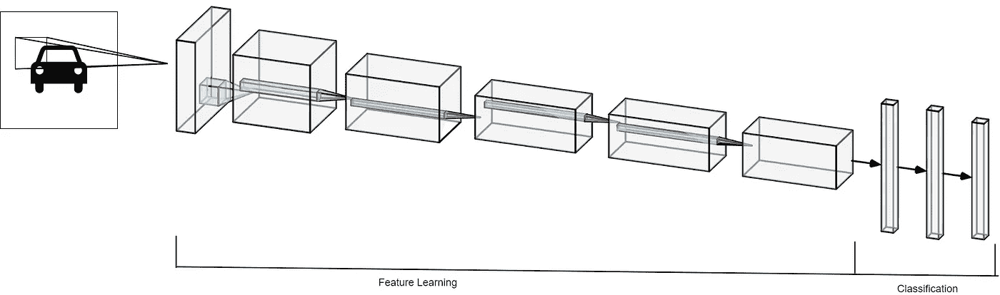
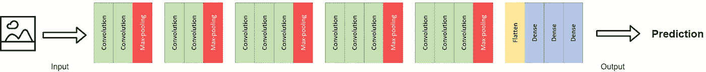
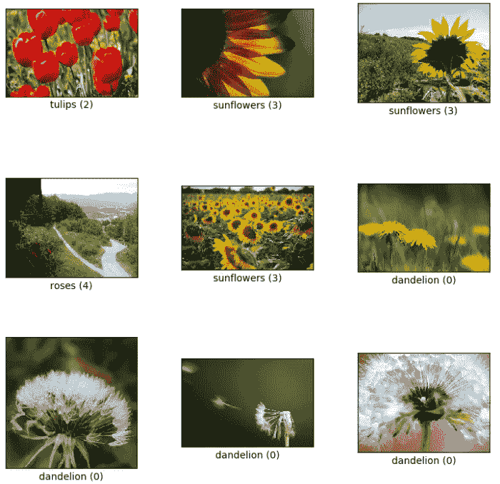
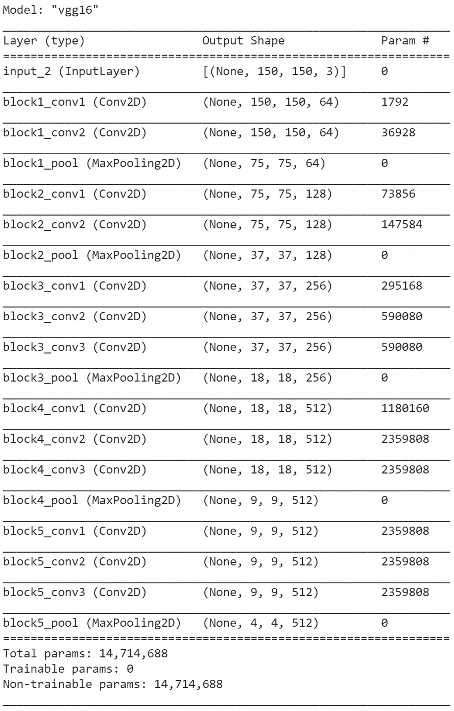

# 使用 VGG16 和 Keras 进行迁移学习

> 原文：<https://towardsdatascience.com/transfer-learning-with-vgg16-and-keras-50ea161580b4?source=collection_archive---------0----------------------->

## 如何使用最先进的训练神经网络来解决你的图像分类问题

本文的主要目标是用代码和例子演示如何使用一个已经训练好的 CNN(卷积神经网络)来解决你的具体问题。

卷积网络对于图像问题非常有用，但是，如果你使用一个大的架构，并且没有 GPU，那么卷积网络的计算成本会很高。为此，我们有两种解决方案:

## 绘图处理器

GPU 对训练神经网络更有效，但它们在普通计算机上并不常见。所以这就是**[***Google colab***](https://research.google.com/colaboratory/)来拯救我们的地方。他们提供 GPU 高达 16 GB 内存的虚拟机，最棒的是:**它是免费的**。**

**但是，即使有了这些升级的规格，你仍然可以在训练一个全新的 CNN 时挣扎。这就是迁移学习可以帮助你用更少的计算获得更好的结果的地方。**

## **迁移学习**

**那么什么是迁移学习呢？**

**为了更好地解释这一点，我们必须首先了解 CNN 的基本架构。**

****

**作者图片**

**CNN 可以分为两个主要部分:特征学习和分类。**

****特征学习****

**在这一部分中，神经网络的主要目标是在图像的像素中找到可用于识别分类目标的模式。这发生在网络的卷积层，专门处理手头问题的那些模式。**

**我不会深入探究这背后的工作原理，但如果你想更深入地挖掘，我强烈推荐这篇文章 和*[***这个令人惊叹的视频***](https://youtu.be/HGwBXDKFk9I) ***。******

*****分类*****

***现在，我们想使用这些模式将我们的图像分类到正确的标签。网络的这一部分正是做这项工作的，它使用来自前几层的输入，在新图像中找到与你的匹配模式最匹配的类别。***

*****定义*****

***因此，现在我们可以在我们的上下文中定义迁移学习，即利用经过训练的 CNN 的特征学习层来分类一个不同于它为之创建的问题。***

***换句话说，我们使用神经网络发现对给定问题的图像分类有用的模式来分类完全不同的问题，而无需重新训练网络的这一部分。***

***现在，我将演示如何使用 Keras 实现这一点，并证明在很多情况下，这比训练一个新的网络效果更好。***

# ***使用 Keras 进行迁移学习***

***在这个演示中，我将使用一个著名的神经网络 VGG16。这是它的架构:***

******

***作者图片***

***该网络在 ImageNet 数据集上进行训练，该数据集包含属于 1000 个不同标签的超过 1400 万个高分辨率图像。***

***如果你想更深入地研究这个特定的模型，你可以研究一下 [***这篇论文。***](https://arxiv.org/abs/1505.06798)***

## ***资料组***

***在这个演示中，我将使用 [tf_flowers 数据集](https://www.tensorflow.org/datasets/catalog/tf_flowers)。只是提醒一下:VGG16 网络没有被训练来对不同种类的花进行分类。***

***数据看起来是这样的:***

******

***作者图片***

***最后…***

## ***代码***

***首先，我们必须从 TensorFlow 加载数据集:***

***现在我们可以加载 VGG16 模型了。***

***我们使用*Include _ top =****False***移除在 ImageNet 数据集上训练的分类层，并将模型设置为不可训练。此外，我们使用 VGG16 中的 preprocess_input 函数来规范化输入数据。***

***我们可以运行这段代码来检查模型摘要。***

```
*base_model.summary()*
```

******

***作者图片***

***两个要点:该模型有超过 1400 万个训练参数，并以 maxpooling 层结束，该层属于网络的特征学习部分。***

***现在我们为我们的具体问题添加最后几层。***

***并编译和拟合模型。***

***在测试集上评估这个模型，我们得到了 96%的准确率！***

***就是这样！***

***就是这么简单。很漂亮，对吧？***

***我们如何在世界上找到一些模式，可以用来识别完全不同的事物。***

***如果你想查看完整的代码和一个 jupyter 笔记本，这里有 GitHubrepo:***

***<https://github.com/gabrielcassimiro17/object-detection> *** 

# ***额外:与手工制作的模型相比***

***为了确保这种方法在计算资源和精度上都更好，我为这个问题创建了一个手工制作的简单模型。***

***这是代码:***

***我使用相同的最终层和拟合参数来比较卷积的影响。***

***手工模型的准确率为 83%。比我们从 VGG16 型号获得的 96%要差得多。***