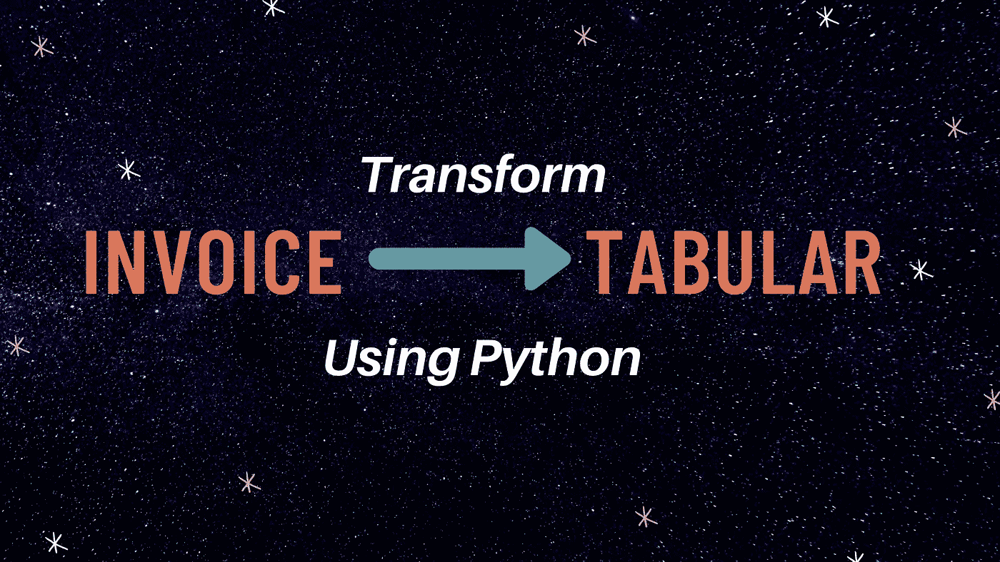
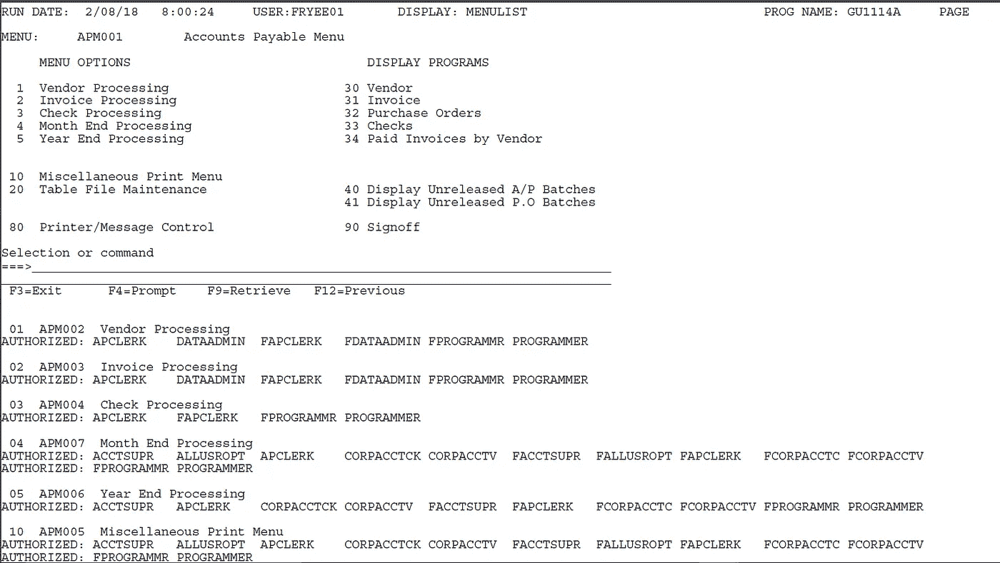
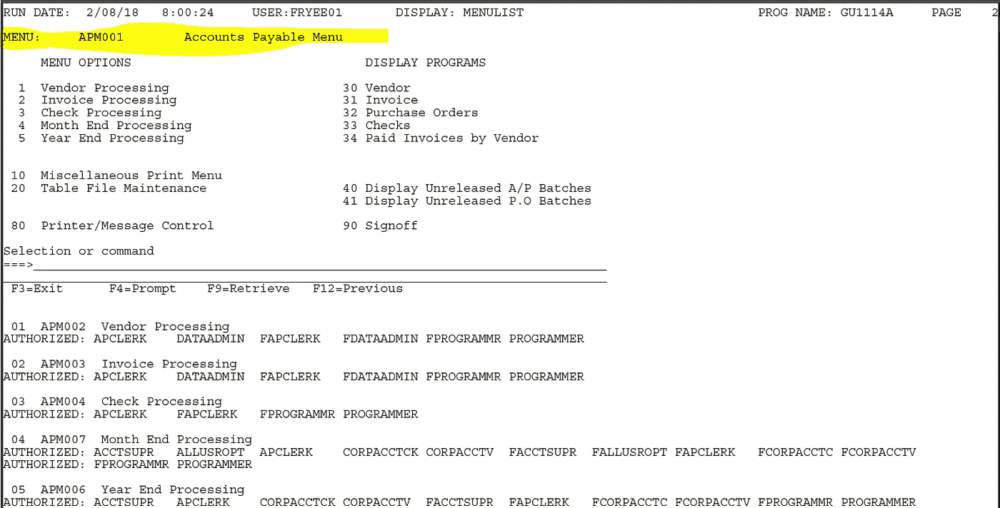
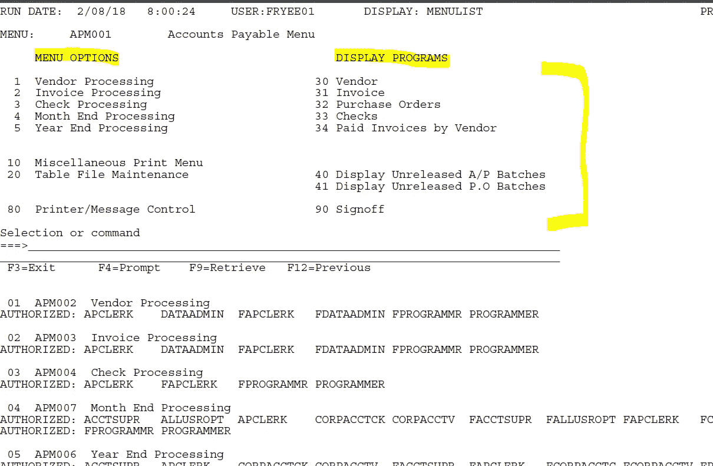
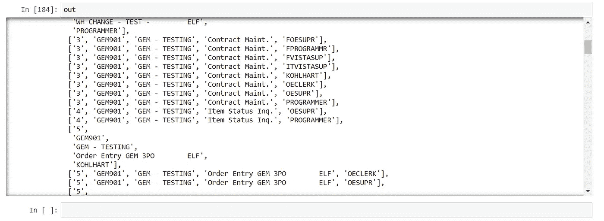

# 使用 Python 将发票转换成表格数据

> 原文：<https://towardsdatascience.com/transform-invoices-into-tabular-data-using-python-cd30b31d1a8f?source=collection_archive---------8----------------------->

## PDF 水管工和正则表达式使它更容易



作者图片(Canva 上制作)

99%的文本数据以非结构化形式存在。当我们谈到难以解释和管理的非结构化数据时，发票是非结构化数据的一个例子。

当我们在分析和数据科学领域工作时，我们通常需要表格形式的数据来分析它们。我的意思是，通过分析，我们可以绘制洞察图、监控、预测未来的洞察、管理未来的需求，等等。

根据 [quora](https://www.quora.com/How-many-invoices-do-SMEs-generate-per-month-on-average) 上的信息，一家大型企业一个月可以产生 33000 张发票，根据[商业杂志](https://www.bizjournals.com/bizjournals/on-numbers/scott-thomas/2012/07/16055-companies-fit-the-definition-of.html)的一份报告，有 16000 多家大公司，这意味着一天内会产生数百万张发票，这是非结构化数据要多得多。

发票的好处是——大多数都遵循相同的模式。也就是说，如果我们能够匹配单一发票的模式，我们就可以处理任何行业的所有发票。

时至今日，一些行业已经采用了自动化发票处理方法，其中大多数仍在手动处理，少数仍在进行相同的自动化流程，以节省时间和资金。

让我们看看如何使用 python 编程来自动化这个过程。我们的最终产品将是一个功能，将采取 pdf 文件的列表作为输入，并生成一个 excel 表，其中一行将表示一个结构化的发票文件。

# 必需的库

我们将需要一些库来读取 pdf 文件，并对我们的文本数据应用正则表达式。

*   pdf lumber—读取 pdf 文件
*   re-应用正则表达式
*   熊猫——来创建和操作我们的数据集

## 导入所需的库

```
import pdfplumber
import re
import itertools
import pandas as pd
```

# 示范发票



演示发票截图

这里，我们有三个部分。最上面的第一部分给出了日期和时间、用户名、程序名和菜单代码的详细信息。

第二个中间部分告诉我们该发票可用的菜单选项。最后，倒数第三个部分告诉我们每个菜单选项下的授权码。

# 方法

我们的第一个目标是制作一个能够区分每个部分的 python 脚本。

```
with **pdfplumber.open("Menu_Authorizations.pdf") as pdf**:
    next_page_continue=False
    for pcount in range(len(pdf.pages)):
        page=pdf.pages[pcount]
        text=page.extract_text()
```

上面的代码帮助我们打开 pdf 文件。这里，我们只有一个包含 300 个菜单的 pdf 文件。有些菜单需要两页纸，因为它们有更多的菜单选项。我们需要根据正则表达式的结果来处理这种情况。

我们可以使用 extract_text()函数从 pdf 中提取数据。因为我们使用了一个循环，所以一次只能接受一张发票。

当我们迭代提取的文本时，我们的循环逐行迭代文本。这意味着——我们必须根据循环正在执行的行来定义正则表达式。

让我们首先定义每个条件的正则表达式。

## 抓取菜单代码

菜单编号出现在以“Menu”开头的行中。这里，我们需要一个正则表达式来检测时间。

```
menu_re= re.compile(r'^MENU:')
```



作者截图

这一行 python 代码可以为我们完成这项任务。

## 抓取所有菜单选项

根据菜单格式——就在菜单代码下面，我们可以找到菜单选项列表。这里，我们需要确保我们的行对于菜单选项表有各自的标题。

```
menu_func_re=re.compile(r'^\s*\d+\s{2}[A-Za-z\s\d\W]+$')
```

如果我们的行以空格、数字开头，后面跟两个空格，上面的正则表达式可以帮助我们。这样，我们就可以检测到这条线。



作者截图

## 抓取每个菜单的授权码

这是我们需要提取的最后一部分。我们需要检查该行是否以数字开头，后跟代码“APM”。

```
APM_re=re.compile(r'\s*\d+\s+APM')
APM_re_internal=re.compile(r"^AUTHORIZED:")
```

以上两行可以为我们完成任务。

# 将这些点连接起来

一旦正则表达式部分完成，我们就可以用必要的条件连接所有的代码部分。

# 最终输出

通过运行代码，我们可以获得表示文档及其相关信息的列表列表。



最终结果—导出前

现在，我们可以使用 pandas 将列表转换为数据框，然后将该数据框导出到 excel 表中。

# 结论

这篇内容丰富的文章就到这里。我们已经介绍了将 PDF 发票转换成 excel 表格的一步一步的方法。这一次，我们还讨论了这个用例的重要性。

我希望你喜欢这篇文章。敬请关注即将到来的文章。

谢谢你的阅读！

以下是我的一些最佳选择:

[](/step-by-step-yolo-model-deployment-in-localhost-using-python-8537e93a1784) [## 逐步使用 Flask & Python 部署自定义对象检测

### 自定义对象检测本地主机部署| YOLO

towardsdatascience.com](/step-by-step-yolo-model-deployment-in-localhost-using-python-8537e93a1784) [](/7-amazing-python-one-liners-you-must-know-413ae021470f) [## 你必须知道的 7 个惊人的 Python 一行程序

### 加速熊猫，快速数据剖析，数据抓取，等等

towardsdatascience.com](/7-amazing-python-one-liners-you-must-know-413ae021470f) [](https://betterprogramming.pub/10-python-tricks-that-will-wow-you-de450921d96a) [## 让你惊叹的 10 个 Python 技巧

### 提高 Python 编程技能的便利特性

better 编程. pub](https://betterprogramming.pub/10-python-tricks-that-will-wow-you-de450921d96a) [](/5-data-science-projects-that-you-can-complete-over-the-weekend-34445b14707d) [## 你可以在周末完成的 5 个数据科学项目

towardsdatascience.com](/5-data-science-projects-that-you-can-complete-over-the-weekend-34445b14707d) 

> *在你走之前……*

如果你喜欢这篇文章，并希望**继续关注**更多关于 **Python &数据科学**的**精彩文章**——请点击这里[https://pranjalai.medium.com/membership](https://pranjalai.medium.com/membership)考虑成为一名中级会员。

请考虑使用[我的推荐链接](https://pranjalai.medium.com/membership)注册。通过这种方式，会员费的一部分归我，这激励我写更多关于 Python 和数据科学的令人兴奋的东西。

还有，可以随时订阅我的免费简讯: [**Pranjal 的简讯**](https://pranjalai.medium.com/subscribe) 。