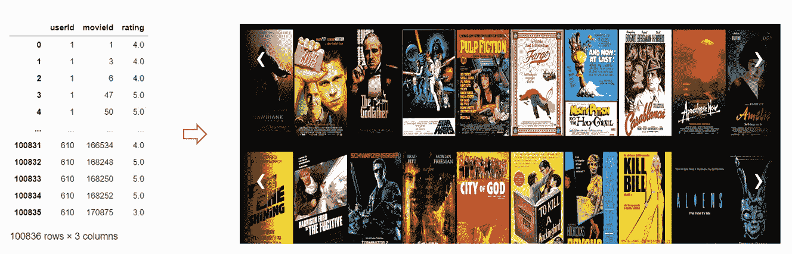
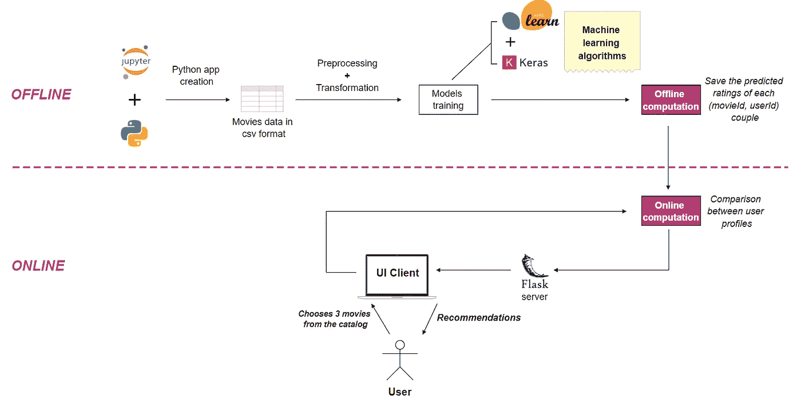
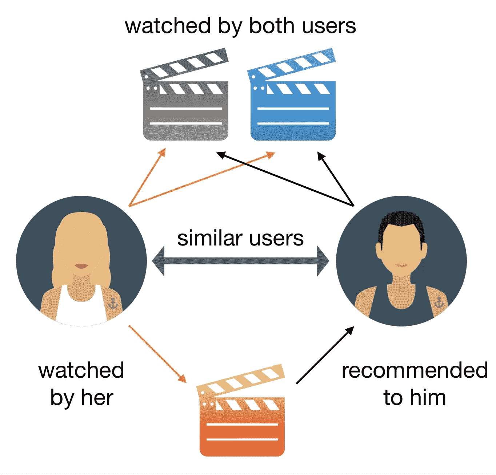
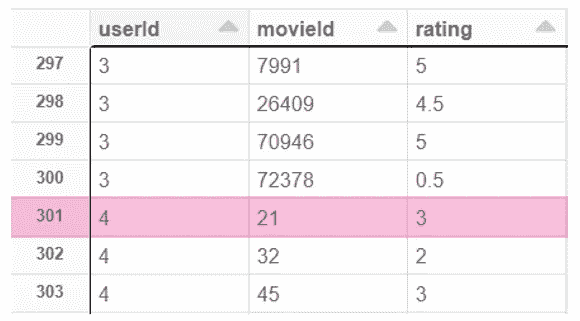
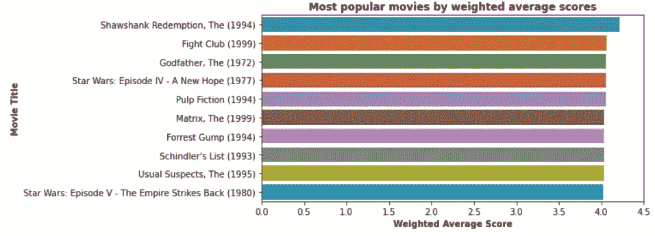
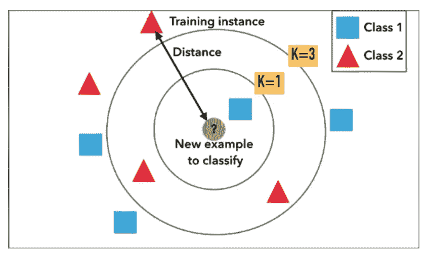
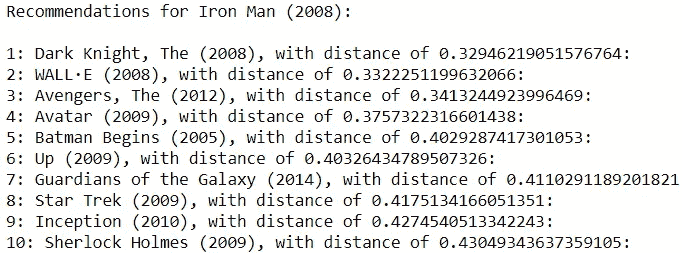
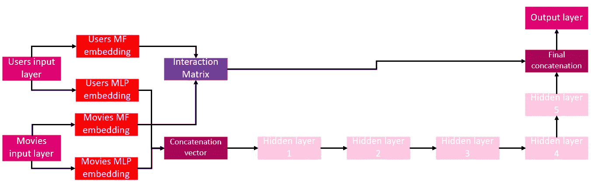
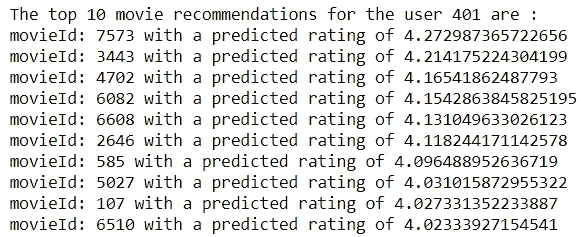
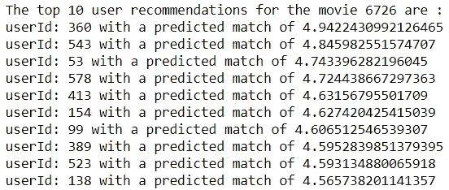

# 简单电影数据集到功能推荐系统的转换

> 原文：<https://towardsdatascience.com/transformation-of-a-simple-movie-dataset-into-a-functional-recommender-system-89c2a5a668c?source=collection_archive---------39----------------------->

## 从创建模型到使用 Python 部署 web 应用程序的所有步骤



(**左**最新 **ratings.csv 电影数据集**的小版本由 [MovieLens](https://grouplens.org/datasets/movielens/latest/) | ( **右** ) **推荐系统 web 应用** [I](https://amine-zaamoun.medium.com/) 在本地实现和部署，电影海报图片来自 [IMDb](https://www.imdb.com/)

# 为什么是推荐系统？

你们当中有谁没有花过几分钟甚至几个小时去选择一部电影，是独自看还是和家人一起看，可惜没有成功？承认在这种时候你希望有人替你做决定，这正是推荐系统的作用。这是巨头网飞和亚马逊目前成功的主要原因之一。我设计这篇文章是为了向您展示任何在数据科学和编程方面有一点创造力和经验的人都可以通过遵循我将要描述的几个步骤来实现他们自己的推荐系统。我在[德国电信(DEUTSCHE TELEKOM AG)创新中心(IHUB)](https://www.telekom.de/start) 数据科学部门实习的 8 个月期间，意识到了这个项目。这个想法也是着眼于实用方面，而不是理论和数学方面，你可以在互联网上到处找到科学文献。

# 系统概述和架构



**电影推荐系统架构**，架构由[作者](https://amine-zaamoun.medium.com/)

本文中介绍的推荐系统是在 **4** 主要步骤中实现的:
- **步骤 1** : **计算每部电影的加权平均分数**以便向最终用户建议该电影院的 100 部最受欢迎的电影的目录
- **步骤 2** : **使用机器学习算法建立对 5 部“受欢迎”电影**的推荐:*k-最近邻居(kNN)* 用 Scikit-learn
- **步骤 3** : **设置推荐 5 部“鲜为人知”的电影**由深度学习算法推荐:深度*神经矩阵分解**【DNMF】*使用 Tensorflow 和 Keras
- **步骤 4** : **部署最终系统**使用 Flask、Python web 开发上的先例模型的预计算结果

但首先，让我们简单解释一下为什么我们特别使用了一个数据集，在这个数据集里**用户对他们看过的**电影进行了评分。

## 协同过滤方法



**协同过滤方法**，图像由[艾玛·马尔迪](https://medium.com/@emmagrimaldi)上[走向数据科学](https://towardsdatascience.com/)

这种方法可以根据一个用户过去的行为和其他用户做出的类似决定建立一个模型。事实上，它是基于在数据集中选择的电影和给予这些电影的数字评级。然后，该模型用于预测用户可能感兴趣的电影，通过这些电影的**预测评级**。

## MovieLens 的 ratings.csv 数据集



**MovieLens' ratings.csv 文件**，来源[此处](https://grouplens.org/datasets/movielens/latest/)

该数据集中突出显示的一行内容如下:**4 号用户观看了 21 号电影，并给了它 3.0/5.0 的评分**。

关于此数据集的所有信息都直接从以下链接的“*README.html*”页面的“*摘要*”部分中检索到:[https://grouplens.org/datasets/movielens/latest/](https://grouplens.org/datasets/movielens/latest/)

我引用道:“这个**数据集**[1】(ml-latest-small)描述了来自电影推荐服务 **MovieLens** 的**五星评级**和自由文本标记**活动**。它包含 **100836 个评级**和跨越 **9742 部电影**的 3683 个标签应用。这些数据是由 **610 个用户**在 1996 年 3 月 29 日到 2018 年 9 月 24 日之间创建的。这个数据集是 2018 年 9 月 26 日生成的。
随机选择用户进行纳入。**所有被选中的用户都对至少 20 部电影进行了评级**。不包括人口统计信息。**每个用户用一个 id** 表示，不提供其他信息。”

还请注意，对于本文中介绍的推荐系统，**只使用了电影**的评级，而没有使用标签应用。

# **第一步**:计算每部电影的加权平均得分

第一步的**目标**是为我们推荐系统的最终用户提供一个流行电影的**目录**，他们可以**从中选择他们最喜欢的**。



**最受欢迎电影加权平均得分**，排行榜由[作者](https://amine-zaamoun.medium.com/)

代码本身是不言自明的，唯一值得注意的是使用了 **PySpark** 来执行这个计算。事实上，这个库允许使用 SQL 语言固有的" *mean"* 和" *col* "函数，从而促进了代码的**组织和可读性。然而，同样的计算在 Pandas 库中也是完全可行的，Pandas 库在数据科学初学者中更受欢迎。**

**代码**我国电影推荐系统实现的第一步

# 步骤 2:使用*k-最近邻(kNN)* 设置 5 部“流行”电影的推荐

第二步的**目标**是**向最终用户推荐**一系列可以被描述为**【流行】**的电影。
首先，这有助于让用户放心，因为他会**认出至少一部**推荐的电影。的确，如果他不认可任何推荐的电影，他可能会拒绝我们系统的有用性。**这个因素**，心理的和人为的，不幸的是**无法量化**。它还证明，如果不考虑**文化因素**，最好的数学和统计模型可能不适合某些用户。
其次，使用 kNN 算法推荐的电影都“受欢迎”的事实是在训练机器学习模型之前对数据进行预先过滤的**直接结果。事实上，我们数据集中的**评估频率**遵循**“长尾”分布**。这意味着**大多数电影的评分很少**，而一个“压倒性少数”的评分比其他电影的评分总和还要多得多(更多细节请见本文 [*精彩文章*](/prototyping-a-recommender-system-step-by-step-part-1-knn-item-based-collaborative-filtering-637969614ea) *作者* [*凯文廖*](https://medium.com/@keliao) )。因此，这个过滤器只允许最受欢迎的电影被用来训练 **kNN** 算法，所以产生的推荐也只能是受欢迎的电影。**

**这个算法**也有相当容易理解的优点，也相当容易解释。对于非技术人员来说尤其如此，例如您公司的销售团队或您的朋友和家人，他们不一定在数据科学领域。正如 *Kevin Liao* 在他的文章中解释的那样:“**当 KNN 对一部电影做出推论**时，KNN 会计算**目标**电影与其数据库中所有其他电影之间的**‘距离’**，然后**对其距离**进行排序，并返回**前 K 部最近邻电影**作为**最相似的**电影推荐”。



**图解 KNN 如何对新样本**进行分类，[凯文廖](https://medium.com/@keliao)关于[走向数据科学](https://towardsdatascience.com/)的图式



**与《钢铁侠(2008)》最近的 10 部电影**根据我的推荐系统中使用的 kNN 算法，由[作者](https://medium.com/@zaamine)得出的结果

在这个例子中可以看到，与“*钢铁侠(2008)* ”最接近的邻居电影是“*黑暗骑士(2008)* ”，其**余弦相似度**(或简称为**“距离”**)约为 0.33。从主观和个人的角度来看，这个结果似乎非常连贯，因为它们是两部超级英雄电影。我们还可以注意到“*《阿凡达》(2009)* ”和“*《盗梦空间》(2010)* ”的存在，这也是两部科幻电影。我感谢有必要注意到这个机器学习算法的**魔力，因为，正如我提醒你的那样，**只有在 1.0 到 5.0 范围内给出的评分**被使用过**。事实上，**这些电影的类型并没有被用来**提供这些推荐。下面是与代码**相关的**片段，向您展示如何使用 **Scikit-Learn** 库实现该算法，并根据**选择的电影标题**获得推荐:****

**我们的电影推荐系统实现中第二步的 kNN 算法片段**

# 第三步:使用深度神经矩阵分解(DNMF)推荐 5 部“不太出名”的电影

这个第三步的**目的**和这个算法的选择是向终端用户推荐一系列倾向于**【不太为人所知】**的电影。不要进入太多的细节，只要记住**不需要事先过滤**，一部电影可以被用作训练数据**而不管它的受欢迎程度**。事实上，这种算法在数学上非常复杂，结合了数据科学中经常使用的两种模型。第一种模型是**矩阵分解**，例如**交替最小二乘(ALS)** 算法。另一个模型是一个**深度神经网络**的例子，比如**多层感知器(MLP)** 。那么就有必要写一整篇文章来正确地解释它，但是正如我先前已经宣布的，我们的目标不是要做一个统计学课程。所以我让你看这两个已经很好的解释了这些概念的资源:2018 年底 [*Kevin Liao*](https://medium.com/@keliao) 写的文章《 [*逐步原型化一个推荐系统第二部分:协同过滤*](/prototyping-a-recommender-system-step-by-step-part-2-alternating-least-square-als-matrix-4a76c58714a1) 中的交替最小二乘(ALS)矩阵分解》和[*Eijaz Alli bhai【t3t 现在假设您至少对上述两个模型有基本的了解，那么在第三步中使用的**深度神经矩阵分解算法(DNMF)** 具有以下**架构**:*](https://medium.com/@eijaz)



**深度神经矩阵分解架构**，架构由[作者](https://amine-zaamoun.medium.com/)

该算法的**原理**是与经典矩阵分解相同的**。我的意思是，使用这个模型，我们试图**预测某个**用户**对某部**电影**的评价**。我指定评级**，因为该算法填充了当前存在于' *ratings.csv* '数据集中的空白值。让我解释一下:即使是一个超级影迷**也可能没有看过或评价过**我们所掌握的数据集中的 9742 部电影。他的想法是给那些他自己还没有评价的电影打分，以决定他是否喜欢这些电影。这正是我们算法的**矩阵分解**部分所做的。神经网络的加入使得进一步**增加模型**的预测性能成为可能，从而**减少**预测**和**实际评级**之间的误差**。这里有一个**代码片段**向您展示如何使用 **Tensorflow 和 Keras** 库实现这样一个模型。我们将使用它来**预测与不存在的***(userId，movieId)* 对相关联的评级**。******

电影推荐系统实现中第三步的 DNMF 算法片段

我们现在可以遵循相同的逻辑来预测在我们的'*ratings . CSV*'数据集中还不存在的所有*(userId，movieId)* 【对的关联分数。让我们以用户 n 401 为例，由 **DNMF** 算法计算的他的电影评级的前 10 名如下:



**根据我的推荐系统中使用的 DNMF 算法，用户 n 401 的前 10 个电影评级预测**，由[作者](https://amine-zaamoun.medium.com/)得出的结果

我们现在可以**将使用该模型生成的 2 个表的结果**保存在 2 个不同的 *csv* 文件中:**为每部电影推荐的前 10 名用户**和**为每个用户推荐的前 10 部电影**。

```
pdUserRecs.to_csv(os.path.join(trained_datapath, 'DNMF_MovieRecommendationsForAllUsers.csv'), index=False)pdMovieRecs.to_csv(os.path.join(trained_datapath, 'DNMF_UserRecommendationsForAllMovies.csv'), index=False)
```

# 步骤 4:使用 Flask 上先前模型的预计算结果部署最终系统

我们终于到了最后一步**，这一次需要一些关于**网络开发**的知识。适当地**部署**该系统作为**真正的应用**会很有用。在这个 web 应用程序中，我们将**链接**本文前面的**步骤**中完成的所有**工作。事实上，用户将从 100 部最受欢迎电影的目录中选择 3 部电影开始，这是根据它们在步骤 1 中的加权平均分数计算的。这 3 部电影将作为我们 **2 模型**的**输入数据**，以获得 10 部电影**的**最终推荐，其中 **5 部来自 kNN** 和 **5 部来自 DNMF** 。此外，为了给最终用户提供**快速**和**流畅的体验**，DNMF** 车型将给出的**预测**已经**预计算**。这具体是什么意思？这意味着**对于选择**的 3 部电影中的每一部，系统将根据**预测得分**在“*DNMF _ 用户推荐所有电影. csv* 表中搜索**与**最匹配的 5 个用户**:****

****

****电影 n 6726 的前 10 个用户匹配预测**根据我的推荐系统中使用的 DNMF 算法，产生由[作者](https://amine-zaamoun.medium.com/)创作的图像**

**然后，系统将使用与**最匹配的**用户的**列表**来重复与之前相同的过程。换句话说，**会在另一个列表中添加**每个用户最喜欢的 **5 部电影**，其中 **5 会随机保留**在最后，使用另一个**保存的表**。这使得我们能够根据**相似的用户简档**向我们 web 应用程序的最终用户提供**电影推荐**。另一个非常重要的点是，这些推荐已经被快速地**给出**和准确地****，而不必等待**几个小时等待模型被重新训练，因此主要的**兴趣**在于已经**预先计算了****DNMF 结果**。****

****在我们的电影推荐系统实现的最后一步中，make _ recommendations()函数的代码**和******

****正如你所注意到的，当用户选择了他的 3 部电影并按下按钮获得他的推荐时，一个 **POST** 请求被**发送到服务器**。当这个请求被**处理**时，呈现的函数**返回几个与 **"** [**模板**](https://jinja.palletsprojects.com/en/2.11.x/) **"** 相关联的变量**。下面是如何在我们**部署的 web 应用程序**的“*index.html*”文件中使用它们:****

**在我们的电影推荐系统实现的最后一步中，index.html 文件的片段**

**因此，最终用户将能够受益于**好看的**电影**推荐**以及在**功能性网络应用**中的**海报**。下面是**最终结果**的样子:**

****

****部署系统最终推荐**，图片由[作者](https://amine-zaamoun.medium.com/)**

**而**就是这样**！读完这篇文章后，你现在可以喝一杯好咖啡，然后试着实现你自己版本的这个系统。**

# **摘要**

**在这篇文章中，我们一起看到了**如何使用 **Python** 编程语言将一个简单的数据集转化为一个真正的功能性电影推荐系统**，以及**如何将它**部署为一个 **web 应用**。我们还了解到，推荐系统通常基于不同的**互连算法**。这对于为每种类型的产品提供**建议非常有用，无论它是“受欢迎的”还是“不太知名的”。我尽最大努力用一种比理论更实际的方式来呈现这个话题，所以任何人都可以理解我在说什么，希望你会喜欢。**源代码**在我的[GitHub*Movie _ Recommender _ System-Python*repo](https://github.com/Zaamine/Movie_Recommender_System-Python)中有。****

## **参考**

**[1] F .麦克斯韦·哈珀和约瑟夫·康斯坦。[movie lens 数据集:历史和背景](https://dl.acm.org/doi/10.1145/2827872) (2015)，美国计算机学会交互式智能系统汇刊(TiiS) 5，4:19:1–19:19。**

**请随时访问我的 GitHub，关注我的数据科学项目。您也可以直接在 [LinkedIn](https://www.linkedin.com/in/amine-zaamoun/) 上联系我，如果您有任何问题，**我很乐意帮助您**！我还要感谢我的上司。Aykan Aydin，第 AI 章&数据科学，感谢他在这个项目实现过程中提供的宝贵提示和建议。**