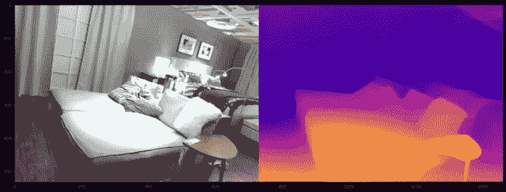
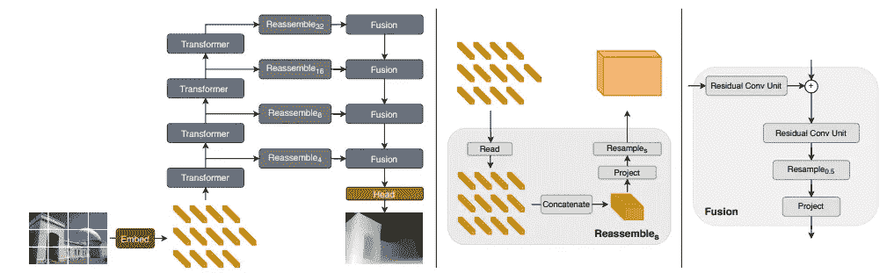
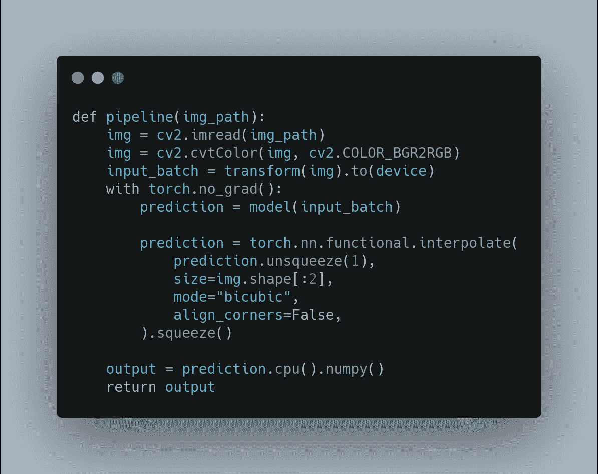
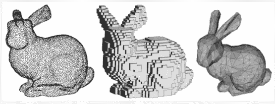
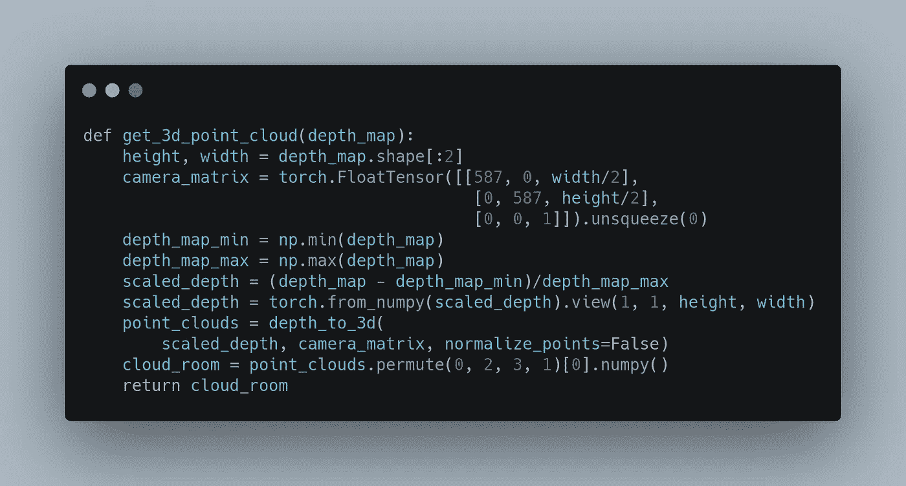
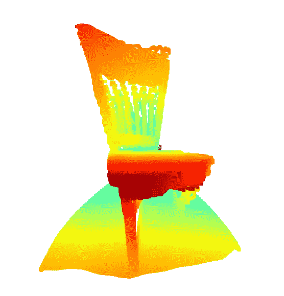
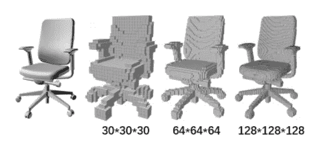
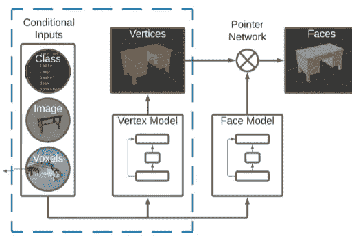
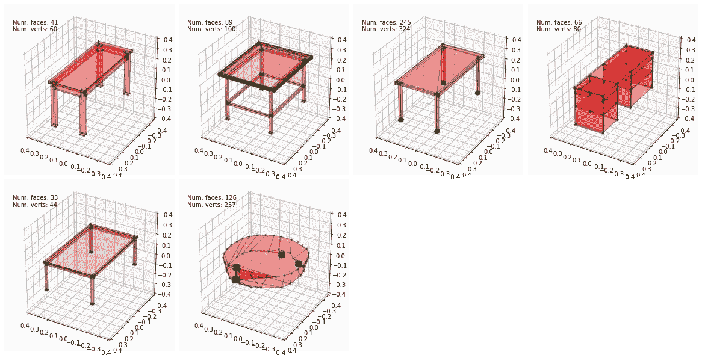

# 基于变压器的三维计算机视觉合成

> 原文：<https://towardsdatascience.com/transformer-based-3d-computer-vision-synthesis-eaa9677d931f?source=collection_archive---------13----------------------->

## 用数据做很酷的事情


图 1:[西蒙·李](https://unsplash.com/@simonppt)在 [Unsplash](https://unsplash.com/photos/Ue97JK9S0QE) 上的照片

# 介绍

3D 计算机视觉是一种迷人的现场教学模型，可以像我们一样理解世界。近年来，2D 计算机视觉在目标检测、分割、关键点估计等方面取得了巨大的进展。3D 计算机视觉涉及理解几何形状和深度，并在许多领域中有应用，包括机器人、自动驾驶、3D 跟踪、3D 场景重建和 AR/VR。

传统方法仍然非常受 3D 计算机视觉的欢迎，但深度学习已经取得了令人印象深刻的进展。在这篇博客中，我们将讨论表现 3D 物体和场景的不同方式。然后，我们将使用 Transformer 模型进行 3D 特征生成的实践代码。代码分享在 Github [这里](https://github.com/priya-dwivedi/Deep-Learning/tree/master/Transformer-based-3D)。

# 3D 信息的表示

从摄像机捕获的图像本质上是 2D 的，并且在过去，多个摄像机被用于理解场景的几何形状。

然而，使用多个相机和激光雷达来生成 3D 信息是一项昂贵的任务，也是 3D 计算机视觉更广泛使用的一个障碍。因此，焦点已经转移到深度学习方法上，这些方法可以从单个单目相机中提取关于场景的 3D 信息。

让我们来看看 3D 信息的不同表现方式。常见的代表包括:

1.  深度图
2.  体素表示
3.  点云
4.  网格表示

## 深度图

深度图允许我们提取深度，并将其显示为一个额外的维度。返回的深度可以是绝对深度，也可以是相对深度。深度可以标准化为 0 到 255 的黑白色标，并如下图 2 所示进行可视化。这里，靠近相机的点用红橙色标度，远离相机的点用蓝色标度。



图 2:使用 DLT 模型的深度估计。从本博客中的代码生成。作者照片

有几个公共数据集包含图像和相应的深度信息。NYU 深度 v2 就是这样一个数据集。通常，这些数据集的深度信息是使用 Kinect 等传感器计算的。

## 使用 DLT 的深度估计

[DLT 模型](https://arxiv.org/abs/2103.13413)将[视觉转换器](https://arxiv.org/abs/2010.11929)扩展到密集预测任务。我是变形金刚模型的忠实粉丝，Vision Transformer 是第一个流行的用于视觉任务的变形金刚实现。然而，Vision Transformer 是一种仅支持编码器的型号，通常与分类头一起用于分类任务。

DLT 的论文用解码器/融合器扩展了视觉变换器，该解码器/融合器在不同的头部对视觉变换器的输出进行采样，并融合这些表示以获得与输入图像具有相同形状的输出表示。该模型在深度估计和语义分割任务上进行训练，并在这两个方面显示了最先进的结果。

DLT 模型的模型架构如下图 3 所示。左侧显示了整体 DLT 架构，包括视觉转换器编码器模块，然后重组+融合为解码器模块。中间的面板展开了重新组装块，右边的面板解释了融合块。



图 3:他们论文中的 DLT 模型。来源:[链接](https://arxiv.org/pdf/2103.13413.pdf)

我已经使用 PyTorch hub 的 [DLT 的实现来从单目图像生成深度估计。我写了一个](https://pytorch.org/hub/intelisl_midas_v2/) [colab 笔记本](https://colab.research.google.com/drive/1a3kuY6TeH-TtIiYiTfMTGeNxPPmUlcAP?authuser=2#scrollTo=qd_sOLySBetD)，用于加载 DLT 模型，并使用样本图像对其进行推理。该代码也可以在 Github [这里](https://github.com/priya-dwivedi/Deep-Learning/tree/master/Transformer-based-3D)获得。

运行 DLT 模型的管道如下:



图 4:来自 Colab 笔记本的 DLT 模型代码。作者照片

深度图很容易计算并且相当精确，但是深度本身并不能提供场景的完整 3D 表示，因为深度不能从被遮挡的对象中计算出来。例如，上面图 1 中蒲团珠后面的床被遮挡，因此我们没有对它的深度估计。

其他表示能够提供物体的完整 3D 模型。



图 5:点云(左)、体素(中)和网格(右)的 3D 表示。来源:[链接](https://www.mdpi.com/2079-9292/8/10/1196/htm)

3D 对象的三种最常见的表示是体素、网格和点云。我真的很喜欢下面的图 5，它将一幅 2D 图像转换成了各种 3D 图像。

## 点云表示

点云表示涉及将 3D 空间表示为点的集合，每个点具有 3D 位置。

```
point_cloud = [(x1, y1, z1), (x2, y2, z2),..., (xn, yn, zn)]
```

物体的点云表示非常流行。它比深度估计更好地保留了输入形状。如果物体的 RGBD 信息是可用的，那么如果相机参数是已知的，它可以用于估计物体的点云。相机参数通常使用称为相机校准的过程来估计。

在我们关于 [Colab](https://colab.research.google.com/drive/1a3kuY6TeH-TtIiYiTfMTGeNxPPmUlcAP?authuser=2#scrollTo=qd_sOLySBetD) 和 [Github](https://github.com/priya-dwivedi/Deep-Learning/tree/master/Transformer-based-3D) 的代码中，我们使用 [Kornia](https://kornia.readthedocs.io/en/latest/get-started/introduction.html) 使用来自 DLT 的 RGBD 信息计算 3D 点云。



图 6:从深度图中提取三维点云的代码。作者照片

我们使用 depth_to_3d 函数将深度图转换为点云。对于尺寸为 416x416 的图像，点云是形状为 416x416x3 的 NumPy 数组。

然后，我们可以使用 [Open3D](http://www.open3d.org/) 库将 3D 点云转换为 ply 格式文件，并可视化生成的点云。 [colab](https://colab.research.google.com/drive/1a3kuY6TeH-TtIiYiTfMTGeNxPPmUlcAP?authuser=2#scrollTo=qd_sOLySBetD) 笔记本有运行这个可视化的代码，但是，colab 不能打开交互式可视化器。我能够在我的本地机器上运行 jupyter 笔记本的可视化。


图 7:来自 Open3D 的 3D 点云甲龙。从本博客中的代码生成。作者照片

从我们的深度图生成的椅子点云如下所示。请使用 open3d 库可视化椅子点云



图 8:来自 Open3D 的椅子的 3D 点云。从本博客中的代码生成。作者照片

## 体素表示

体素表示将对象表示为许多 3D 像素或立方体的组合。体素表示非常类似于真实世界的表示，在真实世界中，物体由微小的部分——原子/分子——组成。如果增加体素网格的分辨率，你会越来越接近真实世界的物体，如下图 6 所示。



图 9:椅子的体素表示。[来源](https://www.researchgate.net/figure/Three-expressions-of-3D-data-a-Multi-view-b-point-cloud-and-c-voxels_fig2_338614048)

基于体素的方法的主要缺点是在高分辨率体素上渲染和运行深度学习模型所需的计算。

## 网格表示

另一种常见的 3D 表示是网格表示。如图 6 所示，该网格表示将对象显示为连接在一起的面和顶点。

来自 DeepMind 的 Polygen model 使用变形器来生成代表 3D 对象的网格和面。它使用 2D 图像或体素作为条件输入，为 3D 对象生成一组可信的顶点。然后，它通过合理的方式连接顶点来生成面。

顶点和面模型都是自回归解码器，其中下一个顶点/面是基于在该点之前预测的所有其他东西来预测的。



图 10:解释的多边形模型。来源:[宝丽金论文](https://arxiv.org/pdf/2002.10880.pdf)

回购协议的作者已经发布了预先训练的模型和相同的 Colab 代码是[在这里](https://colab.research.google.com/github/deepmind/deepmind-research/blob/master/polygen/sample-pretrained.ipynb#scrollTo=FU3yBmWWebbk)。我测试了代码，为两个常见的对象生成网格——桌子和鸟舍。



图 11。多边形模型生成的表格网格样本。来源:本博客中的代码。作者照片

# 结论

这个博客展示了变形金刚模型是如何被用来生成我们世界的 3D 表现的。我们研究了如何使用变形金刚来生成室内场景的深度图。然后，我们将深度图转换为 3D 点云，并使用 Open3D 可视化这些点云。我们还查看了来自 Deep Mind 的多边形模型，以生成常见对象的网格。

我希望您尝试一下代码，并生成自己的常见场景的 3D 可视化。请在下面的评论中分享你的经历。

在[深度学习分析](https://deeplearninganalytics.org/)，我们非常热衷于使用机器学习来解决现实世界的问题。我们已经帮助许多企业部署了创新的基于人工智能的解决方案。通过我们的网站[这里](https://deeplearninganalytics.org/contact-us/)联系我们，或者如果你看到合作的机会，给我发电子邮件到 priya@deeplearninganalytics.org。

参考

1.  [Polygen 模型解释](/generating-3d-models-with-polygen-and-pytorch-4895f3f61a2e)
2.  [用于密集预测的视觉转换器](https://arxiv.org/pdf/2103.13413.pdf)
3.  关于[立体几何的细节](https://www.3dflow.net/elementsCV/S4.xhtml)
4.  [Kornia](https://github.com/kornia/kornia)3D 点云估算库