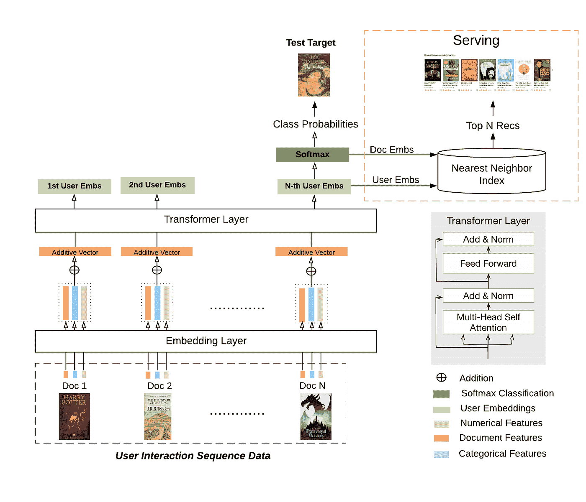
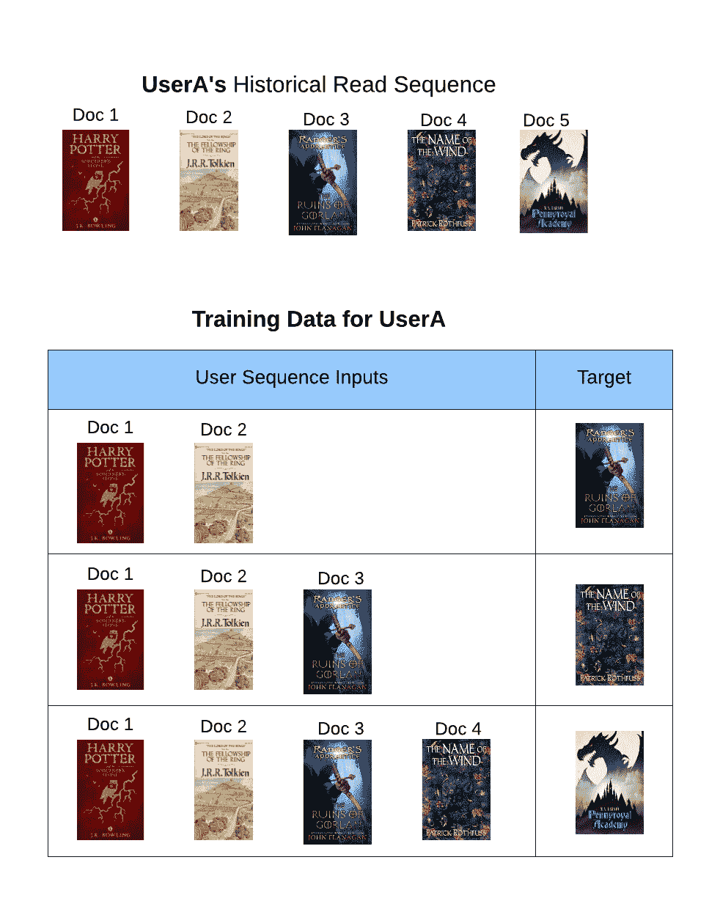
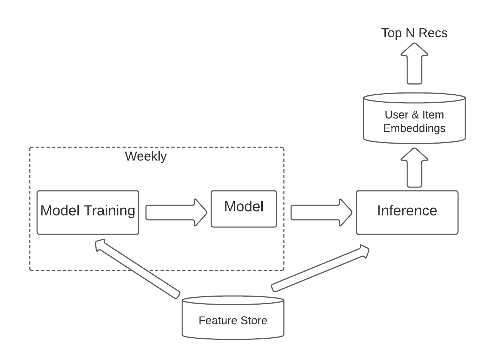

# Scribd 上基于变压器的实时推荐

> 原文：<https://towardsdatascience.com/transformer-based-real-time-recommendation-at-scribd-5fa05f000c47?source=collection_archive---------12----------------------->

## 我们如何在 Scribd 使用 transformer 模型生成实时推荐的详细信息、我们面临的挑战及其解决方案。

顺序深度学习模型已经在推荐行业中证明了其优势，可以根据用户过去的操作顺序生成更相关和动态的推荐。在 [Scribd](https://www.scribd.com/) 时，我们还使用顺序深度学习模型来生成个性化建议，从而显著提升了我们的业务指标。我们使用 transformer 模型架构来实现顺序深度学习模型，以生成实时建议。在这里，我将描述我们如何端到端地使用 transformer 模型。

本文介绍了变形金刚模型:注意力是你所需要的全部，然后应用于各种成功的项目中，如 [BERT:深度双向变形金刚的前期培训](https://arxiv.org/abs/1810.04805)。在自然语言处理领域，它被证明比 LSTM 的[和 GRU 的](https://arxiv.org/abs/1909.09586\)更好更快。基于转换器的模型架构也可以应用于推荐应用，但是推荐问题比 NLP 领域更复杂一些，因此需要根据业务需求进行调整。因此，在 Scribd，我们不是基于过去的单词序列来预测下一个单词，而是基于多种类型的文档和多种类型的交互的丰富用户交互历史来预测用户接下来想要阅读什么，其中序列中的位置&相对时间都是重要的因素。

我们缩小了范围，首次实施时最多只支持 300 万用户和 500 万个项目。但对于这种规模，我们还必须对特征收集和模型训练过程进行大量优化，以将训练时间减少到 12 小时以内。在这里，我包括我们执行的整体设计和优化。

如果你不熟悉基于 transformer 的架构，那么我推荐你阅读这篇文章:[图示的 Transformer](http://jalammar.github.io/illustrated-transformer/)

# 模型架构

我们只使用了 transformer 架构的编码器，它使用自我关注来组合来自用户过去交互的信号。自我关注是一种非常有效的机制，可以捕捉用户兴趣的任何近期变化，同时还能保持长期的上下文。但我们的模型仍然存在受欢迎程度偏差，我们通过对训练数据进行分层来减少这种偏差。

经许可，图片由 Scribd 提供

## **输入嵌入和池层** : -

这一层对来自交互、用户和项目数据的各种特征进行整形，并将它们加在一起以创建最终的输入向量，该向量将被输入到 transformer 的编码器层。

*   分类特征被映射到相应的嵌入，并且它们作为训练过程被学习。
*   所有数字特征被连接并通过前馈网络，以将矢量大小调整为变压器层输入的预期矢量大小。
*   所有这些向量被加权并相加，以产生每次交互的最终向量，该向量将被馈入 transformer 的编码器层。

## **变压器的编码器层** :-

编码器层使用自关注结合所有交互序列，随后是前馈网络和标准化。我们发现，在超参数调整期间，2 个编码器和 1 个头就足够了。

潜在输出向量将在每个序列的 2 个编码器的末端生成，但是只有最后一个序列的潜在输出向量用于预测下一个项目。我们称这个最后的潜在输出向量为用户嵌入。

## **优化功能:-**

Scribd 的用户可以以不同的方式进行互动，如阅读书籍，听有声读物或播客，书签，下载或评价书籍，导航，搜索等。在仔细分析业务影响后，我们决定仅对几个重要的参与度指标进行模型优化，如具有特定阅读阈值的阅读、书签、下载等。为了简化多任务学习问题，我们假设所有这些指标的权重相等。它把 MTL 问题归结为第一阶段的分类问题。在后期阶段，我们将微调多种交互类型的权重。

最初，我们使用三元组和 BPR 损失，它学习对给定用户的正面目标进行比负面目标更高的排序，但是交叉熵分类损失在实践中对我们的训练数据表现得更好。

## **使用用户和项目嵌入服务** : -

如上所述，来自编码器的最后一个潜在输出向量被称为用户嵌入。然后这些用户嵌入通过前馈网络来计算所有项目的预测分数。因此，这些最后的预测前向网络的权重被称为项目嵌入。因此，用户嵌入和项目嵌入之间的点积将给出实际的推荐分数。因此，可以使用任何支持最近邻搜索的数据库来提供实时推荐。我们决定使用弹性搜索，这样在进行最近邻搜索之前，我们可以根据地理、语言和其他数百种业务限制进行预过滤。

每当用户的交互发生变化时，我们可以使用推理阶段(每小时 X 次)计算用户嵌入，并且只为该用户计算变化指数。因此，它还可能支持近乎实时的更新。

注意，前馈网络也具有偏差项，因此需要通过添加最后填充维度来调整用户嵌入的维度。

## **训练数据和特点**

经许可，图片由 Scribd 提供

用户的交互阅读序列被分成子序列，以创建更多的训练数据，如下图所示。这对于捕捉用户早期的消费模式非常有用，有助于对交互历史较少的用户进行预测。

**特征** :-对于用户交互序列中的每个交互，我们基本上有 3 种类型的特征:交互特征、用户特征和物品特征。

交互特征有阅读时间、下载与否、书签与否等。用户特征是用户的人口统计信息，项目特征是类别/分类、项目 id、语言等。

# 挑战和解决方案:—

这些是我们在实施过程中面临的一些挑战，并找到了解决方案。如果您有与我们相似的用例，这可能会对您有所帮助。

## **可变序列长度的相互作用** :-

尽管 transformer 模型足够灵活，可以采用可变的序列长度，但许多从业者通常使用固定长度的交互序列，因此可以批量运行不同序列的不同交互，以加快训练速度。分批运行非常有效，但是需要填充较小的序列。因此，如果我们保持最大序列太高，我们将有太多的序列与很多 paddings，这在训练期间浪费资源。

所以我们在 spark 中开发了自定义特征管道，将长度相近的序列批量分组，并以预批量格式保存在 TFRecords 文件中。这大大减少了较小序列的填充。此外，我们确保了序列批次将不会按序列长度排序，从而允许从不同长度的序列批次中快速学习。

## 使用类似于位置嵌入的相对时间:-

所有基于变压器的模型都使用位置嵌入来捕获序列相关信号，但在我们的情况下，相对时间比位置本身更重要。例如，用户可能在 2 个月左右后访问网站，那么最后一次交互可能不是那么新鲜。

当超参数调整时，我们发现相对时间的基于正弦的编码比使用以天为单位的绝对相对时间作为特征执行得更好。

## **处理电力用户超负荷:-**

由于训练数据具有来自高级用户的大量样本，因此模型仅关注高级用户细分的过度优化。但与此同时，超级用户更有可能与不太受欢迎的项目进行交互，因此截断用户历史可能会损害低尾项目的性能。最初，我们试图为超级用户减轻体重，但这也损害了低尾物品的性能。因此，后来我们发现了一种平衡的折衷方案，首先用几个时期的原始训练数据来训练模型，然后用另外几个时期的截断训练数据来训练模型，以便在所有用户群之间进行微调。

## **多 GPU &优化函数:——**

多 GPU 大大加快了训练时间，所以我们使用 8 个 GPU 的 AWS 机器进行训练和预测。使用多 GPU 是直截了当的，除了模型训练的优化步骤。这个特别的 tensorflow 文档在这里帮助了。我们目前使用*TF . keras . losses . sparsecategoricalcrossentropy*loss，因为我们的文档不到 500 万个。

# 排名管道

在推荐行业，排名管道通常由候选生成和排名管道组成。尽管我们有多达 500 万个文档，但我们使用弹性搜索，在没有候选生成步骤的情况下，成功地直接进行了实时排名。更多细节在[这篇博客](https://tech.scribd.com/blog/2021/embedding-based-retrieval-scribd.html)中有所描述。

经许可，图片由 Scribd 提供

*   模特每周都要重新训练。
*   用户和项目嵌入每小时生成 X 次。
*   在预过滤和排序步骤之后，生成前 N 个 rec。

# 结果

使用 Scribd 的内部 A/B 测试平台，我们进行了一项实验，将现有的推荐服务与新的个性化模型进行比较，以生成订户的主页。测试进行了大约一个月，超过 100 万 Scribd 用户(试用者或订户)被指定为参与者。在对结果进行仔细分析后，我们发现，与所有用户群的控制体验相比，个性化变体在统计上有以下显著改善(p<0.01):

*   点击推荐项目的用户数量增加
*   每个用户平均点击次数的增加
*   阅读时间至少为 10 分钟的用户数量增加(在三天的时间内)

这些增长代表了对关键性能指标的重大业务影响。

# 后续步骤

正如预期的那样，个性化模型在具有丰富历史的用户上表现得更好，但仍需要对早期用户进行改进。因此，我们正在努力使用强化学习来改善早期用户的用户体验。另一方面，我们正致力于通过为项目添加丰富的分类功能来提高长尾项目的推荐质量。

感谢您的阅读！我们希望这篇文章对你有所帮助。

# 参考资料:-

以下是我为本文参考的一些论文:

*   [注意力是你所需要的一切](https://arxiv.org/abs/1706.03762)
*   [伯特:深度双向变压器预训练](https://arxiv.org/abs/1810.04805)
*   [自我关注顺序推荐](https://arxiv.org/abs/1808.09781)
*   [BERT4Rec:来自变压器的双向编码器表示的顺序推荐](https://arxiv.org/abs/1904.06690)
*   [环境感知顺序推荐](https://arxiv.org/abs/1609.05787)
*   [带有亚马逊产品嵌入的大规模协同过滤](https://arxiv.org/pdf/1901.04321.pdf)
*   [阿里巴巴电子商务推荐行为序列转换器](https://arxiv.org/pdf/1905.06874.pdf)