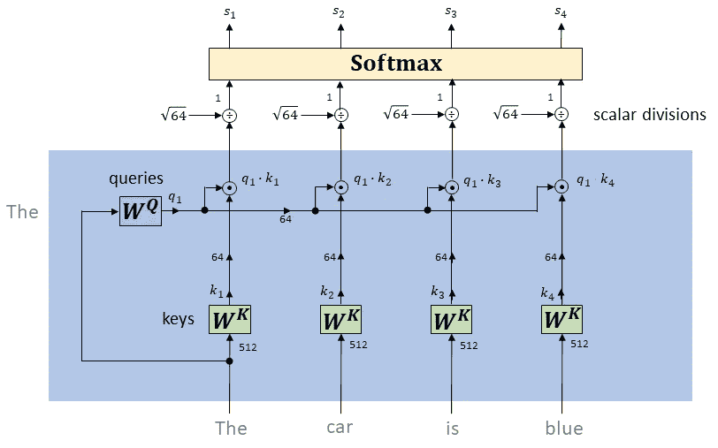
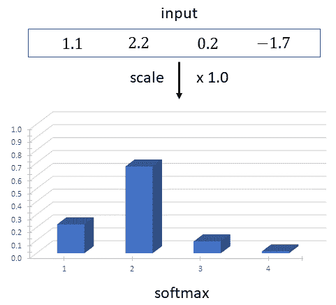
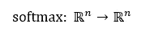
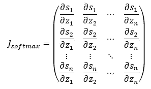
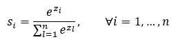
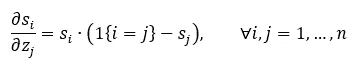
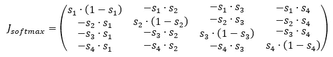
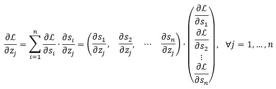
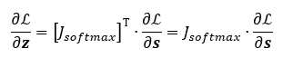

# 变压器网络:为什么缩放点积会导致更稳定的梯度的数学解释

> 原文：<https://towardsdatascience.com/transformer-networks-a-mathematical-explanation-why-scaling-the-dot-products-leads-to-more-stable-414f87391500?source=collection_archive---------9----------------------->

## 一个小细节如何能产生巨大的影响

在变压器网络中使用的自注意机制的主要目的是生成考虑了周围单词的上下文的单词嵌入。自我注意机制通过将句子中的每个单词与句子中的每个其他单词进行比较，并随后将上下文相关的单词组合在一起来完成这项任务。

计算第一个单词的自我关注分数(图片由作者提供)

自我注意机制首先为句子中的每个单词计算三个向量(查询、键和值)。为了找到所选单词的上下文相关单词，我们将查询向量与句子中其他单词的关键向量进行点积，见上图。点积产生负无穷大和正无穷大之间的任何值，因此应用 softmax 将这些值映射到[0，1]，并确保它们在整个序列中的总和为 1。如此获得的自我注意分数对于与所选单词无关的单词来说是很小的。

*上图未示:自我关注分数随后用于构建所谓的价值向量的* [*凸组合*](https://en.wikipedia.org/wiki/Convex_combination) *。关于变压器网络如何工作的更多细节，见这篇* [*帖子*](/drawing-the-transformer-network-from-scratch-part-1-9269ed9a2c5e) *。*

但为什么点积在馈入 softmax 函数之前要用√64 进行缩放？在大多数关于变形金刚的教程中，我们听到一些关于点积在数量级上变大的事情，从而将 softmax 函数推到梯度极小的区域。

在这篇文章中，我们想从数学上理解为什么这句话成立。为此，我们将首先探讨 softmax 函数对于大幅度输入的行为。然后，我们将分析大幅度对 softmax 函数导数的影响。

# Softmax 函数

在变压器网络中，softmax 函数的主要目的是获取一系列任意实数(正数和负数),并将它们转换为正数，其总和为 1:

(图片由作者提供)

上面公式中的指数函数确保获得的值是非负的。由于分母中的归一化项，获得的值总和为 1。

但是，softmax 函数不是比例不变的，如以下动画所示:

(图片由作者提供)

我们对输入的比例越大，最大的输入就越能控制输出。随着比例的增加，softmax 函数会将接近 1 的值分配给最大输入值，将 0 分配给所有其他值。这是由指数函数的性质造成的，指数函数增长越快，其输入越大。另一方面，如果我们降低输入的比例，softmax 输出会变得非常相似。

# 雅可比矩阵

在我们继续之前，我们必须澄清一件事:softmax 在形式上是一个所谓的*向量函数*，它以一个向量作为输入，并产生一个向量作为输出:

所以，我们在讲 softmax 函数的导数时，实际上讲的是它的雅可比矩阵(而不是梯度)，它是所有一阶偏导数的矩阵:

在哪里

在[之前的帖子](/derivative-of-the-softmax-function-and-the-categorical-cross-entropy-loss-ffceefc081d1)中，我们已经推导出了雅可比矩阵元素的封闭表达式:

看，在上面的公式中，𝑠的偏导数是如何用𝑠本身来表示的。为了看到雅可比矩阵的完整结构，让我们把𝑛 = 4 写在纸上:

我们看到对角线元素不同于非对角线元素。此外，我们看到 softmax 的雅可比矩阵是对称的。

接下来让我们寻找一种情况，其中雅可比矩阵的所有元素都变为零。很容易看出，当任何一个𝑠取值为 0 或 1 时，对角线元素变为零。当非对角线元素的一个或两个因子为零时，非对角线元素变为零。因此，雅可比矩阵在以下四种情况下成为零矩阵:

我们在上一节中已经看到，对于较大的输入，softmax 函数产生的输出与上述输出非常相似。

# 通过 Softmax 层反向传播

这个难题的最后一部分是展示，为什么 softmax 的大输入值会导致梯度在反向传播过程中消失。

假设使用反向传播，我们已经计算了 softmax 函数输出端的梯度，如下图所示:

(图片由作者提供)

接下来，我们希望通过 softmax 函数反向传播，并获得输入端的梯度。请记住，softmax 函数的每个输出都依赖于它的所有输入。使用我们为𝑗-th 输入获得的链式法则:

右手边的行向量可以被识别为雅可比矩阵的𝑗-th 列。因此，通过 softmax 层反向传播相当于乘以其雅可比矩阵:

我们已经看到，当输入大幅增加时，softmax 函数的雅可比矩阵收敛为零矩阵。在这种情况下，梯度流(误差传播)因此被 softmax 层扼杀，并且在 softmax 层之前的所有元素减慢学习或者甚至完全停止学习。

在变压器网络中，softmax 函数的输入由关键向量和查询向量之间的点积组成。关键向量和查询向量的维度𝑑越大，点积就越大。在原始论文中，关键向量的维数是 64。作者在原始论文中应用的补救措施是用查询和键的维度的平方根来划分点积。这样，不管键和查询向量的维数是多少，学习都会进行得很好。

# 参考

[注意你所需要的一切](https://arxiv.org/pdf/1706.03762.pdf)
[从零开始绘制变压器网络](/drawing-the-transformer-network-from-scratch-part-1-9269ed9a2c5e)
[从零开始绘制变压器](http://peterbloem.nl/blog/transformers)
[soft max 的雅可比矩阵](/derivative-of-the-softmax-function-and-the-categorical-cross-entropy-loss-ffceefc081d1)