# 变形金刚、时间形成者和注意力

> 原文：<https://towardsdatascience.com/transformers-an-exciting-revolution-from-text-to-videos-dc70a15e617b?source=collection_archive---------6----------------------->

## 从文本到视频的激动人心的革命

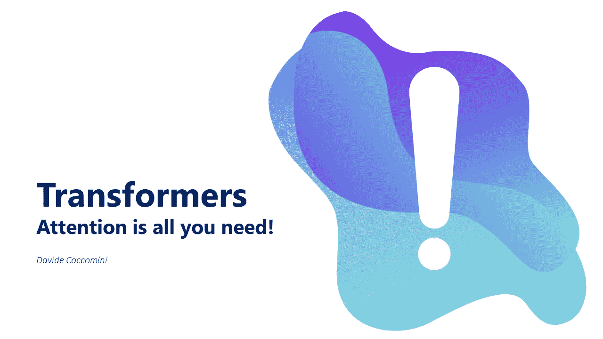

转换器是一种非常强大的深度学习模型，已经能够成为许多自然语言处理任务的标准，并有望彻底改变计算机视觉领域。

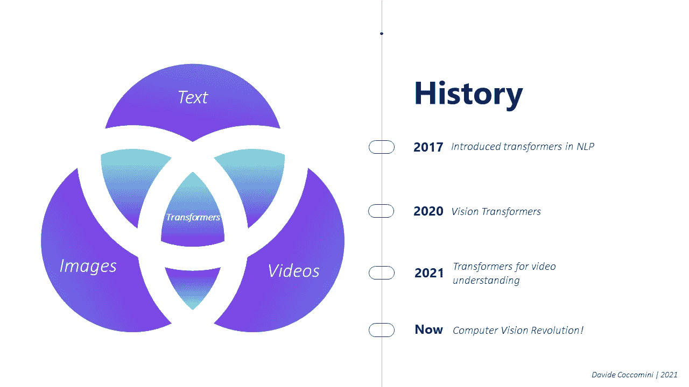

这一切都始于 2017 年，当时谷歌大脑发表了一篇注定改变一切的论文，注意力是你所需要的一切[4]。研究人员将这种新的架构应用于几个自然语言处理问题，很快就可以看出这在多大程度上能够克服困扰 rnn 的一些限制，rnn 传统上用于诸如从一种语言翻译到另一种语言的任务。
这些年来，变形金刚已经成为自然语言处理领域的一个机构，谷歌大脑在 2020 年问道，它们在图像上也会一样有效吗？答案是肯定的，视觉变形金刚诞生了，通过对图像的一些初步修改，他们设法利用了变形金刚的经典架构，并很快在该领域的许多问题上达到了最先进的水平。

兴奋是巨大的，几个月后，在 2021 年初，脸书的研究人员发布了新版本的变形金刚，然而，这一次，专门针对视频，时间形成者。显然，即使在这种情况下，通过一些微小的结构变化，这种架构很快就成为视频的赢家，脸书在 2021 年 2 月宣布，它将把它与社交视频结合使用，以创建用于各种目的的新模型。

# 为什么我们需要变形金刚？

B 但是让我们后退一步，探索驱使谷歌研究人员寻找一种新的替代架构来解决自然语言处理任务的动机。

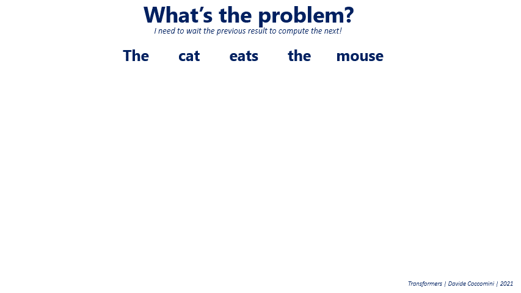

传统上，诸如翻译之类的任务是使用递归神经网络来执行的，已知递归神经网络存在许多问题。主要问题之一是它的顺序操作。例如，要将一个句子从英语翻译成意大利语，使用这种类型的网络，要翻译的句子的第一个单词与初始状态一起被传递到编码器，然后下一个状态与句子的第二个单词一起被传递到第二个编码器，依此类推，直到最后一个单词。来自最后一个编码器的结果状态然后被传递到解码器，该解码器返回第一个翻译的单词和随后的状态作为输出，该状态被传递到另一个解码器，依此类推。

这里的问题相当明显，要完成下一步，我必须有上一步的结果。这是一个很大的缺陷，因为您没有利用现代 GPU 的并行化能力，因此在性能方面会有所损失。还有梯度爆炸、无法检测同一个句子中距离较远的词之间的依存关系等等其他问题。

# 你需要的只是关注？

于是问题出现了，有没有一种机制可以让我们以并行的方式计算，让我们从句子中提取我们需要的信息？答案是肯定的，这个机制就是注意力。

如果我们要定义注意力暂时忘记任何技术和实现方面，我们将如何去做？

让我们以一个例句为例，问我们自己，把注意力集中在单词“gave”上，我应该把注意力放在句子中的哪些其他单词上来增加这个单词的含义？我可能会问自己一系列问题，比如，谁给的？在这种情况下，我会把注意力集中在“我”这个词上，然后我可能会问是谁给的？把我的注意力放在查理这个词上，最后，我可能会问，是什么给出了？最后关注食物这个词。
通过问自己这些问题，也许对句子中的每个单词都这样做，我也许能够理解句子的意思和层面。此时的问题是，我如何在实践中实现这个概念？

为了理解注意力的计算，我们可以将注意力与数据库世界相比较。当我们在数据库中进行搜索时，我们提交一个查询(Q ),并在可用数据中搜索满足该查询的一个或多个关键字。输出是与查询最相关的键的相关值。

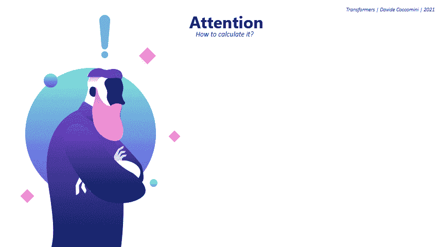

注意力计算的情况极其相似。
我们首先将计算注意力的句子视为一组向量。通过单词嵌入机制，每个单词被编码成一个向量。我们认为这些向量是搜索的关键，对于我们正在搜索的查询，它可能是来自同一个句子(自我关注)或来自另一个句子的单词。此时，我们需要计算查询和每个可用键之间的相似性，通过缩放的点积进行数学计算。该过程将返回一系列真实值，这些值可能彼此非常不同，但是由于我们希望获得 0 到 1 之间的权重，并且其总和等于 1，因此我们对结果应用 SoftMax。一旦获得了权重，我们必须将每个单词的权重，以及它与查询的相关性，乘以代表它的向量。我们最终返回这些产品的组合作为注意力向量。

为了建立这种机制，我们使用线性层，从输入向量开始，通过矩阵乘法生成关键字、查询和值。关键字和查询的组合将允许在这两个集合之间获得最正确的匹配，然后将它们的结果与值组合，以便获得最相关的组合。

但是如果我们想把注意力集中在一个单词上，这个机制就足够了，但是如果我们想从几个角度看这个句子，然后并行地计算几次注意力呢？我们使用所谓的多头注意力，具有类似的结构，其结果在最后被简单地组合以返回所有计算的注意力的单个汇总向量。

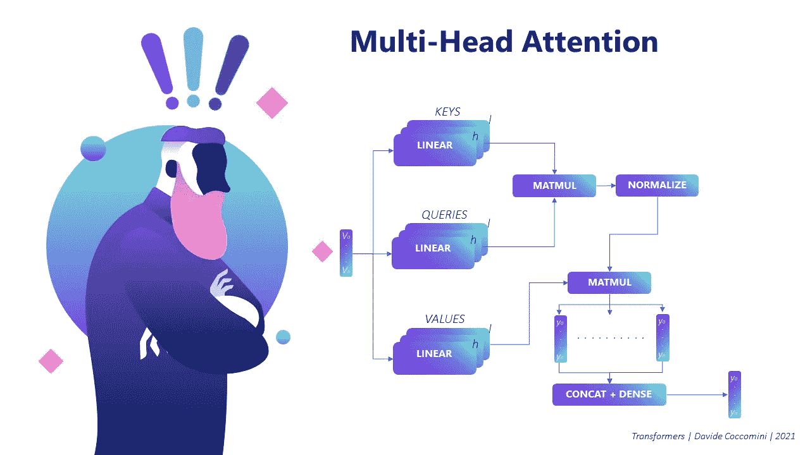

既然我们已经了解了使用哪种机制并确定了其并行性，那么让我们分析一下嵌入多头注意力的结构以及构成转换器的结构。

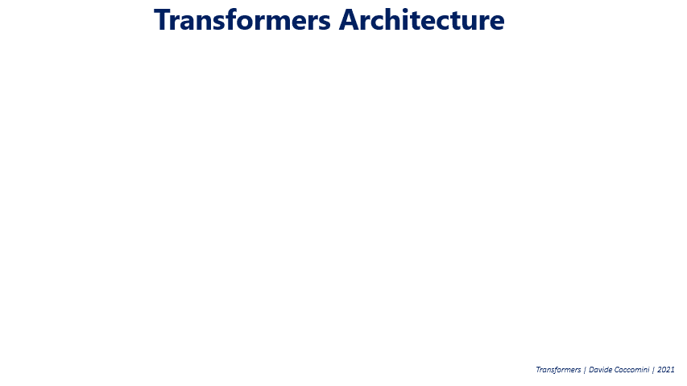

考虑到总是翻译任务，让我们首先关注图像的左边部分，即编码部分，它把要从英语翻译成意大利语的整个句子作为输入。在这里，我们已经看到，与 RNN 方法相比，这是一个巨大的革命，因为它不是逐字处理句子，而是完全提交。在进行注意力计算之前，表示单词的向量与基于正弦和余弦的位置编码机制相结合，该位置编码机制在向量中嵌入关于单词在句子中的位置的信息。这一点非常重要，因为我们知道，在任何语言中，单词在句子中的位置都不仅仅是相关的，如果我们想要做出正确的评估，这是我们绝对不能丢失的信息。所有这些信息传递到多头注意力机制，其结果被标准化并传递到前馈。编码可以进行 N 次，以获得更有意义的信息。

但是要翻译的句子并不是转换器的唯一输入，我们还有第二个模块，解码器，它接收转换器先前执行的输出。例如，如果我们假设我们已经翻译了前两个单词，我们想预测意大利语句子的第三个单词，我们将把前两个翻译的单词传入解码器。将对这些字进行位置编码和多头关注，并将结果与编码器结果相结合。对该组合重新计算注意力，并且借助于线性层和 softmax，结果将是成为新翻译单词的潜在候选单词的向量，具有与它们中的每一个相关联的概率。在下一次迭代中，除了前面的单词之外，解码器还将接收这个单词。

因此，这种结构被证明是非常有效的，这是因为它完整地处理句子，而不是一个单词一个单词地处理，保留了关于单词在句子中的位置的信息，并利用了注意力，这是一种能够有效表达句子内容的机制。

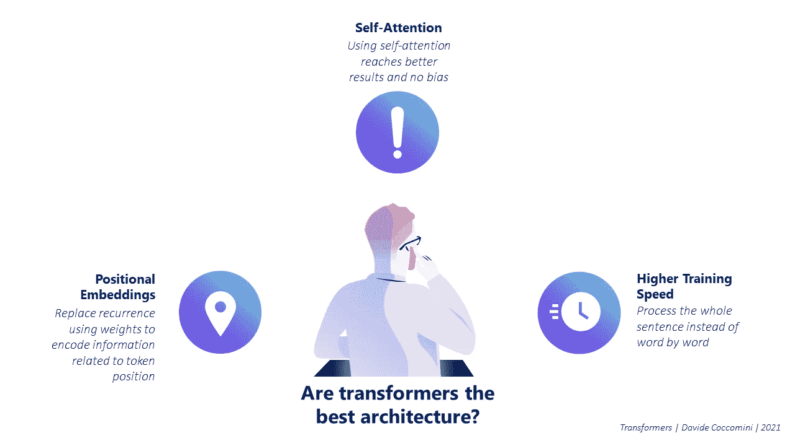

经过这么好的解释，你可能会认为变形金刚是完美的，没有任何缺陷。显然，事实并非如此，它的优势之一也是它的弱点，注意力的计算！

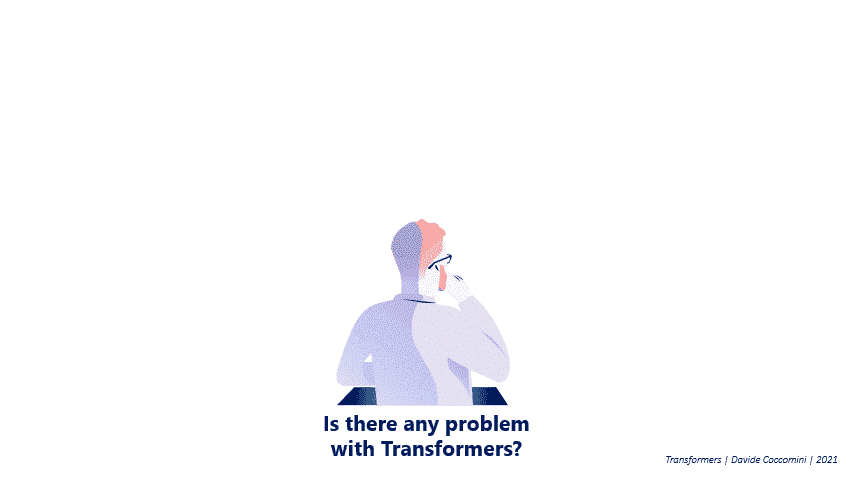

为了计算每个单词相对于所有其他单词的注意力，我必须执行 N 次计算，即使是部分并行的，也仍然非常昂贵。有了这样的复杂性，让我们想象一下，在一个数百个单词的段落上多次计算关注度意味着什么。

从图形上看，你可以想象一个矩阵，其中必须填充每个单词相对于其他任何单词的注意力值，这显然有相关的成本。重要的是要指出，可选地并且通常在解码器上，可以计算掩蔽注意力，其中避免计算查询词和所有后续词之间的注意力

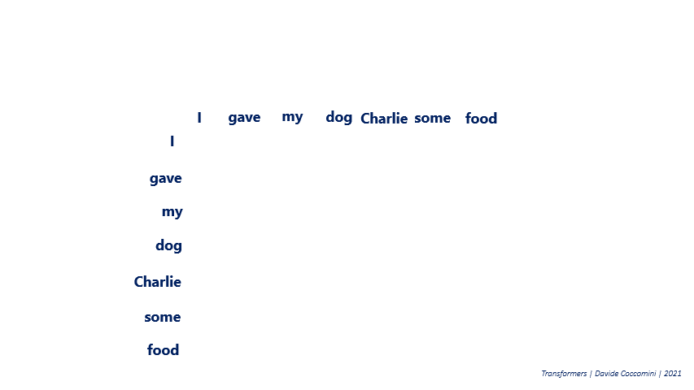

有些人可能会说，但是如果变形金刚带来的许多好处都与注意力机制有关，我们真的需要上面看到的所有结构吗？但 2017 年的第一篇谷歌大脑论文不是说“注意力是你所需要的一切”吗？[4]这当然是合理的，但在 2021 年 3 月，谷歌的研究人员再次发表了一篇题为“注意力不是你所需要的全部”的论文[6]。那是什么意思？研究人员进行了实验，分析了在没有变压器任何其他组件的情况下进行的自我关注机制的行为，并发现它以双指数速率收敛到秩 1 矩阵。这意味着这种机制本身实际上是无用的。那么为什么变形金刚这么厉害呢？这是由于倾向于降低矩阵等级的自我关注机制与变形金刚的另外两个组成部分——跳过连接和 MLP——之间的拉锯战。

第一种方法允许路径分布多样化，避免获得所有相同的路径，这大大降低了矩阵降阶为 1 的可能性。相反，由于其非线性，MLP 设法增加所得矩阵的秩。相反，已经证明正常化在避免自我注意机制的这种行为中不起作用。因此，注意力并不是你所需要的全部，但是 transformer 架构成功地利用了注意力来达到令人印象深刻的效果。

# **视觉变形金刚**

A 生活在 2020 年的这个时候，谷歌的研究人员再次想知道，“但是如果变形金刚被发现在自然语言处理领域如此有效，它们将如何处理图像？”。有点像 NLP，我们从注意力的概念开始，但这次应用于图像。我们试着通过一个例子来理解一下。

图片来自“一张图片相当于 16x16 个单词”(Dosovitskiy 等人)

如果我们考虑一幅站在墙前的狗的图片，我们中的任何人都会说这是一幅“狗的图片”而不是一幅“墙的图片”，这是因为我们将注意力集中在图像的主导和辨别主体上，这正是应用于图像的注意力机制所做的。

既然我们知道注意力的概念也可以扩展到图像，我们只需要找到一种方法将图像输入到一个经典的转换器中。

我们知道转换器将单词作为输入向量，那么我们如何将图像转换成向量呢？当然，第一个解决方案是使用图像的所有像素，并将它们“内联”以获得一个矢量。但是让我们停一会儿，看看如果我们选择这个选项会发生什么。

我们之前说过，注意力的计算复杂度等于 O(N)。这意味着，如果我们必须计算每个像素相对于所有其他像素的复杂度，在像 256x256 像素这样的低分辨率图像中，我们将需要进行大量的计算，并且使用当今的资源绝对无法完成。所以这种方法肯定是不可行的。

解决方案非常简单，在论文“一幅图像相当于 16x16 个字”[2]中，提出将图像分成小块，然后使用线性投影将每个小块转换成矢量，该线性投影将小块映射到矢量空间中。

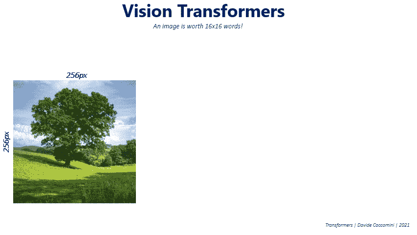

现在我们只需要去看看视觉转换器的架构。

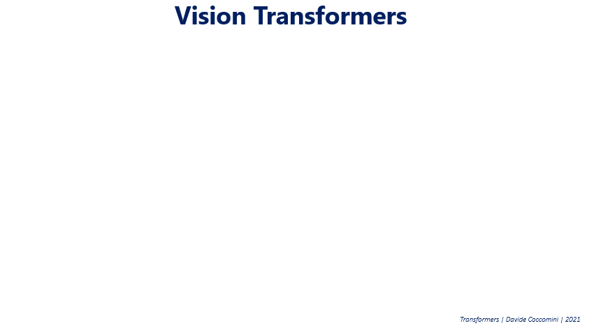

然后，图像被分成小块，这些小块通过线性投影获得向量，向量与关于小块在图像中的位置的信息耦合，并被提交给经典变换器。添加关于图像内补片的原始位置的信息是基本的，因为在线性投影期间，该信息将会丢失，即使这对于完全理解图像的内容是非常重要的。插入另一个向量，该向量独立于被分析的图像，并且用于获得关于整个图像的全局信息，并且实际上，对应于该小块的输出是唯一被考虑并被传递到将返回预测类的 MLP 中的输出。

但是，在这个过程中有一个点会丢失大量信息。事实上，在从面片到矢量的转换过程中，任何有关面片中像素位置的信息都会丢失。这肯定是一件严肃的事情，Transformer in Transformer(TnT)[3]的作者指出，因为要分析的一部分图像中的像素排列是我们不希望为了进行质量预测而丢失的某些信息。

TnT 的作者然后问他们自己，有没有可能找到一种更好的方法让向量提交给转换器？然后，他们的建议是获取图像的每个单独的小块(pxp ),这些小块本身是 3 个 RGB 通道上的图像，并将其转换为 c 通道张量。然后这个张量被分成 p '个部分，p' < p，在这个例子中 p'=4。这产生了 c 维中的 p '矢量。这些向量现在包含了关于片内像素排列的信息。

然后，将它们连接起来并进行线性投影，以便使它们与从原始面片的线性投影中获得的矢量大小相同，并与该矢量组合。

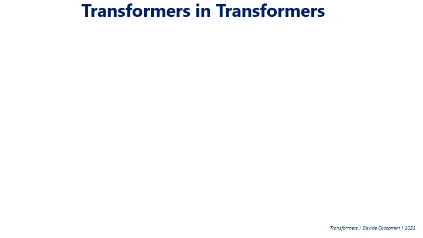

通过这样做，变换器的输入向量也将受到片内像素排列的影响，并且通过这样做，作者已经设法进一步提高了各种计算机视觉任务的性能。

# 时间形成者

鉴于变形金刚首先在自然语言处理领域取得了巨大成功，然后在图像领域取得了巨大成功，2021 年，脸书的研究人员试图将这种架构应用到视频领域。

直觉上，很明显这是可能的，因为我们都知道视频只不过是一个接一个的一组帧，而帧只不过是图像。

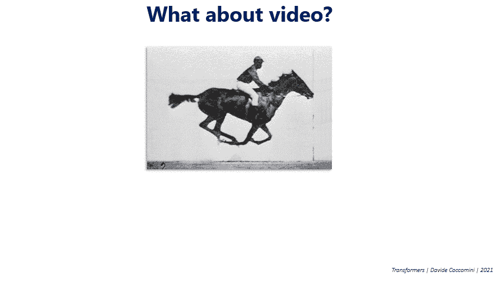

只有一个小细节使它们不同于视觉变形金刚，你不仅要考虑空间，还要考虑时间。事实上，在这种情况下，当我们计算注意力时，我们不能将帧视为孤立的图像，而是应该找到某种形式的注意力，将连续帧之间发生的变化考虑在内，因为它是视频评估的核心。

为了试图解决这个问题，作者提出了几种新的注意力机制，从专门关注空间(主要用作参考点)的机制，到在空间和时间之间轴向、分散或联合计算注意力的机制。

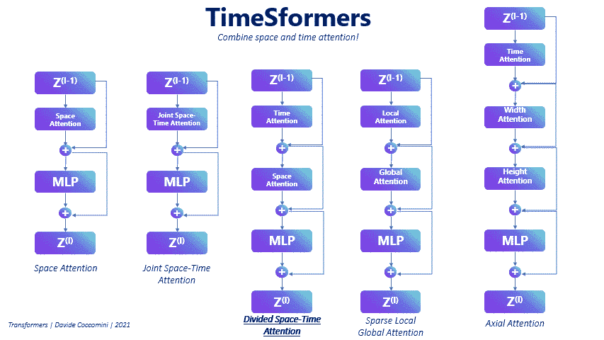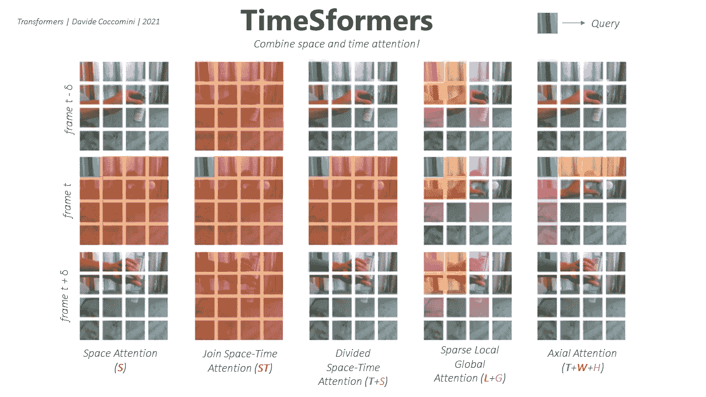

图片来自“一张图片相当于 16x16 个单词”(Dosovitskiy 等人)

然而，取得最佳效果的方法是时空分离注意力。在给定时刻 t 的帧和作为查询的它的一个片的情况下，它包括计算整个帧上的空间注意力，然后计算查询的相同片但在前一帧和下一帧中的时间注意力。

但是为什么这种方法如此有效呢？原因是它比其他方法学习更多的独立特征，因此能够更好地理解不同类别的视频。我们可以在下面的可视化中看到这一点，其中每个视频由空间中的一个点表示，其颜色代表其所属的类别。

图片来自“一张图片相当于 16x16 个单词”(Dosovitskiy 等人)

作者还质疑了视频分辨率和其中帧数的相关性，并发现分辨率越高，模型的准确性就越高，在一定程度上。至于帧数，同样随着帧数的增加，精度也增加。有趣的是，不可能用比图中所示更高的帧数进行测试，因此精度仍有可能提高，我们还没有找到这种提高的上限。

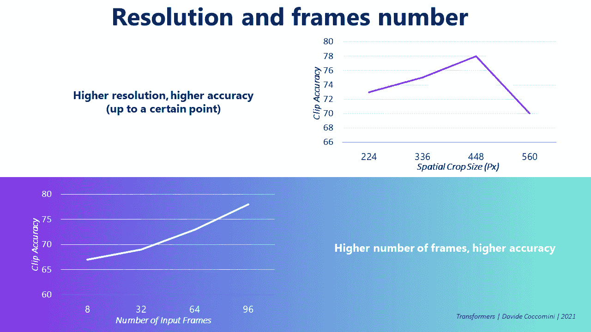

众所周知，在视觉变形器中，较大的训练数据集通常会产生更好的准确性。作者在 TimeSformers 上也检查了这一点，同样，随着考虑的训练视频数量的增加，准确性也增加了。

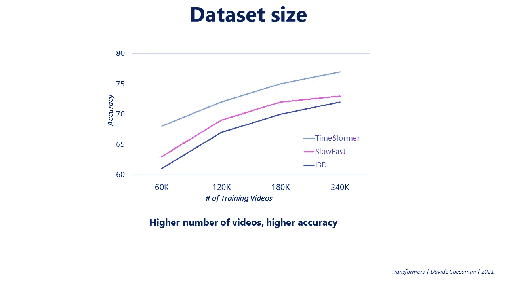

# 结论

现在还剩下什么要做？变形金刚刚刚进入计算机视觉的世界，似乎决心要取代传统的卷积网络，或者至少在这一领域为自己开拓出一个重要的角色。因此，科学界正处于混乱之中，试图进一步改进变压器，将它们与各种技术结合起来，并应用于实际问题，最终能够做一些直到最近才成为可能的事情。像脸书和谷歌这样的大巨头正在积极开发和应用变形金刚，我们可能只是触及了表面。

*关键词:变形金刚，视觉变形金刚，时间变形金刚，注意力*

**你喜欢这篇文章吗？** [**加入我的领英**](https://www.linkedin.com/in/davide-coccomini/) **！**

如果你对变形金刚感兴趣，请阅读我关于恐龙的文章！

# 参考文献和见解

[1]“格达斯·伯塔修斯、王恒、洛伦佐·托雷萨尼”。"[视频理解只需要时空注意力吗？](https://arxiv.org/abs/2102.05095)”。

[2]“阿列克谢·多索维茨基等人”。[一幅图像相当于 16x16 个字:用于图像识别的变形金刚](https://arxiv.org/abs/2010.11929)。

[3]《韩凯等人》。[变压器中的变压器](https://arxiv.org/abs/2103.00112)。

[4]“阿希什·瓦斯瓦尼等人”。[注意力是你所需要的一切](https://arxiv.org/abs/1706.03762)。

[5]《启哲谢等》。"[与吵闹的学生一起进行自我训练提高了 ImageNet 分类](https://arxiv.org/abs/2010.11929)"。

[6]"董一禾等人"，"[注意力不是你所需要的全部:纯粹的注意力随着深度成倍地失去排名](https://arxiv.org/abs/2103.03404)"

[7]“Nicola Messina 等”，[用于图文匹配检索的变压器推理网络](https://arxiv.org/abs/2004.09144)

[8]“Nicola Messina 等人”，“[使用转换器编码器进行跨模态检索的细粒度可视文本对齐](https://arxiv.org/abs/2008.05231)”

[9]“大卫·科科米尼”，“[训练码为](https://github.com/davide-coccomini/TimeSformer-Video-Classification)的视频分类时间转换器”

[10]《大卫·柯考米尼》。[视觉变压器还是卷积神经网络？都是！](/vision-transformers-or-convolutional-neural-networks-both-de1a2c3c62e4)”

[11]《大卫·柯考米尼》。"[注意力是你在《变形金刚》中真正需要的吗？](/is-attention-what-you-really-need-in-transformers-6c161c2fca83)

[12]《大卫·柯考米尼》。[在迪诺上，无标签自蒸馏](/on-dino-self-distillation-with-no-labels-c29e9365e382)