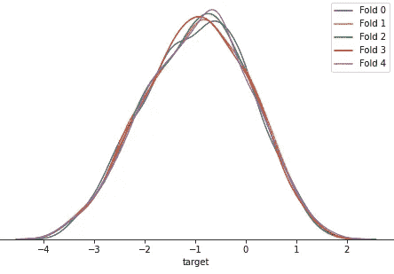
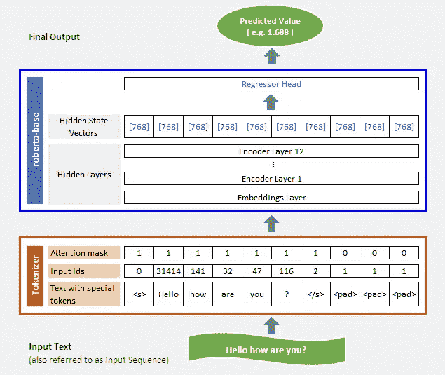
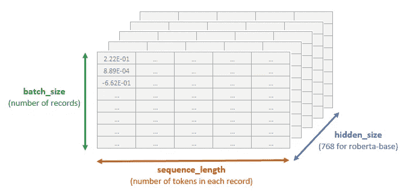
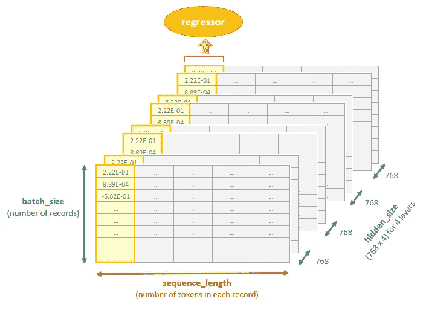
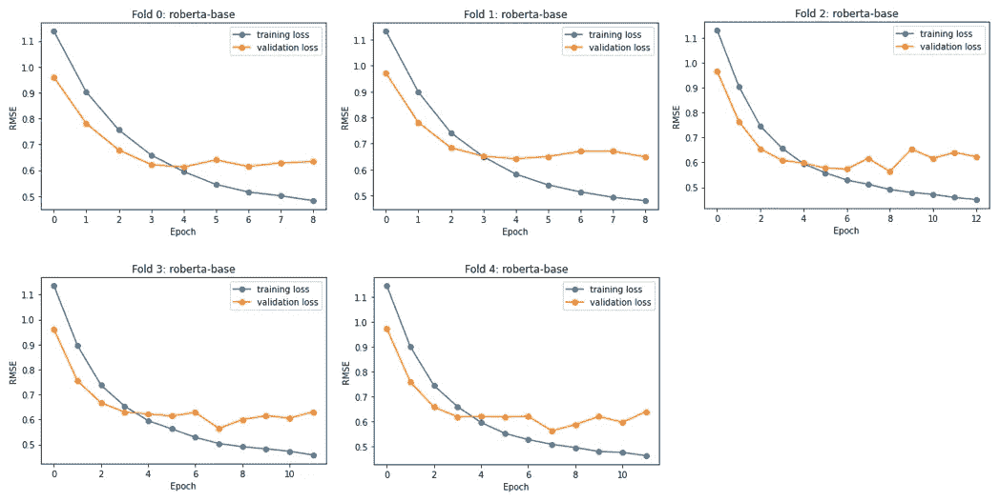

# 变形金刚，你能评价阅读段落的复杂程度吗？

> 原文：<https://towardsdatascience.com/transformers-can-you-rate-the-complexity-of-reading-passages-17c76da3403?source=collection_archive---------15----------------------->

## [实践教程](https://towardsdatascience.com/tagged/hands-on-tutorials)

## 用 PyTorch 微调 RoBERTa 以预测文本摘录的阅读难易程度


照片由 [Jeffery Ho](https://unsplash.com/@jefferyho?utm_source=medium&utm_medium=referral) 在 [Unsplash](https://unsplash.com?utm_source=medium&utm_medium=referral) 上拍摄

变压器，它们到底是什么？它们不是用于电能动力传输的装置，也不是虚构的活生生的自主机器人*擎天柱*或*大黄蜂*可以变形为车辆等其他物体。在我们的上下文中，Transformers 指的是 BERT、ALBERT、RoBERTa 等，它们在数据科学领域中用于解决各种自然语言处理任务，如机器翻译、文本摘要、语音识别、情感分析等。它们是用于自然语言处理的最先进的语言模型，并且在过去的几年中获得了极大的欢迎。

这篇文章将展示 Transformer 模型的微调，特别是 RoBERTa 在我们感兴趣的数据集上的微调。对下游任务进行微调，以预测 3-12 年级课堂使用的文学作品摘录的阅读难易程度。

这项工作是由非营利教育技术组织 CommonLit 发起的。它赞助了在 Kaggle 上举办的一场比赛(你可以在这里阅读更多信息)，旨在使用机器学习来寻求对现有可读性评级方法的改进。这将有助于读写课程的开发者以及教育者为学生选择合适的阅读文章。呈现具有适当复杂程度和阅读挑战的引人入胜的段落将极大地有利于学生发展基本的阅读技能。

# **目录**

**1。** [**关于数据集**](#9ec0)
**2。** [**拆分数据**](#cee1)
**3。** [**创建数据集类**](#a815)
**4。** [**罗伯塔-基为我们的型号**](#fd6f)
**5。** [**变压器有哪些典型的原始输出？**](#e811)
**6。** [**定义模型类**](#2a6b)
∘ [使用 pooler_output](#1e02)
∘ [构建自己的变压器自定义头](#1439)
∘ [(A)注意头](#1fbb)
∘ [(B)串接隐藏层](#9f4a)
**7。** [**模型训练**](#6eaa)
∘ [评价度量和损失函数](#fb94)
∘ [训练函数](#9d11)
∘ [验证函数](#7df2)
∘ [运行训练](#77df)
[**总结**](#7680)
[**参考文献**](#ffa8)

# 1.关于数据集

我们将要使用的数据集可以在[这个](https://www.kaggle.com/c/commonlitreadabilityprize/data?select=train.csv) Kaggle 页面上找到。这个数据集包含大约 2800 条记录。我们将使用的两个重要字段是`excerpt`和`target`。

查看数据，`excerpt`是预测阅读难易程度的文本，`target`是可以包含正值或负值的数值字段。如该数据集中所示，它是一个连续变量，最小值为-3.676268，最大值为 1.711390。因此，给定一个特定的`excerpt`，我们需要预测`target`的值。

给大家一点背景知识，竞赛主持人 Scott Crossley 曾在[这个](https://www.kaggle.com/c/commonlitreadabilityprize/discussion/240423)讨论中提到“*目标值是一个*[*Bradley-Terry*](https://en.wikipedia.org/wiki/Bradley%E2%80%93Terry_model)*分析超过 111，000 个两两比较摘录的结果。跨越 3-12 年级的教师，大多数在 6-10 年级教学，担任这些比较的评分者*。

较高的`target`值对应于“*更易阅读”*，较低的值对应于“*更难阅读”*。例如，假设我们有三个摘录 A、B 和 C，它们对应的`target`值是 1.599999、-1.333333 和-2.888888。这将意味着 A 比 B 更容易阅读，B 比 c 更容易阅读。

为了说明，下面是两个样本摘录。

```
**Excerpt with target value of 1.541672:**More people came to the bus stop just before 9am. Half an hour later they are all still waiting. Sam is worried. "Maybe the bus broke down," he thinks. "Maybe we won't go to town today. Maybe I won't get my new school uniform." At 9:45am some people give up and go home. Sam starts to cry. "We will wait a bit longer," says his mother. Suddenly, they hear a noise. The bus is coming! The bus arrives at the stop at 10 o'clock. "Get in! Get in!" calls the driver. "We are very late today!" People get on the bus and sit down. The bus leaves the stop at 10:10am. "What time is the return bus this afternoon?" asks Sam's mother. "The blue bus leaves town at 2:30pm," replies the driver. Sam thinks, "We will get to town at 11 o'clock." "How much time will we have in town before the return bus?" wonders Sam.**Excerpt with target value of -3.642892:**The iron cylinder weighs 23 kilogrammes; but, when the current has an intensity of 43 amperes and traverses 15 sections, the stress developed may reach 70 kilogrammes; that is to say, three times the weight of the hammer. So this latter obeys with absolute docility the motions of the operator's hands, as those who were present at the lecture were enabled to see. I will incidentally add that this power hammer was placed on a circuit derived from one that served likewise to supply three Hefner-Alteneck machines (Siemens D5 model) and a Gramme machine (Breguet model P.L.). Each of these machines was making 1,500 revolutions per minute and developing 25 kilogrammeters per second, measured by means of a Carpentier brake. All these apparatuses were operating with absolute independence, and had for generators the double excitation machine that figured at the Exhibition of Electricity. In an experiment made since then, I have succeeded in developing in each of these four machines 50 kilogrammeters per second, whatever was the number of those that were running; and I found it possible to add the hammer on a derived circuit without notably affecting the operation of the receivers.
```

显然，在这两篇摘录中，前者比后者更容易阅读。

# 2.拆分数据

由于我们的数据集相当小，我们将使用[交叉验证](https://machinelearningmastery.com/k-fold-cross-validation/)来更准确地衡量我们模型的性能。因此，我们将使用分层 k-fold 将数据分为训练集和验证集。使用分层 k-fold，通过保留每个类别的样本百分比来进行折叠。当我们有一个倾斜的数据集时，或者当`target`的分布不平衡时，这种方法是有用的。然而，因为我们的`target`是一个连续变量而不是类，所以我们需要某种变通方法。这就是宁滨`target`前来救援的地方。bin 类似于类，这对于 scikit-learn 的`[StratifiedKFold](https://scikit-learn.org/stable/modules/generated/sklearn.model_selection.StratifiedKFold.html)`来说再好不过了。

代码相当简单。在计算对`target`进行分类所需的分类数之前，我们随机化数据行并重置行索引。一种方法是使用[斯特奇法则](https://www.vosesoftware.com/riskwiki/Sturgesrule.php)来确定要使用的箱数。接下来，我们使用 scikit-learn 的`StratifiedKFold`类，根据我们拥有的 bin 将数据分成 5 份。最后，生成的折叠编号(范围从 0 到 4)将被分配给一个名为`skfold`的新列。过程结束时，不再需要垃圾箱，如果您愿意，可以将其丢弃。

用`StratifiedKFold`创作褶皱，改编自 Abhishek Thakur 的笔记本[这里](https://www.kaggle.com/abhishek/step-1-create-folds)。

供您参考，完整数据集的平均值`target`为-0.96(四舍五入到小数点后两位)。拆分成 5 个褶皱后，我们可以看到`target`在每个褶皱上的分布形状都被保留了下来。看下面的图，每个折叠的平均值`target`几乎是一致的，它们确实非常接近-0.96。



图 1:每个折叠的目标变量的分布形状。作者图片

# 3.创建数据集类

我们现在将创建`MyDataset`的子类`torch.utils.data.Dataset`。摘录将作为`texts`传入，同时传入的还有用于标记`texts`的`tokenizer`。在这个过程中，记号赋予器产生记号的 id(称为输入 id)以及输入到我们的模型中所必需的注意屏蔽。图 2 显示了一个输入文本为“*你好吗？*”。如果你感兴趣，可以在[这里](https://huggingface.co/transformers/preprocessing.html)找到关于记号赋予器、注意力屏蔽、填充和截断的更多细节。

# 4.`roberta-base`作为我们的模型

RoBERTa 代表[**R**obustubly**O**optimized**BERT**Pre-training**A**approach](https://arxiv.org/abs/1907.11692)，由华盛顿大学和脸书大学的研究人员于 2019 年提出。它是在 2018 年发布的 [BERT:面向语言理解的深度双向变换器预训练](https://arxiv.org/abs/1810.04805)的基础上改进的预训练程序。在整个演示过程中，我们将使用 RoBERTa 和 PyTorch，但是如果您愿意，您也可以修改和使用其他的 Transformer 模型。请务必查看您所使用的变压器模型的相关文档，以确认它们支持代码所使用的输入和输出。

上有一些 RoBERTa 类的变体🤗拥抱脸。其中一个是`RobertaModel`，这里的[引用](https://huggingface.co/transformers/master/model_doc/roberta.html#robertamodel)为*“裸露的罗伯塔模型变压器输出原始的隐藏状态，顶部没有任何特定的头。”*换句话说，bare `RobertaModel`的原始输出是输入序列中每个 token 对应的预定义隐藏大小的隐藏状态向量。使用裸露的`RobertaModel`类，我们将添加我们自己的定制回归头来预测`target`。

对于我们的变压器微调任务，我们将使用来自🤗拥抱脸作为我们的模特。正如那里所描述的，“RoBERTa 是一个以自我监督的方式在一个大的英语语料库上预先训练的变形金刚模型”。 `roberta-base`隐藏尺寸为 768，由一个嵌入层后跟 12 个隐藏层组成。



图 2:用`max_length=10`和`padding=“max_length”`设置 tokenizer 参数的例子。添加特殊标记后，任何短于 10 的输入序列都将被填充`<pad>`标记。作者图片

# 5.变压器的典型原始输出是什么？

在我们开始创建和定义模型类之前，我们需要理解 Transformer 的原始输出是什么。这是因为我们将使用原始输出来填充自定义回归头。

以下是 BERT、ALBERT 和 RoBERTa 等变压器模型通常返回的常见原始输出。它们取自文档[这里](https://huggingface.co/transformers/master/model_doc/bert.html#bertmodel)，这里[这里](https://huggingface.co/transformers/master/model_doc/albert.html#albertmodel)，这里[这里](https://huggingface.co/transformers/master/model_doc/roberta.html#robertamodel)。

*   **last_hidden_state** :这是模型最后一层输出的隐藏状态序列。它是一个形状张量`(batch_size, sequence_length, hidden_size)`
*   **pooler_output** :这是由线性层和 Tanh 激活函数进一步处理的序列的第一个令牌(分类令牌)的最后一层隐藏状态。它是一个形状为`(batch_size, hidden_size)`的张量。请注意，`pooler_output`可能不适用于某些型号的变压器。
*   **隐藏状态**:可选，当`output_hidden_states = True`通过时返回。它是形状`(batch_size, sequence_length, hidden_size)`的张量元组(一个用于嵌入的输出+一个用于每层的输出)。

那么，什么是`batch_size`、`sequence_length`、`hidden_size`？

通常，模型按批次处理记录。因此`batch_size`是模型在一次向前/向后传递中更新其内部参数之前处理的记录数。`sequence_length`是我们为标记器的`max_length`参数设置的值，而`hidden_size`是处于隐藏状态的特征(或元素)的数量。至于*张量*，你可以把它形象化为一个 n 维数组，可以用于任意数值计算。



图 3: `last_hidden_state`，即最后一层的模型输出。它是一个形状张量`(batch_size, sequence_length, hidden_size)`。作者图片

# 6.定义模型类

这里我们将创建`MyModel`和子类`[nn.Module](https://pytorch.org/docs/stable/generated/torch.nn.Module.html)`。

An `nn.Module`是所有神经网络模块的基类，它包含多个层和一个方法`forward`，该方法接受输入并返回输出。除此之外，它还包含状态和参数，并可以通过它们进行权重更新或将其梯度归零。从`nn.Module`的`__call__`函数中调用`forward`方法。因此，当我们运行`MyModel(inputs)`时，就会调用`forward`方法。

## 使用`pooler_output`

对于任何回归或分类任务，最简单的实现是直接采用`pooler_output`并附加一个额外的回归器或分类器输出层。

特别是在我们的例子中，我们可以在`__init__`方法中定义一个带有一个`[nn.Linear](https://pytorch.org/docs/stable/generated/torch.nn.Linear.html)`层的`regressor`作为我们网络的一部分。然后在`forward`方法中，我们将把`pooler_output`输入到`regressor`中，为`target`产生预测值。

## 构建您自己的变压器定制头

除了简单地使用`pooler_output`之外，还有许多不同的方法可以定义和组成你自己的层和自定义头。我们将演示的一个例子是*注意力头*，它是从[这里的](https://www.kaggle.com/maunish/clrp-pytorch-roberta-finetune-fixed-minor-issues?scriptVersionId=68364625&cellId=8)改编而来的。

## 🅰️ **注意头像**

在`forward`方法中，来自`last_hidden_state`的原始输出被输入到另一个类`AttentionHead`的实例中(我们将在下一段中讨论`AttentionHead`)。来自`AttentionHead`的输出然后被传递到我们之前看到的`regressor`中。

那么，`AttentionHead`里面是什么？`AttentionHead`中有两个线性层。`AttentionHead`将`last_hidden_state`带入第一个线性图层，在进入第二个线性图层之前，经过一个[tanh](https://medium.com/@cmukesh8688/activation-functions-sigmoid-tanh-relu-leaky-relu-softmax-50d3778dcea5)(双曲线正切)激活函数。这就导出了注意力得分。然后将 softmax 函数应用于这些注意力分数，重新缩放它们，以使张量的元素位于范围[0，1]内，总和为 1(嗯，试着将其视为概率分布)。然后将这些权重与`last_hidden_state`相乘，并对跨越`sequence_length` 维度的张量求和，最终产生形状`(batch_size, hidden_size)` **的结果。**

## 🅱️ **连接隐藏层**

我们想分享的另一个技术是隐藏层的连接。这个想法来自于 [*BERT:用于语言理解的深度双向转换器的预训练*](https://arxiv.org/abs/1810.04805) ，其中作者提到，使用基于特征的方法，连接最后四个隐藏层在他们的案例研究中给出了最佳性能。

> “最佳执行方法是连接预训练转换器的前四个隐藏层的标记表示”

您可以在下面的代码中观察到，在调用我们的模型时，我们需要如何指定`output_hidden_states = True`。这是因为我们现在想要接收和使用来自其他隐藏层的输出，而不仅仅是`last_hidden_state`。

在`forward`方法中，来自`hidden_states`的原始输出被叠加，给我们一个`(layers, batch_size, sequence_length, hidden_size)`的张量形状。由于`roberta-base`总共有 13 层，这简单地转化为`(13, batch_size, sequence_length, 768)`的张量形状。接下来，我们在`hidden_size`维度上连接最后四层，这给我们留下了一个张量形状`(batch_size, sequence_length, 768*4)`。连接之后，我们使用序列中第一个标记的表示。我们现在有了一个张量形状`(batch_size, 768*4)`，这最终被输入到`regressor`。



图 4:4 个隐藏层的连接。作者图片

如果你有兴趣继续阅读更多的例子，请看一下[这个](https://www.kaggle.com/rhtsingh/utilizing-transformer-representations-efficiently/notebook)笔记本。

# 7.模特培训

好了，让我们继续为一个基本的模型训练过程编写训练代码。

因为在这篇文章中我们不会涉及训练变形金刚的高级技术，我们将只创建简单的函数。现在，我们需要创建一个损失函数，一个训练函数，一个验证函数，最后是运行训练的主函数。

> 由于我们使用的是预训练模型(而不是从头开始训练)，这里的模型训练也通常被称为变压器微调过程。

## ▶️评价度量和损失函数📉

为了衡量我们模型的性能，我们将使用 [RMSE](/what-does-rmse-really-mean-806b65f2e48e) (均方根误差)作为评估指标。

等等，损失函数是什么？它是用来做什么的？损失函数是用来测量预测输出和提供的`target`值之间的误差，以优化我们的模型。事实上，这是优化器试图最小化的函数。

有时评估度量和损失函数可以不同，特别是对于分类任务。但是在我们的例子中，由于这是一个回归任务，我们将使用 RMSE 来完成这两个任务。

因此，我们将损失函数定义如下:

```
def loss_fn(predictions, targets):       
    return torch.sqrt(nn.MSELoss()(predictions, targets))
```

## ▶️训练函数

我们正在创建的`train_fn`将使用训练数据集来训练我们的模型。在我们运行训练时的主训练循环中，每个历元都会调用这个函数。

该功能将首先在训练模式下设置模型。本质上，它将在数据加载器中循环所有批次的训练数据，获得批次的预测，反向传播误差，基于当前梯度更新参数，并基于调度器更新学习率。

需要注意的一点是，在开始反向传播之前，我们需要将梯度设置为零。这是因为 PyTorch 会在后续反向过程中累积梯度。

最后，该函数将返回它在批次中收集的培训损失和学习率。

## ▶️验证函数

`validate_fn`用于对我们的验证数据集进行评估。它基本上会评估我们的模型在每个时期的训练过程中表现如何。它与我们上面写的`train_fn`非常相似，除了梯度计算被禁用。因此没有误差的反向传播，也没有参数和学习率的更新。

该功能首先将模型设置为评估模式。它将在数据加载器中循环所有批次的认证数据，对认证数据(即训练期间未看到的数据)的批次运行预测，并收集将在最后返回的认证损失。

> **笔记摘自 PyTorch 文档** [**此处**](https://pytorch.org/docs/stable/notes/autograd.html) **和** [**此处**](https://pytorch.org/docs/stable/generated/torch.no_grad.html) **:**
> 
> 建议我们在训练时总是使用`model.train()`，在评估我们的模型(验证/测试)时总是使用`model.eval()`，因为我们正在使用的模块可能会被更新以在训练和评估模式下表现不同。
> 
> 当我们确定不会调用`[.backward()](https://pytorch.org/docs/stable/generated/torch.Tensor.backward.html#torch.Tensor.backward)`进行反向传播时，禁用梯度计算对推断(或验证/测试)很有用。这将减少原本需要梯度计算的计算的内存消耗。

## ▶️跑步训练

现在我们已经创建了`train_fn`和`validate_fn`，让我们继续创建运行培训的主函数。

该功能的顶部将为模型训练做必要的准备。对于每个折叠，它将初始化标记化器，获取并创建训练和验证数据集和数据加载器，加载模型并将其发送到设备，并获取优化器和学习率调度器。

一旦这些都完成了，它就准备好进入训练循环了。训练循环将调用`train_fn`进行训练，然后再调用`validate_fn`对每个时期进行模型评估。一般来说，训练损失和验证损失应该随着时间逐渐减少。每当验证损失有所改善时(记住，它越低越好)，模型检查点就会被保存。否则，循环将继续，直到最后一个时期，或者当达到早期停止阈值时。基本上，当经过 *n* 次迭代后确认损失仍无改善时，触发提前停止，其中 *n* 为预设阈值。

该函数还将绘制训练和验证损失，以及每个折叠结束时的学习率时间表。



图 5:每个折叠的训练和验证损失的样本图。作者图片

# 摘要

最后，我们即将结束这篇冗长的文章。总结一下:

☑️:我们学习了如何使用 scikit-learn 的`StratifiedKFold`执行分层 k-fold，将数据分成训练集和验证集。特别是在我们的案例中，我们使用了垃圾箱。

☑️:我们从变压器中得到典型的原始输出的要点。

☑️:我们创建并定义了数据集和模型类。

☑️我们探索了一些自定义回归头的例子，我们可以建立我们的模型。

☑️:我们经历了模型训练过程的基础，并为它创建了必要的功能。

这还不是全部。请关注我的下一篇文章，关于如何应用高级培训技术来微调变压器模型。

</advanced-techniques-for-fine-tuning-transformers-82e4e61e16e>  

*如果你喜欢我的帖子，别忘了点击* [***关注***](https://peggy1502.medium.com/) *和* [***订阅***](https://peggy1502.medium.com/subscribe) *以获得邮件通知。*

*可选地，你也可以* [*注册*](https://peggy1502.medium.com/membership) *成为媒体会员，以获得媒体上每个故事的全部访问权限。*

📑*访问这个*[*GitHub repo*](https://github.com/peggy1502/Data-Science-Articles/blob/main/README.md)*获取我在帖子中分享的所有代码和笔记本。*

2021 保留所有权利。

# 参考

[1] A. Thakur，[(几乎)接近任何机器学习问题](https://www.amazon.com/dp/8269211508) (2020)

[2] C .孙，x .邱，y .徐，x .黄，[如何微调用于文本分类的 BERT？](https://arxiv.org/abs/1905.05583) (2020)

[3] Y. Liu，M. Ott，N. Goyal，J. Du，M. Joshi，D. Chen，O. Levy，M. Lewis，L. Zettlemoyer 和 V. Stoyanov， [RoBERTa:稳健优化的 BERT 预训练方法](https://arxiv.org/abs/1907.11692) (2019)

[4] J. Devlin，M. Chang，K. Lee 和 K. Toutanova， [BERT:用于语言理解的深度双向转换器的预训练](https://arxiv.org/abs/1810.04805) (2018)

[5] A .瓦斯瓦尼、n .沙泽尔、n .帕尔马、j .乌兹科雷特、l .琼斯、A .戈麦斯、l .凯泽和 I .波洛苏欣，[注意力是你所需要的全部](https://arxiv.org/abs/1706.03762) (2017)