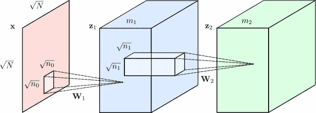

# 变形金刚，解释:理解 GPT 3，伯特和 T5 背后的模型

> 原文：<https://towardsdatascience.com/transformers-explained-understand-the-model-behind-gpt-3-bert-and-t5-cdbf3fc8a40a?source=collection_archive---------1----------------------->

戴尔·马科维茨原创图片

## [实践教程](https://towardsdatascience.com/tagged/hands-on-tutorials)

你知道那句话吗，*当你有一把锤子时，一切看起来都像钉子？嗯，在机器学习中，似乎我们真的发现了一把神奇的锤子，事实上，对它来说一切都是钉子，它们被称为变形金刚。变形金刚是可以被设计成翻译文本，写[诗和专栏](https://www.gwern.net/GPT-3)，甚至[生成计算机代码](https://www.wired.com/story/ai-latest-trick-writing-computer-code/)的模型。事实上，我写的许多关于 daleonai.com 的惊人研究都是建立在变形金刚之上的，比如从基因序列预测蛋白质结构的模型 [AlphaFold 2](https://daleonai.com/how-alphafold-works) ，以及强大的自然语言处理(NLP)模型，比如 [GPT-3](https://daleonai.com/how-alphafold-works) ，BERT，T5，Switch，Meena 等等。你可能会说他们不仅仅是满足了…唉，算了吧。*

如果你想在机器学习，特别是 NLP 方面保持领先，你至少要知道一点关于变形金刚的知识。所以在这篇文章中，我们将谈论它们是什么，它们是如何工作的，以及为什么它们如此有影响力。

转换器是一种神经网络体系结构。概括地说，神经网络是一种非常有效的模型，用于分析复杂的数据类型，如图像、视频、音频和文本。但是有不同类型的神经网络针对不同类型的数据进行了优化。例如，为了分析图像，我们通常会使用[卷积神经网络](https://en.wikipedia.org/wiki/Convolutional_neural_network)或“CNN”隐约地，它们模仿了人类大脑处理视觉信息的方式。

*卷积神经网络，图片来自 Wikicommons 的 Renanar2。*

大约从 2012 年开始，我们已经相当成功地用 CNN 解决了视觉问题，比如识别照片中的物体、识别人脸和阅读手写数字。但是在很长一段时间里，对于语言任务(翻译、文本摘要、文本生成、命名实体识别等)来说，没有什么可以与之相比的。这很不幸，因为语言是我们人类交流的主要方式。

在 2017 年推出变形金刚之前，我们使用深度学习来理解文本的方式是一种叫做递归神经网络或 RNN 的模型，看起来像这样:

来自*维基媒体* [fdeloche](https://commons.wikimedia.org/wiki/User:Ixnay) 的一张 RNN 图片。

假设你想把一个句子从英语翻译成法语。RNN 会把一个英语句子作为输入，一次处理一个单词，然后依次吐出它们的法语对应物。这里的关键词是“顺序”在语言中，单词的顺序很重要，你不能把它们混在一起。句子:

"简自找麻烦。"

意思和这句话很不一样:

“荷生去找简了”

因此，任何理解语言的模型都必须捕捉词序，递归神经网络通过按顺序一次处理一个词来做到这一点。

但是 RNNs 有问题。首先，他们很难处理大型文本序列，比如长段落或短文。当一个段落结束时，他们会忘记开头发生的事情。例如，一个基于 RNN 的翻译模型可能很难记住一个长段落主题的性别。

更糟糕的是，注册护士很难训练。众所周知，他们容易受到所谓的[消失/爆炸梯度问题](/the-exploding-and-vanishing-gradients-problem-in-time-series-6b87d558d22)(有时你只需重新开始训练并交叉手指)。更有问题的是，因为它们顺序处理单词，rnn 很难并行化。这意味着你不能仅仅通过向它们扔更多的 GPU 来加速训练，这反过来意味着你不能在那么多数据上训练它们。

# 输入变压器

这就是变形金刚改变一切的地方。它们是由谷歌和多伦多大学的研究人员在 2017 年开发的，最初旨在做翻译。但与递归神经网络不同，变压器可以非常有效地并行化。这意味着，有了合适的硬件，你可以训练一些真正的大模型。

多大？

非常大。

GPT-3 是一个特别令人印象深刻的文本生成模型，它写得几乎和人类一样好，它是在一些 45 TB 的文本数据上训练出来的，包括几乎所有的公共网络。

因此，如果你还记得关于变形金刚的任何事情，就让它这样吧:将一个可扩展的模型与一个巨大的数据集结合起来，结果可能会让你大吃一惊。

# 变形金刚是怎么工作的？

*变压器图来自原图:*[https://arxiv.org/abs/1706.03762](https://arxiv.org/abs/1706.03762)

虽然来自[原始论文](https://arxiv.org/abs/1706.03762)的图表有点吓人，但变形金刚背后的创新可以归结为三个主要概念:

1.  位置编码
2.  注意力
3.  自我关注

## 位置编码

让我们从第一个开始，位置编码。假设我们试图将文本从英语翻译成法语。请记住，RNNs，旧的翻译方法，通过顺序处理单词来理解单词顺序。但这也是它们难以并行化的原因。

变形金刚通过一种叫做位置编码的创新技术绕过了这个障碍。这个想法是获取输入序列中的所有单词——在这个例子中是一个英语句子——并给每个单词附加一个它的顺序号。所以，你给你的网络输入一个序列:

`[("Dale", 1), ("says", 2), ("hello", 3), ("world", 4)]`

从概念上讲，你可以把理解词序的负担从神经网络的结构转移到数据本身。

首先，在转换器接受任何数据训练之前，它不知道如何解释这些位置编码。但随着模型看到越来越多的句子及其编码的例子，它学会了如何有效地使用它们。

我在这里做了一点过度简化——最初的作者使用正弦函数来提出位置编码，而不是简单的整数 1、2、3、4——但要点是相同的。将词序存储为数据，而不是结构，你的神经网络变得更容易训练。

## 注意力

变形金刚的下一个重要部分叫做注意力。

呵。

注意力是一种神经网络结构，这些天你会在机器学习中到处听到。事实上，2017 年介绍变形金刚的论文标题并不叫*我们向你呈现变形金刚。*取而代之的是叫做[注意力是你所需要的全部](https://arxiv.org/pdf/1706.03762.pdf)。

[关注](https://arxiv.org/pdf/1409.0473.pdf)是在两年前的 2015 年，在翻译的语境下引入的。要理解它，请参考原文中的例句:

欧洲经济区协议于 1992 年 8 月签署。

现在想象一下，试着把这句话翻译成法语的对等物:

《欧洲经济区协定》于 1992 年 8 月签署。

尝试翻译这句话的一个糟糕的方法是仔细阅读英语句子中的每个单词，并尝试一次一个单词地吐出它的法语对应词。出于几个原因，这不会很好地工作，但其中一个原因是，法语翻译中的一些单词被颠倒了:在英语中是“欧洲经济区”，但在法语中是“欧洲经济区”。此外，法语是一种带有性别词汇的语言。形容词“économique”和“européenne”必须是阴性形式，以匹配阴性宾语“la zone”

注意力是一种机制，它允许文本模型在决定如何翻译输出句子中的单词时“查看”原始句子中的每个单词。这是来自最初的关注文件的一个很好的可视化:

*图自论文《联合学习对齐和翻译的神经机器翻译(2015)》，*【https://arxiv.org/abs/1409.0473】T2

这是一种热图，显示了当模型输出法语句子中的每个单词时，它“注意”了哪里。正如您所料，当模型输出单词“européenne”时，它会同时关注输入单词“European”和“Economic”

模型如何知道在每个时间点应该“注意”哪些单词？这是从训练数据中学到的东西。通过查看数千个法语和英语句子的例子，该模型了解了哪些类型的单词是相互依赖的。它学习如何尊重性别、多元化和其他语法规则。

自 2015 年被发现以来，注意力机制一直是自然语言处理的一个非常有用的工具，但在其最初的形式中，它是与递归神经网络一起使用的。因此，2017 年《变形金刚》论文的创新部分是完全抛弃了 RNNs。这就是为什么 2017 年的论文被称为“注意力是你所需要的全部”

## 自我关注

《变形金刚》的最后一部分(可能也是最有影响力的部分)是注意力的扭曲，叫做“自我关注”

我们刚刚谈到的“香草”注意力有助于在英语和法语句子中对齐单词，这对翻译很重要。但是，如果你不是试图翻译单词，而是建立一个理解语言潜在意义和模式的模型——一种可以用来完成任何数量的语言任务的模型——会怎么样呢？

总的来说，使神经网络强大、令人兴奋和酷的是，它们经常自动建立对它们接受训练的数据的有意义的内部表示。例如，当你检查视觉神经网络的层时，你会发现一组神经元“识别”边缘、形状，甚至像眼睛和嘴这样的高级结构。根据文本数据训练的模型可能会自动学习词性、语法规则以及单词是否同义。

神经网络学习的语言的内部表示越好，它在任何语言任务中就越好。事实证明，如果注意力被输入的文本本身所吸引，它会是一种非常有效的方式。

例如，以这两句话为例:

"服务员，能给我结账吗？"

“看来我刚刚让服务器崩溃了。”

服务器这个词在这里意味着两个非常不同的东西，我们人类可以通过查看周围的单词来轻松消除歧义。自我注意允许神经网络在周围单词的上下文中理解一个单词。

因此，当一个模型处理第一句话中的单词“服务器”时，它可能会“注意”单词“检查”，这有助于区分人工服务器和金属服务器。

在第二句话中，模型可能会注意到单词“崩溃”来确定*这个*“服务器”指的是一台机器。

自我关注帮助神经网络消除单词歧义，进行词性标注，实体解析，学习语义角色和[等等](https://arxiv.org/abs/1905.05950)。

所以，我们到了。:变压器，在 10，000 英尺的高度解释，归结为:

如果你想要更深入的技术解释，我强烈推荐看看杰伊·阿拉玛的博客文章[《变形金刚》](http://jalammar.github.io/illustrated-transformer/)。

## 变形金刚能做什么？

最流行的基于变压器的模型之一被称为 BERT，是“来自变压器的双向编码器表示”的缩写它是在我 2018 年加入谷歌时由谷歌的研究人员推出的，很快就进入了几乎所有的 NLP 项目——包括[谷歌搜索](https://blog.google/products/search/search-language-understanding-bert/)。

BERT 指的不仅仅是模型架构，而是经过训练的模型本身，你可以在这里免费下载和使用。它由谷歌研究人员在大规模文本语料库上训练，已经成为 NLP 的通用小刀。它可以扩展解决一系列不同的任务，例如:

-文本摘要

-回答问题

-分类

-命名实体解析

-文本相似性

-攻击性信息/亵渎检测

-了解用户查询

-多得多

BERT 证明了你可以在未标记的数据上建立非常好的语言模型，比如从维基百科和 Reddit 上搜集的文本，然后这些大型“基础”模型可以根据特定领域的数据进行调整，以适应许多不同的用例。

最近，由 OpenAI 创建的模型 [GPT-3](https://daleonai.com/gpt3-explained-fast) 以其生成逼真文本的能力震撼了人们的心灵。 [Meena](https://ai.googleblog.com/2020/01/towards-conversational-agent-that-can.html) ，由 Google Research 去年推出，是一个基于 Transformer 的聊天机器人(akhem，“对话代理”)，它可以就几乎任何话题进行引人注目的对话(作者曾经花了 20 分钟与 Meena 争论对人类来说意味着什么)。

变形金刚也在自然语言处理之外兴风作浪，通过[作曲](https://magenta.tensorflow.org/music-transformer)，[从文本描述生成图像](https://daleonai.com/dalle-5-mins)，以及[预测蛋白质结构](https://deepmind.com/blog/article/alphafold-a-solution-to-a-50-year-old-grand-challenge-in-biology)。

# 如何使用变形金刚？

既然你已经被变压器的力量所吸引，你可能想知道如何在你自己的应用中使用它们。没问题。

你可以从 [TensorFlow Hub](https://tfhub.dev/) 下载常见的基于变压器的模型，比如 BERT。关于代码教程，请查看我写的这篇关于构建语义语言驱动的应用的文章。

但是如果你想真正时髦并且你写 Python，我强烈推荐由 HuggingFace 公司维护的流行的“变形金刚”库。这个平台允许你以一种对开发者非常友好的方式训练和使用大多数当今流行的 NLP 模型，比如 BERT，Roberta，T5，GPT-2。

暂时就这样吧！

*特别感谢路易斯/古斯·古斯塔沃、卡尔·魏因梅斯特和亚历克斯·Ku 审阅了本文的初稿！*

*原载于 2021 年 5 月 6 日 https://daleonai.com**T21*[。](https://daleonai.com/transformers-explained)