# 变形金刚形象地解释了——不仅仅是如何解释，还解释了它们为什么如此好用

> 原文：<https://towardsdatascience.com/transformers-explained-visually-not-just-how-but-why-they-work-so-well-d840bd61a9d3?source=collection_archive---------1----------------------->

## 实践教程，直观变形金刚系列 NLP

## 一个温和的指南，用简单的英语介绍注意力得分计算如何捕捉一个序列中单词之间的关系。

奥拉夫·阿伦斯·罗特内在 [Unsplash](https://unsplash.com?utm_source=medium&utm_medium=referral) 上的照片

在过去的几年里，变形金刚席卷了 NLP 的世界。现在，它们在 NLP 以外的应用中也获得了成功。

变压器因为注意力模块而获得能量。这是因为它捕捉到了序列中每个单词与其他单词之间的关系。

但是最重要的问题是*它到底是如何做到的？*

在本文中，我们将尝试回答这个问题，并理解*为什么*会执行它所做的计算。

我的变形金刚系列还有几篇文章。在那些文章中，我们学习了 Transformer 架构，并在训练和推理过程中一步一步地完成了它们的操作。我们还探索了引擎盖下，并确切了解他们如何工作的细节。

我们的目标是不仅要理解事物是如何工作的，还要理解它为什么会这样工作。

1.  [功能概述](/transformers-explained-visually-part-1-overview-of-functionality-95a6dd460452) ( *变压器如何使用，为什么比 rnn 好。架构的组件，以及训练和推理期间的行为*
2.  [工作原理](/transformers-explained-visually-part-2-how-it-works-step-by-step-b49fa4a64f34) ( *端到端内部操作。数据如何流动以及执行何种计算，包括矩阵表示*
3.  [多头关注](/transformers-explained-visually-part-3-multi-head-attention-deep-dive-1c1ff1024853) ( *整个变压器关注模块的内部工作方式*)

如果您对一般的 NLP 应用程序感兴趣，我还有一些您可能会喜欢的文章。

1.  [波束搜索](/foundations-of-nlp-explained-visually-beam-search-how-it-works-1586b9849a24)
2.  [Bleu 评分](/foundations-of-nlp-explained-bleu-score-and-wer-metrics-1a5ba06d812b) ( *Bleu 评分和单词错误率是 NLP 模型的两个基本指标*)

为了理解是什么让变压器滴答作响，我们必须集中注意力。让我们从输入它的信息开始，然后看看它是如何处理这些信息的。

# 输入序列如何到达注意模块

注意模块存在于编码器堆栈中的每个编码器以及解码器堆栈中的每个解码器中。我们先放大编码器的注意力。

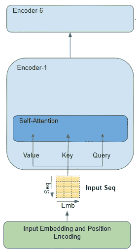

注意编码器(图片由作者提供)

例如，假设我们正在处理一个英语到西班牙语的翻译问题，其中一个样本源序列是“球是蓝色的”。目标序列是“La bola es azul”。

源序列首先通过嵌入和位置编码层，该层为序列中的每个单词生成嵌入向量。嵌入被传递到编码器，在那里它首先到达注意模块。

在 Attention 中，嵌入的序列通过三个线性层传递，这三个层产生三个独立的矩阵，即查询、键和值。这是用于计算注意力得分的三个矩阵。

要记住的重要一点是，这些矩阵的每一行对应于源序列中的一个单词。

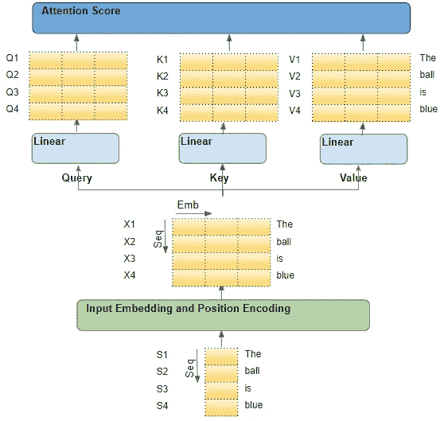

*源序列的流程(图片由作者提供)*

# 每个输入行都是序列中的一个单词

我们理解注意力是怎么回事的方法是从源序列中的单个单词开始，然后沿着它们的路径通过转换器。特别是，我们想要关注注意力模块内部发生的事情。

这将帮助我们清楚地看到源和目标序列中的每个单词是如何与源和目标序列中的其他单词相互作用的。

因此，当我们仔细阅读这个解释时，要集中精力在每个单词上执行什么操作，以及每个向量如何映射到原始输入单词。我们不需要担心许多其他细节，如矩阵形状、算术计算的细节、多重注意力等等，如果它们与每个单词的走向没有直接关系的话。

因此，为了简化解释和可视化，让我们忽略嵌入维度，只跟踪每个单词的行。

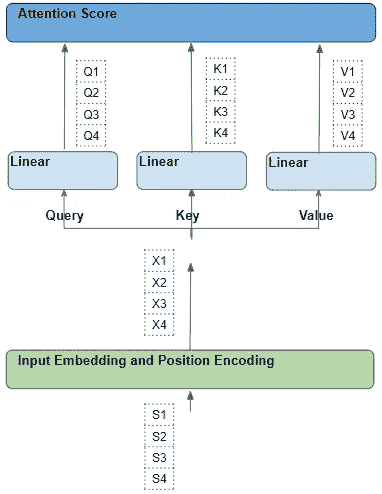

*源序列中每个单词的流向(图片由作者提供)*

# 每个单词都经历了一系列可学习的变化

每个这样的行都是通过一系列转换(嵌入、位置编码和线性层)从其对应的源单词生成的。

所有这些转变都是可训练的操作。这意味着这些操作中使用的权重不是预先确定的，而是由模型以产生所需输出预测的方式学习的。

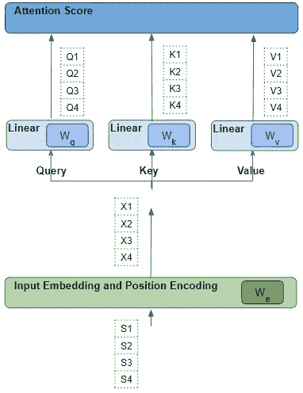

*学习线性和嵌入权重(图片由作者提供)*

关键问题是，转换器如何计算出哪组权重会给它最好的结果？请记住这一点，因为我们稍后会谈到这一点。

# 注意力得分—查询和关键词之间的点积

注意力执行几个步骤，但是在这里，我们将只关注线性层和注意力分数。

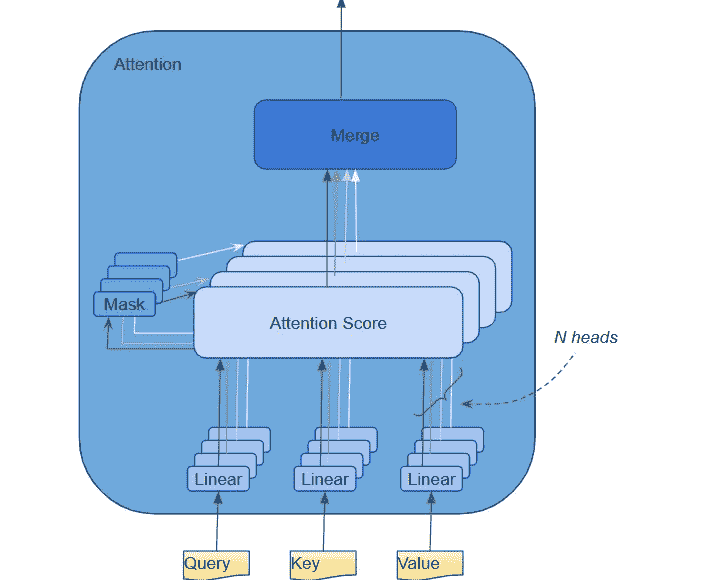

*多头关注(图片由作者提供)*

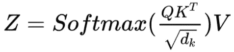

*关注度评分计算(图片由作者提供)*

从公式中我们可以看出，注意力的第一步是做矩阵乘法(即点积)在查询(Q)矩阵和关键(K)矩阵的转置之间。观察每个单词的变化。

我们产生一个中间矩阵(姑且称之为‘因子’矩阵)，其中每个单元是两个字之间的矩阵乘法。

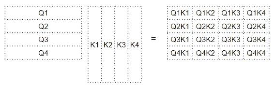

*查询和关键矩阵之间的点积(图片由作者提供)*

例如，第四行中的每一列对应于第四个查询词与每个关键词之间的点积。

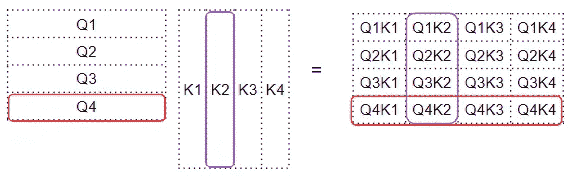

*查询和关键矩阵之间的点积(图片由作者提供)*

# 注意力得分—查询关键词和值词之间的点积

下一步是这个中间“因子”矩阵和值(V)矩阵之间的矩阵乘法，以产生由注意力模块输出的注意力分数。这里我们可以看到，第四行对应于第四个查询词矩阵乘以所有其他关键字和值词。

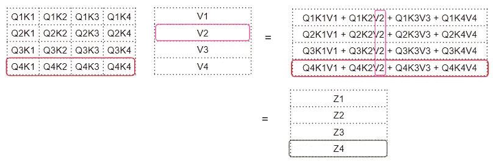

*查询键和值矩阵之间的点积(图片由作者提供)*

这产生由注意力模块输出的注意力得分向量(Z)。

考虑输出分数的方式是，对于每个单词，它是来自“值”矩阵的每个单词的编码值，由“因子”矩阵加权。因子矩阵是特定单词的查询值与所有单词的键值的点积。

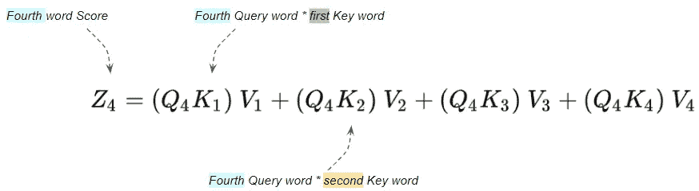

*注意力得分是单词值(作者图片)的加权和*

# **查询、关键字和值字**的作用是什么？

查询词可以被解释为我们正在计算关注度的词*。关键词和值词是我们关注的词*即。该单词与查询单词的相关程度如何。**

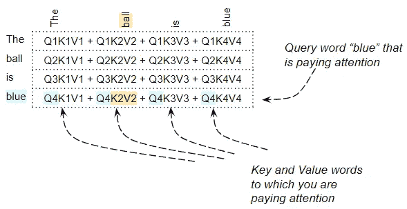

*单词“blue”的注意力分数关注其他所有单词(图片由作者提供)*

例如，对于句子“球是蓝色的”，单词“蓝色”的行将包含“蓝色”和其他每个单词的注意力得分。这里“蓝色”是查询词，其他词是“键/值”。

还有其他正在执行的操作，如除法和 softmax，但在本文中我们可以忽略它们。它们只是改变矩阵中的数值，但不影响矩阵中每个字行的位置。它们也不涉及任何单词间的相互作用。

# 点积告诉我们单词之间的相似性

我们已经看到，注意力得分是通过做点积，然后将它们相加，来捕捉特定单词和句子中其他单词之间的一些相互作用。但是矩阵乘法如何帮助变换器确定两个单词之间的相关性呢？

要理解这一点，请记住查询、键和值行实际上是具有嵌入维度的向量。让我们放大一下这些向量之间的矩阵乘法是如何计算的。

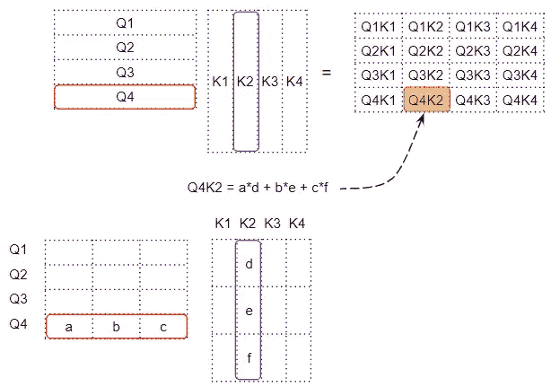

*每个单元格是两个单词向量之间的点积(图片由作者提供)*

当我们在两个向量之间做点积时，我们将数对相乘，然后求和。

*   如果两个成对的数字(如上面的‘a’和‘d ’)都是正的或者都是负的，那么乘积将是正的。乘积将增加最终总和。
*   如果一个数字是正的，另一个是负的，那么乘积将是负的。乘积将减少最终总和。
*   如果乘积为正，两个数字越大，它们对最终总和的贡献就越大。

这意味着，如果两个向量中相应数字的符号对齐，最终的和将会更大。

# 变形金刚是如何学习单词之间的关联性的？

点积的概念也适用于注意力得分。如果两个单词的向量更加一致，注意力得分将会更高。

那么我们希望变压器的行为是什么呢？

我们希望句子中彼此相关的两个单词的注意力得分高。我们希望两个互不相关的单词得分较低。

比如，对于“黑猫喝了牛奶”这句话，“牛奶”这个词与“喝了”非常相关，可能与“猫”的相关性略低，与“黑”无关。我们希望“牛奶”和“喝了”产生一个高的注意力分数，“牛奶”和“猫”产生一个稍低的分数，而“牛奶”和“黑色”产生一个可以忽略的分数。

这是我们希望模型学习产生的输出。

要做到这一点，表示“牛奶”和“饮用”的单词向量必须对齐。“牛奶”和“猫”的向量会有些不同。而他们对于“奶”和“黑”会有很大的不同。

让我们回到我们一直在思考的问题——转换器是如何计算出哪组权重会给它带来最好的结果的？

基于单词嵌入和线性层的权重来生成单词向量。因此，转换器可以学习这些嵌入、线性权重等等，以产生如上所要求的单词向量。

换句话说，它将学习这些嵌入和权重，如果一个句子中的两个单词彼此相关，那么它们的单词向量将被对齐。并因此产生更高的注意力分数。对于彼此不相关的单词，单词向量将不会对齐，并且将产生较低的注意力分数。

因此,“牛奶”和“喝过的”的嵌入将非常一致，并产生高的注意力分数。对于“牛奶”和“猫”来说，它们会有些不同，从而产生稍低的分数，而对于“牛奶”和“黑色”来说，它们会有很大的不同，从而产生较低的分数。

这就是注意力模块背后的原理。

# 总结一下——是什么让变压器运转起来？

查询和关键字之间的点积计算每对单词之间的相关性。这种相关性然后被用作“因子”来计算所有值词的加权和。该加权和作为注意力分数输出。

转换器学习嵌入等，以这种方式，彼此相关的单词更加对齐。

这是引入三个线性层并为查询、键和值制作三个版本的输入序列的一个原因。这给了注意力模块更多的参数，它能够学习来调整单词向量的创建。

# 变压器中的编码器自关注

注意力被用在变压器的三个地方:

*   编码器中的自我关注—源序列关注自身
*   解码器中的自我关注—目标序列关注自身
*   编码器-解码器-注意解码器-目标序列注意源序列

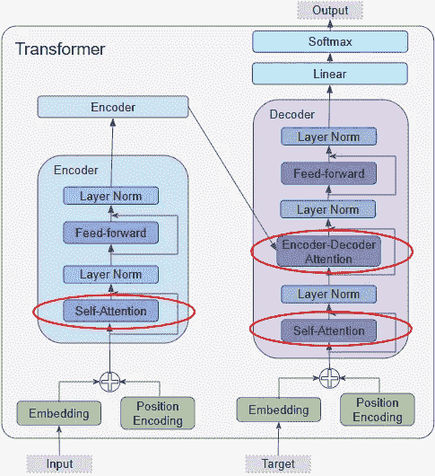

*变形金刚中的注意力(图片由作者提供)*

在编码器自我关注中，我们计算源句子中的每个单词与源句子中的每个其他单词的相关性。堆栈中的所有编码器都会发生这种情况。

# 变压器中的解码器自关注

我们刚刚在编码器中看到的大部分自我注意也适用于解码器中的注意，有一些小但重要的区别。

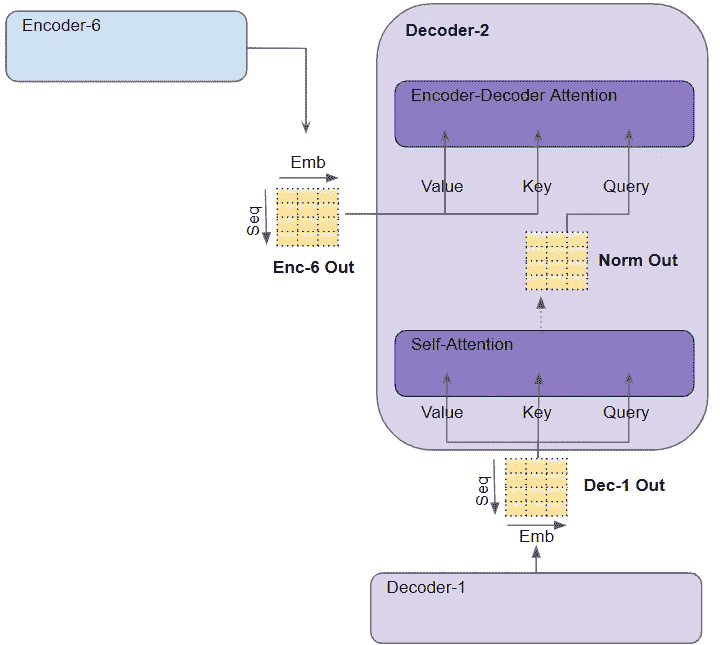

*解码器中的注意力(图片由作者提供)*

在解码器自我关注中，我们计算目标句子中的每个单词与目标句子中的每个其他单词的相关性。

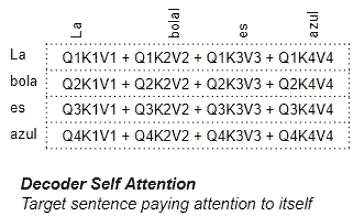

*解码器自我关注(图片由作者提供)*

# 变压器中的编码器-解码器注意

在编码-解码注意中，从目标句子中获得查询，从源句子中获得键/值。因此，它计算目标句子中每个单词与源句子中每个单词的相关性。

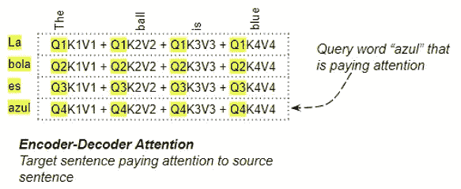

*编解码注意(图片由作者提供)*

# 结论

希望这能让你对变压器设计的优雅有一个很好的认识。也请阅读我的系列中的其他 Transformer 文章，以深入了解为什么 Transformer 现在已经成为这么多深度学习应用程序的首选架构。

最后，如果你喜欢这篇文章，你可能也会喜欢我关于音频深度学习、地理定位机器学习和批处理规范的其他系列。

</audio-deep-learning-made-simple-part-1-state-of-the-art-techniques-da1d3dff2504>  </leveraging-geolocation-data-for-machine-learning-essential-techniques-192ce3a969bc>  </batch-norm-explained-visually-how-it-works-and-why-neural-networks-need-it-b18919692739>  

让我们继续学习吧！