# 变形金刚直观解释(第 2 部分):如何工作，一步一步

> 原文：<https://towardsdatascience.com/transformers-explained-visually-part-2-how-it-works-step-by-step-b49fa4a64f34?source=collection_archive---------0----------------------->

## 直观变形金刚系列 NLP

## 引擎盖下的变压器及其端到端操作的温和指南。

约书亚·索蒂诺在 [Unsplash](https://unsplash.com?utm_source=medium&utm_medium=referral) 上拍摄的照片

这是我的变形金刚系列的第二篇文章。在[的第一篇文章](/transformers-explained-visually-part-1-overview-of-functionality-95a6dd460452)中，我们了解了变压器的功能、使用方法、高级架构以及优势。

在这篇文章中，我们现在可以看看引擎盖下，并研究他们如何工作的细节。我们将看到数据如何通过实际的矩阵表示和形状在系统中流动，并理解每个阶段执行的计算。

这里是对本系列之前和之后文章的一个快速总结。我的目标是不仅要理解事物是如何工作的，还要理解它为什么会这样工作。

1.  [功能概述](/transformers-explained-visually-part-1-overview-of-functionality-95a6dd460452) *(变压器是怎么用的，为什么比 RNNs 好。架构的组件，以及训练和推理期间的行为)*
2.  **工作原理—本文** *(端到端内部操作。数据如何流动和执行什么计算，包括矩阵表示)*
3.  [多头警示](/transformers-explained-visually-part-3-multi-head-attention-deep-dive-1c1ff1024853) *(整个变压器警示模块的内部工作方式)*
4.  [为什么注意力能提高表现](/transformers-explained-visually-not-just-how-but-why-they-work-so-well-d840bd61a9d3) *(不仅仅是注意力能做什么，还有为什么它如此有效。注意力是如何捕捉句子中单词之间的关系的)*

如果您对一般的 NLP 应用程序感兴趣，我还有一些您可能会喜欢的文章。

1.  [波束搜索](/foundations-of-nlp-explained-visually-beam-search-how-it-works-1586b9849a24)
2.  [Bleu 评分](/foundations-of-nlp-explained-bleu-score-and-wer-metrics-1a5ba06d812b) ( *Bleu 评分和单词错误率是 NLP 模型的两个基本指标*)

# 架构概述

正如我们在[第 1 部分](/transformers-explained-visually-part-1-overview-of-functionality-95a6dd460452)中看到的，该架构的主要组件包括:

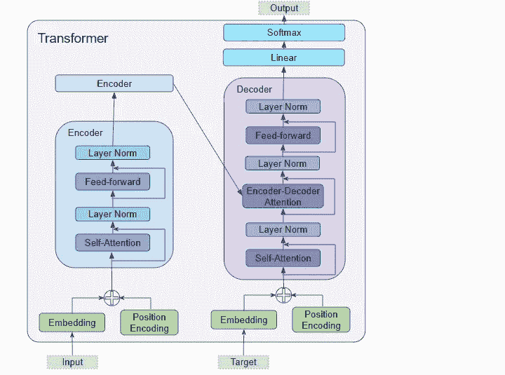

(图片由作者提供)

编码器和解码器的数据输入，包括:

*   嵌入层
*   位置编码层

编码器堆栈包含许多编码器。每个编码器包含:

*   多头注意力层
*   前馈层

解码器堆栈包含多个解码器。每个解码器包含:

*   两个多头注意力层
*   前馈层

输出(右上)—生成最终输出，包含:

*   线性层
*   Softmax 层。

为了理解每个组件的作用，让我们在训练转换器解决翻译问题时，先来看看它的工作过程。我们将使用一个训练数据样本，该样本由一个输入序列(英语为“You ' welcome”)和一个目标序列(西班牙语为“De nada”)组成。

# 嵌入和位置编码

像任何 NLP 模型一样，Transformer 需要关于每个单词的两件事情——单词的含义及其在序列中的位置。

*   嵌入层对单词的含义进行编码。
*   位置编码层表示单词的位置。

转换器通过添加这两种编码来组合它们。

## 把...嵌入

变压器有两个嵌入层。输入序列被馈送到第一嵌入层，称为输入嵌入。

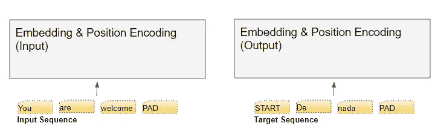

(图片由作者提供)

在将目标右移一个位置并在第一位置插入开始标记之后，将目标序列馈送到第二嵌入层。注意，在推理过程中，我们没有目标序列，我们将输出序列循环输入到第二层，正如我们在[第一部分](/transformers-explained-visually-part-1-overview-of-functionality-95a6dd460452)中所学的。这就是为什么它被称为输出嵌入。

使用我们的词汇表将文本序列映射到数字单词 id。然后，嵌入层将每个输入单词映射到一个嵌入向量中，这是该单词含义的更丰富的表示。

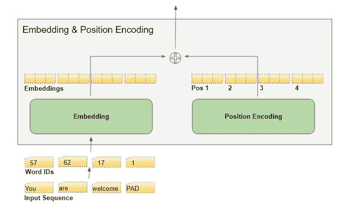

(图片由作者提供)

## 位置编码

因为 RNN 实现了一个循环，其中每个单词都是顺序输入的，所以它隐式地知道每个单词的位置。

然而，变压器不使用 RNNs，序列中的所有单词都是并行输入的。这是其优于 RNN 架构的主要优势，但这意味着位置信息丢失，并且必须单独添加回去。

就像两个嵌入层一样，有两个位置编码层。位置编码的计算独立于输入序列。这些是固定值，仅取决于序列的最大长度。举个例子，

*   第一项是指示第一个位置的常量代码
*   第二项是指示第二位置的常数代码，
*   诸如此类。

这些常数使用下面的公式计算，其中

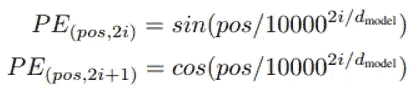

*   *pos* 是单词在序列中的位置
*   *d_model* 是编码向量的长度(与嵌入向量相同),并且
*   *i* 是这个向量的索引值。

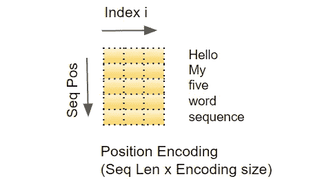

(图片由作者提供)

换句话说，它交错了正弦曲线和余弦曲线，所有偶数索引的正弦值和所有奇数索引的余弦值。例如，如果我们对一个 40 个单词的序列进行编码，我们可以在下面看到一些(单词位置，encoding_index)组合的编码值。

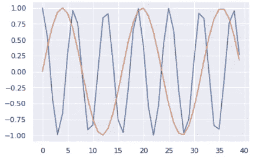

(图片由作者提供)

蓝色曲线表示所有 40 个字位置的第 0 个索引的编码，橙色曲线表示所有 40 个字位置的第 1 个索引的编码。对于剩余的指数值将有类似的曲线。

# 矩阵维度

我们知道，深度学习模型一次处理一批训练样本。嵌入和位置编码层对表示一批序列样本的矩阵进行操作。嵌入采用(样本，序列长度)形状的单词 id 矩阵。它将每个单词 ID 编码成一个单词向量，其长度为嵌入大小，从而产生一个(样本、序列长度、嵌入大小)形状的输出矩阵。位置编码使用的编码大小等于嵌入大小。所以它产生一个形状相似的矩阵，可以添加到嵌入矩阵中。

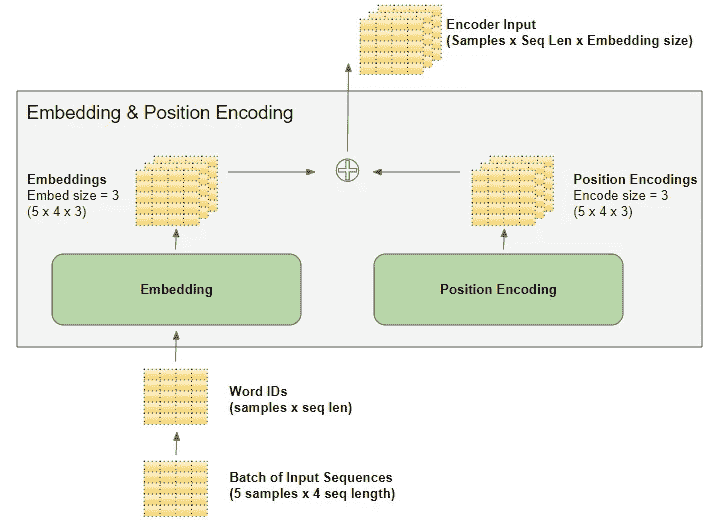

(图片由作者提供)

由嵌入和位置编码层产生的(样本、序列长度、嵌入大小)形状在整个变换器中保持不变，因为数据流经编码器和解码器堆栈，直到它被最终输出层整形。

这给出了变压器中 3D 矩阵尺寸的感觉。然而，为了简化可视化，从这里开始，我们将放弃第一维(对于样本),并使用单个样本的 2D 表示。

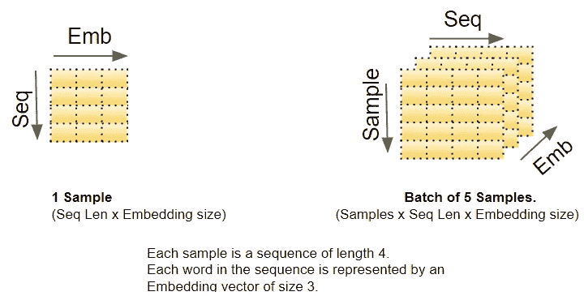

(图片由作者提供)

输入嵌入将其输出发送到编码器。类似地，输出嵌入馈入解码器。

# 编码器

编码器和解码器堆栈分别由几个(通常是六个)编码器和解码器组成，按顺序连接。

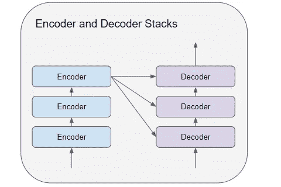

(图片由作者提供)

堆栈中的第一个编码器从嵌入和位置编码接收其输入。堆栈中的其他编码器接收来自前一个编码器的输入。

编码器将其输入传递到多头自关注层。自我关注输出被传递到前馈层，然后前馈层将其输出向上发送到下一个编码器。

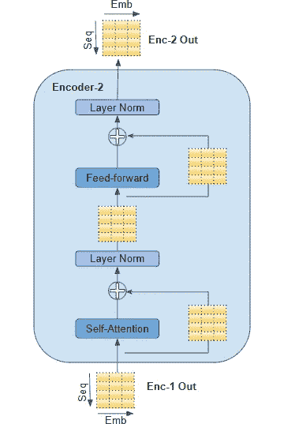

(图片由作者提供)

自我注意和前馈子层都具有围绕它们的剩余跳跃连接，随后是层标准化。

最后一个编码器的输出被馈送到解码器堆栈中的每个解码器，如下所述。

# 解码器

解码器的结构与编码器非常相似，但也有一些不同。

像编码器一样，堆栈中的第一个解码器从输出嵌入和位置编码接收其输入。堆栈中的其他解码器接收来自前一个解码器的输入。

解码器将其输入传递到多头自关注层。这与编码器中的操作方式略有不同。它只允许处理序列中较早的位置。这是通过掩盖未来头寸来实现的，我们稍后会谈到这一点。

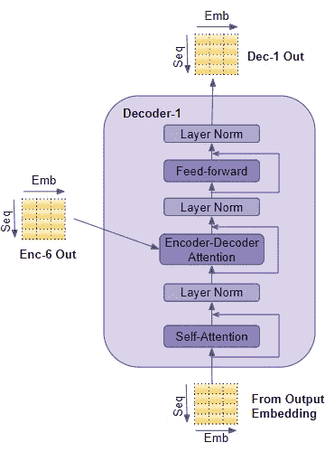

(图片由作者提供)

与编码器不同，解码器有第二个多头关注层，称为编码器-解码器关注层。编码器-解码器关注层的工作方式类似于自我关注，只是它结合了两个输入源——其下的自我关注层以及编码器堆栈的输出。

自我关注输出被传递到前馈层，然后前馈层将其输出向上发送到下一个解码器。

这些子层中的每一层，自关注、编码器-解码器关注和前馈，都有一个围绕它们的剩余跳跃连接，随后是层标准化。

# 注意力

在第一部分中，我们讨论了为什么注意力在处理序列时如此重要。在《变形金刚》中，注意力用在三个地方:

*   编码器中的自我关注—输入序列关注自身
*   解码器中的自我关注—目标序列关注自身
*   编码器-解码器-注意解码器-目标序列注意输入序列

关注层以三个参数的形式接受输入，即查询、键和值。

*   在编码器的自我关注中，编码器的输入被传递给所有三个参数，查询、键和值。

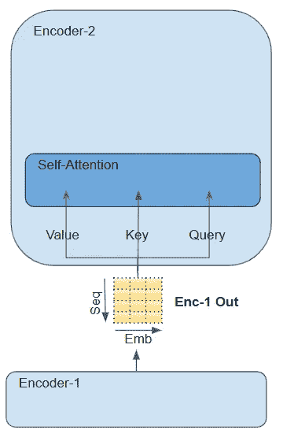

(图片由作者提供)

*   在解码器的自我关注中，解码器的输入被传递给所有三个参数，查询、键和值。
*   在解码器的编码器-解码器中，堆栈中最后一个编码器的输出被传递给 Value 和 Key 参数。它下面的自我关注(和层范数)模块的输出被传递给查询参数。

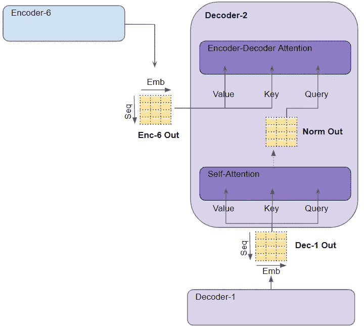

(图片由作者提供)

# 多头注意力

转换器将每个注意力处理器称为注意力头，并并行重复几次。这就是众所周知的多头注意力。通过结合几个相似的注意力计算，它给予它的注意力更大的辨别能力。

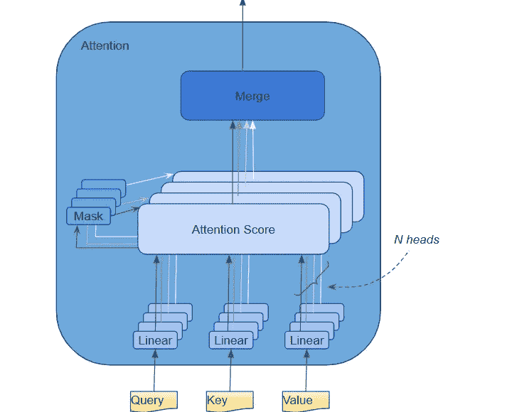

(图片由作者提供)

查询、键和值分别通过单独的线性层，每个层都有自己的权重，产生三个结果，分别称为 Q、K 和 V。然后使用如下所示的关注度公式将它们结合在一起，以产生关注度分数。

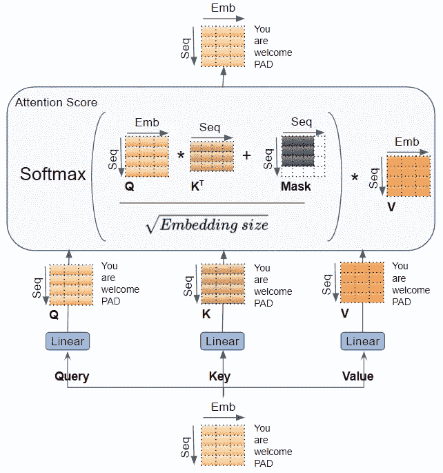

(图片由作者提供)

这里要认识到的重要事情是，Q、K 和 V 值携带序列中每个单词的编码表示。注意力计算然后将每个单词与序列中的每个其他单词相结合，使得注意力分数对序列中每个单词的分数进行编码。

不久前讨论解码器时，我们简要提到了掩蔽。面具也显示在上面的注意图中。让我们看看它是如何工作的。

# 注意面具

在计算注意力分数时，注意力模块实现屏蔽步骤。掩蔽有两个目的:

**在编码器自我注意和编码器-解码器-注意中:**掩蔽用于在输入句子中有填充的地方使注意力输出为零，以确保填充不会对自我注意有所贡献。(注意:由于输入序列可能有不同的长度，所以像在大多数 NLP 应用程序中一样，用填充标记来扩展它们，以便可以将固定长度的向量输入到转换器中。)

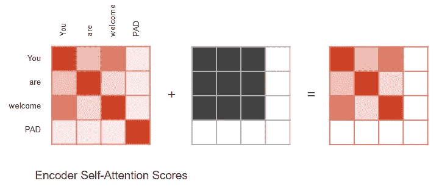

(图片由作者提供)

类似地，对于编码器-解码器的注意。

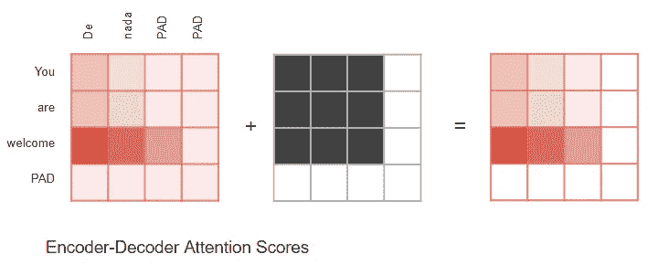

(图片由作者提供)

**在解码器自我关注:**掩蔽用来防止解码器在预测下一个单词时提前“偷看”目标句子的其余部分。

解码器处理源序列中的单词，并使用它们来预测目标序列中的单词。在训练过程中，这是通过教师强制完成的，其中完整的目标序列作为解码器输入。因此，在预测某个位置的单词时，解码器可以获得该单词之前的目标单词以及该单词之后的目标单词。这允许解码器通过使用来自未来“时间步”的目标字来“欺骗”。

例如，当预测'*单词 3'* 时，解码器应该只参考来自目标的前 3 个输入单词，而不参考第四个单词'*可探'*。

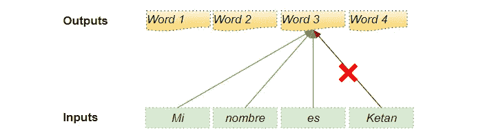

(图片由作者提供)

因此，解码器会屏蔽序列中稍后出现的输入单词。

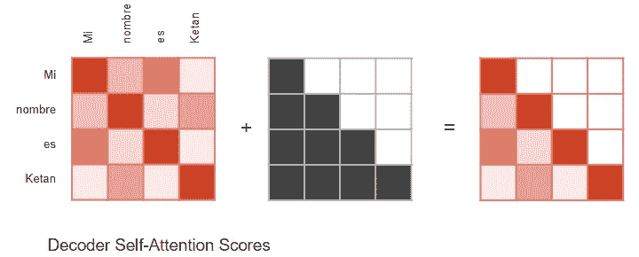

(图片由作者提供)

在计算注意力得分时(参考前面显示计算的图片),掩蔽应用于 Softmax 之前的分子。被屏蔽的元素(白色正方形)被设置为负无穷大，因此 Softmax 将这些值变为零。

# 生成输出

堆栈中的最后一个解码器将其输出传递给输出组件，输出组件将其转换为最终的输出语句。

线性层将解码器向量投影到单词得分中，在句子中的每个位置，目标词汇表中的每个唯一单词都有一个得分值。例如，如果我们的最终输出句子有 7 个单词，而目标西班牙语词汇有 10000 个独特的单词，我们为这 7 个单词中的每一个生成 10000 个分值。得分值指示词汇表中的每个单词在句子的那个位置出现的可能性。

然后，Softmax 层将这些分数转化为概率(总计为 1.0)。在每个位置，我们找到概率最高的单词的索引，然后将该索引映射到词汇表中相应的单词。这些字构成了变压器的输出序列。

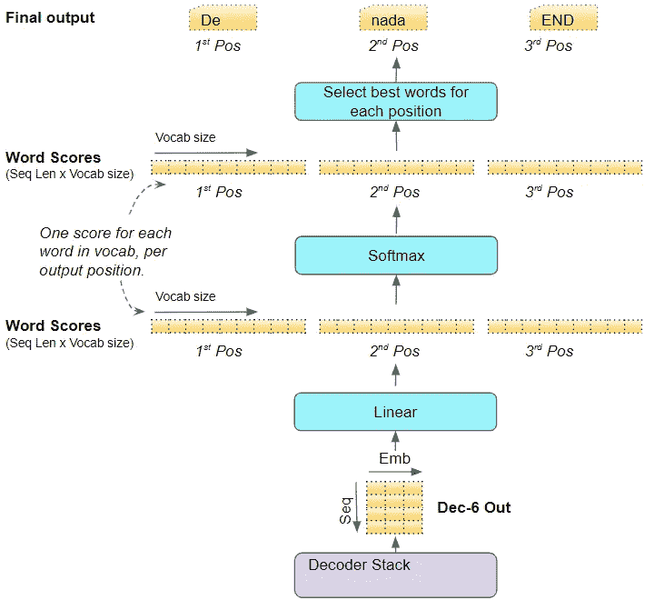

(图片由作者提供)

# 训练和损失函数

在训练期间，我们使用诸如交叉熵损失的损失函数来将生成的输出概率分布与目标序列进行比较。概率分布给出了每个单词在该位置出现的概率。

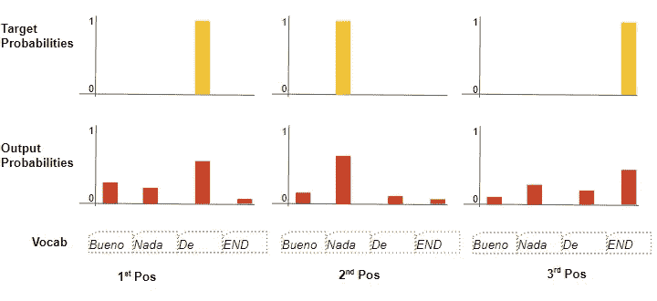

(图片由作者提供)

让我们假设我们的目标词汇表只包含四个单词。我们的目标是产生一个与我们预期的目标序列“De nada END”相匹配的概率分布。

这意味着第一个单词位置的概率分布对于“De”应该具有概率 1，而对于词汇表中所有其他单词的概率是 0。类似地，“nada”和“END”分别对于第二和第三个字位置应该具有概率 1。

通常，损耗用于计算梯度，以通过反向传播来训练变压器。

# 结论

希望这能让你在训练中对变压器内部的情况有所了解。正如我们在[上一篇文章](/transformers-explained-visually-part-1-overview-of-functionality-95a6dd460452)中所讨论的，它在推理过程中循环运行，但是大部分处理保持不变。

多头注意力模块为变形金刚提供了动力。在下一篇文章中，我们将继续我们的旅程，更深入地去真正理解注意力是如何计算的细节。

最后，如果你喜欢这篇文章，你可能也会喜欢我关于音频深度学习、地理位置机器学习和图像字幕架构的其他系列。

</audio-deep-learning-made-simple-part-1-state-of-the-art-techniques-da1d3dff2504>  </leveraging-geolocation-data-for-machine-learning-essential-techniques-192ce3a969bc>  </image-captions-with-deep-learning-state-of-the-art-architectures-3290573712db>  

让我们继续学习吧！