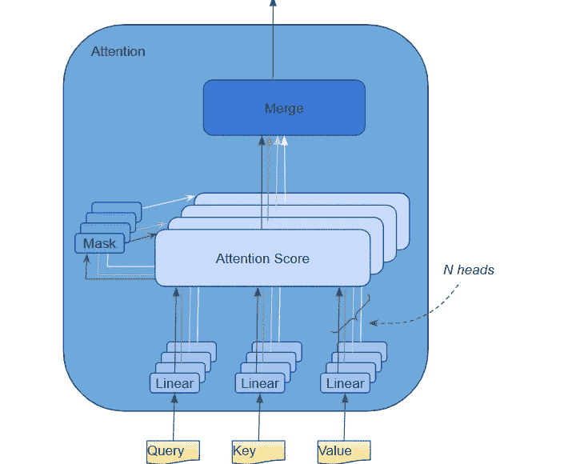
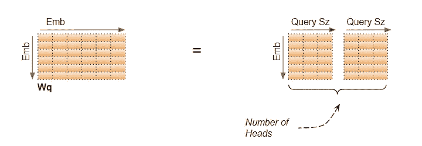
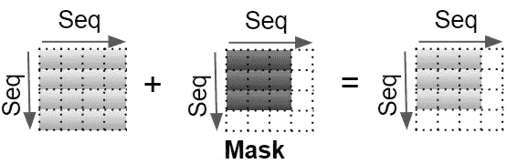

# 变形金刚直观讲解(第三部分):多头关注，深度潜水

> 原文：<https://towardsdatascience.com/transformers-explained-visually-part-3-multi-head-attention-deep-dive-1c1ff1024853?source=collection_archive---------0----------------------->

## 直观变形金刚系列 NLP

## 一个温和的自我注意，编码解码器注意，注意分数和掩蔽的内部工作指南，用简单的英语。

斯科特·托宾在 [Unsplash](https://unsplash.com?utm_source=medium&utm_medium=referral) 上的照片

这是我的变形金刚系列的第三篇文章。我们以自顶向下的方式覆盖它的功能。在前面的文章中，我们学习了什么是转换器，它的架构，以及它是如何工作的。

在本文中，我们将更进一步，深入探讨多头注意力，这是变形金刚的大脑。

这里是对本系列之前和之后文章的一个快速总结。我的目标是不仅要理解事物是如何工作的，还要理解它为什么会这样工作。

1.  [功能概述](/transformers-explained-visually-part-1-overview-of-functionality-95a6dd460452) *(变压器是怎么用的，为什么比 RNNs 好。架构的组成部分，以及训练和推理期间的行为)*
2.  [工作原理](/transformers-explained-visually-part-2-how-it-works-step-by-step-b49fa4a64f34) *(内部端到端操作。数据如何流动以及执行何种计算，包括矩阵表示)*
3.  **多头关注——本文** *(关注模块在整个变压器内部的工作方式)*
4.  [为什么注意力能提高表现](/transformers-explained-visually-not-just-how-but-why-they-work-so-well-d840bd61a9d3) *(不仅仅是注意力能做什么，还有为什么它如此有效。注意力如何捕捉句子中单词之间的关系)*

如果您对一般的 NLP 应用程序感兴趣，我还有一些您可能会喜欢的文章。

1.  [波束搜索](/foundations-of-nlp-explained-visually-beam-search-how-it-works-1586b9849a24)
2.  [Bleu 评分](/foundations-of-nlp-explained-bleu-score-and-wer-metrics-1a5ba06d812b) ( *Bleu 评分和单词错误率是 NLP 模型的两个基本指标*)

# 注意力是如何在变压器中使用的

正如我们在[第 2 部分](/transformers-explained-visually-part-2-how-it-works-step-by-step-b49fa4a64f34)中所讨论的，注意力用在了变压器的三个地方:

*   编码器中的自我关注—输入序列关注自身
*   解码器中的自我关注—目标序列关注自身
*   编码器-解码器-注意解码器-目标序列注意输入序列

(图片由作者提供)

**注意输入参数—查询、键和值**

关注层以三个参数的形式接受输入，即查询、键和值。

这三个参数在结构上是相似的，序列中的每个单词都由一个向量表示。

**编码器自关注**

输入序列被馈送到输入嵌入和位置编码，该编码为输入序列中的每个单词产生编码表示，该编码表示捕获每个单词的含义和位置。这被馈送到第一编码器中的自关注中的所有三个参数，查询、关键字和值，然后第一编码器还为输入序列中的每个单词产生编码表示，其现在也合并了每个单词的关注分数。当它通过堆栈中的所有编码器时，每个自我注意模块也将其自己的注意分数添加到每个单词的表示中。

(图片由作者提供)

**解码器自我关注**

到了解码器堆栈，目标序列被馈送到输出嵌入和位置编码，该输出嵌入和位置编码为目标序列中的每个单词产生编码表示，该编码表示捕获每个单词的含义和位置。这被馈送到第一解码器中的自关注中的所有三个参数，查询、关键字和值，第一解码器然后还为目标序列中的每个单词产生编码表示，其现在也合并了每个单词的关注分数。

在通过层规范之后，这被馈送到第一解码器中的编码器-解码器注意中的查询参数

**编解码器注意**

与此同时，堆栈中最后一个编码器的输出被传递给编码器-解码器关注的值和关键参数。

因此，编码器-解码器的注意力同时获得目标序列的表示(来自解码器自身的注意力)和输入序列的表示(来自编码器堆栈)。因此，它为每个目标序列单词产生一个具有注意力分数的表示，该表示也捕获了来自输入序列的注意力分数的影响。

当这通过堆栈中的所有解码器时，每个自我注意和每个编码器-解码器注意也将它们自己的注意分数添加到每个单词的表示中。

# 多个注意力头

在转换器中，注意力模块并行多次重复其计算。每一个都被称为注意力头。注意模块将其查询、键和值参数分成 N 个部分，并通过单独的头独立地传递每个部分。所有这些相似的注意力计算然后被组合在一起以产生最终的注意力分数。这被称为多头注意力，它赋予了转换者更大的能力来编码每个单词的多种关系和细微差别。

(图片由作者提供)

为了准确理解数据在内部是如何处理的，让我们在训练 Transformer 解决翻译问题的同时，来看看注意力模块的工作。我们将使用一个训练数据样本，该样本由一个输入序列(英语为‘You ' welcome)和一个目标序列(西班牙语为‘De nada’)组成。

# 注意力超参数

有三个超参数决定数据维度:

*   嵌入大小—嵌入向量的宽度(在我们的示例中，我们使用宽度 6)。该尺寸贯穿于整个变压器模型，因此有时被称为“模型尺寸”等其他名称。
*   查询大小(等于键和值大小)-三个线性图层分别用于生成查询、键和值矩阵的权重大小(在我们的示例中，我们使用的查询大小为 3)
*   注意力头的数量(在我们的例子中使用 2 个头)

此外，我们还有批量大小，这为我们提供了样本数量的一个维度。

# 输入层

输入嵌入和位置编码层产生一个形状矩阵(样本数、序列长度、嵌入大小)，该矩阵被提供给堆栈中第一个编码器的查询、关键字和值。

(图片由作者提供)

为了使可视化变得简单，我们将在图片中删除 Batch 维度，并将重点放在其余维度上。

(图片由作者提供)

# 线性图层

查询、键和值有三个独立的线性层。每个线性图层都有自己的权重。输入通过这些线性层产生 Q、K 和 V 矩阵。

(图片由作者提供)

# 在注意力集中拆分数据

现在，数据被分散到多个注意力头上，这样每个注意力头都可以独立处理数据。

然而，需要理解的重要一点是，这只是一个逻辑分割。查询、键和值没有被物理地分割成单独的矩阵，一个矩阵对应一个注意头。单个数据矩阵分别用于查询、键和值，矩阵的逻辑上独立的部分用于每个注意力标题。类似地，没有单独的线性层，每个注意力头部一个。所有的注意力头共享相同的线性层，但只是在数据矩阵的“自己的”逻辑部分上操作。

**线性层权重按人头进行逻辑分区**

这种逻辑分割是通过将输入数据以及线性层权重均匀地划分到注意力头上来完成的。我们可以通过如下选择查询大小来实现这一点:

*查询大小=嵌入大小/头数*

(图片由作者提供)

在我们的示例中，这就是查询大小= 6/2 = 3 的原因。即使层权重(和输入数据)是一个单一的矩阵，我们也可以认为它是每个头部的单独层权重的“叠加”。

(图片由作者提供)

因此，所有磁头的计算可以通过单个矩阵运算来实现，而不需要 N 次单独的运算。这使得计算更有效，并保持模型简单，因为需要更少的线性层，同时仍然实现独立注意头的能力。

**重塑 Q、K 和 V 矩阵**

由线性层输出的 Q、K 和 V 矩阵被重新整形以包括显式的头部尺寸。现在，每个“切片”对应于每个头部的一个矩阵。

通过交换头部和序列维度，该矩阵被再次整形。虽然没有画出批量维度，但是现在 Q 的维度是(批量、头、序列、查询大小)。

Q 矩阵被整形以包括头部维度，然后通过交换头部和序列维度再次被整形。(图片由作者提供)

在下图中，我们可以看到分裂我们的例子 Q 矩阵的完整过程，从线性层出来后。

最后一个阶段仅用于可视化——尽管 Q 矩阵是单个矩阵，但我们可以将其视为每个人头逻辑上独立的 Q 矩阵。

注意力头部的 q 矩阵分裂(图片由作者提供)

我们准备计算注意力得分。

# 计算每个头部的注意力得分

我们现在有三个矩阵，Q，K 和 V，分布在头部。这些用于计算注意力得分。

我们将只使用最后两个维度(序列和查询大小)来显示单个头的计算，并跳过前两个维度(批处理和头)。本质上，我们可以想象，我们所看到的计算对于批次中的每个头和每个样品都是“重复”的(尽管，很明显，它们是作为单个矩阵操作而不是循环进行的)。

第一步是做 Q 和 k 之间的矩阵乘法。

(图片由作者提供)

现在结果中添加了一个掩码值。在编码器自我关注中，掩码用于屏蔽填充值，以便它们不参与关注分数。

在解码器自关注和解码器编码器关注中应用了不同的掩码，我们稍后将在流程中进行讨论。

(图片由作者提供)

现在，通过除以查询大小的平方根来缩放结果，然后对其应用 Softmax。

(图片由作者提供)

在 Softmax 的输出和 V 矩阵之间执行另一个矩阵乘法。

(图片由作者提供)

编码器自我关注中完整的关注分数计算如下:

(图片由作者提供)

# 将每个头部的注意力分数合并在一起

我们现在对每个头部都有单独的注意力分数，这些分数需要合并成一个单一的分数。这种合并操作本质上是拆分操作的逆操作。

这是通过简单地改变结果矩阵的形状以消除头部维度来实现的。这些步骤是:

*   通过交换头部和序列维度来重塑注意力得分矩阵。换句话说，矩阵形状从(批、头、序列、查询大小)到(批、序列、头、查询大小)。
*   通过将形状调整为(批处理、序列、标题*查询大小)来折叠标题维。这有效地将每个头部的注意力得分向量连接成单个合并的注意力得分。

由于嵌入大小=头*查询大小，所以合并后的分数为(批次，序列，嵌入大小)。在下图中，我们可以看到示例得分矩阵合并的完整过程。

(图片由作者提供)

# 端到端多头关注

综合起来，这就是多头关注的端到端流程。

(图片由作者提供)

# 多头分割捕捉更丰富的诠释

嵌入向量捕捉单词的意思。在多头注意力的情况下，正如我们已经看到的，输入(和目标)序列的嵌入向量在逻辑上被分割成多个头。这有什么意义？

(图片由作者提供)

这意味着嵌入的不同部分可以了解每个单词含义的不同方面，因为它与序列中的其他单词相关。这允许转换器捕获序列的更丰富的解释。

这可能不是一个现实的例子，但它可能有助于建立直觉。例如，一个部分可能捕获名词的“性别”(男性、女性、中性)，而另一个部分可能捕获名词的“基数”(单数对复数)。这在翻译过程中可能很重要，因为在许多语言中，需要使用的动词取决于这些因素。

# 解码器自我关注和掩蔽

解码器自我关注的工作方式与编码器自我关注类似，只是它对目标序列的每个字都起作用。

(图片由作者提供)

类似地，屏蔽会屏蔽掉目标序列中的填充字。

# 解码器编码器-解码器注意和掩蔽

编码器-解码器的注意力来自两个来源。因此，与计算每个输入单词与其他输入单词之间的交互的编码器自关注和计算每个目标单词与其他目标单词之间的交互的解码器自关注不同，编码器-解码器关注计算每个目标单词与每个输入单词之间的交互。

(图片由作者提供)

因此，得到的注意力分数中的每个单元格对应于一个 Q(即目标序列字)与所有其他 K(即输入序列)单词和所有 V(即输入序列)字。

类似地，屏蔽屏蔽了目标输出中后面的单词，这在本系列的第二篇文章中有详细解释。

# 结论

希望这能让你很好地理解 Transformer 中的注意力模块是做什么的。当把我们在第二篇文章中讨论的转换器的端到端流程放在一起时，我们现在已经涵盖了整个转换器架构的详细操作。

我们现在确切地理解了*变压器是做什么的。但是我们还没有完全回答*为什么*变压器的注意力执行它所做的计算这个问题。为什么它使用查询、键和值的概念，为什么它执行我们刚刚看到的矩阵乘法？*

我们有一个模糊的直觉想法，认为它“抓住了每个单词与其他单词之间的关系”，但这到底是什么意思呢？这是如何让变形人的注意力有能力理解序列中每个单词的细微差别的呢？

这是一个有趣的问题，也是本系列最后一篇文章的主题。一旦我们了解了这一点，我们将真正理解变压器架构的优雅。

最后，如果你喜欢这篇文章，你可能也会喜欢我关于音频深度学习、地理位置机器学习和图像字幕架构的其他系列。

</audio-deep-learning-made-simple-part-1-state-of-the-art-techniques-da1d3dff2504>  </leveraging-geolocation-data-for-machine-learning-essential-techniques-192ce3a969bc>  </image-captions-with-deep-learning-state-of-the-art-architectures-3290573712db>  

让我们继续学习吧！