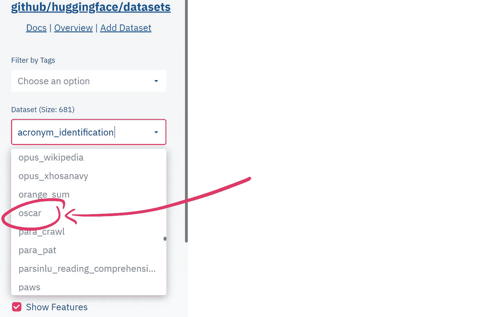
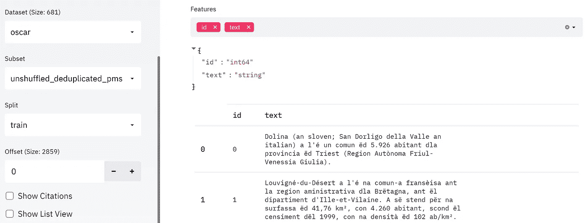
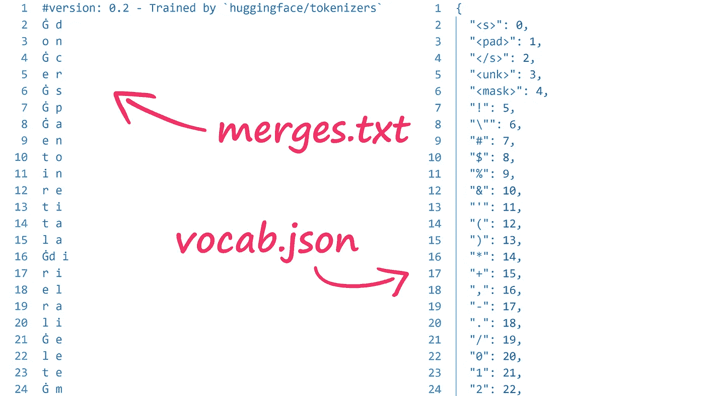

# 如何构建一个 Transformer 标记器

> 原文：<https://towardsdatascience.com/transformers-from-scratch-creating-a-tokenizer-7d7418adb403?source=collection_archive---------8----------------------->

## 你所需要的就是使用高频变压器创建一个定制的记号赋予器

作者图片

一个几乎每个自然语言处理(NLP)项目都是这样开始的:

当然，总会有一些复杂的情况。也许数据具有您(或其他任何人)以前从未见过的奇怪属性，并且使数据成为预处理的噩梦——但是对于模型设置，我们通常可以使用现有的预训练模型。

这很好，但是如果没有符合我们特定要求的预训练模型呢？

也许我们希望我们的模型能够理解一种不太常见的语言，例如，有多少 transformer 模型已经接受了皮埃蒙特语或纳瓦特尔语的训练？

**零点**

在这种情况下，我们需要做一些不同的事情。我们需要从头开始构建自己的模型。

现在，构建新的 transformer 模型背后的很大一部分工作是创建新的模型标记器。

记号赋予器是我们从人类可读文本到转换器可读记号的翻译器。在本文中，我们将学习如何构建我们自己的 transformer tokenizer。

# 获取数据

像往常一样，我们从数据开始。关于 transformer 的最大好处之一是我们的选择太多了——我们构建我们的标记器和预训练 transformer 模型所需要的只是非结构化的文本数据。

多语言数据的 HuggingFace 数据集的视频漫游

最大的非结构化文本数据集之一是 OSCAR，碰巧这是一个巨大的多语言数据集。现在，我们可以通过 HF `datasets`包直接访问这个数据集，让我们来看看。

现在，我们只能通过 Python 列出数据集的名称——这不是很多信息。为了获得更多细节，我们可以前往 HF [数据集查看器](https://huggingface.co/datasets/viewer/)。

左侧窗口允许我们使用过滤器和/或通过指定确切的数据集进行搜索。

选择 **oscar** 后，我们将看到另一个下拉选项— **子集** —它列出了 oscar 中所有可用的不同子集(如语言)。

我们可以通过选择**unshuffled _ duplicated _ PMS**子集来预览 OSCAR Piemontese 数据。

奥斯卡皮埃蒙特子集预览。

我们将继续使用`datasets.load_dataset(*'dataset'*, *'subset'*)`用 Python 下载这个数据集。

从这里我们可以看到拉丁子集包含 18.8K 个样本，其中每个样本都是一个字典，包含一个 *id* 和*文本*。

在训练我们的标记器时，我们需要从文件中读取数据——我们将在纯文本文件中存储所有样本，用换行符分隔每个样本。

我们将把每个文本文件分成 5K 个样本的块(尽管对于这种大小的数据集来说没有必要，但对于大型数据集来说是必需的)，并将它们保存到一个新的 *oscar_la* 目录中。

# 训练分词器

现在我们的数据已经准备好了，我们可以开始训练标记器了。我们将使用字节级字节对编码(BPE)记号赋予器。

标记化器构建的视频演练

字节级编码意味着我们将从字节字母表中构建我们的记号化器词汇表。由于这个原因，所有的单词都可以分解成记号——甚至是新单词——所以我们不需要特殊的未知记号。

我们需要一个文件列表来输入我们的分词器的训练过程，我们将列出所有的*。我们的 *oscar_la* 目录中的 txt* 文件。

现在我们初始化并训练我们的记号赋予器。我们将使用 roBERTa 特殊标记，一个词汇大小为`30522`的标记，以及一个最小频率(一个标记在数据中出现的次数，以引起我们的注意)`2`。

我们现在已经构建了我们的拉丁文 roBERTa tokenizer。让我们给它起一个听起来像拉丁语的名字——Bert ius——并保存到文件中。

## 记号化器文件

保存我们的记号赋予器创建了两个文件，一个`merges.txt`和`vocab.json`。

两个标记器文件— **merges.txt** 和 **vocab.json** 。

当我们的记号赋予器编码文本时，它将首先使用`merges.txt`将文本映射到记号，然后使用`vocab.json`将记号映射到记号 id。

# 使用分词器

我们已经构建并保存了我们的标记器——但是我们如何使用它呢？嗯，我们可以像加载其他标记器一样加载我们的标记器——使用`from_pretrained`。

现在让我们试着编码每个人最喜欢的拉丁短语:

这里可以看到我们的两个张量，`input_ids`和`attention_mask`。在`input_ids`中，我们可以看到由 **0** 表示的序列令牌**s>T21，由 **2** 表示的序列令牌**s \>**结束，以及由 **1** 表示的填充令牌 **< pad >** 。**

太好了！我们在巨大的 OSCAR 数据集的拉丁子集上组装了一个定制的标记器。本文到此为止！

我希望你喜欢这篇文章！如果你有任何问题，请通过 [Twitter](https://twitter.com/jamescalam) 或在下面的评论中告诉我。如果你想要更多这样的内容，我也会在 [YouTube](https://www.youtube.com/c/jamesbriggs) 上发布。

感谢阅读！

[🤖《变形金刚》NLP 课程 70%的折扣](https://bit.ly/nlp-transformers)

**除另有说明外，所有图片均出自作者之手*