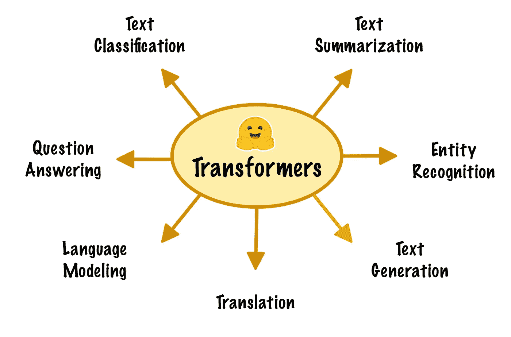
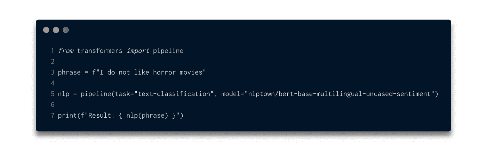
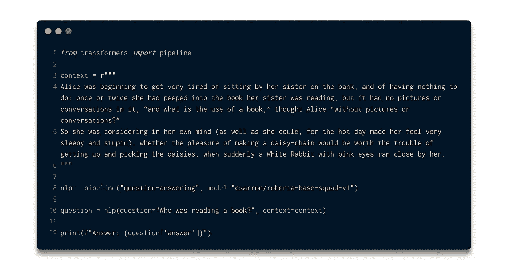
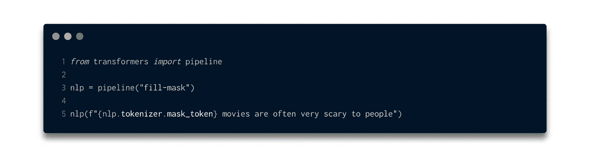
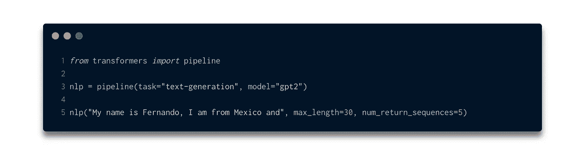
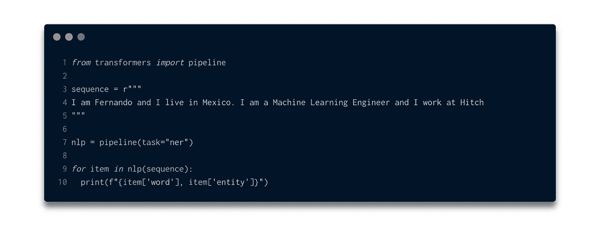
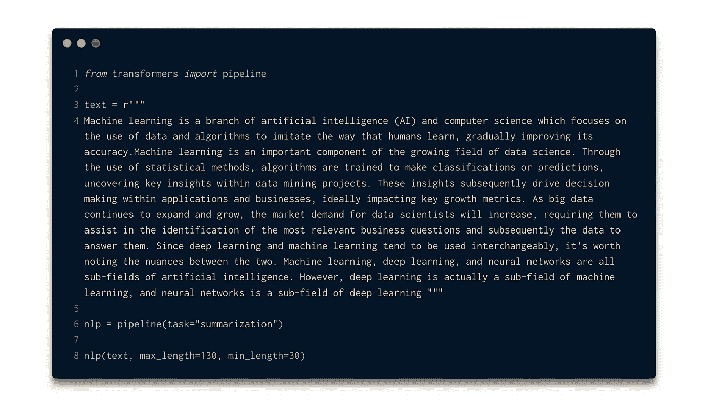
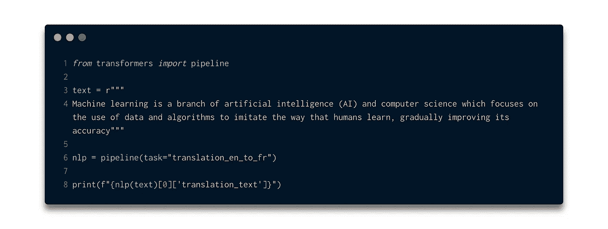

# 变形金刚:用 3 行代码实现 NLP 模型

> 原文：<https://towardsdatascience.com/transformers-implementing-nlp-models-in-3-lines-of-code-475639c3611d?source=collection_archive---------16----------------------->

## transformers 库简介，用于实现不同 NLP 任务的最新模型



图一。变形金刚|作者图片

使用最先进的自然语言处理模型从未如此简单。拥抱脸[ [1](https://huggingface.co/) ]已经开发了一个名为`transformers`的强大库，它允许我们以一种非常简单的方式实现和利用各种各样最先进的 NLP 模型。在这篇博客中，我们将了解如何安装和使用 transformers 库来完成不同的任务，例如:

*   **文本分类**
*   **问答**
*   **屏蔽语言建模**
*   **文字生成**
*   **命名实体识别**
*   **文本摘要**
*   **翻译**

所以在我们开始回顾不同任务的每个实现之前，让我们安装`transformers`库。在我的情况下，我在 macOS 上工作，当试图用`pip`直接安装时，我得到了一个[错误](https://github.com/huggingface/transformers/issues/2831)，我通过之前安装的`Rust`编译器解决了这个错误，如下所示:

```
$ curl --proto '=https' --tlsv1.2 -sSf https://sh.rustup.rs | sh
```

之后我用`pip`直接安装了`transformers`，如下所示:

```
$ pip install transformers
```

太好了，通过前面的两个步骤，库应该已经被正确安装了。因此，让我们从不同的实现开始，让我们开始吧！

# 文本分类

文本分类任务包括将给定的文本分配到给定的一组类中的特定类。情感分析是文本分类问题中最常解决的问题。

要通过`transformers`库使用文本分类模型，我们只需要两个参数`task`和`model`，它们分别指定要处理的问题类型和要使用的模型。考虑到拥抱脸存储库中托管的模型的多样性，我们可以开始使用其中的一些。[在这里](https://huggingface.co/models?pipeline_tag=text-classification)你可以找到文本分类任务的模型集合。

在图 2 中，我们可以看到用于情感分析的`bert-base-multilingual-uncasced-sentiment`模型的实现。



图二。文本分类|按作者分类的图片

输出是:

```
Result: [{'label': 'NEG', 'score': 0.9566874504089355}]
```

根据您选择实现的模型，这将是要获得的结果。考虑阅读每个模型的文档以了解它们在什么数据集上被训练以及它们执行什么类型的分类是很重要的。`transformers`的另一个巨大优势是，如果你有自己的模型托管在拥抱脸存储库中，你也可以通过这个库使用它。

# 问题回答

*抽取式问题回答*的任务是试图在给定的上下文中找到给定问题的答案。这个任务最有代表性的数据集之一是斯坦福问答数据集。

完成这项任务。变压器`pipeline`需要`context`和`question`。在下面的例子中,`context`是由*爱丽丝漫游奇境记*中的一段确定的，这个问题指的是该段中描述的一个事件。在下图中，您可以看到实现方式:



图二。问答|作者图片

输出是:

```
Answer: 'her sister'
```

对于这个任务，我们选择模型`robert-base-squad-v1`，然而，在[拥抱脸库](https://huggingface.co/models?pipeline_tag=table-question-answering)中，我们可以为这个任务找到不同的替代模型，值得看看其中的一些。

# 掩蔽语言建模

屏蔽语言建模任务是用屏蔽标记屏蔽给定文本句子的标记，其中要求模型用适当的标记填充每个屏蔽。

对于这种类型的任务，transformers `pipeline`只需要任务的名称(在本例中为`fill-mask`)，然后是指定要屏蔽的令牌的文本序列，在下图中我们可以看到实现:



图 3。蒙版语言建模|作者图片

输出是:

```
[{'sequence': ' Horror movies are often very scary to people',
  'score': 0.12314373254776001,
  'token': 28719,
  'token_str': ' Horror'},
 {'sequence': ' horror movies are often very scary to people',
  'score': 0.052469268441200256,
  'token': 8444,
  'token_str': ' horror'},
 {'sequence': 'Ghost movies are often very scary to people',
  'score': 0.05243474990129471,
  'token': 38856,
  'token_str': 'Ghost'},
 {'sequence': 'War movies are often very scary to people',
  'score': 0.03345327079296112,
  'token': 20096,
  'token_str': 'War'},
 {'sequence': 'Action movies are often very scary to people',
  'score': 0.029487883672118187,
  'token': 36082,
  'token_str': 'Action'}]
```

结果显示为令牌及其各自属性的列表。在这种情况下，得分最高的令牌是`Horror`，最后一个令牌是`Action`。

# 文本生成

文本生成任务指的是相对于确定的上下文创建语法和语义正确的文本部分。在这种情况下，`pipeline`初始化需要使用`task`的类型和`model`，就像前面的任务一样。最后，`pipeline`实例需要两个参数，即`context`(或种子)和要生成的序列的长度`max_length`。要生成的序列数是一个可选参数。

下图显示了生成 5 个文本序列的`GPT-2`模型的实现:



图 4。文本生成|作者图片

输出是:

```
[{'generated_text': 'My name is Fernando, I am from Mexico and live for a reason. I am a musician and the best producer, you might call me a poet'}, {'generated_text': 'My name is Fernando, I am from Mexico and I make an app with a lot of friends to keep us safe!" said Fernando.\n\nThe'}, {'generated_text': 'My name is Fernando, I am from Mexico and I am an atheist. I am living in a town called Tanta and I am living in the'}, {'generated_text': 'My name is Fernando, I am from Mexico and I have been doing this gig since the age of 21 and I am the first person to record this'}, {'generated_text': 'My name is Fernando, I am from Mexico and I am in Mexico", he said.\n\nHis name may be a reference to his birthplace and'}]
```

有点好笑的是`GPT-2`生成的序列是基于一个住在墨西哥的人，他的名字叫费尔南多。

# 命名实体识别

命名实体识别任务是指给给定文本序列的每个标记分配一个类。对于该任务的执行，只需要将任务标识符`ner`分配给`pipeline`初始化。随后，对象只接收一个文本流。在下图中，我们可以看到实施过程:



图 5。命名实体识别|作者图片

输出是:

```
('Fernando', 'I-PER')
('Mexico', 'I-LOC')
('Learning', 'I-ORG')
('Engineer', 'I-MISC')
('Hit', 'I-ORG')
('##ch', 'I-ORG')
```

对于本例，这些类是:

*   **I-MISC** ，杂项实体
*   **根据**，人名
*   **I-ORG** ，组织
*   **I-LOC** ，位置

有趣的是，公司作为一个组织被正确地分配。

# 文本摘要

文本摘要任务是指在给定一个确定文本的情况下提取一个摘要。为了初始化`pipeline`，需要`task`的定义以及`summarization`标识符。随后，对于任务的执行，仅需要`text`和要生成的最大和最小序列长度作为自变量。在下图中我们可以看到这个任务的实现:



图 6。摘要|作者图片

输出是:

```
[{'summary_text': ' Machine learning is an important component of the growing field of data science . Machine learning, deep learning, and neural networks are all sub-fields of artificial intelligence . As big data continues to grow, the market demand for data scientists will increase, requiring them to assist in the identification of the most relevant business questions .'}]
```

正如我们所看到的，由模型生成的摘要相对于输入文本是正确的。与前面的任务一样，我们可以使用各种模型进行文本摘要，如`BART`、`DistilBart`、`Pegasus` [ [4](https://huggingface.co/models?pipeline_tag=summarization) 。

# 翻译

翻译任务是指将一种给定语言的文本转换成另一种语言。`transformers`库允许以非常简单的方式使用最先进的模型进行翻译，例如`T5`。流水线用要解决的任务的标识符初始化，该标识符指的是原始语言和要翻译的语言，例如从英语翻译成法语，标识符是:`translation_en_to_fr`。最后，生成的对象接收要翻译的文本作为参数。在下图中我们可以看到一个从英语到法语的文本翻译器的实现:



图 7。翻译|作者图片

输出是:

```
L'apprentissage automatique est une branche de l'intelligence artificielle (AI) et de la science informatique qui se concentre sur l'utilisation de données et d'algorithmes pour imiter la façon dont les humains apprennent, en améliorant progressivement sa précision.
```

# 结论

在这篇教程博客中，我们看到了如何使用`transformers`库以一种非常简单的方式实现最先进的 NLP 模型。

在这篇博客中，我们看到了如何实现一些最常见的任务，然而重要的是要提到，这篇博客中显示的例子仅仅是为了推断，然而`transformers`库的一个伟大的属性是，它提供了能够基于那些已经训练好的模型微调我们自己的模型的方法。这将是下一篇博客的好主题。

# **参考文献**

【1】[抱紧脸](https://huggingface.co/)

【2】[小队](https://rajpurkar.github.io/SQuAD-explorer/) : *斯坦福问答数据集*

【3】[爱丽丝梦游仙境](https://www.gutenberg.org/files/11/11-h/11-h.htm)

[4] [文本摘要模型](https://huggingface.co/models?pipeline_tag=summarization)