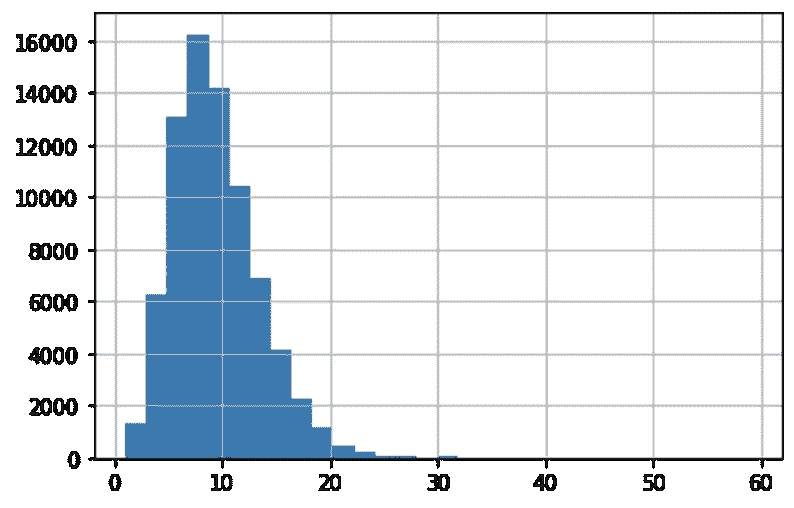
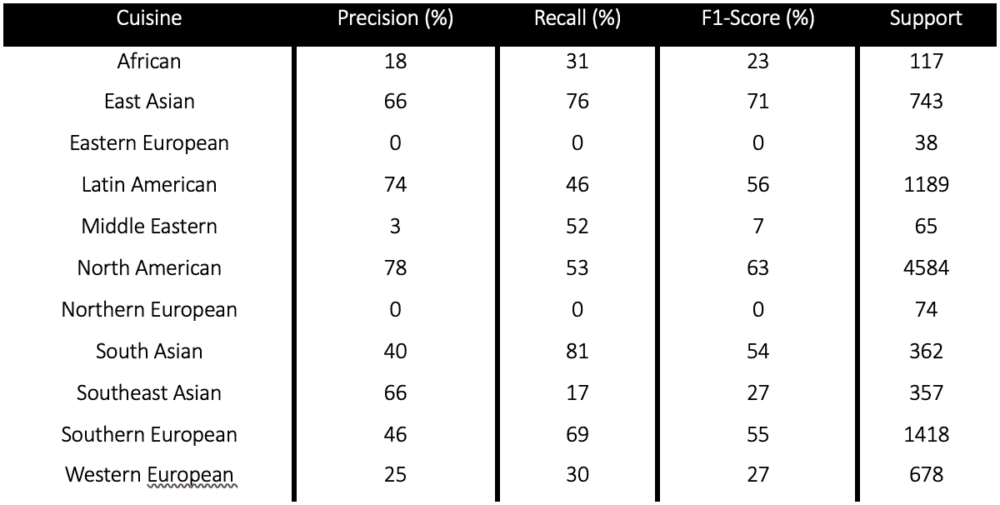

# NLP 中的变压器

> 原文：<https://towardsdatascience.com/transformers-in-nlp-7c164291326d?source=collection_archive---------28----------------------->

## 伯特、罗伯塔和 GPT-3

[https://unsplash.com/photos/iy_MT2ifklc](https://unsplash.com/photos/iy_MT2ifklc)

# 介绍

与计算机视觉不同，在自然语言处理(NLP)中，预训练模型最近才变得广泛可用。部分由于文本数据集的稀缺，NLP 的进展缓慢，直到 2018 年变压器(BERT)双向编码器表示的发布[1]。

BERT 由 Jacob Devlin 和他的同事在 Google AI Language 发表[1]。

BERT 有两种预训练模型:基本模型和大型模型。虽然两者使用相同的架构，但前者包含 1.1 亿个参数，而后者包含 3.45 亿个参数。能够使用预先训练的模型并对其进行微调以适应不同的任务意味着即使在缺乏足够的数据来训练具有数百万个参数的模型的情况下，也可以避免模型过度拟合。较大的模型通常具有更好的性能[2]。

在微调 BERT 时，有三种可能性[2]:

*   训练所有架构
*   训练一些层，冷冻其他层
*   冻结整个网络并将额外的层附加到模型上

第三种方法用于下面的案例研究(食谱->烹饪)。

与其他神经网络架构一样，提供的训练数据量越大，它的性能就越好。因此，一个重要的收获是，运行更多代的 BERT 将导致更高的准确性，并有足够的数据。作为一个参考值，包含 128 000 字批量的任务可能需要 500K 到 1M 的训练步骤才能收敛。就所需的计算能力而言，它相当于使用多个最先进的 GPU 进行几天的训练[3]。

BERT 的另一个特点是它的双向方法。与以前的从左到右或者结合从左到右和从右到左训练来查看文本序列的努力相反[3]。

与递归神经网络和长短期记忆神经网络相比，BERT 的一个优点是它可以并行化。这意味着它可以通过在多个 GPU 中训练来加速。在输入数据是文本序列的情况下，这意味着它可以一次接受多个标记作为输入[3]。

变压器的两种后实现是鲁棒优化的伯特预训练方法(罗伯塔)和生成预训练变压器 3 (GPT-3)。罗伯塔于 2019 年由脸书研究中心发布，在广泛使用的基准-通用语言理解评估上取得了最先进的结果。后来，在 2020 年，OpenAI 发布了 GPT-3。它的完整版本拥有 1750 亿个机器学习参数的容量。由于其非凡的成果，微软于 2020 年 9 月 22 日宣布授权 GPT-3 独家使用。使得它只能通过开放的 API 提供给公众。

# 案例研究(食谱->烹饪)

使用 BERT 变换器，训练了一个从给定的配料列表中预测菜肴的模型。

包含大约 100，00 0 个配方的 Kaggle 和 Nature 数据集用于训练转换器。每个食谱包括一个配料列表(图 1)，以及相应的菜肴。一份按字母顺序排列的配料清单给了模型。数据集的 80%用于训练，10%用于验证，10%用于测试。

在训练模型之前，标记化步骤使用 BERT 标记化器将每个配方分成 50 个标记。初始变压器的所有参数都被冻结。

**图 1** 编号。每份食谱的配料数量。食谱

训练时使用了实现权重衰减为 1e-3 的 Adam 算法的优化器。负对数似然被用作损失函数。并且模型收敛需要 40 个时期。训练在来自 Google Colab 的 P100 GPU 中进行。

模型的性能是用每种菜肴的精确度、召回率和 f1 分数来评估的。此外，所有菜系的 f1 总分。以及精确度、召回率和 f1 分数的宏观和加权平均值(图 2)。

**图 2** 料理预测器模型性能。0-非洲、1-东亚、2-东欧、3-拉丁美洲、4-中东、5-北美、6-北欧、7-南亚、8-东南亚、9-南欧&10-西欧

对于北美、南欧、拉丁美洲和东亚菜系，检测准确率达到 65%以上。

# 参考

[1][https://en . Wikipedia . org/wiki/BERT _(language _ model)](https://en.wikipedia.org/wiki/BERT_(language_model))【2021 年 7 月 21 日访问】

[2][https://www . analyticsvidhya . com/blog/2020/07/transfer-learning-for-NLP-fine-tuning-Bert-for-text-class ification/](https://www.analyticsvidhya.com/blog/2020/07/transfer-learning-for-nlp-fine-tuning-bert-for-text-classification/)【2021 年 7 月 21 日访问】

[3][https://towards data science . com/Bert-explained-state-of-art-language-model-for-NLP-F8 b 21 a9b 6270](/bert-explained-state-of-the-art-language-model-for-nlp-f8b21a9b6270)【2021 年 7 月 21 日获取】

[4][https://ai . Facebook . com/blog/Roberta-an-optimized-method-for-pre training-self-supervised-NLP-systems/](https://ai.facebook.com/blog/roberta-an-optimized-method-for-pretraining-self-supervised-nlp-systems/)【2021 年 7 月 21 日访问】

[5][https://openai.com/blog/gpt-3-apps/](https://openai.com/blog/gpt-3-apps/)【2021 年 7 月 21 日访问】