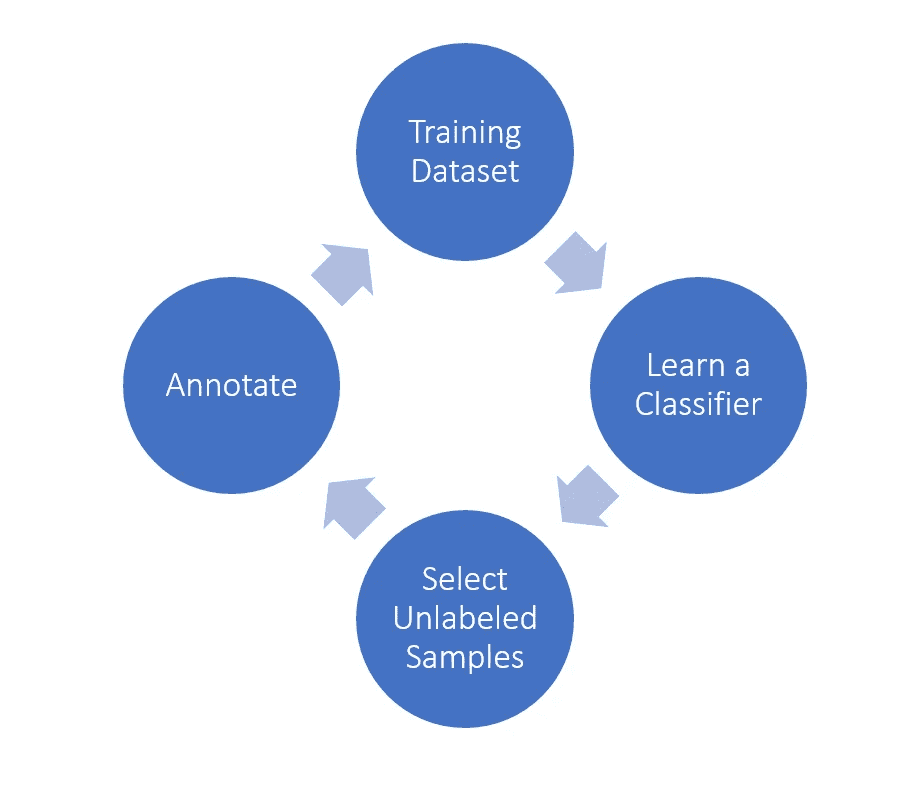
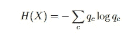
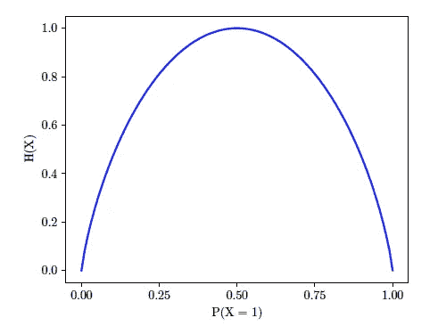
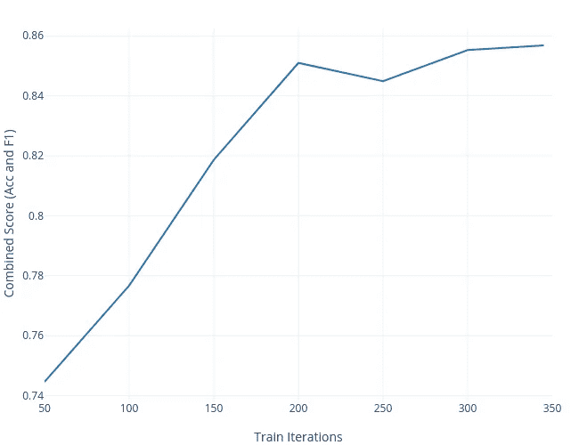
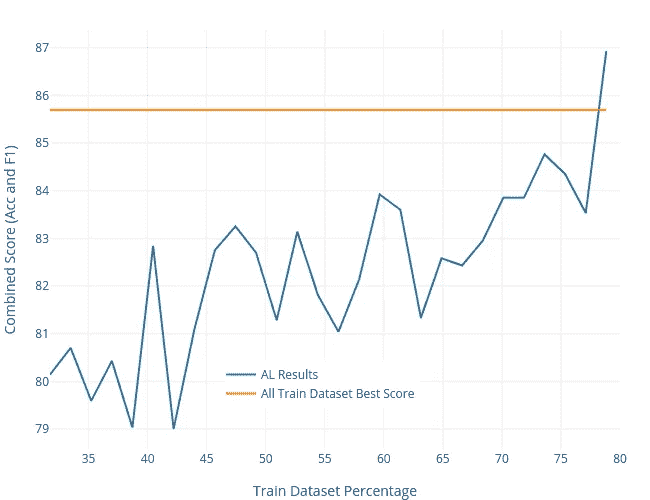

# 变形金刚满足主动学习:更少的数据，更好的性能

> 原文：<https://towardsdatascience.com/transformers-meet-active-learning-less-data-better-performance-4cf931517ff6?source=collection_archive---------16----------------------->

## 关于如何对 Transformer 模型使用主动学习的实践教程


丹·伯顿在 [Unsplash](https://unsplash.com?utm_source=medium&utm_medium=referral) 上拍摄的照片

最近，大型语言模型(LLM)推动了许多自然语言处理(NLP)任务的发展。通常，这些 LLM 遵循两步框架:预训练步骤，随后是微调步骤。预训练使用大量未标记的数据来创建预训练的权重。然后，微调步骤加载这些权重，并根据来自下游任务的标记数据进行训练。LLMs 可以用少量的标记数据获得良好的结果，从而缩短训练时间。然而，在现实世界中，即使注释一个很小的数据集也是很昂贵的。这不仅是一项漫长的人工工作，而且是一项复杂的任务(即，用 30 个类别或一个复杂的领域进行分类)，标记也不是微不足道的。例如，学习任务领域可能具有挑战性(医疗、财务)或者处理多个注释者之间的差异。因此，减少注释的数量是非常有益的，这也是主动学习(al)可以发挥作用的地方。

这篇文章将向你展示如何将 AL 与 Transformer 模型一起使用，以更少的标记数据获得相似或更好的结果。然而，这篇文章中的技术适用于任何概率分类器。另外，如果你对在多任务学习环境中使用人工智能感兴趣，可以看看[我在 ICLR21](https://openreview.net/forum?id=de11dbHzAMF) 上发表的论文。

# 主动学习:高层次的概述

在我们进入教程之前，我将概述一些高层次的概念，它们将帮助你更好地理解这篇文章的剩余部分。然而，如果你正在寻找更多关于 AL 的细节，我推荐[这个文献调查。](https://minds.wisconsin.edu/handle/1793/60660)

AL 背后的核心思想是，如果算法可以选择标记样本，那么它可以使用更少的标记样本来实现更好的性能，从而减少标注工作和训练时间。此外，在标记数据昂贵或难以收集而未标记数据大量可用的情况下，人工智能是有益的。后者是大多数真实世界应用的情况，如产品评论、对话数据等。

在机器学习(ML)文献中有三种主要的人工智能方法:

*   成员查询学习
*   基于池的采样
*   基于流的选择性采样

出于本教程的考虑，我将只概述基于池的抽样，但是如果您想深入了解其他技术的细节，我邀请您查看上面链接的调查。

## 基于池的采样

基于池的采样假设我们有一个用于训练初始分类器的小的初始标记数据集和一个大的未标记数据集。初始分类器使用*信息量*度量*从未标记集合中选择样本。*选定的样本随后由 oracle(自动化流程或人工)标记，并添加到标记的数据中。最后，使用新的标记集学习新的模型。重复该过程，直到达到期望的性能。



图片由 Amine Elhattami 拍摄，灵感来自 https://minds.wisconsin.edu/handle/1793/60660

## 信息含量指标

也被称为查询策略，信息量度量是一种试图帮助选择值得标记的样本*的度量。有多种查询策略。选择正确的将取决于您的数据和任务。在这篇文章中，我们将使用不确定性抽样。*

## 不确定抽样

不确定性采样是一种启发式方法，用于概率分类器，以帮助选择最不确定的样本。核心直觉是，高度的不确定性预示着一个决策边界。澄清这个界限将导致学习更好的分类器。

有多种方法可以应用不确定性采样。在这里，我将介绍熵采样，在本教程中使用的。

**熵采样**选择使用下面的等式计算的具有最高香农熵[2]的未标记样本，其中 *qc* 是样本属于类别 *c 的概率*



香农熵方程

例如，在二进制分类中，熵采样将选择类概率接近 0.5 的实例，其中熵最大，如下图所示。直观上，如果该分类器预测类 1 的概率为 0.99，类 2 的概率为 0.01，则该模型是合理可信的。因此，注释这个特殊的样本可能对模型没有好处。相反，如果两个类别的类别概率都是 0.5，则分类器是非常不确定的。因此，注释这个样本将是非常有益的(定义决策边界)。



基于 Amine Elhattami 的二元分类熵

# 实践教程

在本教程中，我们将在[微软研究院释义语料库](https://www.microsoft.com/en-us/download/details.aspx?id=52398) (MRPC)任务[4]中使用带有 cased BERT [3]基础模型的 al。我选择了一个小模型和一个小任务，让每个人都能在几个小时左右的时间内**复制这个教程。**BERT base 可以安装在几乎任何 GPU 上，包括免费提供的 GPU(如 Google colab)。至于任务，MRPC 数据集并不庞大，三个历元的训练最多需要 30 分钟。

对于 BERT 实现和数据集管理，我使用了流行的 [huggingface](https://huggingface.co/transformers/) 库。此外，我在这个 [git 资源库](https://github.com/Am1n3e/active-learning-transformer)中共享了全部源代码，并创建了一个[公共 Google colab 笔记本](https://colab.research.google.com/github/Am1n3e/active-learning-transformer/blob/main/active_learning_transformer.ipynb)。

## 数据集

MRPC 数据集由从在线新闻中提取的 5801 个句子对组成。这项任务的目标是预测一对句子在语义上是否等价。

句子对示例:

第一句话:“纳斯达克综合指数小幅上涨 1.28 点，涨幅 0.1%，至 1766.60 点，此前一周上涨 3.7%。”

第二句话:科技股纳斯达克综合指数。IXIC 下跌 24.44 点，或 1.39%，至 1，739.87 点。

MRPC 任务使用两个指标。准确性和 F1 分数。本教程将比较评估数据集中两个分数的组合(平均值),如 [GLUE 排行榜](https://gluebenchmark.com/leaderboard)所示，因为测试集标签不公开。

## 基线

在我们开始实现和试验人工智能之前，我们需要使用整个训练数据集创建一个基线分数，以比较后来的结果。因为我们的目标是尝试 al，所以我没有做任何超参数搜索。我使用了 [huggingface run glue 示例](https://github.com/Am1n3e/multitask-transformer/blob/initial-version/run_glue.py)中的默认值。因此，这个基线分数绝不是我们使用所选模型所能达到的最好成绩。以下是所有实验中使用的超参数:

```
per_device_train_batch_size: 32
per_device_eval_batch_size: 32
learning_rate: 2e-5
num_train_epochs: 3
seed: 12
random_seed: 123
```

下图显示了模型在所有训练样本上训练后的评估结果。最大综合得分是 85.7，这是一个相当不错的分数，因为使用一个大得多的模型，当前的最先进水平是 92.85(在写这篇文章的时候)。



Amine Elhattami 使用所有训练数据集的评估结果

## 主动学习设置

现在我们有了基线，让我们看看主动学习是否可以使用更少的标记样本获得类似或更好的结果。概括一下，我们将使用基于池的采样和 Shanon 熵。

首先，我们将原始训练数据集分成两部分:一个小的初始训练数据集和一个较大的“未标记”数据集。由于我们的数据集已经被标记，我们将只从训练集中移除样本。在这个例子中，我选择初始训练数据集为原始数据集的 30%。

第二步是使用我们之前创建的初始训练集来训练初始模型。然后，在评估集上记录分数，并在未标记的数据集上进行预测。

接下来，我们计算未标记数据集预测的熵，并选择具有最高 Shanon 熵的 *topk* 样本。`query_samples_count`是我们想要选择的样本数量。理想情况下，这个数字应该是批量的倍数。这里我选了 64。

一旦选择了样本，我们就请求 oracle(或注释器)提供标签(在我们的例子中，我们已经有了标签)，扩展训练数据集，并从未标记的集合中删除这些样本。

在现实世界的应用程序中，从 oracle 请求标签可能需要将未标记的数据发送到您的标记平台，并保持该过程，直到数据被标记。

最后，从第二步开始重复，直到当前分数超过目标分数，或者未标记数据集为空。后一种情况，意味着你没有足够的数据来达到想要的分数，或者你可能需要做一些超参数搜索。

整个代码将如下所示:

## 结果呢

下图显示了 AL 实验的结果。AL 结果中的每个点(蓝色)是使用训练数据集百分比(x 轴)的不同运行。橙色中的基线分数(使用 100%的训练样本)用作参考。



Amine Elhattami 将所有结果与基线进行比较

如您所见，所有结果都超过了使用少 21%训练样本的基线结果。知道训练数据集包含 3668 个样本，AL 避免了我们标记 776 个样本。如果我们假设一个注释者平均在每个样本上花费 3 分钟，那么就节省了 38.8 个工作小时(T4)。当然，这个时间将取决于任务的复杂性和注释者的知识。

# 结论

在这篇文章中，我们看到了如何使用 transformer 模型进行主动学习，以更少的标记数据获得更好的结果。

这里展示的用例很简单，它可能需要您为自己的应用程序做更多的调整。然而，这篇文章旨在向您展示，这很容易做到，而且值得努力，因为从长远来看，它可以节省大量时间，尤其是在数据域封闭的应用程序中。例如，当使用会话数据时，您不需要注释所有可能的打招呼方式

同样，我已经在这个 [git 仓库](https://github.com/Am1n3e/active-learning-transformer)中分享了全部源代码，并创建了一个[公共 Google colab 笔记本](https://colab.research.google.com/github/Am1n3e/active-learning-transformer/blob/main/active_learning_transformer.ipynb)供你尝试代码和不同的参数。

# 在你走之前

在 Twitter 上关注我，我经常在 Twitter 上发布关于软件开发和机器学习的消息。

# 参考

[1]毛刺解决。主动学习文献调查。计算机科学技术报告 1648，威斯康星大学麦迪逊分校。2009.

[2] C. E. Shannon，“通信的数学理论”，《贝尔系统技术杂志》，第 27 卷，第 3 期，第 379-423 页，1948 年 7 月，会议名称:《贝尔系统技术杂志》。

[3] Jacob Devlin、张明蔚、Kenton Lee 和 Kristina Toutanova。BERT:用于语言理解的深度双向转换器的预训练。 *CoRR* ，abs/1810.04805，2018。网址[http://arxiv.org/abs/1810.04805.](http://arxiv.org/abs/1810.04805.)

[4]威廉·多兰和克里斯·布罗克特。自动构建句子释义语料库。《第三届国际释义研讨会论文集》(IWP2005) ，2005 年。网址[https://www.aclweb.org/anthology/I05-5002.](https://www.aclweb.org/anthology/I05-5002.)