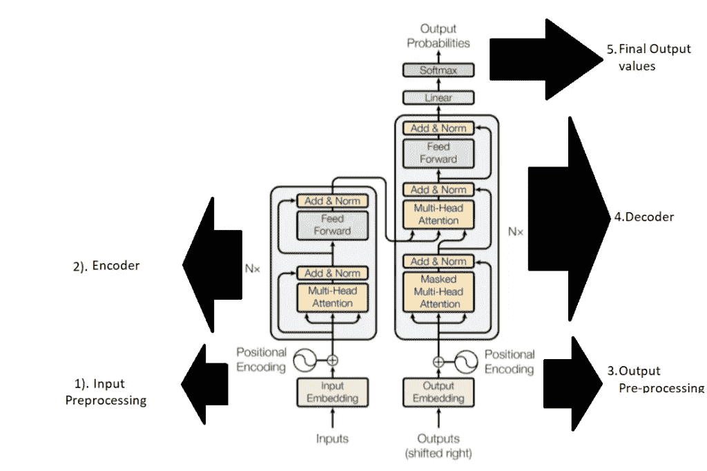
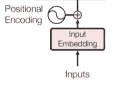
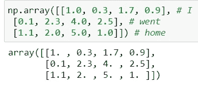
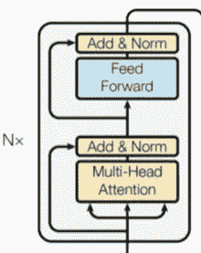
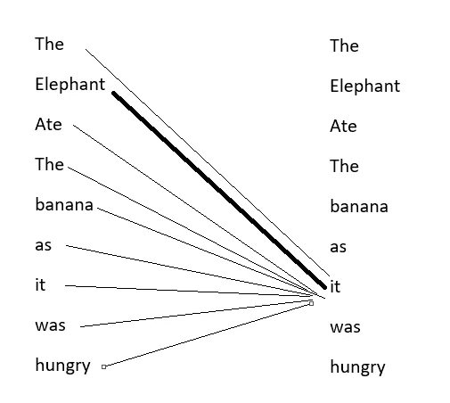

# 变形金刚——你只需要关注

> 原文：<https://towardsdatascience.com/transformers-you-just-need-attention-f3775734c0da?source=collection_archive---------20----------------------->

保罗·斯科鲁普斯卡斯在 [Unsplash](https://unsplash.com/s/photos/camera-focus?utm_source=unsplash&utm_medium=referral&utm_content=creditCopyText) 上的照片

自然语言处理或 NLP 是处理文本分析的机器学习的子集。它与人类语言和计算机的相互作用有关。有不同的 NLP 技术，最新的是最先进的变压器。

这将是第一个关于变形金刚架构的博客系列。事实证明，变形金刚在自然语言处理(NLP)领域是革命性的。自发明以来，它已经取代了所有其他自然语言处理(NLP)架构，如递归神经网络(RNN)、卷积神经网络(CNN)和长短期记忆(LSTM)。变压器有一个编码器-解码器的结构和一定的注意机制，使国家的艺术成果在许多任务。

在这篇文章中我们会学到什么？

*   这篇博文主要关注编码器部分，它的所有组件都将被详细讨论。在本帖中，将从理论和实践两个方面讨论编码器的内部细节(包括代码笔记本)。
*   编码器结构
*   **编码器的关键部件**或者说编码器中的数据流
*   输入-转换为嵌入。
*   位置编码
*   **多头关注层(自我关注机制)**
*   剩余网络
*   **添加和定额层**
*   **前馈层。**

# 架构概述

根据流程，变压器的不同部分

这篇博文将集中在上面这张图片的左边部分。

1.  输入预处理
2.  编码器

# 1.输入预处理

让我们放大输入预处理图像，如下所示。

位置编码器

举个例子:- **《我回家了》**。如果这个句子作为输入被传递到编码器，让我们看看流程。

## 步骤 1:-单词嵌入

电脑看不懂英文字母，需要转换成数字版本。因此，句子中的每个单词都被转换成一个相应的恒定大小(维数)的随机数向量。这些向量被称为**嵌入向量。**新矩阵将是**【句子长度，尺寸】**形状。

词的嵌入表征

在上面的例子中，我们有 3 个单词，每个单词都有一个长度为 4 的嵌入向量。于是，Shape=(3，4) **【句子 _ 长度，维度】**。在自然语言处理中，单词嵌入中的每个数字都具有与单词的语言特征相关的信息。如果我们把两个单词的单词嵌入在一起，比如说**【灰色】****【白色】**既然这些都是颜色，那么它们在 n 维空间中就会彼此靠近。这些单词嵌入最初是随机数，并且在训练过程中它们得到更新并且看起来彼此更接近或相似，因为它们属于**颜色**的类别。

## 步骤 2:-位置编码

在 LSTM RNN，单词是按顺序输入的，因此它能理解单词的顺序。但是在 transformer 中，所有的单词都是并行传递的。随着刑期的增加，在 LSTM 复发将需要大量手术。为了记住单词的顺序，引入了**位置编码**的概念。这是一种表示单词位置的编码。简而言之，**将**位置编码**添加到我们的**现有字嵌入**中，这就给出了最终的**预处理嵌入**以用于编码器部分。位置编码的概念很重要，我会写一篇关于它的单独的博客文章并链接到这里。**

注意:**位置嵌入**的大小应该和我们的**现有的字嵌入**一样，就是这么加起来的。

# 2.编码器堆栈:-

编码器堆栈

可以有 N 个编码器，但它们的内部结构是相同的。我们之前讨论的嵌入将通过 4 个单元:-

1.  多头注意力
2.  添加和规范层
3.  前馈层
4.  添加和规范

## 1.多头注意力

注意机制是一种为每个单词创建表示的方式，其中句子中的每个单词理解与同一句子中所有其他单词(包括其自身)的语义相似性。这是通过点积运算实现的。文中 8 个注意力头并行运行，所以多头注意力。它实际上有助于获得句子中所有单词之间的语义相似关系。输出嵌入将由上下文信息组成，并将显示每个单词如何与句子中的其他单词相关。它可以处理歧义，如下所示。这里的“ **it** ”与“**大象”**的关联度大于“**香蕉”**。

自我注意机制中的词汇表征

多头注意力机制将在更详细的<https://machinelearningmarvel.in/intuitive-maths-and-code-behind-self-attention-mechanism-of-transformers-for-dummies/>****中讨论。我会写一篇关于它的独立博文，并把它链接到这里。****

## **2.添加和规范层**

**编码器的输出嵌入通过残差网络被添加到原始输入嵌入。残差的目的是确保原始重要信息在通过编码器的过程中不会丢失。然后这被归一化。**

## **3.前馈层**

**然后，归一化的嵌入通过完全连接的层。**

## **4.添加和规范层**

**前馈层的输出通过残差网络被添加到编码器的输出嵌入中。残差网络的目的是确保原始重要信息在通过编码器的过程中不会丢失。然后这被归一化。**

**以上四个步骤是编码器的一部分，并且重复多次( **Nx** 如图所示)，这给了我们纯粹的上下文嵌入。**

## **赞成的意见**

**它在大多数 NLP 任务中提供了最先进的结果。即使是基本的预训练模型也能给出很好的结果。**

## **骗局**

**建筑太大了。它有几百万个参数需要训练，并且需要大量的计算能力来训练。下一篇文章将展示解码器部分。直到那时**