# 用集体推理转变协作决策

> 原文：<https://towardsdatascience.com/transforming-organizational-decision-making-with-collective-reasoning-c859c1a9d991?source=collection_archive---------17----------------------->

## *创建一致性和可操作的结果*

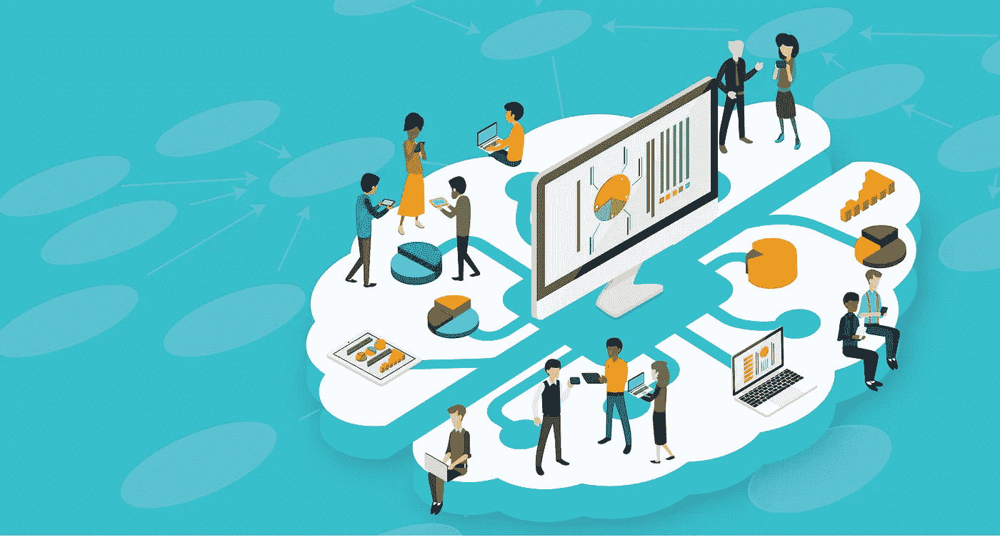

## 组织转型的障碍

决策的信心、准确性和速度是组织变革的圣杯。尽管所有的工作都发生在决策科学、人工智能和数据科学中，但我们仍然发现自己对冗长的会议感到厌倦，这些会议寻求集体信心，以知道我们正在做出正确的决定。疫情使情况变得更糟。

我最近与一家顶级捐赠基金的首席投资官进行了交谈。在他的职位上，他监管投资委员会，每个委员会通过合作决策分配数十亿美元的资金。他知道，改善他们的投资决策过程可以对回报产生重大的积极影响，他确信提高决策准确性的途径必须是通过技术进步。具体来说，他希望捕捉尽可能多的不同观点，使讨论更加透明，并记录决策过程以对照结果进行回溯测试，以便他们可以学习如何改进。

传统上，在所有这些领域，合作决策都很棘手，而且往往会无意中偏向高层领导，或者“房间里最响亮的声音”。此外，协作决策很难大规模管理，当参与者来自多个地点或不同文化时，这更具挑战性。大多数决策都是在行政否决的情况下做出的，这并非偶然，任何试图在一个大型群体中达成共识的人无疑都可以证明这一点。“回音室”效应导致全球投资界每年损失数十亿美元的机会。幸运的是，集体智能、人工智能和自然语言处理的最新发展使得解决高效、准确决策的诸多挑战成为可能。本文阐述了一种通过利用这些技术进步的集体力量来增加组织决策的信心、速度和准确性的方法。通过将人的洞察力和推理技能与人工智能的优化和精炼清晰度结合起来，我们可以开始改善商业中最人性化和最容易出错的方面之一，即信息灵通和准确决策的“艺术”。

在我们开始之前，了解一些我们需要解决的关键挑战是有帮助的。这些是功能障碍的“三大”来源，代表着有效决策机会的丧失:

1.  **对决策原因的集体协调** : *不协调往往会导致僵局、会议令人沮丧的结束，或者领导想要推翻原本开放的流程。在关键决策上寻求集体一致的过程往往会引发组织政治，这往往会导致参与者长期不满、脱离、跟进和执行不力，以及对领导层信心的长期侵蚀。*
2.  **系统性偏见** : *无意识的系统性偏见让组织墨守成规。创新常常被植根于多年“经验”的决策和组织结构的规范模式所阻碍。当根深蒂固的模式和响亮的声音统治着一天的时候，有价值的不同的想法落到了地板上。与教育背景、文化、年龄、性别和资历相关的隐性偏见，共同扼杀了潜在的令人信服的创新想法。*
3.  **基于证据的准确性跟踪:** *对支撑决策的原因和影响的记录不足，为修正主义历史创造了机会，在修正主义历史中，评论浮出水面，如“我认为做出决策时我正在休假”，或总是有用的“我一直有疑问”。健康的组织学会将重点从个人责任转移到直接从证据的审计线索中获得的集体组织学习。*

集体智能和人工智能的进步为克服这三个障碍提供了一个突破性的机会，并为做出充分知情和预测准确的组织决策提供了一种变革性的新方法。

***集体推理:学习和评估群体对决策或预测的理由或信念的过程***

## 创建与集体推理的一致性

这三个障碍的解决方案以及自信、快速和准确决策的途径是快速了解支持决策的证据的共同信念和优先级，同时努力消除偏见。在没有技术的情况下，这通常是在与专注于创建共享优先级和一致性的客观主持人的会议中完成的。这种手动流程不能很好地跨地点和时区扩展，也不适用于疫情这样的危机时刻。此外，由于“房间里最大的声音”、在组织中的地位、激情或说服的力量支配了证据、逻辑和不同的观点，会议过程经常失败。显然，这是一个协作技术解决方案的巨大机会。

集体智慧的研究表明，我们集体更聪明。从多个角度进行决策是众所周知的最佳实践。随着我们进入一个合作的新时代，一代人将参与视为就业的一个基本方面，我们可以在一系列关于集体智慧力量的优秀书籍中找到灵感。斯科特·佩奇(Scott Page)的《差异》(Difference)展示了思维多样性的力量，以提高预测的准确性。菲利普·泰特洛克和丹·加德纳记录并分析了无数案例，证明了集体智慧在“超级预测”中的力量。最后，司各特·佩奇和汤姆·马龙分别在他们广受欢迎的著作《模范思想者》和《超级智者》中贡献了他们丰富的专业知识。总之，这些书展示了集体智慧科学承诺的思考预测和决策准确性的新方法的各种方式。

***集体智慧总结:多视角、多元背景增加预测准确率，减少系统偏差。***

集体推理比集体智慧更进了一步。在集体智慧中，预测是完全独立完成的。一个多元化的小组被赋予一项任务，以做出一个预测的结果，每个人独立工作，并对结果进行分析。独立分析决策的不同观点背后的“为什么”的原因。

在集体推理中，我们将决策的*预测*或评级从评级的*原因*中分离出来。集体推理抓住了在伟大的头脑风暴会议中经常观察到的动态潜力，在头脑风暴会议中，我们从彼此的思维中学习；它共同创造了新的决策方法。集体推理捕捉到了协作思维不可思议的力量，超越了简单聚合一系列独立思想的数学演算，捕捉到了集体思维在创造力、解决问题和一致性方面的力量。

**一个说明性的例子**

让我们用一个简单的例子来说明这一点，那就是决定投资或不投资一家早期公司——一家初创公司。在押注一家可能有下一个大创意的初创公司时，我们都需要自信、速度和准确性。

想象一下，你被邀请成为一群人中的一员，来评估是否投资一家新的秘密创业公司。总的来说，你的任务是预测公司能否成功吸引主要投资者。你可以接触到公司的所有资料，你可以参加创始团队的问答活动。你已经有了做出深思熟虑的决定和预测所需的所有材料。你正在评估的公司有高度技术性的业务。虽然你不知道他们的身份，但你知道还有其他人有很强的技术背景，适合这项任务。

您需要根据以下属性，用 1 到 10 分对公司进行评分:

1.  引人注目的商业机会，考虑市场、竞争等因素。
2.  团队——这是在目标市场领导公司的合适团队吗？
3.  早期顾问和投资者的网络效应——他们能帮助推动公司吗？
4.  投资信念——这是你会进行或推荐的投资吗？

在审查材料后，你提供你的输入分数以及导致你给出你给出的分数的原因。一旦你提交了你的想法，你就会看到其他人的理由和他们得分的原因。您看不到其他贡献者的分数。注意，你看不出谁是幕后推手。你被要求优先考虑与你的想法一致的原因。这一过程增加了对驱动决策观点的证据的关注，并减少了组织立场或团队政治的偏见。一旦你提交了优先考虑的理由列表，阅读它们可能会让你回头重新考虑你的评分或你对决定的其他想法。这种重新考虑是团队走向一致点过程的重要组成部分。

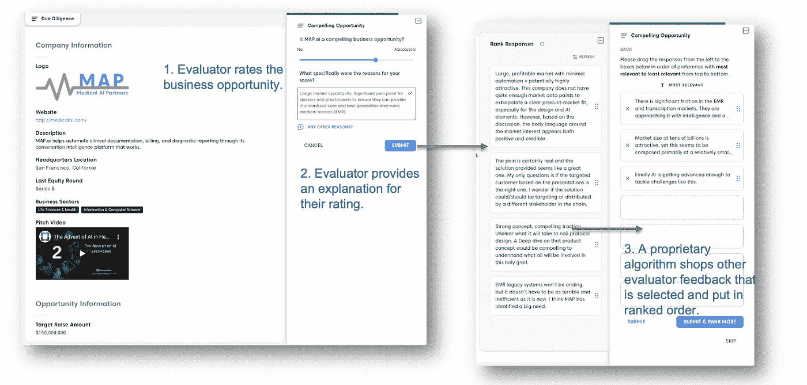

图 1

## 以科学的准确性学习相关性

我们冻结了这个例子，以指出集体推理的技术和科学解决方案的机会。事实上，学习群体偏好的根源可以追溯到近 100 年前 L.L. Thurstone 在 1927 年首次提出的比较判断法则。 ***学习‘预测性’偏好的唯一方法是 A/B 测试，一种经济权衡*** *。*我们很多人都经历过在验光师办公室回答“A 还是 B？”…“B 还是 A？”一遍又一遍。营销人员非常熟悉 A/B 测试，这是了解产品偏好的标准方法。但是，在动态发现环境中，要比较的项目数量可能需要大量的 A/B 测试，这种方法对大规模的组有效吗？人工智能技术提供了一个解决方案。

每当上述评估团队中的个人对一系列原因进行排名时，我们就可以创建一个谁优先考虑谁的原因的“网络”。下面显示的是我们上面列出的一个会议的网页。节点是独立的贡献者，链接是通过对彼此的想法进行优先排序而生成的:

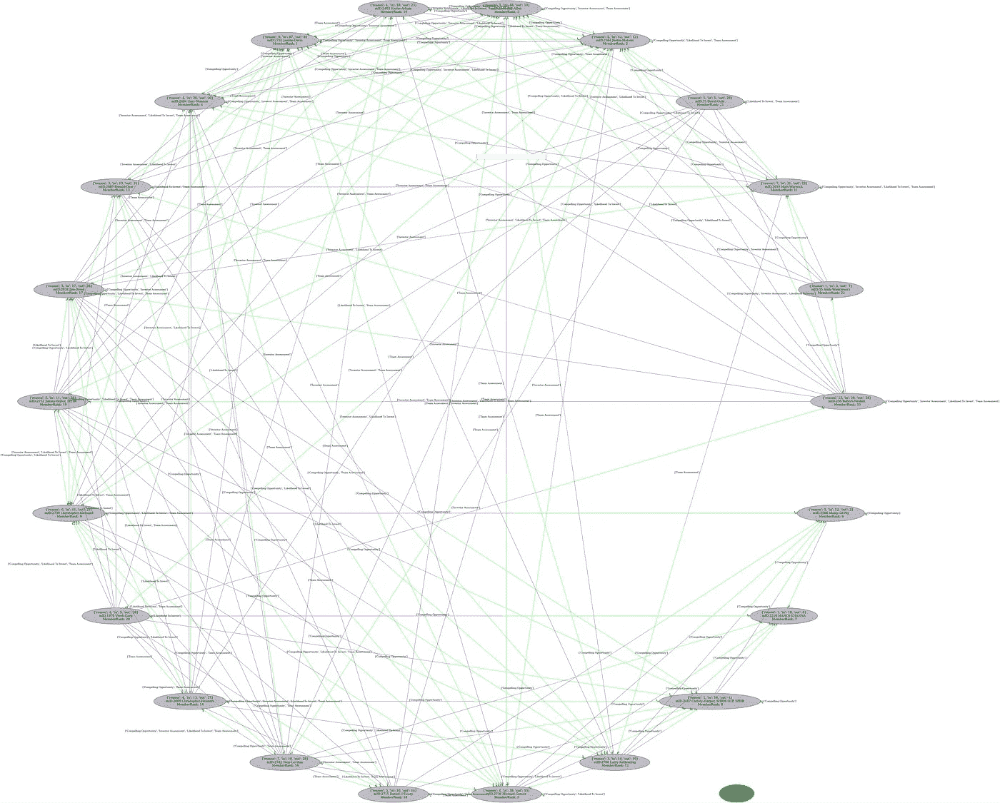

群体互动的网络表现

通过使用隐马尔可夫过程来学习相关性。图 1 右侧面板中显示的示例列表是基于之前的评级事件动态生成的列表。马尔可夫过程的“隐藏”部分是一种功能，它逐渐从“发现模式”转变为“优先模式”，前者获取新想法的输入，后者试图估计最能代表群体排序原因的原因列表。请注意，样本列表的上下文是由所考虑的“特征”决定的。团队评估是整体模型的一个示例“特征”。下图显示了算法的学习曲线。请注意，其收敛速度由评级事件的数量决定，但对于评级最高的项目(靠近图的原点)，其收敛速度相当快。

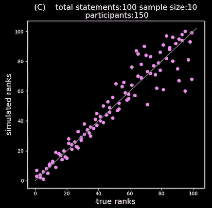

学习相关性

从连接网络中，我们学习各种成员影响力排名，且我们使用自然语言处理技术来学习表示与商业机会、团队等的评估相关联的集体推理的原因和主题。学习相关性与情感提供了一个有意义的信号，表明哪些项目是高度相关的。下图是一个具体投资分析的例子。

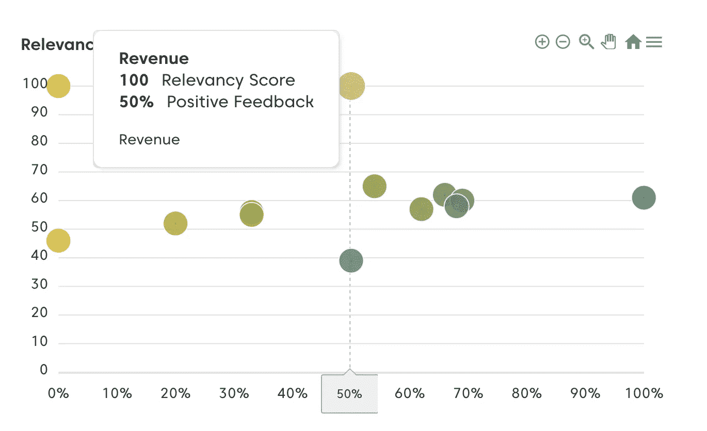

相关性与情感

在这种特殊情况下，评估小组认为收入非常重要，但情绪表明关于收入的讨论是混合的。关于为什么这是真的细节是通过研究分配给这个主题的相关原因来了解的。

这是集体推理系统的本质。它自动获取应用于手头决策的知识。

# 整合人类和人工智能

今天，我们面临着前所未有的挑战，涉及投资者和企业如何配置资本，以及如何成功规划企业转型和增长的道路。对人工智能的大量投资影响了某些业务流程的自动化，但在规划、战略思维、投资决策和企业转型方面，人工智能的承诺却没有兑现。对统计学习的短视关注及其对历史数据的严重依赖，限制了人工智能在催化创新解决方案以应对我们最大挑战方面的愿景。创造性集体行动的需要超越了公司战略。需要明确的集体规划和行动，这延伸到应对气候变化和公共政策。在这篇文章中，我介绍了一个使用集体人类智能和人工智能的平台，该平台经过多年的发展，有望催化和授权集体创造性的预测和行动。

第二代人工智能(statistical learning AI)的限制在朱迪亚·珀尔(Judea Pearl)的新书《为什么之书》(The Book of Why)中有明确阐述。他指出:

“如果我可以用一句简洁的话来总结这本书的主旨，那就是:你比你的数据更聪明。数据不懂因果；人类有。”

他继续解释道:

“虽然概率编码了我们对静态世界的信念，但因果关系告诉我们，当世界发生变化时，无论是通过干预还是通过想象，概率是否以及如何变化。”

在《麻省理工科技评论》的一次采访中，深度学习的创始人之一 Yoshua Bengio 说:

“我认为我们需要考虑人工智能的硬挑战，不要满足于短期的增量进步。我不是说我要忘记深度学习。相反，我想在此基础上更进一步。但我们需要能够扩展它来做推理、学习因果关系和探索世界等事情，以便学习和获取信息。”

有强有力的论据表明，人类和机器智能的集成是下一代人工智能系统的基础。人类在从极小的数据集学习以及富有想象力的发现和预测方面仍然处于优势。信任和透明对于金融投资和企业转型决策等领域的人工智能应用至关重要。人类授权的人工智能和集体智慧提出了指导人工智能未来进程的方法。

# 集体推理:从数据获取到认知模型

如果您想使用目前可用的工具集获得决策输入，您通常会求助于调查工具、投票或通过电子邮件和消息工具的开放式输入。今天的工具适合于收集个人对某个主题或决策的观点。例如，假设你有一组人，你想从他们那里得到投资决策的反馈，你只想得到我们上面提出的三个问题的意见——业务、团队、网络效应。每位参与者被要求从 1 到 10 (10 为最高)对问题进行评分，并给出他们的理由或对其答案的思考。该图以图形方式显示了信息收集工作的模式:

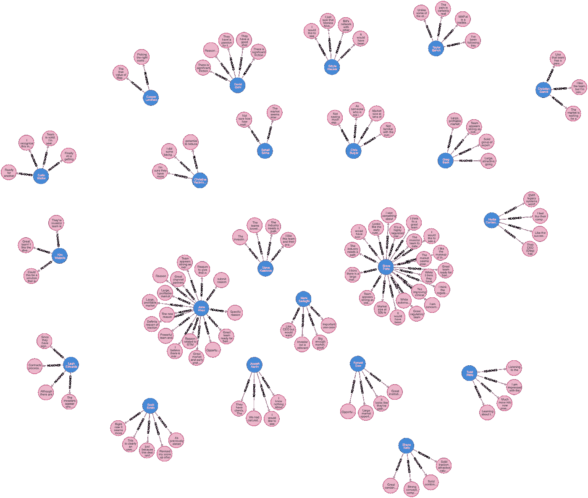

**无相关性排名的个人评论**

蓝点代表输入他们观点的人(23 名参与者)。粉色圆点代表他们的分数和理由(提交分数的 113 个理由)。有些人比其他人更详细地阐述了他们的理由，但他们都为每个问题提供了分数。此图显示了使用上述任何方法(调查、投票或电子邮件)获得的结果。计算一个小组的平均分数很容易，调查工具会自动为你计算。总结这 113 个理由或思考是很难的，除非你使用人类的大脑并阅读每一个理由。即使一个人阅读了每一篇文章，他们也不能把它们都保存在工作记忆中。最多，他们可能会挑出五六个有共鸣的。即使这样，除非他们把评估小组召集到一起，否则他们永远也不会知道代表小组对投资决策的想法的前三或四个原因。学习优先相关性是一个难题。情绪分析只是轻度预测。严重缺失的是提问的能力:

*团队如何围绕这一投资决策的理由保持一致？*

假设我们引入一种机制，允许他们从上面提到的一个样本中对彼此的理由进行排序。使用相关性学习算法，我们可以过滤掉与该组相关性较低的原因，从而从根本上简化分析过程。注意，我们看到了这个群体如何一起推理的早期阶段。这是 ***集体推理的第一步，通过人工智能增强的同行评审过程过滤相关性*** :

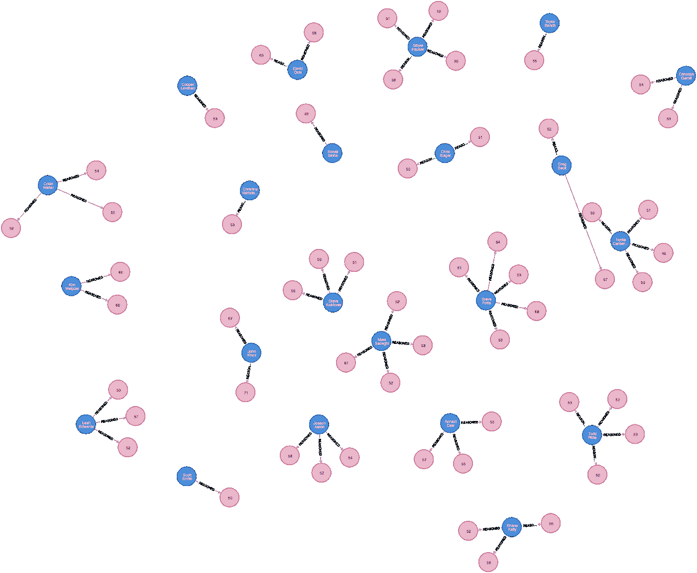

同行评审的相关意见

请注意，左下方的人有许多与她/他的同事不太相关的原因。你是否曾经觉得自己就是会议中的那个人？)如果只看相关性高的原因(比如分数> 50%)，就要把问题的复杂程度降低一点。注意，如果我们想更深入地了解团队的想法，我们现在必须阅读大约 50 个理由。

使用一些最新的 NLP 技术，因为我们正在动态地学习原因的相关性。我们还可以了解对决策至关重要的主题(绿色)。像“好的市场”或“差的上市”这样的主题更容易总结小组的推理。请注意，由于主题或主题只是原因的集合，它们将具有主题相关性分数，因此现在可以根据小组的集体判断，将小组正在思考的主题按优先顺序排列。在这种特殊情况下，结果是有五个关键主题，每个主题都有积极、消极和中性的情绪，从而进一步简化了结果。由于原因与量化分数相关联，我们可以将该分数与情绪分析相结合，以获得更具预测性和更精确的读数，从而了解该人对决策的真实想法。

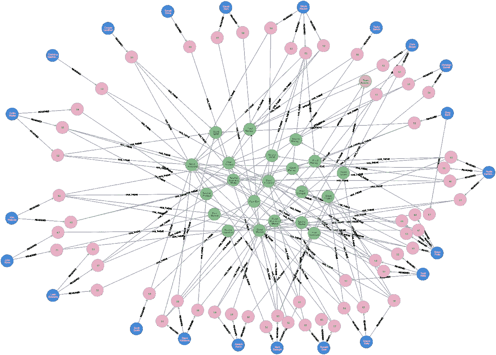

按主题组织的评论

但是，请记住，这一练习的最初目的是按照小组对这一投资决策的建议去做。通过使用如图 1 所示的结构化过程，我们可以将所有的集体推理链接成一个预测。绿色显示的主题和粉色显示的相关原因最终会影响功能的评分，从而影响预测得分。在这种情况下，小组给这项投资打了 79%的分。这种评分方法可以使用地面真实数据进行训练，整合人类和集体智慧，为组织集体决策的全新方法提供框架。

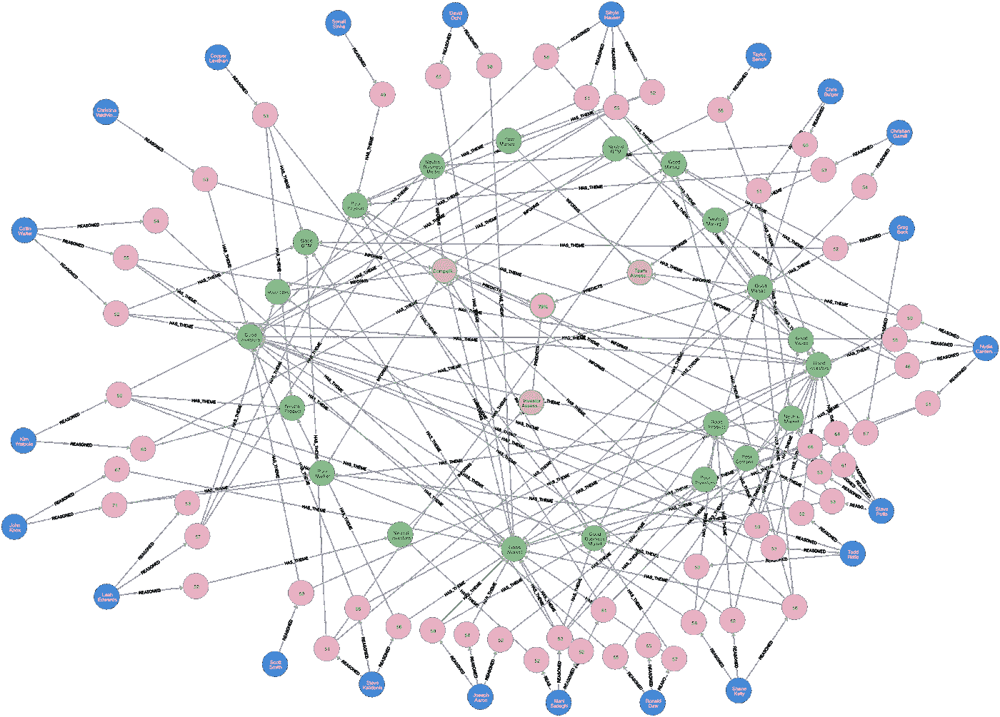

具有相关原因和主题的预测模型

每一个决策过程都会产生一个决策的集体推理模型:一个集体认知模型，这个模型是关于群体认为什么是决策的结果，比如投资或通过的决策。该模型允许从不同的角度进行检查。比如我们可以从预测结果入手，问“为什么”。决定的理由是什么？下图显示了决策的业务质量方面的观点。

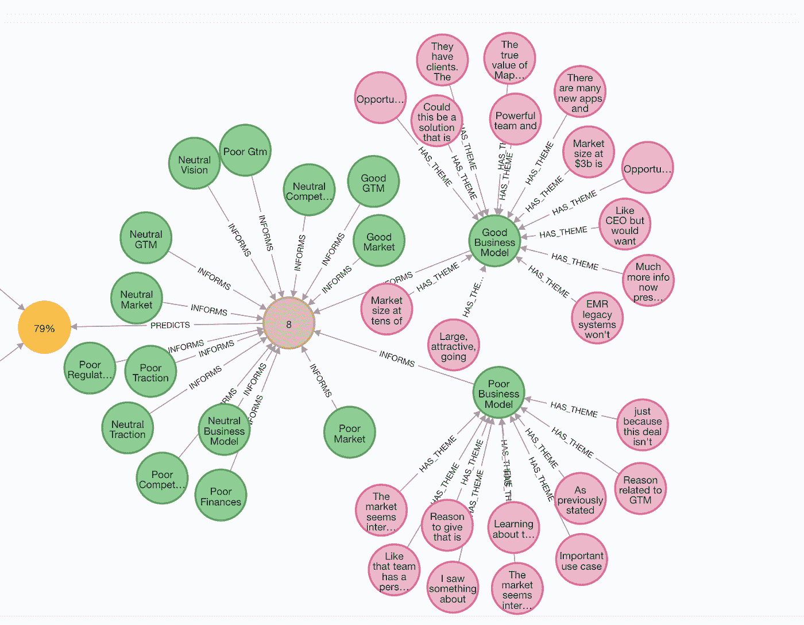

分数和预测背后的原因和主题

与业务质量相关的特征得到了 8 分的平均分数。

然而，正如你所看到的，存在着不同的意见。一些人认为有一个好的商业模式，而另一些人认为没有。集体推理允许探索意见的多样性；这里有一点非常重要。集体推理不是关于“从众心理”，而是探索由不同个体推理的不同意见的分支，以及它如何融入集体预测或决策。

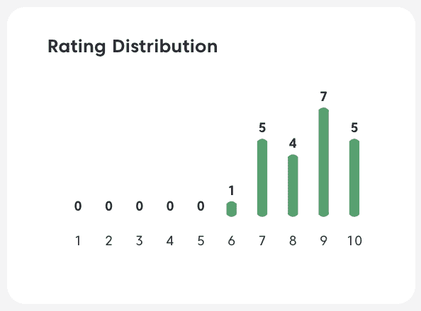

评级分布

集体推理利用了集体智慧的发现，特别是多样性预测定理:

***集体群体误差=群体误差—多样性得分***

对于这里描述的集体推理系统，我们计算数量多样性得分和语言多样性得分。后者是通过使用最新的嵌入技术将语言转化为几何图形而成为可能的。每个原因都是语言空间中的一个点，与其他原因有一个可计算的距离。我们已经证明:

***团队的认知多样性越大，预测准确度越大***

通过将原因(原因)与分数联系起来，我们就在推理和分数之间建立了因果关系。最终结果是，我们现在有了一个用于预测的因果网络或一个用于决策的因果认知模型。随着时间的推移，这可以被一般化，这样我们就有了一个基础，来构建跨越广泛决策领域的集体推理和个人团队智能的计算模型。

***总之，所描述的集体推理系统有可能从根本上改变捕捉和提高组织中决策者智力的方式。***

对于那些对人工智能感兴趣的人来说，你会将结果识别为贝叶斯信念网络或因果网络。实际上，我们已经自动化了从组织中的一组专家或团队成员那里获取知识的过程。

在这篇短文中，我介绍了创建更快、更准确的组织决策的解决方案。每一个协作过程都由一个决策“记分卡”驱动，该“记分卡”记录了您做出决策时需要考虑的因素。每一个过程都会产生一个分数和一个完整的知识和思考记录。该模型可以存档，并用作组织学习的独立资源。该模型模拟了群体的思维，因此是一个因果模型，一个知识模型，一个导致决策的专业知识和思维的迷你智能。

如果你有一个做决定时需要考虑的因素的“记分卡”，考虑使用如上所述的集体推理来自动化和简化你的决策过程。它可以异步地、远程地完成，你不必去开会。你们一旦结盟就能见面，这将是一次愉快得多的经历。你将有一个永久的记录，记录你的团队在做决定时所经历的完整的推理过程。一旦你们达成一致，你们就可以见面，思考这个过程产生的信息，并做出最终决定。请记住，这是一个决策支持过程，其他因素，如资金的流入或减少，宏观经济的突然转变，甚至疫情可能与决策密切相关，但没有包括在分析中。

最后，也许从长远来看是最重要的，我所描述的过程产生了个人和组织作为一个整体的推理过程的永久记录。随着这一永久记录的展开，可以在现实的强光下对其进行评估。该组织是否考虑了适当的理由？它们的重量合适吗？将过程与结果联系起来有助于学习，因为分析师可以根据未来的发展来评估过去的推理。

如果你没有一个“记分卡”来记录你的决策，那就创建一个。这又引出了另一篇文章，请稍后继续，或者通过 [tom@crowdsmart.ai](mailto:tom@crowdsmart.ai) 联系我。

1.  丹尼尔·卡内曼等人即将出版一本名为《噪音，人类判断的缺陷》的书。艾尔。人类判断中的噪音问题及其对准确性的影响。虽然我们的方法可以通过相关性排名和集体输入来隐含地处理噪声，但是它没有明确地处理或模拟噪声问题，并且是未来工作的主题。