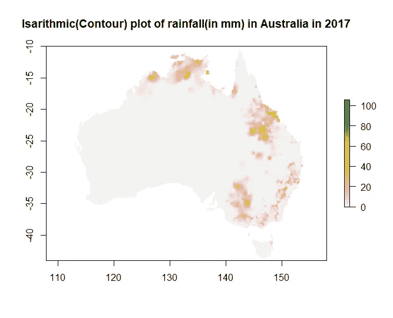
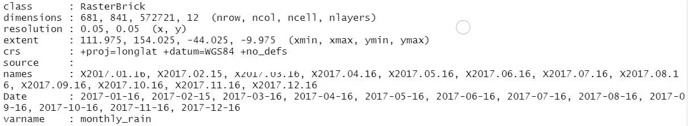
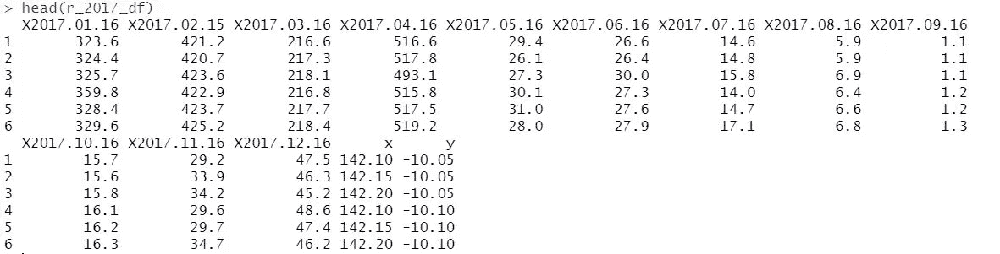
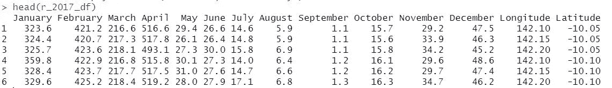
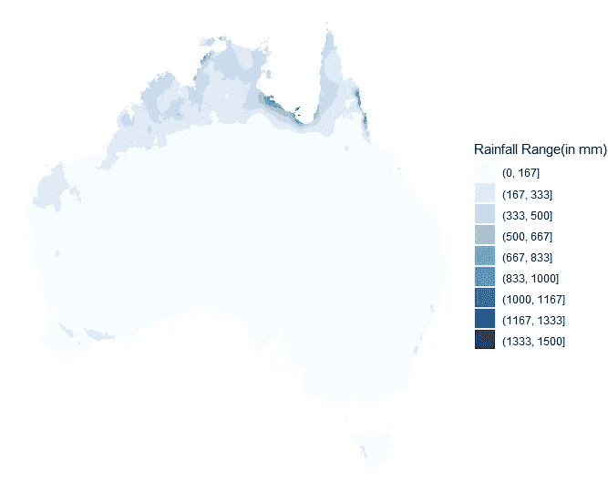

# R 中空间数据到表格数据的转换

> 原文：<https://towardsdatascience.com/transforming-spatial-data-to-tabular-data-in-r-4dab139f311f?source=collection_archive---------21----------------------->

## 关于原始格式的空间数据和将其转换成表格数据的技术问题的评论

# 转型的需要

您可能会问的第一个问题是，为什么还要转换空间数据。在我的案例中，在一个闪亮的数据可视化应用程序上处理空间数据时，转换的需求是必然的。

但是，(地理)空间数据是与映射到地图上的地理位置的数据一致地构造的，由特定的经度和纬度值控制。我们从这些数据中提出的问题要求我们对其进行子集划分/过滤/查询，并最终对其进行处理，以呈现我们希望展示给目标受众的信息。

R 中有几个函数可用于以其原生格式绘制空间数据，例如 plot()、image()和 filled.contour()函数。

```
library(raster)rainfall <- raster("2007.daily_rain.nc")
image(rainfall,plot.title = title(main = "Isarithmic(Contour) plot of total rainfall(in mm) in Australia in 2017"))
plot(rainfall, plot.title = title(main = "Isarithmic(Contour) plot of rainfall(in mm) in Australia in 2017"))
```



作者图片

但是，在某些情况下，您需要不断地处理空间数据来过滤/子集化坐标或与坐标相关联的信息(例如，x-y 坐标位置或 z 坐标位置的降雨量，通常是时间)，以显示受约束区域或时间的数据。

尽管这可以通过使用某些库来实现，比如 **tidync** (如下所示)

```
library(tidync)nc_2007 <- tidync(“2007.daily_rain.nc”)# Filtering based on longitude,lattitude or time(available variables)nc_2007 %>% hyper_filter(lon = lon < 120)
nc_2007 %>% hyper_filter(time = time <= 5 & time >= 2) # 2nd Jan to 5th Jan 2007 data
nc_2007 %>% hyper_filter(lat = lat <120,time = between(time,1,10))
```

使用 **dplyr** 软件包进行数据操作的简便性是无与伦比的。

为此，我们需要将空间数据转换成表格数据(最好是 dataframe 格式)。

但首先，让我们看看空间数据及其常见格式的一些基础知识。

# 空间数据及其常见类型和格式

## 什么是空间数据？

项目与地图上的地理位置相关联的数据。比如澳大利亚各个城市的降雨量。

## 常见的空间数据类型

1.  **基于光栅或像素的数据**

Arial 照片、卫星图像和高程数据通常存储为栅格数据。

最常用的格式:

*   ADRG
*   二进制文件
*   Esri 网格
*   netCDF 网格
*   GeoTIFF
*   JPEG2000

2.**矢量数据**

地理形状存储为矢量数据。

*   **点**用于存储 0 维特征的位置，如山峰
*   **线/折线**用于存储道路或河流等一维特征的位置
*   **多边形**用于存储湖泊或国家等二维特征的位置和形状

最常用的格式:

*   锁眼标记语言(KML)
*   地理标记语言(GML)
*   Esri shapefile
*   杰奥森
*   挽救（saving 的简写）

在本文中，我将重点介绍转换最常用的栅格数据格式之一:netCDF grid。

# 将栅格数据转换为数据帧

这里使用的栅格数据是从 SILO 收集的，SILO 是一个从 1889 年到现在的澳大利亚气候数据的数据库，由昆士兰环境和科学部(DES)托管。我们在这里关注的数据是 2017 年澳大利亚不同经度和纬度的月降雨量数据。

> 这些数据可以通过下面的超链接访问。
> 
> [https://www.longpaddock.qld.gov.au/silo/gridded-data/](https://www.longpaddock.qld.gov.au/silo/gridded-data/)

网格数据主要由三个坐标和每个 x-y-z 的相应属性组成，以月降雨量表示:

**X —经度**

**Y —纬度**

**Z —一年中的某月**

## 步骤 1:从 netCDF 网格格式创建一个 RasterBrick 对象

```
library(raster)r_2017 <- brick("2017.monthly_rain.nc")
r_2017
```



对象的尺寸和属性—按作者分类的图像

使用栅格库的 brick()函数部分，将 **netCDF grid** 数据转换为 **RasterBrick** 对象，允许我们使用 plot()、image()函数作为**栅格**库的一部分直接绘制该对象。

## 步骤 2:将 RasterBrick 对象转换为 SpatialPointsDataFrame 对象，最后转换为 DataFrame

```
r_2017_df <- as.data.frame(rasterToPoints(r_2017,spatial = TRUE))
head(r_2017_df)
```



按作者显示数据框的前几行图像

*rasterToPoints()* 将 **RasterBrick** 对象转换为 Points 对象，这是一种矢量数据，如果您还记得上一节的话。

设置*空间*参数= TRUE 将其转换为 ***空间点数据帧*** 对象。

最后，通过使用转换函数 *as.data.frame()* ，我们可以很容易地将其从***spatialpointsdata frame***对象转换为 **dataframe** 。

## 步骤 3:重命名列名以提高可读性

```
library(dplyr)r_2017_df <- dplyr::rename(r_2017_df,January = 'X2017.01.16')
r_2017_df <- dplyr::rename(r_2017_df,February = 'X2017.02.15')
r_2017_df <- dplyr::rename(r_2017_df,March = 'X2017.03.16')
r_2017_df <- dplyr::rename(r_2017_df,April = 'X2017.04.16')
r_2017_df <- dplyr::rename(r_2017_df,May = 'X2017.05.16')
r_2017_df <- dplyr::rename(r_2017_df,June = 'X2017.06.16')
r_2017_df <- dplyr::rename(r_2017_df,July = 'X2017.07.16')
r_2017_df <- dplyr::rename(r_2017_df,August = 'X2017.08.16')
r_2017_df <- dplyr::rename(r_2017_df,September = 'X2017.09.16')
r_2017_df <- dplyr::rename(r_2017_df,October = 'X2017.10.16')
r_2017_df <- dplyr::rename(r_2017_df,November = 'X2017.11.16')
r_2017_df <- dplyr::rename(r_2017_df,December = 'X2017.12.16')
r_2017_df <- dplyr::rename(r_2017_df,Longitude = 'x')
r_2017_df <- dplyr::rename(r_2017_df,Latitude = 'y')
```



对数据框架进行最终更新，以重命名列名—图片由作者提供

最后，我们可以使用 **dplyr** 包中的 ***重命名*** 函数，将列名重命名为更有意义的名称。

现在，我们可以轻松地操纵我们的数据框架来绘制美丽的可视化图形，从数据中找到有趣的见解，如下所述。

```
library(ggplot2)ggplot(r_2017_df,aes(x=Longitude,y=Latitude,z=.data[["January"]])) + theme_void() + geom_contour_filled_interactive(aes(fill = stat(level),data_id = stat(level),tooltip = paste("Rainfall Range", stat(level))), bins = 9) +  labs(fill = "Rainfall Range(in mm)") + scale_fill_brewer(palette = "Blues")
```



2017 年 1 月澳大利亚降雨量的空间分布-图片由作者提供

总之，通过采用这种将空间数据转换为表格数据的方法，我们可以更好地控制数据，让我们能够更轻松地操作数据，从而帮助我们更自由地从数据中提出问题。