# 使用弹性堆栈将您的电子表格转换为数据分析视图！

> 原文：<https://towardsdatascience.com/transforming-your-business-spreadsheets-into-data-analytics-view-using-kibana-and-logstash-efbc2d598f51?source=collection_archive---------33----------------------->

## 商业电子表格如何具有重要的洞察力…

***由*** [***安德烈拉斐尔***](https://www.linkedin.com/in/andreyrafael/)


照片由[米卡·鲍梅斯特](https://unsplash.com/@mbaumi?utm_source=medium&utm_medium=referral)在 [Unsplash](https://unsplash.com?utm_source=medium&utm_medium=referral) 上拍摄

> 为什么将 excel 电子表格导出到 Elasticsearch 会很有用？如果你在一家拥有大量遗留系统和僵化的 IT 组织结构的大公司工作，你很可能已经看到人们传递 Excel 电子表格，并将其作为存储数据的一种方式(一种数据库)。分析师浪费大量时间将这种临时系统转换为对业务有用的信息，手动将数据传输到数据库或 Tableau、Qlik 或 Power BI 实例。在本文中，我们将尝试通过使用 ELK 堆栈来解决这个问题，以便自动化这种过程，并生成更好的、可操作的见解。

# 但是这是如何工作的呢？

为了演示从基于存储库的数据管理中自动收集简单数据的过程，我将使用 ka ggle "[meal delivery company](https://www.kaggle.com/ghoshsaptarshi/av-genpact-hack-dec2018)"数据集，从头开始介绍这个过程。

我们将从在微软 Azure 上提供 Ubuntu Server 18.04 开始(它可以是你熟悉的任何云服务和操作系统)。

在这个例子中，我将我的服务器命名为“elastic ”,在部署服务器之后，我添加了一个 SSD 磁盘(挂载点/数据),对于我们的目的，Elasticsearch 在 SSD 上工作得最好

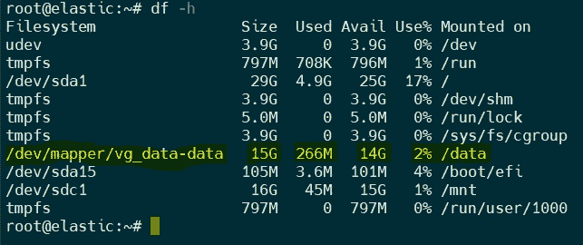

[图片由作者提供]

然后，我们将 elasticsearch、kibana 和 log stash 7 . 9 . 2 版安装在这个文件系统“数据”中，按产品进行分类，如下所示。

```
*Installations commands:**apt-get install elasticsearch, apt-get install kibana, apt-get install logstash**Important: Change permission and owner for folder where you installed for example (in my case):*
```

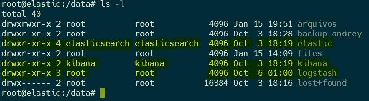

[图片由作者提供]

为了组织日志和数据路径，以便 Elasticsearch 可以与它们同步，我们将编辑 elasticsearch.yml 文件。在我们的例子中，我们将使用 root 访问权限，但在真实的生产环境中，我们可以实现一个控制用户或用户组，对 elasticsearch 过程和配置文件拥有足够的权限。

# **启动麋鹿栈！**

在没有错误地启动 elasticsearch 和 Kibana 之后，下一步是使用' curl '命令来识别 elasticsearch 是否可以摄取任何数据。

```
service elasticsearch start
service kibana start
curl localhost:9200
```

我用用户和密码保护了我的环境(弹性安全)，如果到目前为止所有的程序都是正确的，你会看到消息“你知道，搜索”。

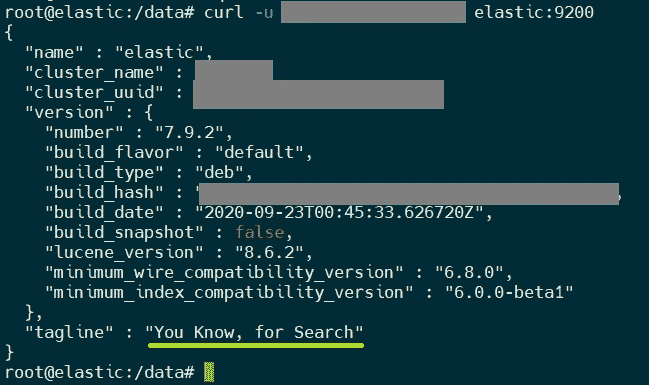

[图片由作者提供]

# **摄取数据！**

我们将使用的数据集包含关于中心、餐饮、地区和许多其他变量的信息。它分为四个数据集。

在实际情况中，我们很可能需要安排一个下载命令在我们知道文件可用的特定时间运行(比如说，每天晚上 8:00)。在我们的例子中，我们使用 bash wget 命令并将数据存储在/data/arquivos 目录中。

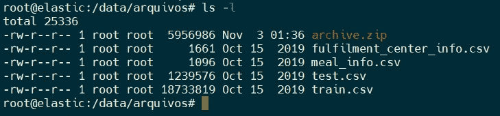

[图片由作者提供]

现在，我们需要配置我们的 *logstash.yml* 管道设置，并在配置文件中描述正确的路径。我创建了一个示例配置(/etc/log stash/conf . d/*spread sheet . conf*)来读取。csv 文件。

```
#structure of sample
input{} - path of files
filter{} - ajust columns, lines, values, strings etc
output{} - send data to elasticsearch
```

这个文件结构对于创建*输入*来读取所有 *<电子表格名称>很重要。csv* 文件，并为每个文件定义*过滤器*。您不需要为每个电子表格创建单独的*输入*或*过滤器*。也可以使用相同的方法。conf 并依次输入您的“*输入/过滤器*”。下面我展示了一个 *train.csv* 文件的*输入*的例子。

我们还可以使用 Logstash 作为 ETL 工具，并修复不一致的地方，如空值、字符串形式的日期以及其他可能出现的问题。将数字字段转换成正确的数据类型非常重要，这样我们以后就可以使用 Elasticsearch 和 Kibana 来探索数字聚合和可视化。

配置完数据字段后，就该输入信息并使用客户机经常需要的所有数据构建一个 kibana 索引了。有了这些数据，就可以执行分析并创建优化的视图。

运行您的 logstash 代理，可以检查是否一切正常…

```
/usr/share/logstash/bin/logstash -f /etc/logstash/conf.d/**spreadsheet.conf**Or create daemon process and run as a service:
service logstash start
```

启动 logstash 代理后，我们的示例的输出应该是:

```
{
                     "week" => 145,
                "center_id" => 61,
                  "meal_id" => 2490,
               "[@timestamp](http://twitter.com/timestamp)" => 2021-01-18T01:47:13.253Z,
                     "path" => "/data/arquivos/train.csv",
                     "type" => "train",
               "base_price" => 290.03,
                 "[@version](http://twitter.com/version)" => "1",
               "num_orders" => 162,
                       "id" => 1361984,
    "emailer_for_promotion" => 0,
        "homepage_featured" => 0,
                     "host" => "elastic",
           "checkout_price" => 292.03
}
```

# **检查数据**！

首先，检查创建的索引，查看所有数据值和字符串是否正确(管理>数据>索引管理):

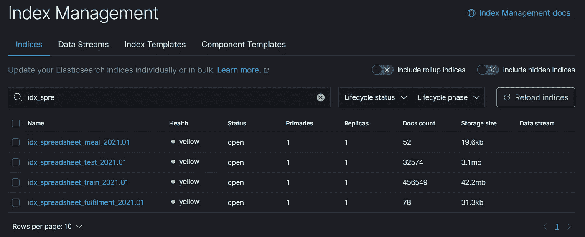

[图片由作者提供]

在 Kibana 中创建新的索引模式(管理> Kibana >索引模式)。为每个电子表格创建正确的索引是这个过程的一个重要部分。csv)并关联数据以构建分析视图。

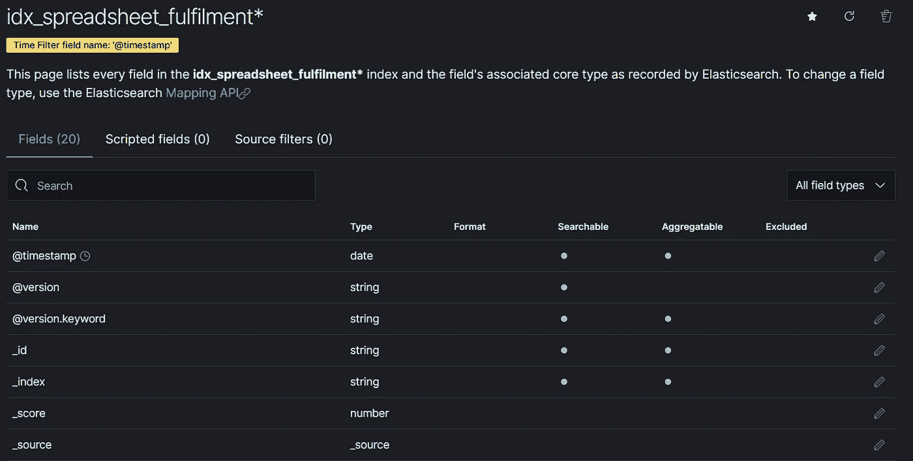

[图片由作者提供]

# 可视化数据！

一旦熟悉了获取的数据，现在就可以分析信息并创建可视化，从而为我们的业务提供可操作的见解，以及该视图如何帮助做出更好的决策。

在这个例子中，我创建了 4 个不同的视图:

1 —按订单频率分组的前 10 大销售类别。有了这个观点，就有可能分析哪些是最消耗的物品。

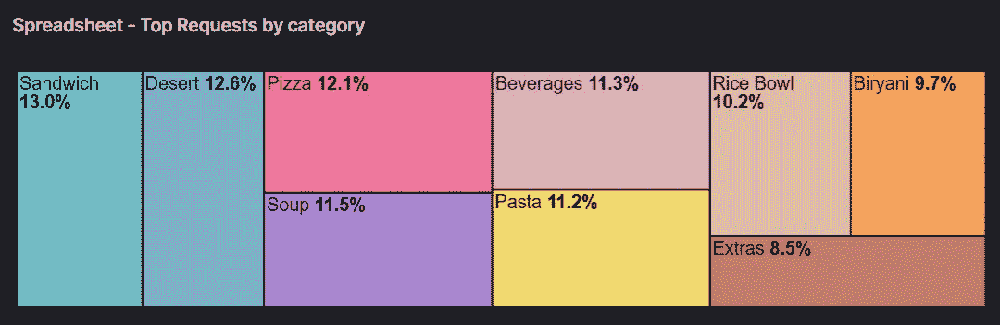

[图片由作者提供]

2 —按中心分组并按餐细分的销售额。该视图允许中心销售最多的物品的可视化。

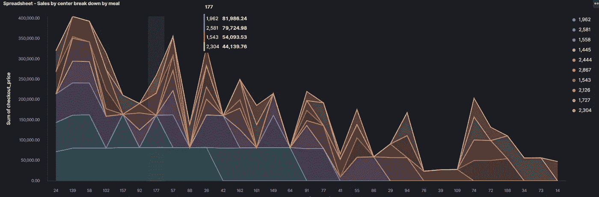

[图片由作者提供]

3-按促销分组并按订单细分的销售，允许分析促销是否确实吸引了客户以及销售最多的产品是什么。

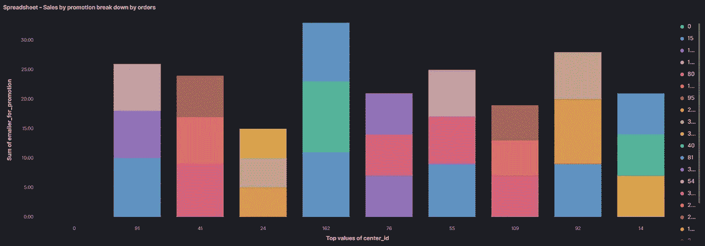

[图片由作者提供]

4-按周分组的订单可以直观显示哪一周的订单最多。

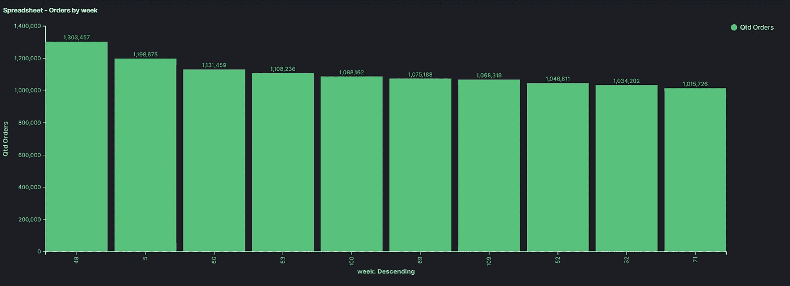

[图片由作者提供]

另一件有趣的事情是可以很容易地创建一个仪表板，提供你的业务或客户的动态视图，如下图所示；)

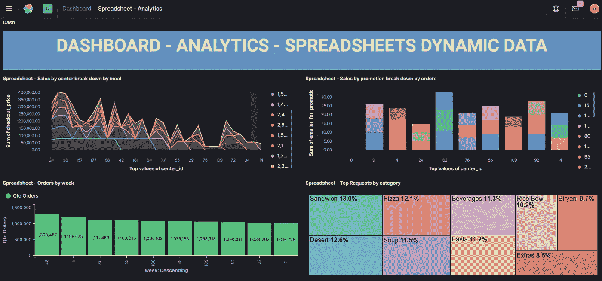

[图片由作者提供]

> 感谢阅读！

**结论**

电子表格可能包含大量有价值的信息，这些信息可能会丢失或损坏。处理此类文件的良好数据收集系统对于保证信息的完整性和高效检索至关重要。在这里，我们研究了一种实现这种数据收集过程的方法，使用 ELK 堆栈来接收和探索我们的数据。通过这种方式，我们可以使拥有许多遗留系统和电子表格的企业仍然能够发布正确的信息，但以一种更加动态的方式发布。

**参考文献**

```
[1] Elastic, Logstash. *Published online at elastic.co.* Retrieved from (2020): 
'[https://www.elastic.co/guide/en/logstash/current/logstash-7-9-2.html](https://www.elastic.co/guide/en/logstash/current/logstash-7-9-2.html)'[2] Saptarshi Ghosh, "Meal delivery company", Analytics Vidhya Genpact Hackathon. *Published online at Kaggle (2018).* Retrieved from:
'[https://www.kaggle.com/ghoshsaptarshi/av-genpact-hack-dec2018](https://www.kaggle.com/ghoshsaptarshi/av-genpact-hack-dec2018)'
```