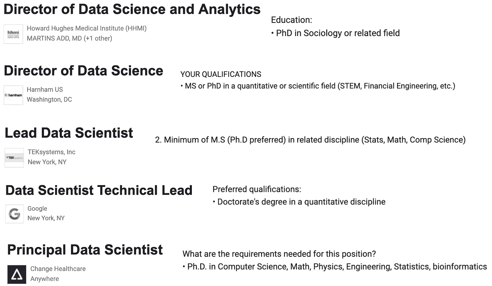

# 从学术界过渡到数据科学

> 原文：<https://towardsdatascience.com/transitioning-to-data-science-from-academia-93299602e4ba?source=collection_archive---------12----------------------->

## 如何利用需要的技能，忘记其他的

布雷特·乔丹在 [Unsplash](https://unsplash.com?utm_source=medium&utm_medium=referral) 上的照片

**“如果学术界不成功，我可以一直做数据科学。”**这是许多研究生和博士后经历的一个反复出现的想法，尤其是如果他们的工作涉及数据科学的核心要素[编程](https://mattsosna.com/DS-transition-3)和[统计](https://mattsosna.com/DS-transition-2)的热情服务。

数据科学可能是学术界的有益替代，而学术界人士*确实*拥有许多品质，使他们成为数据科学职位的有吸引力的候选人。然而，学者们的技能组合中也有*通常是*大漏洞，这可能会阻止他们立即被聘用。

这篇文章将概述从象牙塔跳到工业界所需的技能。我们将轻于技术细节或商业敏锐度；要深入了解这些技能，请查看我的五部分[如何进入数据科学系列](https://mattsosna.com/DS-transition-1)。

特别是如果你刚刚开始考虑将数据科学作为一项职业，我强烈建议你思考一下你的理想角色在 [**分析-工程谱**](https://mattsosna.com/DS-transition-1/#the-scalpel-versus-the-shovel) 中的位置，这将有助于你确定优先学习哪些技能。

迈克·范·登博斯在 [Unsplash](https://unsplash.com?utm_source=medium&utm_medium=referral) 上拍摄的照片

# **学术出类拔萃的地方**

成功的研究极具挑战性。获得博士学位(甚至更高)需要显著的精神和情感成长。如果你在独立研究的挑战中幸存下来，那么你无疑已经:

1.从大量信息中提取有趣问题的能力。回答这些问题的分析能力。对细节的极度关注。较强的计划和组织能力。克服失败(并从中吸取教训)的坚强意志

你在研究生院获得的许多技能都非常适合成为一名优秀的数据科学家。在这两种情况下，你都需要**批判性地思考**该问什么问题，如何获得数据，以及如何**从数据中提取有意义的见解**。

这两种职业都需要**与不同背景的利益相关者沟通和协调**。

最后，两人都被期望**不断学习**，并在还没有解决方案的时候创新解决方案。

很难夸大这些技能的价值。**许多高级或主管级别的数据科学职位*需要*博士学位**，因为学术研究需要严谨的态度来确定解决棘手问题的方法。以下是我在谷歌上搜索了五分钟后找到的几个高级职位，以及他们的预期教育水平。

随着该领域的成熟，这些要求可能会在几年后放松，但目前，拥有博士学位是你作为数据科学家职业发展的主要资产。

图片由 [Ishan @seefromthesky](https://unsplash.com/@seefromthesky?utm_source=medium&utm_medium=referral) 在 [Unsplash](https://unsplash.com?utm_source=medium&utm_medium=referral) 上拍摄

# **学者在哪里奋斗**

然而，上面这些诱人的工作，假设你*已经从研究生院中忘却了很多心态。虽然你在学术界获得的技能对数据科学来说非常有价值，但优先考虑的事情往往是有害的。这是我认为学术界在转换到学术界以外的角色时经常会遇到的困难。*

## 1.速度与精度的权衡

学术界优先考虑精确到小数点后第十位。毕竟，研究的目的是为了*揭开真相*不管需要多长时间。

但是考虑到他们有限的资源，100%的准确率对许多公司来说是不现实的。“足够好”可能是一个难以接受的概念，您的工作流程可能需要在有限的时间内尽可能快地转移到最大化准确性*。*

## ***2。实施分析结果***

*除非你的数据科学职位实际上仍然是学术界的(例如 [Mathematica](https://www.mathematica.org/) 、[布鲁金斯](https://www.brookings.edu/)、**)，否则仅仅*创造知识*是不够的。然后你需要说服利益相关者采纳你的结果，这需要一套完全不同的商业技能。如果你为一家科技公司工作，整合你的成果也需要另外一套完全独立的软件工程技能。***

*这些技能差距可能会悄悄出现在你面前，而且非常明显——平庸的预测模型和卓越的预测模型之间的差异需要训练有素的眼睛，但任何人都可以看出，在你说你的模型对用户可用几周后，它就不可用了。*

## ***3。聚焦团队超越自我***

*当你离开学术界时，你从最大化你个人的产出过渡到最大化你团队的产出。是的，在学术界，你为你的合作者和学生的成功投入了巨大的努力。但是你的名字仍然出现在你合著的任何报纸、海报或研讨会上。*

*在学术界之外，你变得更加默默无闻。你的名字与工作脱节，公司以外的任何人都看不到你的贡献，这可能会令人沮丧。(很可能内部的许多人也看不见！)*

*同样，从学术工作的极端独立性过渡到与同事一起在*字面上相同的代码库*上工作，并且需要遵守[编程最佳实践](https://mattsosna.com/DS-transition-4/#object-oriented-programming)和[产品管理](https://www.atlassian.com/agile/product-management)，而不仅仅是那些在研究生院对你个人有用的东西，也是一个挑战。*

## ***4。做你不想做的事情***

*学术界无拘无束的自由，尤其是对美国项目而言，意味着你可以自由探索你最感兴趣的问题。如果你能为你的想法获得资金，没有人能阻止你规划自己的知识道路。*

*与此同时，在工业界，你的双手被牢牢地束缚在你的组织认定值得追求的问题上。当然，你对此有些发言权，但是如果你的老板坚决反对另一个线性回归，那就是你正在做的。*

*这些问题需要时间来克服。也许你可以很容易地关掉“100%准确”的心态，但要学会软件工程技能，比如 [Git](https://mattsosna.com/DS-transition-4/#version-control) 、 [SQL](https://mattsosna.com/DS-transition-4/#sql) 和[使用 API](https://mattsosna.com/DS-transition-4/#interacting-with-apis)，就需要花费不止几个下午的时间。*

*当你申请工作的时候，拥有令人印象深刻的博士学位，同时又被刚毕业的计算机科学或新兵训练营的毕业生击败，这可能会让人迷失方向。下一节将重点介绍如何平稳过渡到新角色。*

**

*照片由 [Jerry Zhang](https://unsplash.com/@z734923105?utm_source=medium&utm_medium=referral) 在 [Unsplash](https://unsplash.com?utm_source=medium&utm_medium=referral)*

# ***过渡提示***

## ***心态***

*当你进入就业市场时，把自己想象成 ***向雇主推销自己的劳动力*** **是很有用的。**你有什么要卖的？*

*在你读博士期间，你很可能在执行*特定类型的分析*和*特定类型的数据*方面发展了专家级的技能。例如，也许你真的很擅长在天文无线电波中寻找模式。但是谁愿意为这种技能买单呢？而且，即使美国国家航空航天局*正在招人，你觉得继续做你刚刚做了五年的同样的工作怎么样？**

*如果你热爱你的研究，想继续下去，并且有非学术雇主愿意为此付费，那么你已经完全胜任你在学术界之外的第一个角色。恭喜你。但对于我们其他人来说，要成为有竞争力的申请人，还有很多工作要做。*

*不管你在[分析工程领域](https://mattsosna.com/DS-transition-1/#the-scalpel-versus-the-shovel)，**的目标是什么，你如何看待自己作为一名程序员的转变**是你在行业中取得成功所必需的:*

*   *你可能在想什么:“我可以写任何我想写的东西。”*
*   ***什么行业要:**“任何人问我什么，我都能编码。”*

*当你可以灵活地选择你所追求的研究问题，以及如何回答这些问题时，你很容易被自己熟悉的问题和方法所吸引。在某种程度上，博士学位就是要在有限的技能范围内获得真正优秀的技能:你选择一个非常精确的问题来回答，然后努力工作，直到你比世界上任何人都更了解这个知识领域。*

***当你是一名数据科学家时，你不会拥有狭隘的技能组合，** *尤其是*如果你在一家较小的公司。软件工程中有一个术语叫做[“全栈”](https://www.w3schools.com/whatis/whatis_fullstack.asp)——它指的是能够在[前端和后端环境](https://en.wikipedia.org/wiki/Front_end_and_back_end)中进行专业编码的程序员，这两种环境需要完全不同的语言和视角。*

*数据科学就像是一个全栈分析师:你需要在从数据中提取见解的*和构建基础设施以传达这些见解的*之间自如地转换*(比如仪表板和自动化脚本)。**

*在我读博士期间，我发现呆在我已经非常熟悉的 R 和统计学领域非常容易。**我不想离开我的舒适区，因为这需要我面对一个可怕的概念，那就是我*并没有*真正掌握统计和编码。我觉得既然我在论文中使用了 R 和 stats，其他人就认为我是专家。因此，接受正式的统计或 R 职业会违背这些期望，暴露出我不是专家。***

*具有讽刺意味的是，所有这些恐惧阻止了我对 R 和 stats 有一个坚实的、全面的理解。我也怀疑是否有人在乎我知道多少。*

*不要犯和我一样的错误——接受不知道所有的事情，并开始填补知识空白。你需要广泛的技能才能成为一名高效的数据科学家，这些技能需要保持和提高。我推荐在 [Kaggle](https://www.kaggle.com/) 、 [HackerRank](https://www.hackerrank.com/dashboard) 和 [Reddit](https://www.reddit.com/r/dailyprogrammer/) 上查看数据集和挑战。*

*确保**完成一些项目**,而不仅仅是在网上课堂上做笔记——这会让你对这个主题有更深的理解，之后你会有东西给潜在的雇主看。*

**

*由[伊恩·杜利](https://unsplash.com/@sadswim?utm_source=medium&utm_medium=referral)在 [Unsplash](https://unsplash.com?utm_source=medium&utm_medium=referral) 上拍摄*

## ***目标***

*除非你真的不在乎离开学术界后在哪里工作，否则你可能会试图同时完成两个转变:1)进入数据科学，2)进入一个新的领域。*

*我的建议是*首先*过渡到数据科学，在专业环境中积累一些技能，在那里你可以向你的同行学习，*然后*过渡到你喜欢的领域。即使有博士学位，找到第一份工作也很难，所以广撒网吧！*

*理想情况下，尝试在一家拥有数据科学家、分析师和工程师团队的公司着陆，在那里你可以从你周围的每个人那里吸取知识。如果你最终想要工作的领域不一定有几十个数据科学家和工程师可供你学习，这一点尤为重要。*

*一旦你在第一个角色上投入了时间，并准备好进行第二次转变，就开始真正地思考你在寻找什么。对我来说，我想以某种方式为抗击气候变化做出贡献，但除了拥有生物学位之外，我没有这方面的经验。*

*一旦我开始找工作，我意识到我需要更加具体。我想在非营利组织或智囊团工作吗？政府呢——如果是的话，是市政府、州政府还是联邦政府？我是想加入一家可持续发展公司，一家大公司的可持续发展部门，还是一家可持续发展咨询公司？甚至在可持续发展中，这是指电动汽车、可再生能源、电池、航空、重工业、建筑改造、减少废物，还是其他？*

*你自己的搜索不需要这些问题的确切答案，但仔细思考将有助于缩小你要寻找的范围。对我来说，我意识到我想在可持续发展技术上磨练，所以我不再看智库、非营利组织和政府职位。*

## ***申请***

*从简历中删掉你的出版物。*

*是的，你需要剪掉它们。这是转变过程中最痛苦的部分之一。学术界的核心货币在象牙塔之外没有什么价值，除非你申请加入某个智库的博士团队。否则，添加一个链接到你的谷歌学术个人资料，点击保存，然后去散步，吃点冰淇淋。*

*虽然删减出版物是痛苦的，但只要稍加努力，你就可以填写一个雇主会觉得更有趣的*项目*部分。不管是好是坏，写代码是你随时随地都可以做的事情…包括你正常工作之外的事情。[期望在简历中加入编码副业是有争议和问题的](https://softwareengineering.stackexchange.com/questions/48698/i-dont-program-in-my-spare-time-does-that-make-me-a-bad-developer)，但我认为当你试图进入这个领域时，额外的努力是值得的。*

*如果你有时间用一些简单项目的例子来创建一个 GitHub repo，你可以用具体的例子来说明你的代码是什么样的，以及你是如何解决问题的，这样可以大大增强你的简历。把招聘经理想象成决定是否雇佣艺术家的人——知道艺术家的作品是什么样子是很好的，不是吗？*

*最后，当你递交申请时，*总是*附上一份量身定制的求职信，解释你为什么想在这家公司工作，为什么你会是一个很好的人选，以及你在之前的职位中做出的最大贡献。我没有什么可以补充的，因为其他地方已经广泛涉及了；看看[这封求职信的例子](https://resumegenius.com/cover-letter-examples/data-scientist-cover-letter-sample)和[这些简历技巧](https://www.dataquest.io/blog/how-data-science-resume-cv/)。不要用花哨的简历生成器——Google Doc 的免费单页模板很棒。*

**

*Alessandro Erbetta 在 [Unsplash](https://unsplash.com?utm_source=medium&utm_medium=referral) 上拍摄的照片*

# *结论*

*当你考虑离开学术界时，会有很多矛盾的感觉。我喜欢它的理想主义——把热情、敏锐的人聚集在一起，共同解决世界上没有人知道答案的问题。每周给学生上课是一种特权。很难想象有人会付钱让我去参加会议和激动人心的实地考察——我有幸去过非洲两次，还差点去了南极洲。*

*但是在学术界成功的职业生涯需要大量的奉献:这就像成为一名运动员。你需要真正专注于你的主题，愿意多年来思考同样的难题，不断向资助者证明你的工作，并阅读你遇到的所有相关文献。*

*即使有着稳定的出版记录，除非你是所在领域的顶尖人物，否则你需要愿意每隔几年就搬到一个你无法提前预测的地方。*

*尽管这是一个由整天思考的人组成的领域，但在如何审查手稿、如何评估科学贡献以获得终身职位以及如何解决系统性不平等等问题上，存在大量的制度惯性。*

*学术界对一些人来说是一个令人惊叹的职业，但对我来说，我慢慢意识到数据科学是我一直在寻找的。*

*即使知道这一切，转变也是艰难的。改变你的身份会让你变得脆弱，当你开始一份新的职业时，你很难不感到尴尬或沮丧。*

*申请工作几个月后的一天，我在同一天被两个公司拒绝，一个是分析部门，另一个是工程部门，两个部门都是由博士组成的团队。公平地说，一个团队是经济学家博士，另一个是计算机科学家博士(我的学位是生物学)，但即使在我的“同龄人”中，被拒绝也很难。*

*我在研究生院花了那么多时间成为一个全面的实验主义者和理论家，一个可以建立一个实验室鱼类研究系统，进行实验，提取数据，分析数据，并进行交流的人，但是我得到的反馈是这些都不重要。我要么不知道足够多的高级统计，要么我不知道足够多的工程，要么根本没有给我一个理由。*

*尽管令人沮丧，但坚持申请，坚持学习。我写了[“如何进入数据科学”](https://mattsosna.com/DS-transition-1)系列，部分是因为我记得当我进入这个领域时，我发现自己有多难确定自己实际需要什么技能。但你也不必独自经历转变。有几个专门针对希望进入行业的博士的编程训练营，如 [**洞察奖学金**](https://insightfellows.com/data-science) 和 [**数据孵化器**](https://www.thedataincubator.com/fellowship.html) 。虽然你无疑有自学所需技能的纪律，但让专业人士帮助你可能更有效率。*

*如果你想聊天，请不要犹豫。祝你好运！*

*最好，
马特*