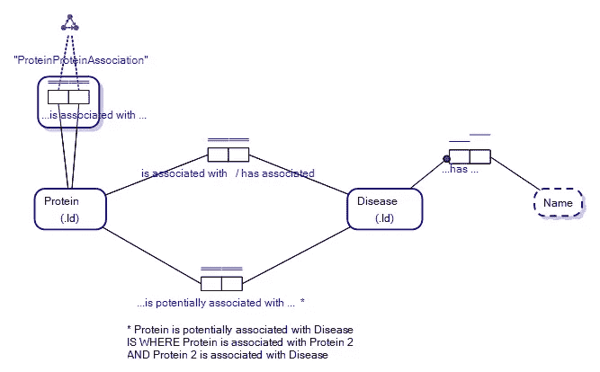
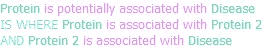
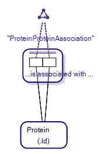
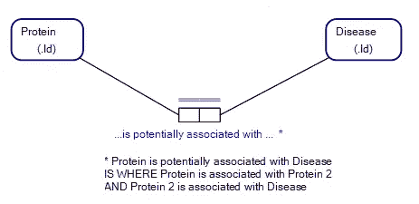
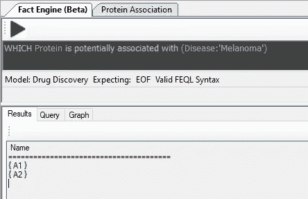
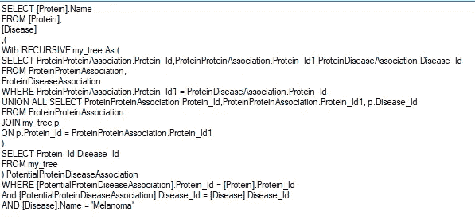

# 对象-角色建模中的传递关系和规则

> 原文：<https://towardsdatascience.com/transitive-relationships-and-rules-in-object-role-modeling-906a3cde1702?source=collection_archive---------27----------------------->

## 生物信息学和基于规则的知识表示

具有传递环约束和派生事实类型/规则的对象-角色模型。图片作者。

上图显示了在对象-角色模型(ORM)中表达的传递关系，以及在*派生的事实类型*中表达的规则。

## 传递关系

在一些数据科学练习中，需要传递关系。对象-角色建模中的传递关系由下面的符号表示:

对象-角色建模中的传递关系符号。图片作者。

在我们的模型中，用于[生物信息学](https://en.wikipedia.org/wiki/Bioinformatics)数据库，蛋白质与其他蛋白质相关联，并且这种关联可以通过一种蛋白质与另一种蛋白质的关联来实现，等等。

例如，我们可能有两个名为 A1 和 A2 的假设蛋白质，其中 A1 与第三个蛋白质 DDX3X 相关联，因为 A1 与 A2 相关联，而 A2 与 DDX3X 相关联。

A1 -> A2 -> DDX3X

DDX3X 是一种现实生活中与黑色素瘤相关的蛋白质。我们的传递关系可能意味着蛋白质 A1 可能与黑色素瘤相关，生物信息学家利用这一信息来决定在药物发现中靶向哪些蛋白质。

## 生物信息学、药物发现和基于规则的数据库查询

我们的模型代表了药物发现和生物信息学更大模型的一部分。本质上，该模型显示了蛋白质之间的关系，以及蛋白质的表达可能与可能与特定疾病的表现相关的其他蛋白质的表达相关。反之亦然，其中疾病的存在可以通过各种蛋白质的相对表达来检测。

顾名思义，生物信息学是生物学和信息学专业的结合，其特点是从业者使用他们能够找到或开发的任何信息技术工具。信息技术在生物信息学中被广泛使用，因为，例如，在人体中有成千上万的蛋白质。有数千种药物，人类 DNA 中有数百万个碱基对，等等。所处理的信息是巨大的，超出了用笔和纸或纯粹在人类头脑中处理的范围。

在这种情况下，生物信息学家求助于使用数据库来存储他们需要处理的所有信息，以帮助发现用于疾病管理的候选药物。

直到最近，一直缺少的是数据库工具，它使生物信息学家在数据库中查询大量数据变得容易。数据库擅长存储数据之间的关系，但直到最近，为数据添加规则的工具还很有限。

例如，生物信息学家不仅想知道蛋白质与疾病相关，还想知道哪些其他蛋白质可能由于它们与第一种蛋白质的关联而与该疾病相关，对于传递相关的蛋白质也是如此。

理想情况下，您希望能够针对生物信息学数据库编写查询，例如:

基于自然语言、对象-角色建模的查询。图片作者。

这样的查询将包含我们的模型中表达的规则:

对象-角色建模中的派生事实类型规则。图片作者。

这种类型的规则将考虑传递关系，例如，蛋白质 A1 与蛋白质 A2 相关联，并且与蛋白质 DDX3X 传递相关，使得查询将通过它们与 DDX3X 的关联/传递关联，返回 A1 和 A2 作为与黑色素瘤疾病的存在相关的候选蛋白质。

## 生物信息学工具

众所周知，生物信息学研究的工具是一个软件大杂烩，因为许多研究是前沿的，所以当实际编写他们需要完成工作的软件时，许多从业者只能靠自己的设备。

例如， [R 语言](https://en.wikipedia.org/wiki/R_(programming_language))被生物信息学家广泛用于该行业的统计和图表绘制要求，从事生物信息学的生物学家需要像理解遗传学和基因组学一样精通信息技术、数据科学和软件代码切割。

这是一个艰难的问题，因为遗传学和基因组学本身就是复杂的研究领域，更不用说精通信息技术了。

因此，生物信息学家在他们能找到的任何地方寻找使他们的生活变得容易的软件工具。这使得他们可以更快地完成工作，并为生物学的核心能力节省宝贵的大脑空间。

## 输入知识图表、知识表示和图表查询

如果你是一名致力于识别疾病标记物的生物信息学家，并且你想写一个关于数据库的查询，该数据库将提供关于哪些表达的蛋白质可能与特定疾病相关联的见解，那么你的问题是，在特定蛋白质的表达和可能并行存在于受试者体内的疾病之间可能存在传递关系。

如何在数据库中表达这种传递关系？
你必须在 数据库或者 ***知识图查询引擎*** 你的数据库中表达那种关系 ***？***

一旦表达了传递关系，生物信息学家还需要警惕在搜索潜在生物标志物的任何此类链接链时可能出现的[组合爆炸](https://en.wikipedia.org/wiki/Combinatorial_explosion)，但拥有容易搜索它们的工具远比没有任何工具好得多。

[数据库的知识图形](https://en.wikipedia.org/wiki/Knowledge_graph)表示和图形查询语言有助于管理数据库的概念化，这样生物信息学家可以通过隐藏底层数据库的复杂性，专注于*他们需要检索什么信息，而较少关注*如何访问该数据。**

**例如，一个生物信息学家可能喜欢在一个知识图上写一个查询，如下所示:**

****

**示例知识图查询，事实引擎。图片作者。**

**由于对象-角色建模语法中丰富的语义，在使用对象-角色建模时，这样的查询是可能的。**

**我的所有研究都指向这些类型的查询可以在现有数据库上运行，而不必购买或构建专门的知识图。**

## **在数据库中输入对象角色建模和知识表示**

**如果我们回顾一下本文开头的对象-角色模型，下面的符号是一个传递关系:**

****

**对象-角色建模中的传递关系。图片作者。**

**我们描述的规则是作为派生的事实类型建立的，如下所示。派生事实类型是数据不存储在数据库中，而是在数据库查询运行时派生的事实类型。它们被指定为由星号表示的衍生规则，该星号表示规则是相关联的:**

****

**对象角色建模中的派生事实类型。图片作者。**

**使用 FactEngine (www.factengine.ai)等知识图工具，您只需在模型中绘制图表，该模型[位于您的数据库](/the-factengine-architecture-6d90ac09b8b8)之上，然后用自然语言编写所需的查询，返回所需的结果:**

****

**自然语言查询。图片作者。**

**这样的查询使用我们定义的规则，该规则反过来使用蛋白质之间的传递关系来返回期望的结果。**

**你不一定需要一个专门的知识图数据库来完成这类事情，也不一定需要一个过于复杂的查询语言，你所需要做的只是在你现有的数据库上用一种自然的查询语言使用一个以对象角色建模编写的知识表示层。这就是我的研究工作，我发现相关的数据科学令人着迷。这个想法是通过隐藏复杂性使生活变得简单。**

**例如，如果您的数据库是一个关系数据库，在我们的第一个示例中，将要求数据库具有递归查询，因为这样一个查询的结果结构化查询语言(SQL)将如下所示:**

****

**对应于自然语言查询的 SQL。图片作者。**

**这种类型的 SQL 就是为什么生物信息学家在寻找让他们生活更轻松的工具。SQL 中的递归查询编写起来很复杂，而且要记住如何编写。**

**因此，世界正在转向隐藏底层数据库和数据库原生查询语言的复杂性，并提供简单的基于图形的查询语言和基于规则的知识表示的工具，以使像生物信息学家这样的人的生活更容易。**

## **为什么？为什么人们需要一个灵活的基于规则的数据库层？**

**人们需要在他们的数据库上建立基于规则的知识表示层的原因是，对于从业者想要在他们的数据库上操作的特定查询集，现成的软件应用程序可能不存在。构建应用程序非常耗时，而且一旦构建完成，它们通常是不灵活的，并且不能针对需要编写以满足某个偶然需求的特定查询进行更改。**

**对象-角色建模是一种丰富而富有表现力的概念建模语言，它允许创建基于规则的信息处理工具，这也是我个人使用它的原因。不管您使用什么对象-角色建模工具来建模您的数据，对象-角色建模使得概念化和定义您想要用您的数据库实现什么变得更加容易。**

**十多年来，派生事实类型背后的科学一直是对象角色建模的一部分[1]，派生事实类型是 FactEngine 中的 beta 版。**

**感谢您的阅读，如果时间允许，我会写更多关于派生事实类型、自然语言查询、对象角色建模的各种基于规则的约束和知识图的内容。**

1.  **Curland M .，Halpin T .，Stirewalt K，“ORM 的角色演算”，OTM 2009:走向有意义的互联网系统:OTM 2009 研讨会，施普林格，第 692–703 页**

**— — — — — — — — — — — — — — — — — — — — — — — — — — -**