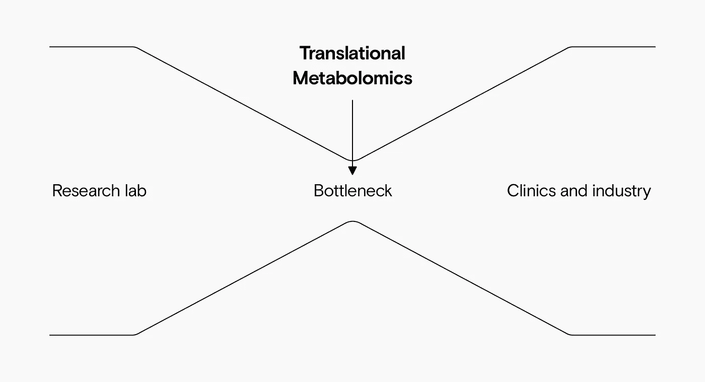

# 转化代谢组学:将研究“转化”为现实产品的挑战

> 原文：<https://towardsdatascience.com/translational-metabolomics-the-challenges-of-translating-research-into-real-world-products-31d4ef112919?source=collection_archive---------37----------------------->

## 转化代谢组学在研究和工业之间架起了一座桥梁，将科学突破“转化”为现实世界的产品

来源:作者

本文基于对 Farhana Pinu 的采访，以及 Pinu、Goldansaz 和 Jaine 在代谢物杂志上发表的“[转化代谢组学:当前的挑战和未来的机遇](https://www.mdpi.com/2218-1989/9/6/108)”。

**代谢组学**目前是一个热门的研究领域，有望对生物体有更深入的了解，并提供更好、更个性化的诊断和治疗。

研究人员每年都在取得很大进展，但迄今为止，只有少数代谢组学应用一直到临床。

Farhana 和她的同事们收集了更多的研究如何能够导致成功的临床和工业产品的建议。这就是转化代谢组学的科学:“将”科学发现转化为日常产品。

转化代谢组学，研究实验室和现实世界之间的瓶颈。来源:作者

# 调整学术和行业目标

为了理解为什么将研究突破转化为现实世界的产品具有挑战性，我们需要理解科学和工业之间的根本区别。科学和工业有非常不同的目标。

*   **发现**推动科学:目标是理解事物如何工作。
*   **产品**驱动产业:目标是将研究打包成易于使用、高效且有利可图的工具。

由于这些不同的目标，科学和工业经常在不同的时间框架内工作。科学家可能会在同一个问题上花费数年或数十年的时间，而临床应用的时间范围从几个月到几年不等。

转化代谢组学旨在**协调**这些目标，并且已经取得了一些重大成功。最受欢迎、最有可能盈利的领域是:

*   **产前检查**评估未出生婴儿感染疾病的风险；
*   **遗传性癌症检测**发现患者是否有患某些癌症的较高风险；和
*   **个性化医疗**除了患者的病情之外，根据众多因素量身定制治疗方案。

这些领域现有的现实世界的成功使更多的成功成为可能，但这并不意味着它是容易的。

# 转化代谢组学面临的挑战

转化代谢组学的前景是明确的，但仍有许多障碍。以下是主要的挑战及其潜在的解决方案。

# 挑战#1:翻译过程可能在多个阶段失败

一个实验要想成功并创造具体的价值，它需要:

*   🧪稳健实验设计:
*   🚚声音数据采集；
*   📊易于使用的数据挖掘；
*   🤓深度解读；和
*   ✅成功验证候选生物标志物。

这些步骤中的任何一个失败都会导致整个项目的失败，因此质量保证在每个阶段都是至关重要的。

# 解决方案 1:严格的流程和用户友好的工具

更严格的程序将有助于确保实验的有效性和可靠性。这包括:

*   使用国际指导:如果研究人员更紧密地遵循专业和监管机构的指导方针，研究可以在全球范围内共享，并取得更大的成功。对科学家来说，大量的文献似乎势不可挡，但应用研究的突破最终会有回报。
*   **开发用户友好的工具:**如果科学家能够访问用户友好的开源软件和数据库，特别是基于网络的数据分析，他们会发现全球合作更加高效和可靠。

更好的过程和工具将有助于确保结果足够可靠，可以被其他研究人员复制。

# 🤔挑战#2:负面看法

代谢组学仍然是一个小众领域，而不是家喻户晓。与其他组学领域一样，它有时被视为“炒作”，一个承诺过多而交付不足的领域。

代谢组学雄心勃勃，并做出了重大承诺。随着时间的推移，它应该会给我们提供治愈糖尿病、癌症和许多其他疾病的线索。即时诊断和各种医疗工具也意味着改善我们的生活。但到目前为止，改变世界的工具还没有实现。

代谢组学**已经**成功了。但是重大的胜利却鲜有宣传，因为它们更加小众和本地化:这个领域需要更好的公关。

# 解决方案 2:研究人员的宣传和参与

Farhana Pinu 指出，科学家并不总是宣传代谢组学的巨大成功。他们需要通过社交媒体和其他渠道进行更多的宣传。

突出结果的需要在其他组学领域也很常见。但代谢组学是一个不太成熟的组学领域，在某些方面正在“迎头赶上”。该领域产生的大量数据，加上它的许多目标，意味着它的成功可能会被埋没。

代谢组学社区需要承认感知问题，并积极宣传其影响。

# 🤑挑战#3:代谢组学是一个昂贵的游戏

研究人员使用昂贵的分析软件和平台，这些软件和平台似乎过于复杂。建立一个完整的代谢组学实验室需要数百万美元。仅液相色谱-质谱平台就要花费近百万美元。

为了省钱，实验室经常使用小样本，这会影响结果。

# 解决方案#3:更便宜、小型化的设备

任何对代谢物测量感兴趣的人都应该能够进行研究。但是没有更便宜的实验室设备，只有少数几个人能得到他们需要的设备。

开发更便宜、更易获得的小型化仪器将会为其他研究人员带来倍增效应。生产硬件和软件的厂商需要合作来实现这一目标。

# 🧑‍🔬挑战 4:多学科专业知识

在其他学科中，研究团队一般由同一领域的专家组成。但是对于转化代谢组学，团队需要生物学家、分析化学家、统计学家、数据科学家和生物信息学家。

专业知识的多样性意味着代谢组学团队规模更大，更难协调。这使得这些团队更加昂贵，效率更低，这增加了建立多学科团队的挑战。

# 解决方案 4:多学科合作和跨学科培训

随着时间的推移，学术领域越来越专业化。为了转化代谢组学的成功，我们需要鼓励两者，

*   专家之间更好的合作；和
*   提高技能和培训多学科专家。

在生物学和数据科学方面经验丰富的研究人员通常比代表这两个领域但在不了解彼此专业知识的情况下一起工作的两个专家更快地获得结果。但是一个人越来越难对代谢组学这样一个广泛的领域有足够的了解。

为了更好地合作，我们需要更多的空间让专家合作。论坛和研讨会可以促进不同领域之间以及学术、工业和管理机构之间的交流。

对于**多学科专家来说，**我们需要专门的培训项目来教授个人代谢组学所需的独特的跨学科技能。

# 📊挑战 5:准确获取数据

即使有昂贵的设备，也没有通用的提取所有代谢物的方法。许多代谢物是不稳定的，除了其他因素外，即使储存在-80 度，也会因光、热和氧化而降解。

有些代谢物浓度高，有些浓度低。这些都需要不同的专门协议和设备来精确测量。

获取单个生物实体的完整代谢组仍然具有挑战性、昂贵且耗时。

# 解决方案 5:更好的设备和分析平台

设备和分析软件通常难以使用。我们需要更好的硬件和软件来准确地获取和分析数据。

一旦研究人员确保他们拥有高质量的数据，他们还需要更容易的方法在全球范围内以及在不同的组学领域之间共享这些数据。

更好的数据分析和数据共享平台将极大地帮助转化工作。

# 🔢挑战#6:代谢组学中的绝对定量

研究人员通常专注于“半定量”数据。也就是说，他们的研究在他们自己的实验室和设备上是结论性的，但是硬数字是由他们特定的设置和设备产生的。

例如，研究人员可能会发现一种可以识别疾病的代谢物。然后，他们可以通过观察这种代谢物的数量来成功区分健康和患病的患者。

但这是一个相对的衡量标准，并没有按照全球标准进行校准。世界另一端的医生不能将这些结果用于他们自己的病人，因为没有病人与健康人相比有多少代谢物的绝对阈值。

# 解决方案 6:更好的校准方法和全球数据共享

使用**绝对量化**更具挑战性，但也更有价值。这包括使用仔细校准的机器来确定特定代谢物的准确数量，这些数量可以被世界各地的其他实验室复制。

无论是在设备校准还是质量保证方面，这项工作的成本都很高。但是全球共享成果所获得的价值远远超过了补偿。

代谢组学标准倡议(MSI)在全球范围内监测和审查数据和标准，研究人员需要尽可能遵循这些标准，以便更容易地将实验转化为临床应用。

# 💅挑战 7:研究人员被“魅力”话题所吸引

每个人都想“治愈癌症”或“治愈糖尿病”。这些都是雄心勃勃的大项目，可能不会很快转化为真正的产品。从行业角度来看，大多数问题都是不可行的:不太可能在合理的时间框架内解决，也不太可能盈利。

更小、更本地化的问题往往更实际、更有利可图。但它们吸引的媒体关注要少得多，因此对资助者和研究人员也不那么有吸引力。

虽然雄心勃勃的研究很重要，但更重要的是解决临床上面临的具体、有效的问题。

# 解决方案 7:简单而具体的结果

研究人员应该与行业合作，以确保实验有适当的范围和背景。这意味着实验应该是:

*   在合理的时间框架内可以实现；和
*   针对适当规模(即使是利基)的需求。

如果处于假设阶段的研究人员专注于可以转化为现实世界应用的结果(例如，便携式设备)，他们的结果更有可能被行业所用。

# 🛠️挑战#8:终端用户设备不足

我们知道研究设备需要更小更便宜。我们还需要为医生等最终用户提供先进的设备。

一些遵循翻译研究的最终用户产品可能很难使用或需要大量时间。结果可能很难理解或者需要专门的分析，导致采用率很低。

# 解决方案 8:易于使用的设备

正如实验室设备一样，我们也需要简单的终端用户设备。设备应该:

*   要好用；
*   要便携；
*   产生快速的结果；
*   产生易于解释的结果；
*   不贵；和
*   被批准使用。

这些优先事项通常超出了学术和科学研究的范围，但转化代谢组学需要从一开始就考虑它们。

# 你有代谢组学研究要翻译吗？

我们的团队在使用机器学习将代谢组学研究转化为现实世界的解决方案方面拥有丰富的经验。如果您正在研究代谢组学相关的问题，[我们希望听到您的意见](https://www.datarevenue.com/en-contact)。