# 赫尔辛基使用 accessviz-mapper 工具绘制旅行时间(可达性)地图

> 原文：<https://towardsdatascience.com/travel-time-accessibility-maps-with-the-accessviz-mapper-tool-in-helsinki-7be23eadd4b0?source=collection_archive---------48----------------------->

## 如何在赫尔辛基地区使用出行时间矩阵 2018 创建可达性地图

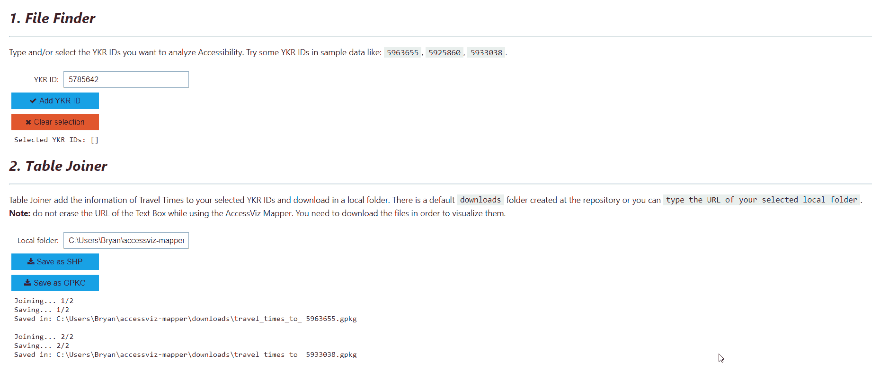

图片由作者提供。Accessviz-mapper 工具。

赫尔辛基是欧洲众所周知的可持续发展和智能城市。赫尔辛基地区的交通通过不同的交通方式(汽车、自行车、公共交通)为长距离和短距离提供良好的可达性。让我们说，根据旅行时间，火车使遥远的社区“靠近”市中心。同样，对于短途旅行，赫尔辛基有足够的自行车道网络，使得在当地通勤更加方便快捷。自行车共享系统(赫尔辛基城市自行车)和公共电动滑板车(Voi，Tier，Lime)帮助市民在日常本地移动中实现可持续通勤。

赫尔辛基的可达性和流动性得到了很好的研究，并准备用于改善城市规划。可达性通过通勤者的出行时间进行研究，出行时间基于不同交通方式的门到门方法。行驶时间/距离存储在 250x250 m 的网格单元中，该单元包含赫尔辛基地区的路线信息。最后公布的网格是**赫尔辛基地区旅行时间矩阵 2018** 。

负责 [**HR 旅行时间矩阵 2018**](https://blogs.helsinki.fi/accessibility/helsinki-region-travel-time-matrix/)**的地球科学家创建者是赫尔辛基大学 [***可达性研究组***](https://blogs.helsinki.fi/accessibility/helsinki-region-travel-time-matrix/) 的一部分，该研究组面向赫尔辛基大学 [***数字地理实验室***](https://www2.helsinki.fi/en/researchgroups/digital-geography-lab) 。 [***行程时间矩阵***](https://docs.google.com/presentation/d/e/2PACX-1vSG5JbJ5dmomksPLCa6xYwdjAooKjkaMLizj8rvfE0YkZg8McKOjKx20XbXotihOQT7tXvOH27RKkwe/pub?start=false&loop=false&delayms=3000&slide=id.p5)*的描述恰当地解释了门到门方法，并显示了由 Toivonen 等人(2014) [2]创建的科学出版物。此外，您可以在研究小组页面上找到一个部分，其中包含所有使用了旅行时间矩阵的更新出版物[。](https://blogs.helsinki.fi/accessibility/publications/)***

***可达性地图表示通勤者通过不同的交通方式从一个特定地点到达另一个地点的距离或时间。HR 行程时间矩阵可以显示从 YKR ID 为 *YKR ID 为*的特定网格到位于赫尔辛基地区的另一个网格的可达性。***

***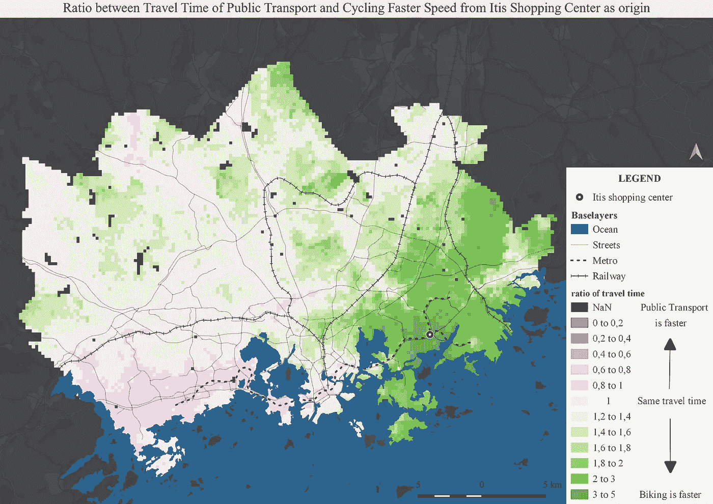***

***图片由作者提供。可达性地图示例显示，与公共交通相比，在当地骑自行车更有效。***

> ***为了使**可达性映射**对 HR 出行时间矩阵用户友好，创建了 **accessviz-mapper 工具**。***

***在这篇短篇故事/教程中，我将展示如何使用 accessviz-mapper 工具创建可访问性地图，您可以在本地计算机上运行该工具。accessviz-mapper 工具与 [***一起部署在本地，瞧***](https://voila.readthedocs.io/en/stable/index.html) ，您可以在下面解释的 5 个阶段中使用它。但是首先，事先检查一些步骤。***

> ***检查 accessviz-mapper 工具 的 [***Repo。***](https://github.com/DigitalGeographyLab/accessviz-mapper-dgl)***

***主要的第一步是在本地磁盘中克隆存储库。如果您的计算机上有 [Anaconda](https://www.anaconda.com/) ，只需在命令窗口中找到您想要的目录，并写下:
`git clone [https://github.com/DigitalGeographyLab/accessviz-mapper-dgl.git](https://github.com/DigitalGeographyLab/accessviz-mapper-dgl.git)`***

***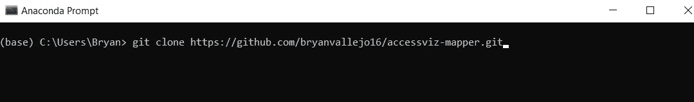***

***图片由作者提供。在本地磁盘中克隆 accessviz-mapper***

***然后，在命令行中进入克隆的存储库。确保已经安装了自述文件中指定的所有需要的 python 包: *voila、ipywidgets、folium、pyproj、geopandas、matplotlib、glob、os、NumPy、contextily、mapclassify、osmnx、networkx、shapely* 。
您可以将它们直接安装在基础环境中，但在我的情况下，我将它们全部安装在我的名为 gis 的个人环境中。找到关于[如何创建环境](https://uoa-eresearch.github.io/eresearch-cookbook/recipe/2014/11/20/conda/)的说明。***

******

***图片由作者提供。指定工具库的适当环境和目录***

***最后，运行行`voila accessviz-mapper.ipynb`，一个本地服务器将打开该工具。***

***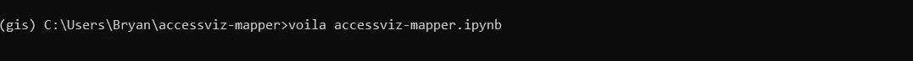***

***图片由作者提供。在本地部署 accessviz-mapper***

## *****地图创建*****

***accessviz-mapper 工具包含一些网格的行驶时间信息作为演示数据。在这个例子中，我们将使用`5963655` 和`5933038` 。如果您想在 accessviz-mapper 工具中添加所有网格的数据，请下载整个数据集 [HR Travel Time Matrix 2018](https://blogs.helsinki.fi/accessibility/helsinki-region-travel-time-matrix-2018/) 。然后，在克隆的存储库中导航到文件夹`data/HelsinkiTravelTimeMatrix2018`，您会注意到您需要添加赫尔辛基地区的所有旅行时间文件夹。***

***当 accessviz-mapper 打开时，您将看到该工具的简短描述。如果你想选择自己的 **YKR ID 的**只需向下滚动，你会看到一个互动地图——***YKR ID explorer***，在这里你可以查看整个赫尔辛基地区的 **YKR ID** 。***

***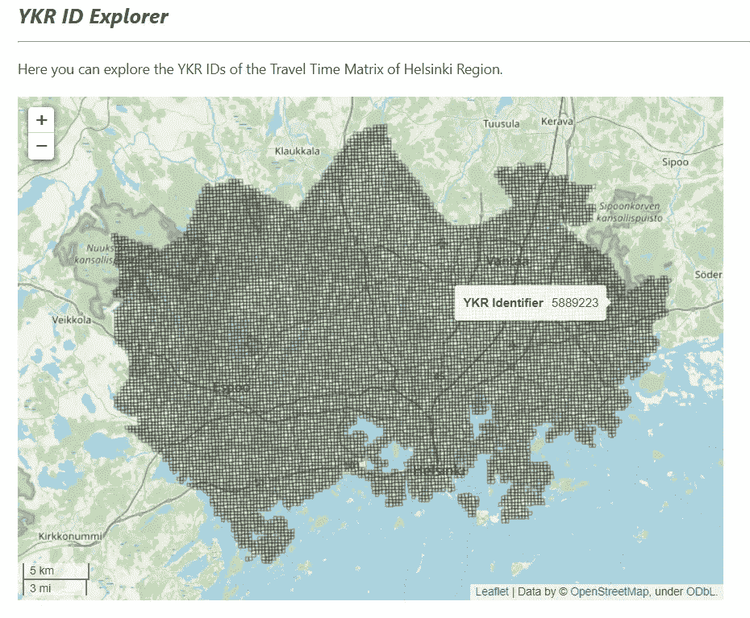***

***图片由作者提供。YKR ID 浏览器***

***当你已经选择了你的 YKR IDs。遵循 accessviz-mapper 工具中指定的步骤。***

******1)文件查找器******

***在这里，您可以添加您想要的 YKR IDs。一个或多个。在这种情况下，我们使用`5963655` 和`5933038.`只需键入数字，并按下按钮`**Add YKR ID.**`***

***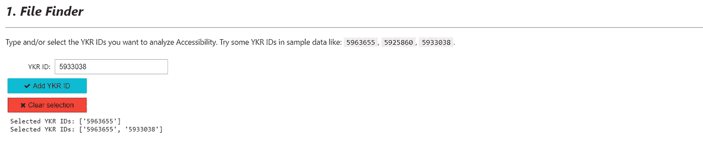***

******2)表接合工******

***在这一步中，一个名为`downloads`的新文件夹会在您的本地克隆存储库中自动创建。如果你愿意，你可以更新文件夹的 URL，但是最好把它放在同一个地方。这里，您**需要**将行驶时间信息加入 YKR ID 图层。这就是在这一步中发生的连接。按下按钮`**Save as SHP**`或`**Save as GPKG**`，或两者都按下。***

***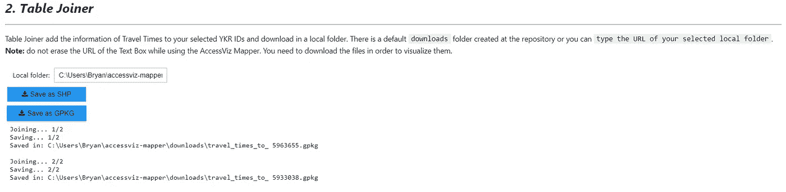***

***图片由作者提供。accessviz-mapper 工具中的表格连接器***

******3)可视化器******

***在这个阶段，accessviz-mapper 工具将映射您加入并存储在本地存储库中的文件。 ***如果有重复的文件(SHP 和 GPKG)也不用担心，该工具只识别一个 YKR ID 以避免重复贴图。******

***选择合适的模式(即自行车快速行驶)，找到你想要的分类方案(即自然中断)，颜色图(即粉绿色发散变化)，Alpha(透明度)，以及分类类别的数量。最后，按下按钮`**Map files.**` 工具将绘制行程时间。***

***您也可以选择用`**Save maps PNG**`按钮保存文件，它们将存储在您本地存储库中的同一个`dowloads`文件夹中。***

***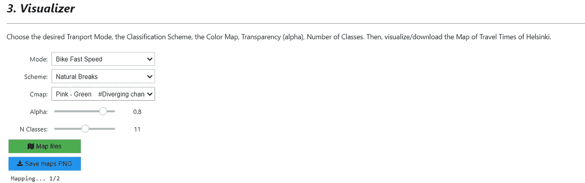******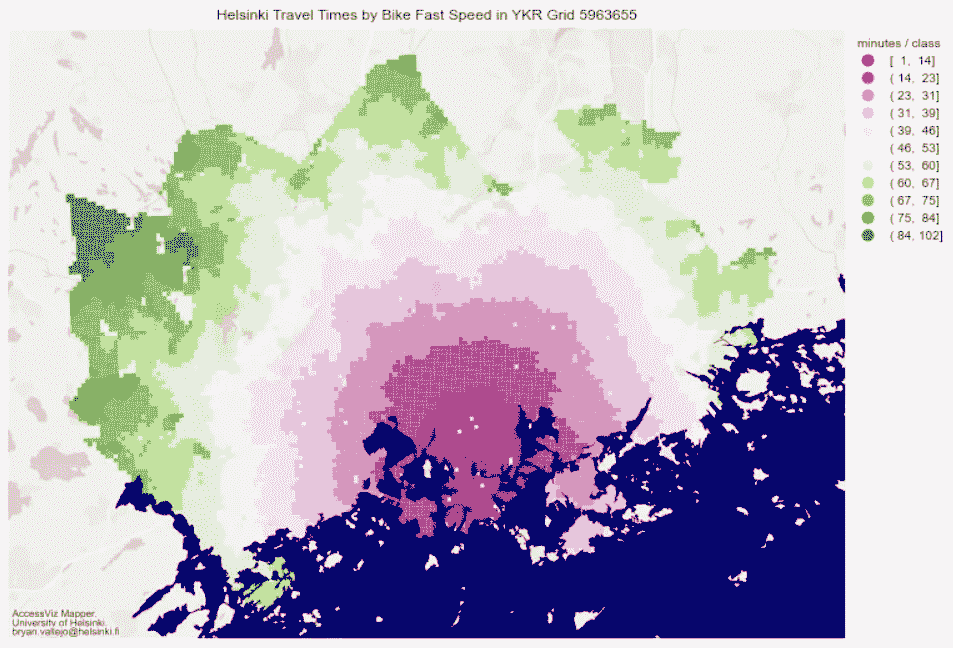***

***图片由作者提供。YKR ID 5963655 中自行车快速行驶时间的地图产品***

******4)比较行程时间和距离——工具******

***这一阶段通过减去行程时间来比较两种不同的交通方式。
**简单解释了一下**，当比较(图例)更接近于零时，可达性相同。如果为负，则选择的第一传输模式更快，如果为正，则选择的第二传输模式更快。
点击`**Map comparison**`按钮，可以保存为 SHP 或 GPKG，也可以保存为 PNG。如果需要，您可以在下载图层文件后使用自己的映射。***

***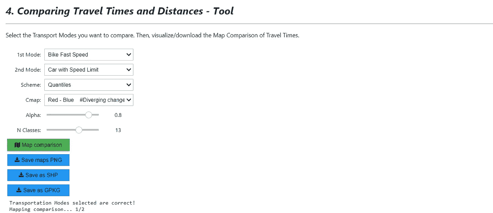******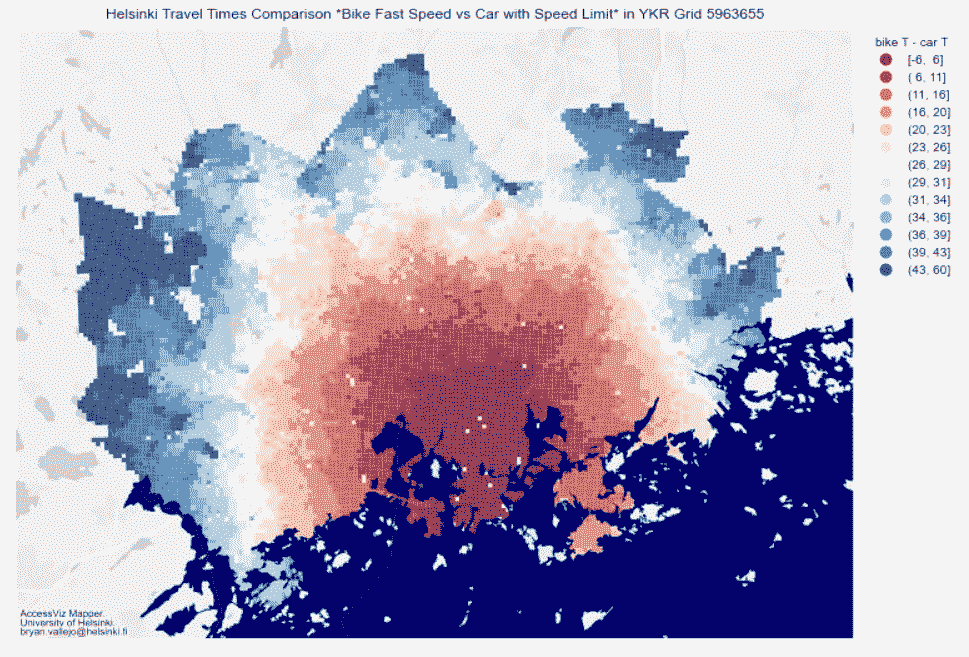***

***图片由作者提供。旅行时间比较。***

***该地图相对显示，红色区域骑自行车和开车的时间几乎相同，而蓝色区域开车更快。探索交通方式！***

******5)最短路径——路由工具******

***这个阶段在选中的***YKR id 之间创建 ***最短路径*** 。*** 很好，你可以选择网络: ***自行车道，公路，步行道。*** 您也可以下载图层，并将其添加到您自己的地图中。***

***在这个例子中，我使用 YKR ID `5963655,`作为起点，YKR ID `5933038` 和`5925860\.` 作为目的地，你可以添加一个或多个起点和目的地。然后选择您喜欢的**路径网络**并按下按钮`**Find shortest path.**` 这可能需要一些时间，因为它正在从打开的街道地图中获取数据。***

***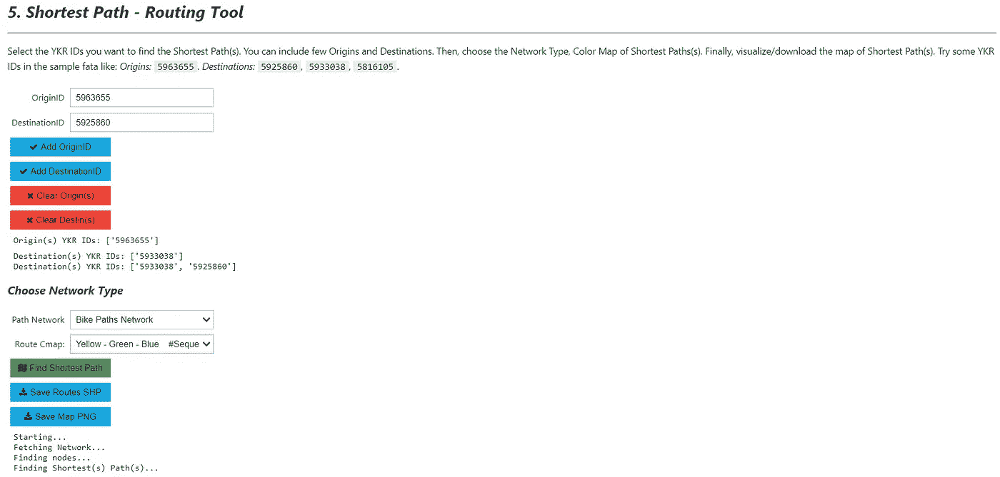******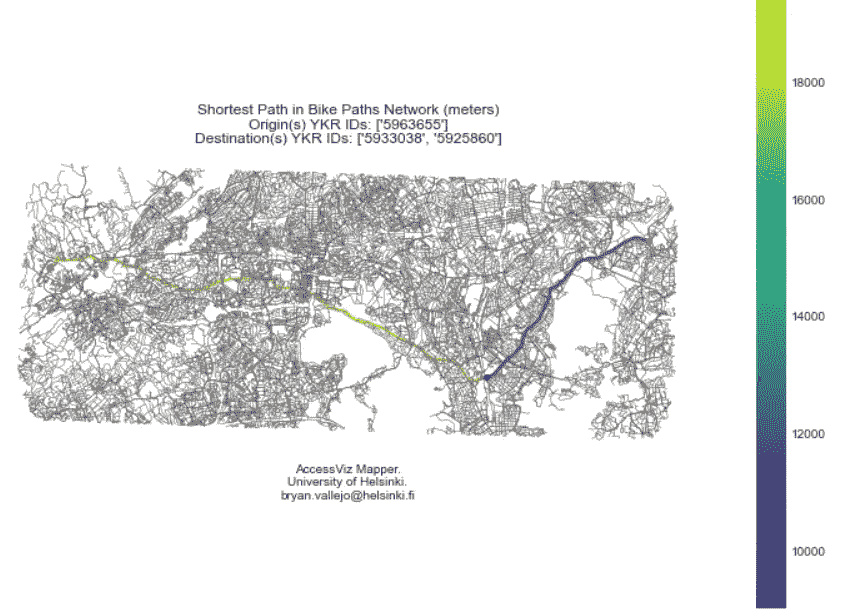***

***图片由作者提供。所选 YKR IDs 之间自行车道的最短路径***

***现在你已经知道了如何方便地绘制赫尔辛基不同交通方式的可达性。探索各种选项，为您的城市规划项目找到合适的可视化方案。如果你有任何疑问/建议，欢迎提出。此工具的目标是在赫尔辛基地区快速创建包含行驶时间信息的地图和图层。[查看我的个人资料](https://www.linkedin.com/in/bryanrvallejo/)进行查询***

## *****参考文献*****

***[1] Tenkanen，h .，J.L. Espinosa，E. Willberg，V. Heikinheimo，A. Tarnanen，T. Jaakkola，j . jrvi，M. Salonen，T. Toivonen (2018)。*赫尔辛基地区行程时间矩阵 2018* 。DOI:10.13140/rg . 2 . 2 . 233353233336***

***[2]t .托伊沃宁、m .萨洛宁、h .滕卡宁、p .萨尔萨米、t .雅克科拉和 j .耶尔维(2014 年)。Joukkoliikenteell，autolla ja k vellen:[Avoin saavutetttavuusaineisto p kaupunkiseudulla](http://Avoin saavutettavuusaineisto pääkaupunkiseudulla. Terra)。特拉福音 126: 3，127–136。***