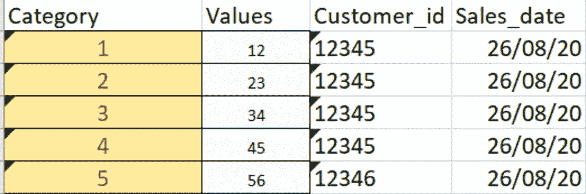
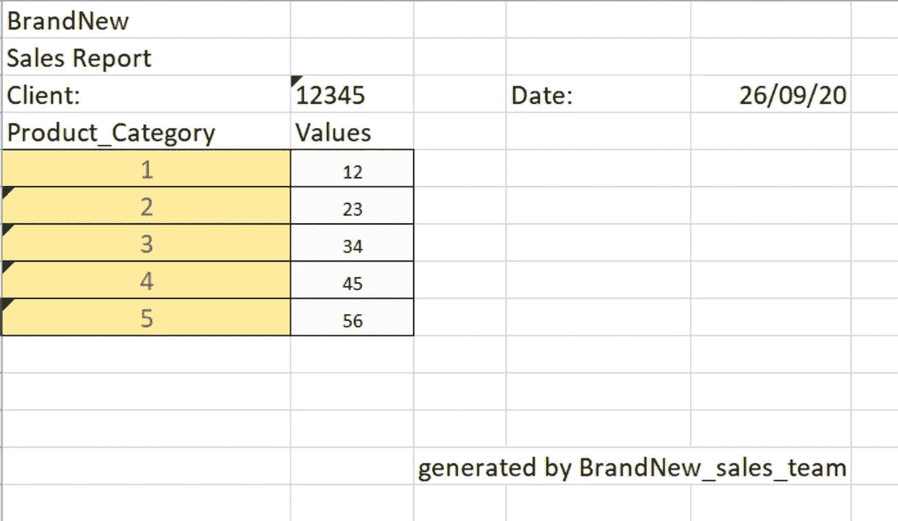
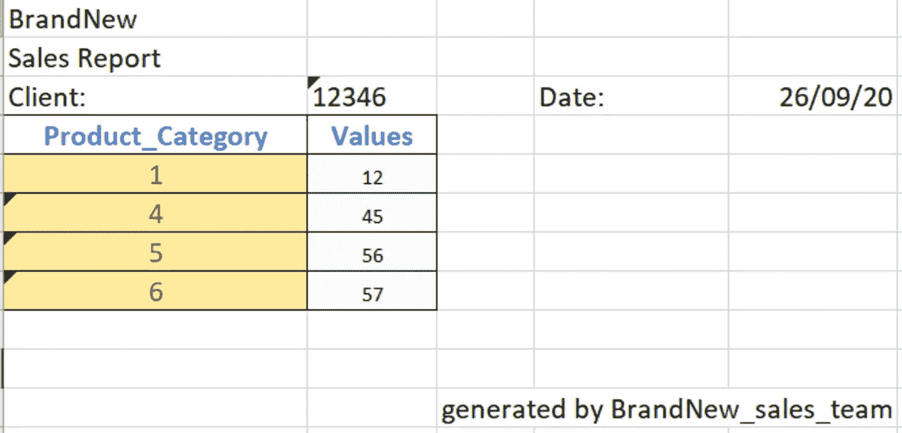
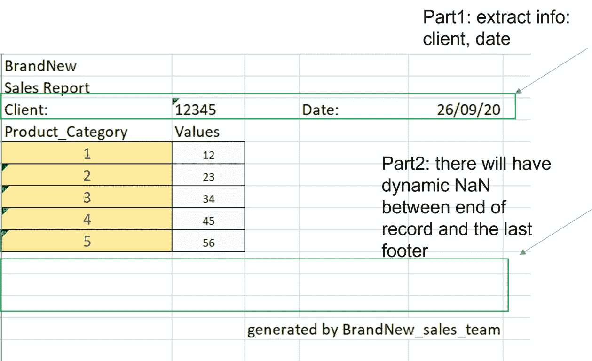
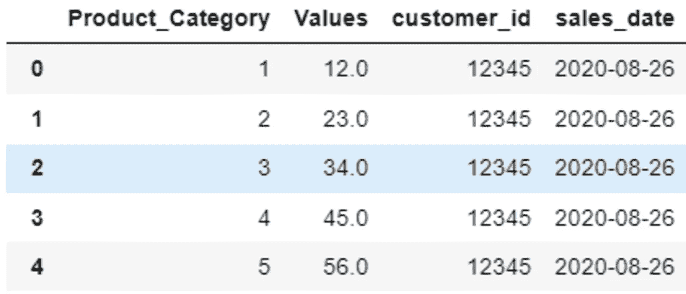
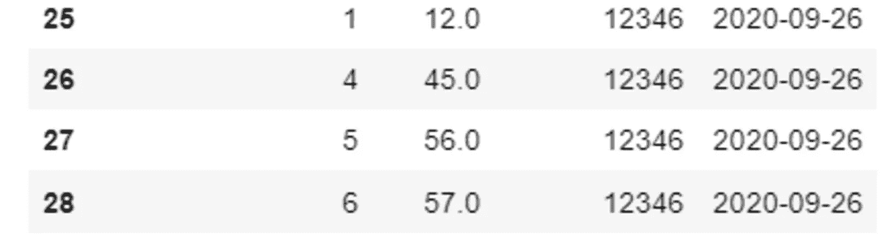
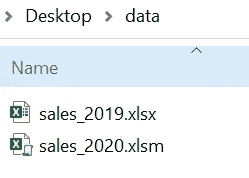
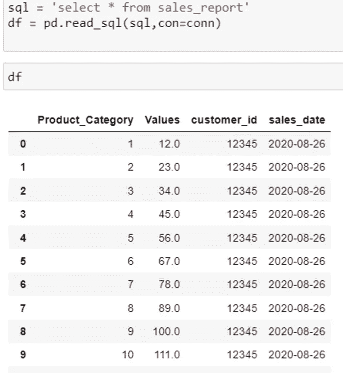

# 遍历、清理批处理 Excel 文件中的批处理工作表，以及与 MySQL 交互

> 原文：<https://towardsdatascience.com/traversing-cleaning-batch-worksheets-in-batch-excel-files-and-interacting-with-mysql-1cf81939518b?source=collection_archive---------40----------------------->

## 仅用熊猫清洁


作者照片

**今天的故事包括:**

1.  如何只使用熊猫遍历和清理脏的批量 Excel 工作表
2.  根据步骤 1，如何遍历批量 Excel 工作簿并合并报表
3.  如何将 Excel 文件保存到 MySQL 数据库并与之交互？

读写 Excel 文件是日常业务中非常经常的操作。这并不复杂，但繁琐，有各种情况下，你可能要面对和需要耐心的细节来处理它们。今天我重点讲只读 Excel 文件(不修改 Excel)，只用熊猫清理数据，用 MySQL 交互。

# 数据集简介

**干净和脏的数据集**

有时，数据集可能组织得很清楚，如下所示:



图 1:清理数据集

在其他情况下，数据集可能有许多额外的无用信息，如下所示:



图 2:脏数据集 1



图 3:脏数据集 2

对于第一种情况，将不同的工作表合并到一个报表中更容易，但是对于第二种情况，需要按照以下步骤清理数据:

*   第 1 部分:从特定单元格中提取客户信息和销售日期
*   第二部分:将 excel 读入 Dataframe 时，最后一条记录(5，56)和页脚(由 BrandNew_sales_team 生成)之间会产生 NaN，更糟糕的是，它是动态的。



图 4:数据清理的步骤

**清理 Excel 文件的工具:**

你可以使用 Excel，VBA，甚至 Power BI 等等。微软的产品来清理和整合数据，或者您可以使用 xlwings、Openpyxl 等。python 库，但是我更喜欢只使用 pandas DataFrame，因为

*   Openpyxl 不需要安装 Excel，但是不能运行。xls 文件，并且无法打开受密码保护的文件。
*   xlwings 需要在机器上安装 Excel。
*   假设的情况是，应用程序将在没有安装 Excel 的情况下运行，就像在云中一样。
*   我在熊猫方面的技术比其他人都好。

**详细数据集**

1.  Excel 文件有密码保护，包含 VBA，里面有各种工作表，需要合并。
2.  Excel 文件格式和上面的图 2 和图 3 一模一样。
3.  需要处理一批 Excel 文件。

# **数据清理**

我开始只清理一个名为“sales_2020.xlsm”的工作簿。

首先导入库:

```
import numpy as np
import pandas as pd
from pandas import DataFrame
```

获取所有工作表的名称:

```
xl_file_name='sales_2020.xlsm'
xl = pd.ExcelFile(xl_file_name)
sheet_name=xl.sheet_names  # see all sheet names
```

主要的数据清理功能:

结果如下所示:



图 5:前五名



图 6:尾巴 4

# **遍历批量 Excel 文件**

如果有需要合并的批处理文件，使用 ***os*** 库搜索所有文件，结合上面的代码得到报告。

假设文件组织如下:



图 7:文件路径

浏览全部文件的方法如下:

```
filepath=r'C:\Users\username\Desktop\data'
for root,dirs,files in os.walk(filepath):
                for file in files:                        
                    filename=os.path.join(root,file)# get the name with absolute path 
```

整合所有步骤，合并所有报告的功能是:

只需要给定一个变量作为 filepath:

```
filepath=r'C:\Users\user name\data'
consolidate_sales_report(filepath)
```

所有的报告都是合并的。

**保存到 Mysql**

假设您有权将数据写入 Mysql 数据库，并且已经创建了一个名为‘sales _ report’的模式。

我们可以使用下面的代码与 MySQL 进行交互:

结果很完美！



图 8:与 MySQL 交互

今天我从出差，清理 Excel 中的数据，和熊猫批量，和 MySQL 交互总结一下主要流程。主要使用的工具有:

*   只使用*熊猫*来遍历和清理 Excel 中的数据，因为有了这个库，Excel 不需要安装(对云来说很好)，它可以处理各种情况，作为密码保护和启用宏的文件，与 Openpyxl 或 xlwings 相比，它是高效的
*   使用*工作表名称遍历所有工作表*
*   使用 *os.walk()* 和 *os.path.join(root，file)遍历所有工作簿*
*   使用 *to_sql* 和 *read_sql* 与 MySQL 交互。

谢谢你的时间。