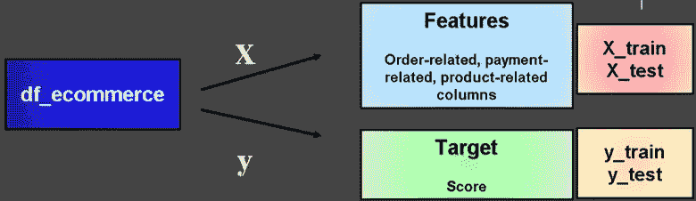

# 基于树算法的顾客满意度预测方法

> 原文：<https://towardsdatascience.com/tree-based-algorithms-approach-on-predicting-customer-satisfaction-296730e19baa?source=collection_archive---------22----------------------->

## 决策树、随机森林和梯度推进在这个动手项目中用于预测电子商务数据集的客户满意度

照片由 [niko photos](https://unsplash.com/@niko_photos?utm_source=medium&utm_medium=referral) 在 [Unsplash](https://unsplash.com?utm_source=medium&utm_medium=referral) 上拍摄

# 介绍

客户满意度是企业可以用来有效管理和监控其运营的方法之一。只要客户满意度保持在较高水平，每种产品都可以在市场上生存很长时间。好的产品质量并不是能使一个产品能有高水平的顾客满意度的唯一因素。许多因素，如交货时间、额外付款、产品价格等。会对客户满意度产生重大影响。客户满意度是留住客户的关键。一个满意的客户更有可能考虑购买同样的产品并再次使用同样的服务，从而为公司带来大量利润。同时，一个不满意的客户可能会因为之前对公司客户服务的负面体验而避免在未来购买同样的产品[【1】](https://www.researchgate.net/publication/31728374_Analysis_of_Customer_Satisfaction_Data_A_Comprehensive_Guide_to_Multivariate_Statistical_Analysis_in_Customer_Satisfaction_Loyalty_and_Service_Quality_Research_DR_Allen)。

客户满意度评估是帮助企业确定下一步的营销策略，从而为公司带来利润。由于每个客户的行为都不可预测，因此预测客户满意度可能很困难。然而，为了克服这一点，有许多统计方法无疑将有助于企业基于特定因素分析和预测客户满意度[【2】](https://www.researchgate.net/publication/276131080_Profit_estimation_for_a_product_under_warranty_An_evaluation_based_on_customer's_expectation_and_satisfaction)。在本文中，我们将主要关注使用基于树的机器学习算法从电子商务数据集预测客户满意度。

这个建模预测的数据集是来自 Kaggle 的 olist 的[巴西电子商务公共数据集。](https://www.kaggle.com/olistbr/brazilian-ecommerce)

作者已授予公开使用、共享和修改该数据集的权限。许可证可以在这里找到。

这个动手项目的目标是从电子商务数据集预测客户满意度。我们将采用的基于树的机器学习建模技术是决策树、随机森林和梯度推进。我们将对每个模型进行评估，并将它们进行比较，以确定三个模型中哪一个是预测客户满意度的最佳模型。

# 基于树的模型简要说明

决策树是用于分类和回归的监督机器学习方法之一。在这个动手项目中，我们将专注于决策树分类器及其各种类型，这将为我们提供一个可读的分类模型。决策树分类器上的树节点代表一个属性测试。分支从该节点出现，每个分支代表前一个属性的一个可能值。叶子从这些分支开始生长，每个叶子对应于与实例相关联的类标签。训练集中的实例从决策树的根指向叶子[【3】](https://www.sciencedirect.com/book/9780128036631/pervasive-computing#book-description)。

## 以这种方式使用决策树有几个优点，包括:[【4】](https://scikit-learn.org/stable/modules/tree.html)

1.  该模型易于理解和解释。
2.  该模型需要最少的数据准备，并且不支持缺失值。
3.  统计测试可用于验证模型的可靠性。
4.  这个模型可以使用数值和分类数据，但是它不支持 scikit-learn 中的分类数据。
5.  该模型可用于解决多输出问题。

## 然而，伴随好处而来的是缺点。这种模式有很多缺点，包括:[【4】](https://scikit-learn.org/stable/modules/tree.html)

1.  当模型包含不能很好地概括数据的过于复杂的树时，过度拟合经常发生。
2.  数据的微小变化会导致决策树变得不稳定，从而导致生成的树与之前的不同。
3.  如果一些类占主导地位，模型可能会产生有偏见的树。

决策树分类器使用数组 X 和数组 y 两个数组，数组 X 保存形状为(n_samples，n_features)的训练样本。数组 Y 保存形状为(n_samples)的训练样本的类标签。

随机森林和梯度增强的决策树变体是使用多棵树来实现比单棵树更好的结果的建模类型。这两种模型也可用于防止过度拟合。

## 以下是随机森林和梯度提升的区别:[【5】](https://www.datasciencecentral.com/profiles/blogs/decision-tree-vs-random-forest-vs-boosted-trees-explained)

1.  随机森林独立构造每棵树，然后结合每棵树的平均值的预测结果。
2.  梯度推进一次构建一棵树，同时结合预测结果。

## 以下是本项目中使用的建模技术的几个步骤:

1.  导入库
2.  数据理解
3.  数据清理和预处理
4.  探索性数据分析
5.  特征工程
6.  机器学习建模
7.  结论

# 导入库

导入我们将在建模过程中使用的库是很重要的。我们将主要在数据分析和建模过程中使用各种类型的库。我们将使用 pandas 和 NumPy 作为数据处理和转换工具。为了更好地可视化我们的数据，我们将使用 seaborn 和 matplotlib 作为数据可视化工具。我们将主要使用 scikit-learn 库，该库分为各种类型的模块，用于我们预测模型的建模过程工具。

# 数据理解

在继续该过程之前，必须合并原始数据集。我们将只包含带有订单相关列、产品相关列、付款相关列以及具体的评论分数列的数据集。每个数据集的组合过程如下所示。

总共有 115，689 行和 16 列。每列都标有自己的描述。原始列中未使用的列已被删除，这 16 列是唯一将用于我们的分析和建模的列。

## 下面是对 16 列中每一列的描述。

1.  **order_status** :这是对订单状态(已交付或已取消)的引用。
2.  **order_purchase_timestamp** :显示每件商品购买的时间戳。
3.  **order _ delivered _ customer _ date**:显示客户的实际订单交付日期。
4.  **order _ estimated _ delievy _ date**:显示在购买时提供给客户的预计交货日期。
5.  **shipping_limit_date** :显示卖方将订单转移给物流伙伴的装运限制日期。
6.  **payment_sequential** :客户可以使用多种支付方式为一个订单付款。
7.  **付款类型**:客户首选的付款方式。
8.  **付款期数**:客户首选的付款期数。
9.  **payment_value** :交易的价值。
10.  **价格**:每件物品的成本。
11.  **freight_value** :每件商品的运输成本(如果一个订单有多件商品，运费值在商品之间分摊)。
12.  **product_category** :每件商品的类别。
13.  **产品名称长度**:从产品名称中提取的字符数。
14.  **产品描述长度**:从产品描述中提取的字符数。
15.  **产品 _ 照片 _ 数量**:已发布的产品照片数量。
16.  **review_score** :客户在满意度调查中给出的评分，范围从 1 到 5。

# **数据清理和预处理**

如前所述，决策树建模不支持缺失值。因此，数据预处理将包括数据清理过程，以检测每一列中的任何缺失值。

仅在“订单交付客户日期”列上，就有 2，400 个 NaN 值。数据清理过程通过删除 2.08%的 NaN 值数据，将 115，609 行减少到 113，209 行。

日期值列中的时间戳数据已被转换为具有完整数据的新列，以便在机器学习模型上进行进一步分析。

# 探索性数据分析

探索性数据分析用于获得对影响客户评审的每个相关列的业务理解。以下是一些与影响客户评估的各种因素相关的业务问题:

1.  最受顾客欢迎的十大产品是什么？
2.  说到支付货款，大多数客户会选择哪种支付方式？
3.  支付价值因素对客户评价的影响有多大？
4.  运费价值因素对客户评价的影响有多大？
5.  价格因素对客户点评的影响会有多大？
6.  支付价值和价格因素的关系会对客户评价产生多大影响？
7.  预计交付日期和交付日期之间的相关性会对客户评审产生多大影响？

## 所有这些问题的答案都可以在下面找到。

## 十大最受欢迎产品的商业洞察:

1.  购买最多的前十种产品来自床浴桌、健康美容、运动休闲、家具装饰、电脑配件、家庭用品、手表礼品、电话、园艺工具和汽车。
2.  顾客最喜欢的产品是床浴桌，已收到超过 10，000 份订单。
3.  在健康和美容、运动和休闲、家具和装饰以及电脑配件等类别下了 8000 多份订单。
4.  家庭用品和手表礼品的订单超过 6000 份。
5.  在电信、园艺工具和汽车类别下了 3000 多份订单。
6.  这十大产品在确定客户满意度方面发挥了重要作用，它们将被用作参数，以便在稍后的功能工程过程中进行一次性编码。

## 对客户支付类型的商业洞察:

1.  信用卡的支付价值最高，其次是 boleto、借记卡和代金券。
2.  信用卡和 boleto 支付的支付值都超过 175。
3.  使用借记卡的支付值低于信用卡和 boleto，因为它具有 150 的值。
4.  凭证在其他凭证中具有最低的支付价值，因为产品实际价格的一半可以由客户使用兑现的凭证来支付。

## 基于支付价值的客户评审业务洞察:

1.  当支付值减少时，评论分数会稍微增加。
2.  当付款值超过 200 时，评审得分值为 1。
3.  当支付值降低到大约 175 时，出现值为 2 的评论分数。
4.  当付款值在 160 左右时，评价分数为 3、4 和 5，这使得付款值 160 将是使客户获得高评价分数的最佳选择。

## 基于运费价值的客户评论业务洞察:

1.  随着运费价值的降低，客户可能会给出更好的评价分数。
2.  运费值超过 20 的客户评价从 1 到 4 不等。
3.  当运费价值低于 20 时，客户将给出 5 的最佳评论分数。
4.  最低的运费价值可以获得最好的评论分数，因为当客户只需为运费价值的额外支付支付一点点时，他们会很高兴。

## 基于价格的客户评论业务洞察:

1.  较低的价格值对评论分数没有明显的影响。
2.  一个标价超过 120 英镑的产品可以从顾客那里得到正面和负面的反馈。
3.  当产品的价格很高，但产品的质量没有达到客户的期望时，评审得分为 1(高价格也意味着高质量的产品)。
4.  当一个产品的价格很高，并且产品的质量符合客户的期望时，评论得分为 5 是可能的。
5.  点评评分 3 在其他中价格最低，价值在 110 左右。

## 基于支付价值和价格相关性的客户评价业务洞察:

1.  当价格和支付值具有相同的值时，大多数良好评论得分为 4 和 5。
2.  当顾客只需支付产品的价格而没有增加支付价值的任何附加值时，价格和支付价值之间的相同价值的相关评论得分出现。
3.  大多数 5 分的评价也发生在支付价值低于产品实际价格的时候。
4.  大多数评审得分为 1 的情况发生在支付价值高于产品实际价格的时候。

## 基于产品到达的预计天数和交付天数的相关性，对客户评审的业务洞察:

1.  绝大多数好评分数为 4 和 5 的商品预计天数较长，但商品的实际交付天数提前或准时到达，使得商品比预计时间更快到达顾客手中。
2.  大多数负面评价分数为 1 和 2 的产品预计交付天数较短，但实际交付天数比预期时间长。

# 特征工程

为了使数据更加精确，特征工程用于创建新的特征，例如新的列和虚拟变量。这个项目的特征工程的解释可以在下面找到。

我们从特征工程中创建三个新列，并删除旧列，因为新列将对模型预测做出更大贡献。

## 下面详细解释了每个新列。

1.  **arrival_time:** 根据预计天数和交付天数，指定产品到达客户手中所需的天数。
2.  **delivery_arrival:** 根据到货时间判断交货是准时还是迟到(如果到货时间为负值表示迟到，到货时间为正值表示准时)。
3.  **评分:**确定客户提供的是正面评价还是负面评价(0 表示评价得分= 1–2，1 表示评价得分= 4–5，评价得分 3 的中性值被删除)。

有一些列必须被处理，比如那些带有分类值的列。因此，必须使用标签编码和独热编码将这些值转换为 int 值，以便进行机器学习建模。

## 下面详细解释了每个编码过程。

1.  **对 2 的不同值进行标签编码:**将负值转换为 0，将正值转换为 1。
2.  **对大于 2 的不同值进行单热编码**:使用 pd.get dummies 函数对特定列进行单热编码处理，以获得虚拟变量。
3.  **对大于 10 的不同值进行一次性编码:**定义前十个最常出现的值，然后对这些特定值应用一次性编码。

# 机器学习建模

在开始建模过程之前，我们必须将数据划分为 X 和 Y 数组，然后再次划分为训练和测试数据。X 数组包含一个 features 列，其中包含我们之前处理过的与订单、付款和产品相关的信息。y 数组仅包含“分数”特征工程列。下面提供了对该代码的更详细的解释。

(图片来自作者)

为了找到每个建模阶段的最佳参数，执行超参数调整和交叉验证技术。此外，为了获得关于模型评估的更多信息，我们将利用混淆矩阵并评估模型正确性，以确定我们的数据是否过度拟合。我们还将比较实际训练数据和预测训练数据，以进一步证明我们的统计机器学习方法如何准确预测客户满意度。

## 我们可以从决策树模型中获得以下信息:

1.  决策树模型交叉验证的超参数调优过程只需要 16 秒左右。
2.  决策树的最佳参数使用 max_depth 值 4、min_samples_split 值 100 和平均测试分数 0.871051。
3.  训练数据的准确度为 0.8714%，而测试数据的准确度为 0.8673%。
4.  当比较实际的训练数据和预测的训练数据时，决策树模型预测 100 个正确预测中的 88 个。
5.  决策树模型的 F1 值为 0.93%。

## 我们可以从随机森林模型中获得以下信息:

1.  决策树模型的交叉验证的超参数调整过程只需要大约 2 分钟，比决策树模型花费的时间长。
2.  随机森林模型的最佳参数使用 max_depth 值 5、n_estimator 值 50 和平均测试分数 0.869954。
3.  训练数据精度为 0.8701%，而测试数据精度为 0.8664%。
4.  当比较实际训练数据和预测训练数据时，随机森林模型预测 100 个正确预测中的 88 个。
5.  这个建模的 F1 值为 0.93%，与决策树模型相同。

## 我们可以从梯度推进模型中得出以下信息:

1.  梯度增强模型的交叉验证的超参数调整过程需要超过 11 分钟，是其他模型中最长的。
2.  随机森林模型的最佳参数使用 max_depth 值 5、n_estimator 值 50 和平均测试分数 0.874234。
3.  训练数据精度为 0.8775%，而测试数据精度为 0.8709%，这使得该模型比其他模型更适合。
4.  当比较实际训练数据和预测训练数据时，随机森林模型预测 100 个正确预测中的 88 个。
5.  这款车型的 F1 得分为 0.93%，与其他车型相同。

# 结论

在我们评估了所有的建模方法之后，我们将比较每个模型的有效性。每种模式都有优缺点；我们将决定这些模型中哪一个最适合用于预测客户满意度。

## 我们的建模方法的结论如下:

1.  所有车型的 F1 评分为 0.93%。
2.  基于实际训练和预测训练数据的比较，我们可以得出结论，我们的所有模型在 100 次中正确预测了 88 次。
3.  与其他模型相比，梯度增强模型具有最拟合的数据结果，但它具有最长的超参数调整交叉验证过程，持续时间超过 11 分钟。
4.  决策树模型具有最快的超参数调整交叉验证过程，仅需 16 秒。
5.  推荐使用决策树模型来预测客户满意度，因为它具有最快的建模过程，与其他模型具有相同的准确性和较高的 F-1 分数。

# 参考

[1] D. R. Allen 和 T. R. Rao，[顾客满意度数据分析:顾客满意度、忠诚度和服务质量研究中多元统计分析的综合指南](https://www.researchgate.net/publication/31728374_Analysis_of_Customer_Satisfaction_Data_A_Comprehensive_Guide_to_Multivariate_Statistical_Analysis_in_Customer_Satisfaction_Loyalty_and_Service_Quality_Research_DR_Allen) (2000)，ASQ 质量出版社。

[2] P. K. Kapur，A. Anand 和 N. Sachdeva，[保修期内产品的利润估算:基于客户期望和满意度的评估](https://www.researchgate.net/publication/276131080_Profit_estimation_for_a_product_under_warranty_An_evaluation_based_on_customer's_expectation_and_satisfaction) (2014)，国际可靠性、质量和安全工程杂志。

[3] C. Dobre 和 F. Xhafa，[面向智能数据收集的普适计算下一代平台](https://www.sciencedirect.com/book/9780128036631/pervasive-computing#book-description) (2016)，学术出版社。

[https://scikit-learn.org/stable/modules/tree.html](https://scikit-learn.org/stable/modules/tree.html)

[5][https://www . datascience central . com/profiles/blogs/decision-tree-vs-random-forest-vs-boosted-trees-explained](https://www.datasciencecentral.com/profiles/blogs/decision-tree-vs-random-forest-vs-boosted-trees-explained)

# 确认

如果你想获得更多关于这个建模方法中使用的代码的细节，你可以在这里查看我的 Github 库[。](https://github.com/nugrahazikry/Tree-Based-Algorithms-Approach-on-Predicting-Customer-Satisfaction)

为了简化这个模型的解释，我还制作了 PowerPoint，这样你就可以得到一个清晰的解释。你可以在这里查看幻灯片。

**Github:**https://github.com/nugrahazikry

【领英:[https://www.linkedin.com/in/zikry-adjie-nugraha/](https://www.linkedin.com/in/zikry-adjie-nugraha/)