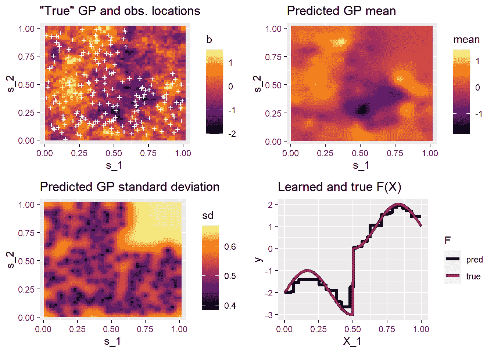
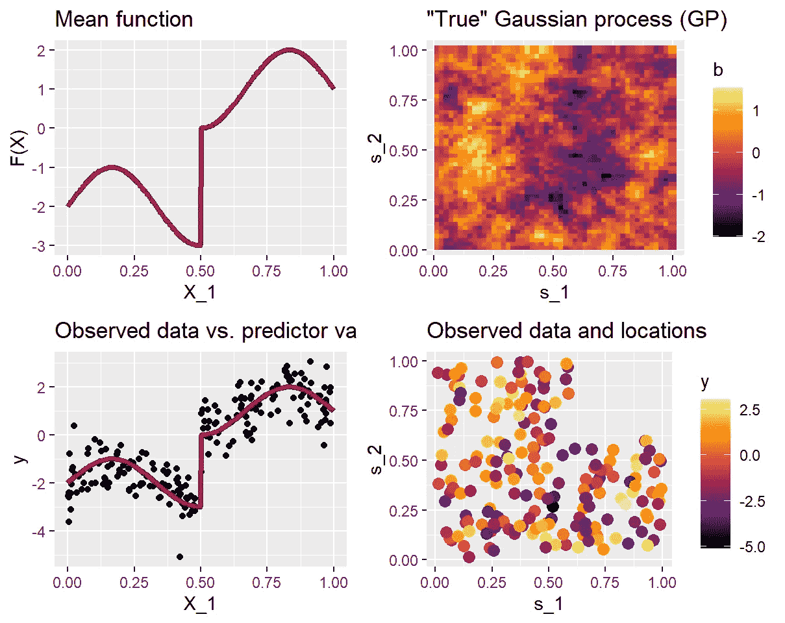
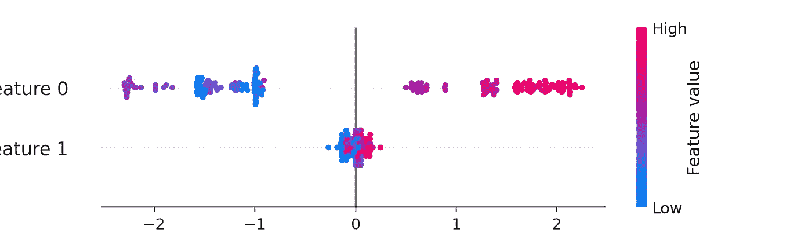
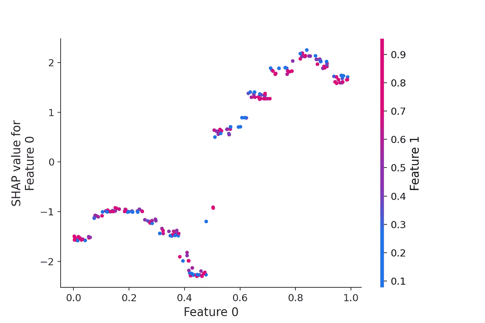
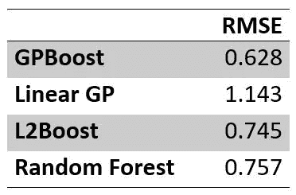

# 空间数据的树提升

> 原文：<https://towardsdatascience.com/tree-boosting-for-spatial-data-789145d6d97d?source=collection_archive---------22----------------------->

## GPBoost:结合树提升和高斯过程模型



图 1:真实空间场和预测空间场以及预测函数的比较。

空间数据通常使用[高斯过程模型](https://en.wikipedia.org/wiki/Kriging)建模。在许多应用中，除了空间位置之外，还有其他预测变量。通常，这些协变量包含在高斯过程模型的线性回归项中(称为“[泛克里金法](https://en.wikipedia.org/wiki/Regression-kriging)”)。但是，你可能想知道线性假设是否真的成立。作为替代，你可以应用一种最先进的机器学习技术，比如[(梯度)树提升](https://en.wikipedia.org/wiki/Gradient_boosting)。然而，这可能也不能完全让你满意，首先，预测在空间上是不连续的，其次，物理空间具有特殊结构的事实完全被机器学习算法忽略了。

本文展示了如何使用 [GPBoost 算法](https://arxiv.org/abs/2004.02653)将树提升与高斯过程模型结合起来，对空间数据进行建模。本文提供了方法论以及如何在 R 和 Python 中应用 [GPBoost 库](https://github.com/fabsig/GPBoost)的背景知识。它显示了(I)如何训练模型并进行预测，(ii)如何调整参数，以及(iii)如何解释模型。此外，还对几种备选方法进行了简短的比较。

# 介绍

**高斯过程**是用于建模空间数据的流行模型，这归因于几个**优点**:

*   它们允许进行概率预测
*   它们可以被视为合理的先验模型，结合了托布勒的地理第一定律(“一切都与其他一切相关，但近处的东西比远处的东西更相关。”)并且它们明确地模拟样本之间的空间相关性

然而，如果有额外的预测变量，标准空间高斯过程模型也有一个潜在的严重缺陷**:**它们假设预测变量**和响应变量之间存在线性关系。**

****Tree-boosting 是一种机器学习技术，通常可以实现卓越的预测准确性**。这反映在这样的陈述中，如“*一般来说，对于广泛的应用问题来说，“增强决策树”被认为是最有效的现成非线性学习方法*”(Johnson and Zhang，2013)或“【XGBoost 为什么赢得“每一次”机器学习竞赛？(尼尔森，2016)。除此之外，tree-boosting 及其众所周知的软件实现(如 XGBoost、LightGBM 和 CatBoost)还有其他几个优点；参见[这篇博文](/tree-boosted-mixed-effects-models-4df610b624cb)。当将标准增强算法应用于空间数据时，考虑到已经在空间上观察到数据的事实，基本上有两种选择:(I)忽略空间坐标，或者(ii)通过将空间位置添加到预测变量集中，将空间位置视为“常规”预测变量。不言而喻，第一个选项通常是一个糟糕的选择，因为潜在的重要信息会丢失。然而，**当通过在预测变量**中包含位置来对空间数据**建模时，普通的树提升算法也有一些潜在的缺点:****

*   **它们忽略了任何潜在的(剩余的)空间相关性**
*   **它们产生不连续的空间预测**
*   **他们忽略了合理的先验信息，即“近物比远物更相关”(见上文)**

# **方法论背景**

****GPBoost 算法(**[**【SIG rist，2020)**](https://arxiv.org/abs/2004.02653) **的思想是将树提升与高斯过程模型相结合，这样可以(I)利用两种技术的优点，并且(ii)避免上述缺点。**粗略地说，高斯过程和树提升都是用于建模“他们擅长的部分”。更详细地说，假设**

> **y = F(X) + b(s) + e**

**在哪里**

*   **y 是响应变量(又名标签)**
*   **x 包含预测变量，F()是潜在的非线性函数**
*   **b(s)是高斯过程，s 表示空间位置**
*   **e 是一个误差项**

**如同在经典的树提升算法中，假设函数 F()是树的集合。在标准高斯过程模型中，函数 F()被简单地假设为线性函数。此外，当应用标准的树提升算法时，可以简单地将位置 s 包括在非线性函数 F(X，s)中。**GPBoost 算法是一种 boosting 算法，其迭代地学习高斯过程的协方差参数(也称为超参数),并使用** [**梯度和/或考虑空间相关性的牛顿 boosting**](https://www.sciencedirect.com/science/article/abs/pii/S0957417420308381) **步骤将树添加到树集合中**。有关该方法的更多详细信息，请参见 [Sigrist (2020)](https://arxiv.org/abs/2004.02653) 。在 GPBoost 库中，可以使用(内斯特罗夫加速)梯度下降或 Fisher 评分(又名自然梯度下降)来学习协方差参数，使用 [LightGBM 库](https://github.com/microsoft/LightGBM/)来学习树。**

# **GPBoost 算法在 R 和 Python 中的应用**

**在下文中，展示了 GPBoost 算法如何在 R 和 Python 中应用。本文中使用的完整代码可以在[这里](https://htmlpreview.github.io/?https://github.com/fabsig/GPBoost/blob/master/examples/GPBoost_demo.html)找到。另外，关于 [GPBoost 库](https://github.com/fabsig/GPBoost)和相应的 R 和 Python 包的更多信息可以在[这里](https://github.com/fabsig/GPBoost)找到。**

## ****数据****

**我们模拟数据 y = F(X) + b(s) + e 如下。b(s)遵循具有指数协方差函数的高斯过程。x 包含两个预测变量，其中只有一个具有非线性效应。后一种选择只是为了能够很好地可视化和比较学习到的和真实的函数 F()。此外，我们使用一个相对较小的样本量 200。对于较大的数据集，GPBoost 库支持 Vecchia 近似来加速计算。下图说明了模拟数据。本文的附录包含了用 R 和 Python 模拟数据的完整代码。**

****

**数据说明:用于模拟的均值函数 F(X)、“真实”潜在高斯过程 b 和观测数据 y(下图)。**

# **训练和预测**

**通过首先定义一个`**GPModel**` 然后将其传递给`gpboost`或`gpb.train`函数来完成训练。通过调用`predict`函数并传递树集合的预测变量和高斯过程的预测位置来获得预测。请注意，树集合和高斯过程的预测是分别返回的。即，需要对它们求和以获得单点预测。下面的代码展示了如何在 R 和 Python 中实现这一点。本文开头的图 1 显示了高斯过程的预测均值和标准差(=“预测不确定性”)以及预测均值函数 F(X)。**

****换 R****

```
library(gpboost)
gp_model <- GPModel(gp_coords = coords, 
                     cov_function = "exponential")
# Training
bst <- gpboost(data = X, label = y, gp_model = gp_model,
               nrounds = 247, learning_rate = 0.01,
               max_depth = 3, min_data_in_leaf = 10, 
               num_leaves = 2^10,
               objective = "regression_l2", verbose = 0)
summary(gp_model) # Estimated covariance parameters
# Make predictions: latent variables and response variable
pred <- predict(bst, data = X_test, gp_coords_pred = coords_test, 
                predict_var = TRUE, pred_latent = TRUE)
# pred[["fixed_effect"]]: predictions from the tree-ensemble.
# pred[["random_effect_mean"]]: predicted means of the gp_model.
# pred["random_effect_cov"]]: predicted (co-)variances 
                              of the gp_model
pred_resp <- predict(bst, data = X_test, 
                     gp_coords_pred = coords_test, 
                     pred_latent = FALSE)
y_pred <- pred_resp[["response_mean"]] # predicted response mean
# Calculate mean square error
MSE_GPBoost <- mean((y_pred-y_test)^2)
```

****在 Python 中****

```
import gpboost as gpb
gp_model = gpb.GPModel(gp_coords=coords, cov_function="exponential")
data_train = gpb.Dataset(X, y)
params = { 'objective': 'regression_l2', 'learning_rate': 0.01,
            'max_depth': 3, 'min_data_in_leaf': 10, 
            'num_leaves': 2**10, 'verbose': 0 }
# Training
bst = gpb.train(params=params, train_set=data_train,
                gp_model=gp_model, num_boost_round=247)
gp_model.summary() # Estimated covariance parameters
# Make predictions: latent variables and response variable
pred = bst.predict(data=X_test, gp_coords_pred=coords_test,  
                   predict_var=True, pred_latent=True)
# pred['fixed_effect']: predictions from the tree-ensemble.
# pred['random_effect_mean']: predicted means of the gp_model.
# pred['random_effect_cov']: predicted (co-)variances 
                             of the gp_model
pred_resp = bst.predict(data=X_test, gp_coords_pred=coords_test, 
                        predict_var=False, pred_latent=False)
y_pred = pred_resp['response_mean'] # predicted response mean
# Calculate mean square error
np.mean((y_pred-y_test)**2))
```

# **模型解释**

**经过训练的模型可以使用各种工具进行解释。除了传统的特征重要性测量和部分相关性图，SHAP 值和相关性图可以如下所示创建。我们获得的数字正确地确定了第一个预测变量(“特征 0”)的影响的重要性和形式。**

****换 R****

```
library("SHAPforxgboost")
shap.plot.summary.wrap1(bst, X = X)
shap_long <- shap.prep(bst, X_train = X)
shap.plot.dependence(data_long = shap_long, x = "Covariate_1",
                     color_feature = "Covariate_2", smooth = FALSE)
```

***注意，对于 R 包，您需要 gpboost 版本 0.4.3 或更高版本来创建这些 SHAP 图。此外，对于 SHAPforxgboost 包，数据矩阵 X 需要有列名。如果不是这种情况，请在使用以下代码训练增强器模型之前添加它们:***

```
your_colnames <- paste0(“Covariate_”,1:2)
X <- matrix(as.vector(X), ncol=ncol(X), 
             dimnames=list(NULL,your_colnames))
```

****在 Python 中****

```
import shap
shap_values = shap.TreeExplainer(bst).shap_values(X)
shap.summary_plot(shap_values, X)
shap.dependence_plot("Feature 0", shap_values, X)
```

****

**SHAP 价值观**

****

**SHAP 依赖图**

# **参数调谐**

**使用树作为基础学习器的 Boosting 有几个调整参数。可以说最重要的是提升迭代的次数。其他调整参数包括学习速率、最大树深度、每片叶子的最小样本数、叶子数以及其他参数，例如对叶子值的 L2 正则化和对叶子数的 L0 惩罚。通常较小的学习率会导致更精确的模型。然而，建议也尝试更大的学习速率(例如，1 或更大)，因为当使用梯度提升时，梯度的比例可以取决于损失函数和数据，并且即使更大数量的提升迭代(比如 1000)对于小的学习速率也可能是不够的。这与牛顿提升形成对比，牛顿提升使用小于 0.1 的学习率，因为自然梯度与比例无关。**

**例如，可以使用随机或确定性网格搜索和 k 重交叉验证来选择这些调整参数，如下所示。一种计算成本更低的替代全 k 倍交叉验证的方法是将验证数据集传递给参数调整函数。更多细节见[这里(对于 R)](https://github.com/fabsig/GPBoost/tree/master/R-package/demo/parameter_tuning.R) 和[这里(对于 Python)](https://github.com/fabsig/GPBoost/tree/master/examples/python-guide/parameter_tuning.py) 。*请注意，使用“grid.search.tune.parameters”功能需要 GPBoost 版本 0.4.3 或更高版本。***

****换 R****

```
# Create random effects model and datasets
gp_model <- GPModel(gp_coords = coords, 
                     cov_function = "exponential") 
dtrain <- gpb.Dataset(data = X, label = y)
# Candidate parameter grid
param_grid = list("learning_rate" = c(1,0.1,0.01),
                  "min_data_in_leaf" = c(1,10,100),
                  "max_depth" = c(1,3,5,10))
# Other parameters not contained in the grid of tuning parameters
params <- list(objective = "regression_l2", verbose = 0, 
               "num_leaves" = 2^10)
# Use random grid search and cross-validation. Set 'num_try_random=NULL' to use deterministic grid search
set.seed(1)
opt_params <- gpb.grid.search.tune.parameters(
  param_grid = param_grid,
  params = params,
  num_try_random = 20,
  nfold = 4,
  data = dtrain,
  gp_model = gp_model,
  verbose_eval = 1,
  nrounds = 1000,
  early_stopping_rounds = 5,
  eval = "l2")
# Found the following parameters:
# ***** New best score (0.397766105827059) found for the following parameter combination: learning_rate: 0.01, min_data_in_leaf: 10, max_depth: 3, nrounds: 247
```

****在 Python 中****

```
gp_model = gpb.GPModel(gp_coords=coords, cov_function="exponential")
data_train = gpb.Dataset(X, y)
# Candidate parameter grid
param_grid = {'learning_rate': [1,0.1,0.01], 
              'min_data_in_leaf': [1,10,100],
              'max_depth': [1,3,5,10]}
# Other parameters not contained in the grid of tuning parameters
params = { 'objective': 'regression_l2', 'verbose': 0, 
           'num_leaves': 2**17 }
opt_params = gpb.grid_search_tune_parameters(
  param_grid=param_grid,
  params=params,
  num_try_random=20,
  nfold=4,
  gp_model=gp_model,
  use_gp_model_for_validation=True,
  train_set=data_train,
  verbose_eval=1,
  num_boost_round=1000, 
  early_stopping_rounds=5,
  seed=1,
  metrics='l2')
print("Best number of iterations: " + str(opt_params['best_iter']))
print("Best score: " + str(opt_params['best_score']))
print("Best parameters: " + str(opt_params['best_params']))
```

# **与替代方法的比较**

**在下文中，我们将 GPBoost 算法与以下替代方法进行比较:**

*   ****线性高斯过程模型(‘线性 GP’)**其中 F(X)是线性函数**
*   ****标准梯度树提升**并将空间坐标作为常规预测变量**s(‘L2Boost’)**包含在 F()中**
*   ****随机森林**并包括空间坐标作为常规预测变量**

**我们使用交叉验证来选择调整参数，并使用测试数据的均方根误差(RMSE)来测量预测准确性。产生这些结果的 r 代码可以在下面的附录中找到。结果如下表所示。**

****

**GPBoost 和替代方法的预测精度比较。**

****我们发现，就预测准确性而言，GPBoost 优于所有其他替代方案。** *注意，为了简单起见，我们只做一次模拟运行；更详细的对比见* [*西格里斯特(2020)*](https://arxiv.org/abs/2004.02653) *。除了随机森林，所有计算都是使用 GPBoost 库 0.7.5 版完成的。此外，我们使用 randomForest R 包版本*4.6–14*。***

# **结论**

**GPBoost 库允许结合高斯过程模型和树提升。在上面的例子中，我们已经假设在空间位置 s 和其他预测变量 X 之间没有相互作用。这可以容易地放宽，例如，通过在预测函数 F(X，s)中也包括空间位置 s 和/或通过在高斯过程 b(X，s)中另外包括其他非空间预测变量 X。**

**总之，如果您使用高斯过程模型对空间数据进行建模，您应该调查线性假设是否确实合适。GPBoost 算法允许以灵活的方式放宽这一假设。它可以帮助您找到非线性和相互作用，并实现更高的预测准确性。如果您经常使用 boosting 算法，并希望将它们应用于空间数据，GPBoost(它扩展了 LightGBM)可以使学习更加[高效](https://en.wikipedia.org/wiki/Efficiency_(statistics))并产生更高的预测准确性。一般来说，GPBoost 算法还可以应用于非空间数据集，其中应该结合使用树提升和高斯过程回归。此外，GPBoost 库还允许[将树提升与(分组)随机效果模型](/tree-boosted-mixed-effects-models-4df610b624cb)相结合。**

**希望这篇文章对你有用。关于 GPBoost 的更多信息可以在配套文章 [(Sigrist，2020)](https://arxiv.org/abs/2004.02653) 和 [GitHub](https://github.com/fabsig/GPBoost) 上找到。**

# **参考**

**Johnson 和 t .张(2013 年)。利用正则化贪婪森林学习非线性函数。 *IEEE 模式分析与机器智能汇刊*， *36* (5)，942–954。**

**尼尔森 D. (2016)。*用 XGBoost 进行树提升——为什么 XGBoost 会赢得“每一次”机器学习比赛？*(硕士论文，NTNU)。**

**西格里斯特，F. (2020)。高斯过程增强。arXiv 预印本 arXiv:2004.02653 。**

# **附录**

## **模拟数据的 r 代码**

```
set.seed(1)
# Simulate Gaussian process: training and test data (the latter on a grid for visualization)
cov_function <- "exponential"
sigma2_1 <- 0.35 # marginal variance of GP
rho <- 0.1 # range parameter
sigma2 <- 0.1 # error variance
n <- 200 # number of training samples
nx <- 50 # test data: number of grid points on each axis
# training locations (exclude upper right rectangle)
coords <- matrix(runif(2)/2,ncol=2, dimnames=list(NULL,paste0("s_",1:2)))
while (dim(coords)[1]<n) {
  coord_i <- runif(2) 
  if (!(coord_i[1]>=0.6 & coord_i[2]>=0.6)) {
    coords <- rbind(coords,coord_i)
  }
}
# test locations (rectangular grid)
s_1 <- s_2 <- rep((1:nx)/nx,nx)
for(i in 1:nx) s_2[((i-1)*nx+1):(i*nx)]=i/nx
coords_test <- cbind(s_1=s_1,s_2=s_2)
n_all <- nx^2 + n # total number of data points 
D <- as.matrix(dist(rbind(coords_test,coords))) # distance matrix
if(cov_function=="exponential"){
  Sigma <- exp(-D/rho)+diag(1E-10,n_all)
}else if (cov_function=="gaussian"){
  Sigma <- exp(-(D/rho)^2)+diag(1E-10,n_all)
}
C <- t(chol(Sigma))
b_all <- sqrt(sigma2_1)*C%*%rnorm(n_all)
b_train <- b_all[(nx^2+1):n_all] # training data GP
# Mean function. Use two predictor variables of which only one has an effect for easy visualization
f1d <- function(x) sin(3*pi*x) + (1 + 3 * pmax(0,x-0.5)/(x-0.5)) - 3
X <- matrix(runif(2*n), ncol=2, dimnames=list(NULL,paste0("Covariate_",1:2)))
F_X_train <- f1d(X[,1]) # mean
xi_train <- sqrt(sigma2) * rnorm(n) # simulate error term
y <- F_X_train + b_train + xi_train # observed data
# test data
x <- seq(from=0,to=1,length.out=nx^2)
x[x==0.5] = 0.5 + 1E-10
X_test <- cbind(Covariate_1=x, Covariate_2=rep(0,nx^2))
F_X_test <- f1d(X_test[,1])
b_test <- b_all[1:nx^2]
xi_test <- sqrt(sigma2) * rnorm(nx^2)
y_test <- F_X_test + b_test + xi_test
```

## **用于模拟数据的 Python 代码**

```
import numpy as np
np.random.seed(1)
# Simulate Gaussian process: training and test data (the latter on a grid for visualization)
sigma2_1 = 0.35  # marginal variance of GP
rho = 0.1  # range parameter
sigma2 = 0.1  # error variance
n = 200  # number of training samples
nx = 50 # test data: number of grid points on each axis
# training locations (exclude upper right rectangle)
coords = np.column_stack(
  (np.random.uniform(size=1)/2, np.random.uniform(size=1)/2))
  while coords.shape[0] < n:
    coord_i = np.random.uniform(size=2)
    if not (coord_i[0] >= 0.6 and coord_i[1] >= 0.6):
      coords = np.vstack((coords,coord_i))
# test locations (rectangular grid)
s_1 = np.ones(nx * nx)
s_2 = np.ones(nx * nx)
for i in range(nx):
  for j in range(nx):
    s_1[j * nx + i] = (i + 1) / nx
    s_2[i * nx + j] = (i + 1) / nx
coords_test = np.column_stack((s_1, s_2))
n_all = nx**2 + n # total number of data points 
coords_all = np.vstack((coords_test,coords))
D = np.zeros((n_all, n_all))  # distance matrix
for i in range(0, n_all):
  for j in range(i + 1, n_all):
    D[i, j] = np.linalg.norm(coords_all[i, :] - coords_all[j, :])
    D[j, i] = D[i, j]
Sigma = sigma2_1 * np.exp(-D / rho) + np.diag(np.zeros(n_all) + 1e-10)
C = np.linalg.cholesky(Sigma)
b_all = C.dot(np.random.normal(size=n_all))
b_train = b_all[(nx*nx):n_all] # training data GP
# Mean function. Use two predictor variables of which only one has an effect for easy visualization
def f1d(x):
  return np.sin(3*np.pi*x) + (1 + 3 * np.maximum(np.zeros(len(x)),x-0.5)/(x-0.5)) - 3
X = np.random.rand(n, 2)
F_X_train = f1d(X[:, 0]) # mean
xi_train = np.sqrt(sigma2) * np.random.normal(size=n)  # simulate error term
y = F_X_train + b_train + xi_train  # observed data
# test data
x = np.linspace(0,1,nx**2)
x[x==0.5] = 0.5 + 1e-10
X_test = np.column_stack((x,np.zeros(nx**2)))
F_X_test = f1d(X_test[:, 0])
b_test = b_all[0:(nx**2)]
xi_test = np.sqrt(sigma2) * np.random.normal(size=(nx**2))
y_test = F_X_test + b_test + xi_test
```

## **r 代码用于替代方法的比较**

```
# 1\. Linear Gaussian process model
# Add an intercept term to the model matrix
X1 <- cbind(Intercept=rep(1,n),X)
gp_model <- fitGPModel(gp_coords = coords, cov_function = "exponential",
                       y = y, X = X1)
X_test1 <- cbind(rep(1,dim(X_test)[1]),X_test)
print("Fitted linear Gaussian process model:")
summary(gp_model)
y_pred_linGP <- predict(gp_model, gp_coords_pred = coords_test,X_pred = X_test1)
MSE_lin <- mean((y_pred_linGP$mu-y_test)^2)
print(paste0("MSE of linear Gaussian process model: ", MSE_lin)) # 1.306599# 2\. Gradient tree-boosting with a squared loss
# Add the coordinates to the predictor variables
XC <- cbind(X,coords)
X_testC <- cbind(X_test,coords_test)
# Choose tuning parameters
dtrain <- gpb.Dataset(data = XC, label = y)
set.seed(1)
opt_params <- gpb.grid.search.tune.parameters(
  param_grid = param_grid,
  params = params,
  num_try_random = NULL,
  nfold = 4,
  data = dtrain,
  verbose_eval = 1,
  nrounds = 1000,
  early_stopping_rounds = 5,
  eval = "l2")
# Found the following parameters:
# ***** New best score (0.450492863373992) found for the following parameter combination: learning_rate: 0.05, min_data_in_leaf: 20, max_depth: 10, nrounds: 176
bst <- gpboost(data = XC, label = y,
               nrounds = 176, learning_rate = 0.05,
               max_depth = 10, min_data_in_leaf = 20,
               objective = "regression_l2", verbose = 0)
pred_l2boost <- predict(bst, data = X_testC)
MSE_l2boost <- mean((pred_l2boost-y_test)^2)
print(paste0("MSE of plain gradient tree-boosting: ", MSE_l2boost)) # 0.555046# 3\. Random forest
library(randomForest)
colnames(XC) <- colnames(X_testC) <- paste0("V",rep(1:dim(XC)[2]))
# Choose tuning parameters
library(caret)
control <- trainControl(method="cv", number=4, search="grid")
tunegrid <- expand.grid(.mtry=c(1:4))
set.seed(1)
rf_gridsearch <- train(y~., data=data.frame(y=y,XC), method="rf", metric="RMSE", tuneGrid=tunegrid, trControl=control)
print(rf_gridsearch)
# Found the following parameters: mtry = 3
set.seed(1)
rf <- randomForest(y ~ ., data = XC, ntree=1000, mtry=3)
# plot(rf) # check "convergence"
pred_rf <- predict(rf, newdata = X_testC) ## predicted labels
MSE_rf <- mean((pred_rf-y_test)^2)
print(paste0("MSE of random forest: ", MSE_rf)) # 0.5730892# Compare root mean square errors of different methods
RMSEs <- sqrt(c(GPBoost=MSE_GPBoost, Lin_GP=MSE_lin, L2Boost=MSE_l2boost, RF=MSE_rf))
print(RMSEs)
##   GPBoost    Lin_GP   L2Boost        RF 
## 0.6279240 1.1430655 0.7450141 0.7570265
```