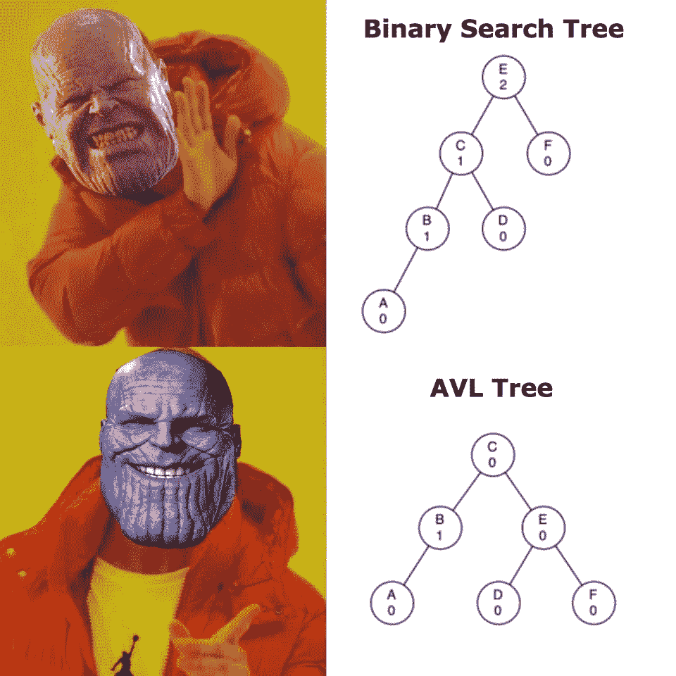
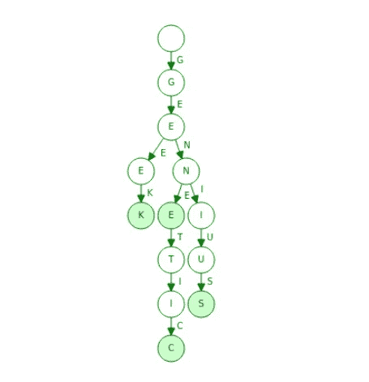

# 树，尝试，考验我的耐心…

> 原文：<https://towardsdatascience.com/trees-tries-and-trying-my-patience-ee5ce57bc9db?source=collection_archive---------37----------------------->

## 二叉树(AVL)和前缀树(尝试)到底是怎么回事

照片由 [niko photos](https://unsplash.com/@niko_photos?utm_source=unsplash&utm_medium=referral&utm_content=creditCopyText) 在 [Unsplash](https://unsplash.com/s/photos/tree?utm_source=unsplash&utm_medium=referral&utm_content=creditCopyText) 上拍摄

啊。臭名昭著的树。

如果你在计算机科学上花过时间(或看过任何编程迷因)，你一定听说过树。更确切地说是二分搜索法树。

像往常一样，在计算领域，事情与现实世界不太一样。所以，我们的树是颠倒的，根在上面。这是混乱的开始…

让我们试着通过保持简单来摆脱这个主题的迷雾。

# **二叉树分解**

二叉树是计算机科学中的一种数据结构，用于以一种更容易、更快地找到数据的方式存储数据，同时占用尽可能少的空间。

数据结构和算法——TutorialsPoint.com[树上的树](https://www.tutorialspoint.com/data_structures_algorithms/tree_data_structure.htm)

**关键词:**

*   节点—树上保存数据的点。
*   根-顶部的节点。只能是 1。
*   叶-没有子节点的节点。
*   高度—从叶到根的最长边数。
*   遍历/(al)-在树中移动。
*   父节点—上面有一个节点，下面至少有一个节点的节点
*   子节点—位于另一个节点之下的节点

每个节点在包含其数据的同时，还保存指向其下左右节点的指针[。这是能够遍历树的关键。](https://en.wikipedia.org/wiki/Pointer_(computer_programming))

Github 上的 [robotgyal](http://github.com/robotgyal) 在 Python 中的基本节点

二叉树真正重要的一点是它们速度很快。这部分是由于插入时数据是如何组织的。

> 小于的值向左，大于的值向右。

这允许 O(n)的时间复杂度。不是最好的。这是因为，通常情况下，这些树可能是不平衡的，即一边的数据比另一边多。它减慢了查找数据的过程，因为您必须遍历每个节点来查找数据。

*但是有解决的办法！*

# AVL 树

发布于 Reddit 上

AVL 树以发明家阿德尔森-维尔斯基和兰迪斯的名字命名，是一种自平衡树。

> 把它想象成一个以根/父为轴的跷跷板。一边太重会让你一事无成。

在不平衡的情况下，它将围绕节点移动，以便再次变得平衡。这些移动被称为**向左**和**向右旋转**。

点击此处了解更多信息:

<http://pages.cs.wisc.edu/~ealexand/cs367/NOTES/AVL-Trees/index.html>  

通过使树平衡，它将时间复杂度改变为 O(logn ),因为你将工作/搜索分成了每一步。从而使其成为最快的数据结构之一。

# 前缀树(尝试)

与二分搜索法类似的是 Trie 树，即前缀树。我们每天在发短信、使用谷歌或任何使用自动完成或预测文本的软件时，都会与这种类型的结构进行交互。

在 [Baeldung](https://www.baeldung.com/cs/tries-prefix-trees) 上尝试(前缀尝试)

当存储集合或字符串时，它非常有用并且非常快。它将存储单个字符以及指向其他节点的指针列表。

与二分搜索法的主要区别在于用于遍历的键是字母而不是数字(在图中显示为节点之间的字母)。

在这个例子中，如果你走最左边的路，你会得到“极客”，中间的是“基因”，最右边的是“天才”。

Trie 节点的基本结构:

Github 上的 [robotgyal](http://github.com/robotgyal) 的 Trie 节点

其中最关键的部分是子节点是最大为 26 的数组。这是因为英语包含 26 个字母，并且由于每个字符串都是按字符拆分和存储的，所以每个级别中的每个节点都有可能有 26 个可能的分支。

这种数据结构既可用于数据科学，也可用于环境输入分析，以解决单词搜索等单词难题。

# 结尾…？

…

号码

有更多的树。

对你来说幸运的是，我们不会一一列举(目前)。我们今天的目标是对这两者有一个高层次的概述，并在其中，当您更深入地实际编码它们时，使转换变得容易。

记笔记！它们对于计算机科学中的优化极其重要，因为它们有助于构建占用更少空间的更快的应用程序。

这就是未来，对吗？

# 资源

<https://www.tutorialspoint.com/data_structures_algorithms/tree_data_structure.htm>  <https://www.educative.io/edpresso/what-is-a-binary-tree>  <https://www.geeksforgeeks.org/complexity-different-operations-binary-tree-binary-search-tree-avl-tree/#:~:text=Therefore%2C%20searching%20in%20binary%20search,h%20is%20height%20of%20BST>  <http://pages.cs.wisc.edu/~ealexand/cs367/NOTES/AVL-Trees/index.html>  <https://ieeexplore.ieee.org/document/938073>  <https://www.baeldung.com/cs/tries-prefix-trees>  <https://en.wikipedia.org/wiki/Trie>  <https://www.hackerearth.com/practice/data-structures/advanced-data-structures/trie-keyword-tree/tutorial/>  <https://www.toptal.com/java/the-trie-a-neglected-data-structure> 