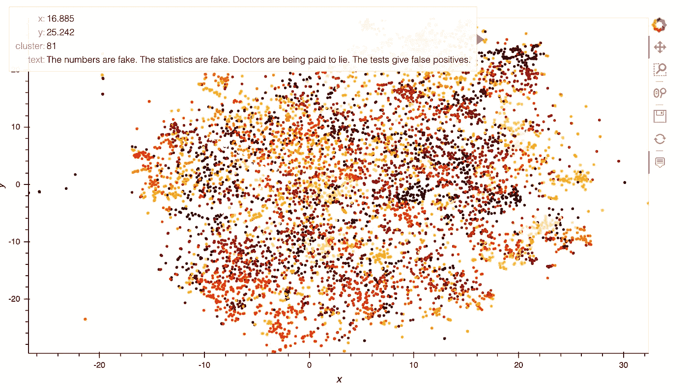
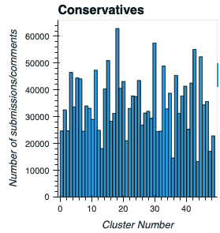
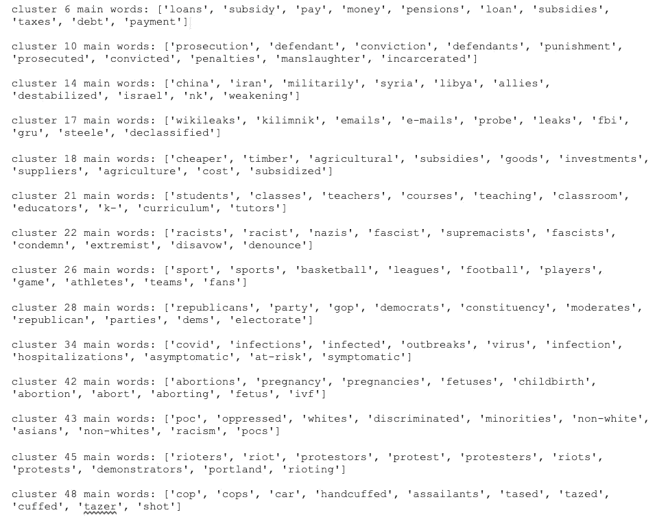
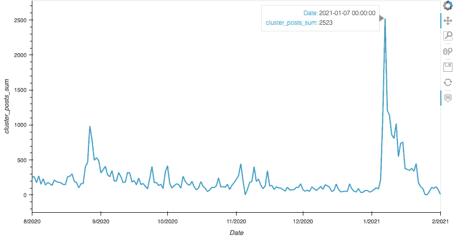
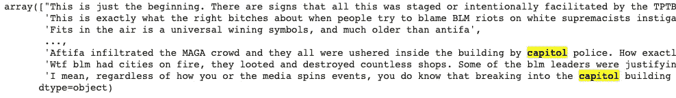
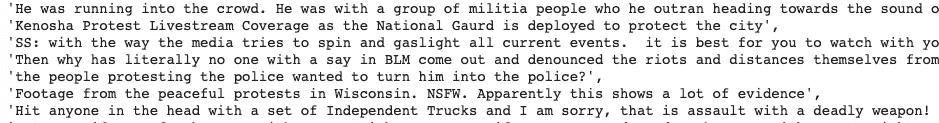

# 美国 2020 年大选期间 Reddit 上的热门话题

> 原文：<https://towardsdatascience.com/trending-topics-in-reddit-during-usa-2020-elections-8b25dd4fede9?source=collection_archive---------42----------------------->

## 使用主题建模和时间序列分析在 reddit 数据集中发现真实事件

在本帖中，我们将分享我们在主题建模和检测文本数据中真实事件方面的工作(代码和结果)。

## 正在下载 Reddit 数据集

首先，我们使用“pushshidt”API 下载 Reddit 数据。下面的代码使用开始日期、结束日期、子编辑名称和文本类型(可以是 submission 或 comment)来下载速率限制下的数据。我们在 2020 年 8 月 1 日至 2021 年 2 月 1 日期间下载了阴谋、保守派和民主党子编辑。

## 数据预处理

有了帖子和评论数据帧后，我们希望清理和预处理数据。对于每个提交，我们将“title”和“self-text”字段连接在一起，为帖子获取一个文本字段，对于评论，我们使用“body”字段获取文本。我们删除了“[已删除]”和“[已删除]”文本，并删除了没有日期的帖子和评论。

然后，为了对文本进行预处理，我们去除了停用词、数字和标点符号。我们把文本分成句子，句子分成记号。为了处理数据量和使用丰富的文本，我们只取长度大于 5 个标记的文本。我们准备了一个所有句子的列表，作为即将到来的模型的输入。

## 主题建模

为了找到一段时间内的趋势事件，我们首先要找到主题。为了获得每个子编辑的相关主题，我们执行了以下三个步骤。

1.  文本嵌入
2.  使聚集
3.  话题指示词

**文本嵌入** 我们首先要使用 NLP 嵌入技术将每个文本转换成一个向量。我们训练了两个模型:加权 word2vec 和通用语句编码器(USE)。

1.  ***加权 word 2 vec-****w*ord2 vec 是一种最先进的单词级嵌入，用一个神经网络隐层进行训练，将每个单词的上下文作为输入，并尝试预测与上下文对应的单词。我们使用这个方法，窗口大小为 5，嵌入大小等于 128。有了词汇表中每个单词的嵌入，我们希望得到整个帖子/评论文本的嵌入。为此，我们使用单词的 tf-idf 分数的加权平均值。下面的代码实现了此方法。

***2。通用句子编码器(使用)——***word 2 vec 方法的主要缺点是不考虑单词的顺序，并且单词的嵌入与它们提到的特定句子没有上下文关系。为了解决这些问题，我们使用了[通用语句编码器](https://amitness.com/2020/06/universal-sentence-encoder/)。主要思想是设计一个编码器，将任意给定的句子概括成 512 维的句子嵌入。USE 使用这种与 transformers 架构的嵌入来解决多个任务，并且基于它在这些任务上所犯的错误，语句嵌入被更新。因为相同的嵌入必须在多个通用任务上工作，所以它将只捕获最有信息的特征并丢弃噪声。直觉是，这将导致通用嵌入，该通用嵌入普遍转移到各种各样的 NLP 任务，例如关联性、聚类、释义检测和文本分类。为了获得每个句子的使用嵌入，我们使用 tensorhub 获得预训练的模型，并使用数据批次应用该模型。

**聚类**

在得到每个文本的向量表示后，我们使用 K-means 算法得到聚类。然后，每个提交和评论被分配到一个集群或一组前 5 个集群，代表每个文本由几个主题组成。我们使用 TSNE 方法来可视化文本嵌入向量和颜色来表示文本被分配到的簇。

TSNE 可视化的 128 嵌入大小，颜色指示集群。使用悬停显示相关文本。

直方图示例显示了使用使用嵌入为 Conservatives 子编辑的 50 个分类中的每个分类分配的文本数量分布。

**话题指示词**

我们希望为每个聚类分配描述该聚类的相关词，为此我们尝试了两种方法:
TF-IDF:我们使用每个聚类的文本中 TF-IDF 得分最高的词来表示主题。
接近质心:使用 K-means，我们得到了每个聚类的质心向量。我们计算了质心和词汇表中每个单词之间的距离。最接近的单词代表主题。

下面的代码实现了第二种方法，这种方法的性能优于 tf-idf。对于 word2vec，我们使用 word2vec 模型来获得与质心向量最相似的单词。对于使用，我们通过对每个单词应用使用模型来计算词汇表中每个单词的嵌入，然后我们计算嵌入后单词和每个词汇表单词之间的余弦距离，以获得最接近的单词。

使用上述方法的主题单词示例:

所选集群的前 10 个单词

## 检测真实事件

我们希望观察主题随时间的出现分布。鉴于社交媒体的性质，当相关事件发生时，用户倾向于增加围绕特定主题的讨论。因此，我们希望看到一个被高度提及的主题与一个具体的现实世界事件之间的相关性。我们希望区分现实世界的事件和日常对话，现实世界的事件激发了对潜在特定主题的讨论。为此，我们绘制了主题(集群)文本量(提交和评论)随时间的变化图，以检测可能指示事件的时间峰值。

主题群的时间序列示例: *['暴徒'，'暴动'，'抗议者'，'抗议'，'抗议者'，'暴动'，'抗议'，'示威者'，'波特兰'，'暴动']:*

为了深入研究每个峰值，我们打印与特定日期的相关主题相关的文本:

例如，在上述主题的时间序列中，我们可以在 7/1/21 看到一个主峰，在 27/8/20 看到一个次峰。

7 月 1 日 21 日，与该主题相关的提交和评论引发了一个真实的事件，即**暴徒在周三破坏了美国国会大厦的安全。**

与 21 年 7 月 1 日主题相关的课文范例。

对于小高峰，27/8/20 与该主题相关的提交和评论引发了另一个真实事件— **明尼阿波利斯虚假谣言骚乱，2020 年 8 月 26 日至 27 日。**明尼阿波利斯市中心发生骚乱，以回应 38 岁的非裔美国人埃迪·索罗(Eddie Sole Jr .)自杀的虚假谣言；示威者认为他是被警察射杀的。

与 27/8/20 主题相关的课文范例。

## 结论

我们在这里提出了一个完整的管道，使用主题分析方法和时间序列分析从 reddit 数据集中提取真实事件。所提出的方法显示了所提到的主题与特定的真实世界事件之间的高度相关性。上面包含代码和示例的管道提供了查找主题和探索主题、检测事件和深入理解它们的能力。您也可以在其他数据集上使用此管道和可视化。

感谢阅读！！！