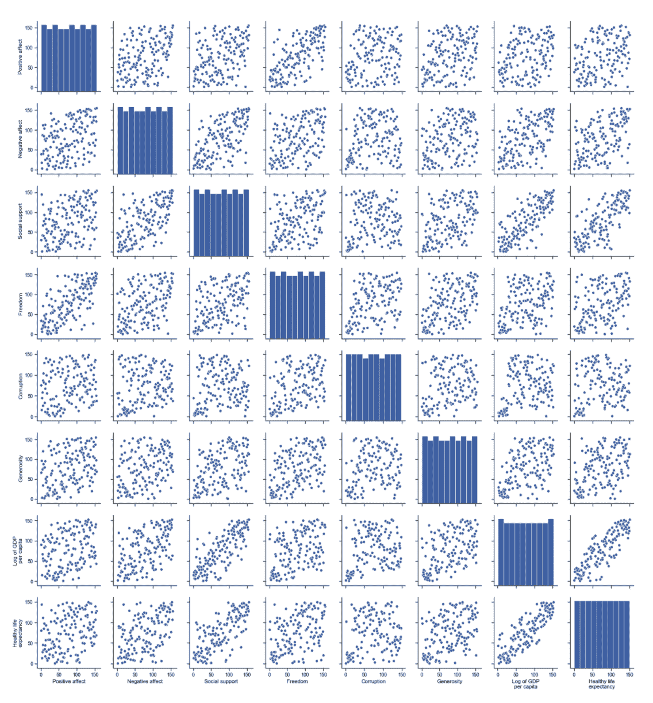
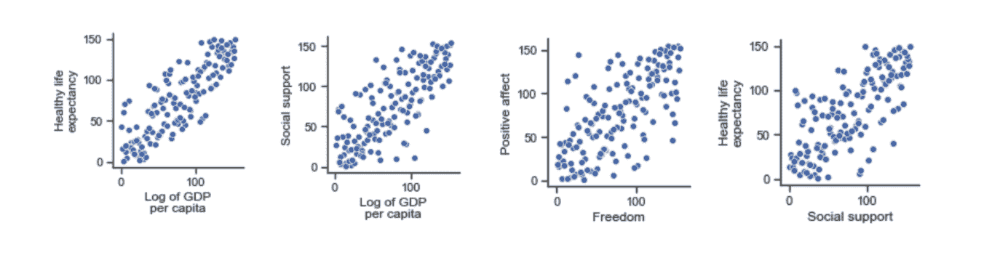
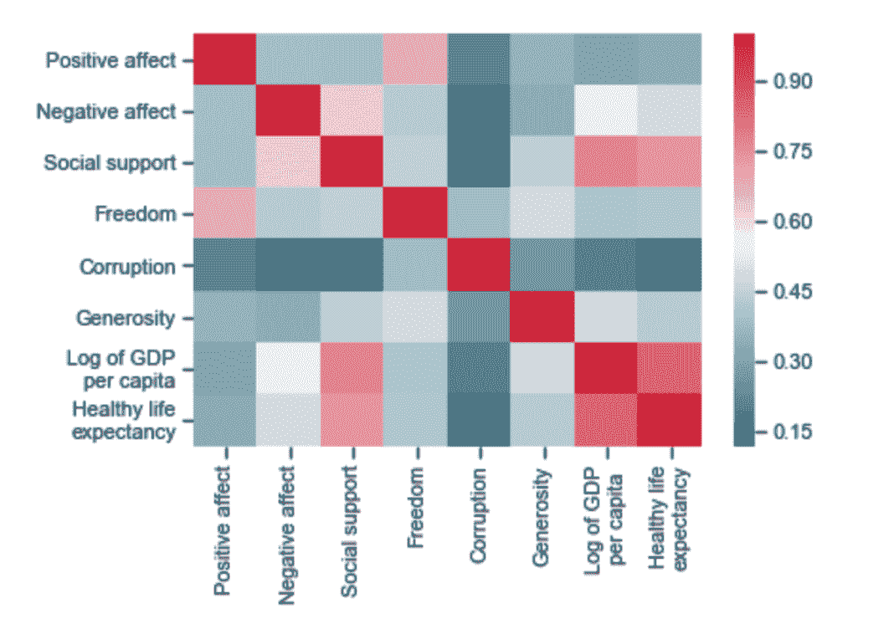
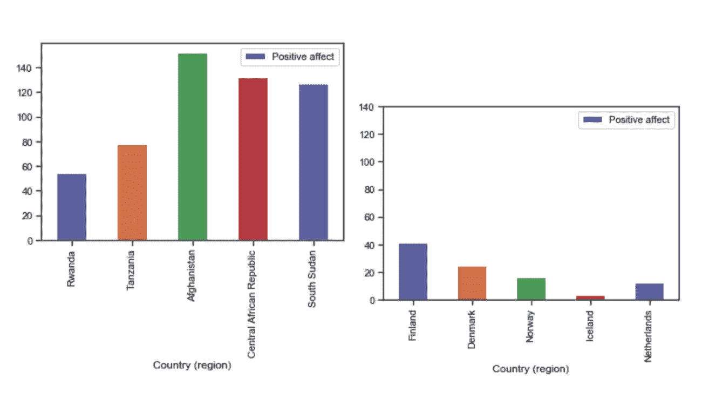
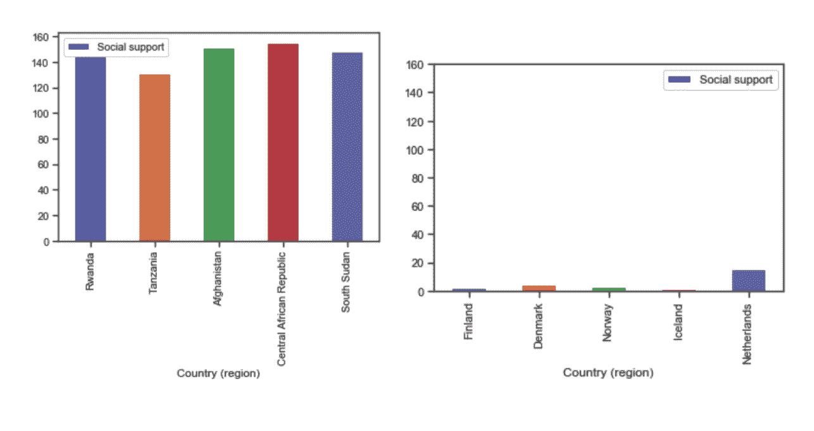
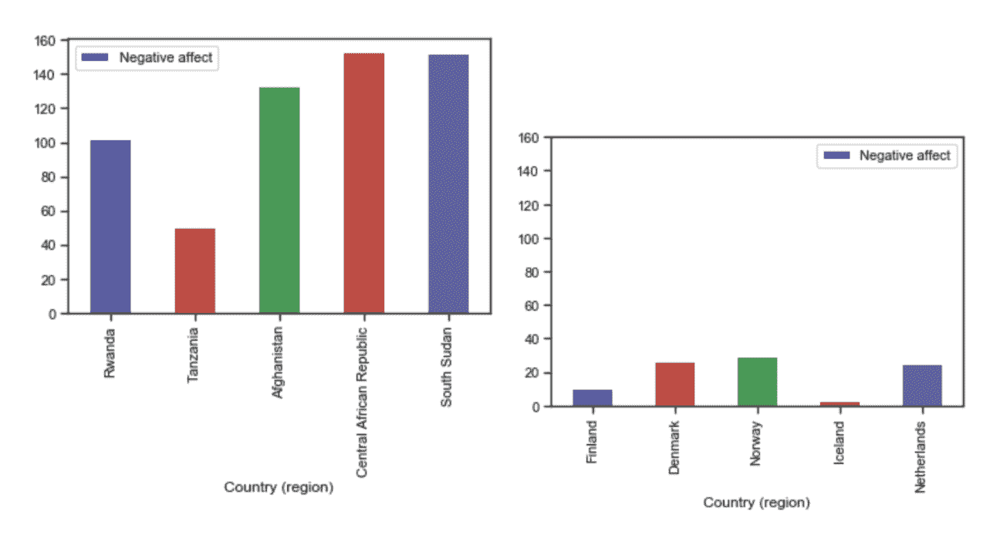
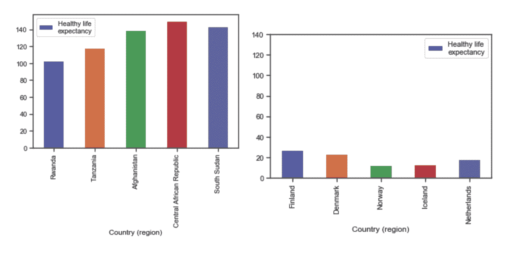
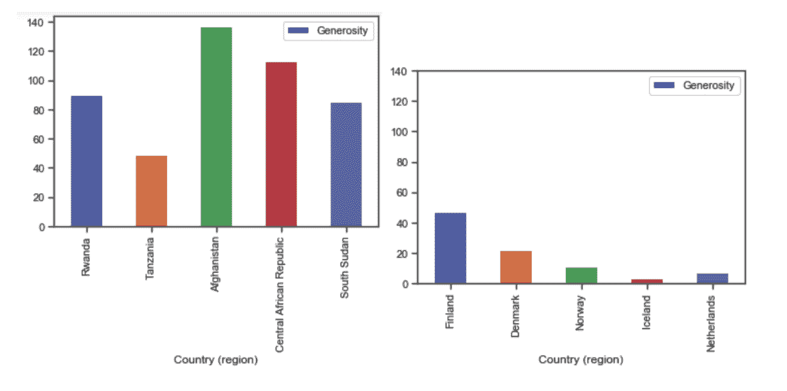

# 《世界幸福报告:联合国可持续发展解决方案网络》的趋势、分析、探索和进一步研究建议

> 原文：<https://towardsdatascience.com/trends-analysis-explorations-and-further-research-proposal-for-the-most-recent-world-happiness-9728cf0ac343?source=collection_archive---------65----------------------->

作者图片

## 世界幸福报告是由联合国可持续发展解决方案网络发布的。所有的数据清理、探索和分析都是我在 Jupyter 笔记本上使用 python 3 完成的，所有的数据可视化都是使用 python 中的可视化库 Matplotlib 完成的。

# 介绍

如果我们可以将 75 亿以上的人归结为几个最有助于幸福的关键趋势，他们会是什么样子？这将告诉我们，作为一个集体，我们是谁？它会告诉我们什么是我们最重视的，最终，什么与一个国家人口幸福感的增加最相关？我有一种冲动，想为这个项目选择某些国家，但我认为，同时查看我的数据中显示的所有国家，可以让我们得出一些有趣而直观的结论，这些结论是关于我们大多数人在人生旅程中不同阶段和程度上寻求的东西:幸福。

# 相互关系

需要进行进一步的研究来试图找到因果关系，但是因为我们的发现才刚刚开始，我们可以从一些基础开始。我们对全球 159 个国家/地区进行了调查，衡量标准如下:

**阶梯:**衡量生活满意度。

**正面情绪:**正面情绪的衡量标准。

**负面情绪:**负面情绪的衡量标准。

**社会支持:**社会支持对幸福分数计算的贡献程度。

**自由度:**自由度对幸福分数计算的贡献程度。

**腐败:**对腐败的感知对幸福得分的贡献程度。

**慷慨度:**慷慨度对幸福分数计算的贡献程度。

**人均 GDP 的对数:**GDP 对幸福得分计算的贡献程度。

**健康预期寿命:**预期寿命对幸福指数计算的贡献程度。

一下子鸟瞰这些数据有点令人望而生畏，但如果你快速浏览下面的内容，你会发现上述变量之间几乎没有强相关的集中区域。四个最值得注意的配对包括:“人均国内生产总值对数”和“健康预期寿命”，社会支持和“人均国内生产总值对数”，“健康预期寿命”和社会支持，以及“自由”和“积极影响”是最接近的聚类配对，具有最清晰、最线性的关系，有助于给人们带来最大幸福的因素。

作者图片

# 健康、幸福和繁荣

我们看过多少次经典的“健康、幸福和繁荣！”在贺卡上？当我们想要表达真诚的良好祝愿时，我们能想到的最好的是大量的健康、幸福和快乐(大概是和最亲近的人一起度过的)和富足，以及一种富足的感觉，一种比你想要的多一点的感觉。自由呢？事实上，没有这些，我们就出发了。但这到底是为什么呢？看一看这些更深刻的见解，可以让我们了解一点我们与幸福及其“内在组成部分”的关系。

# 主要趋势

回到上面提到的四个最值得注意的对:“人均国内生产总值对数”&“健康预期寿命”，社会支持&“人均国内生产总值对数”，“健康预期寿命”&社会支持，以及“自由”和“积极情感”，我们看到这四组之间的联系比其他任何一组都强。从以下四组数据中，我们可以观察到以下对幸福贡献最大的因素:

1.  国内生产总值与健康的预期寿命以及社会支持密切相关
2.  在预期寿命和国内生产总值健康的国家，社会支持是成比例的
3.  似乎更自由的社会有更大的积极影响

作者图片

# 更多问题！

这些趋势让我们提出了更多的问题。GDP 增长和高预期寿命哪个先来？人们是活得更长了，从而对 GDP 做出了更大的贡献，还是因为经济更健康、生活质量更高而活得更长了？是社会支持越多的国家越成功，还是国家的成功创造了更多的社会凝聚力？人们是因为社会中的自由而感觉更积极，还是消极的社会滋生了更多的威权主义？预期寿命的增长是因为社会纽带的增加，还是因为我们活得更长而创造了更多的社会纽带？

# 热图

也许再看一下这些趋势之间的关系，热图是最好的服务。下面，我们看到高相关性区域和低相关性区域:

作者图片

在影响力最低的领域中，我们会发现腐败。这是否是因为考虑到衡量一个国家生活质量和幸福的其他方面，腐败对幸福的影响最小？在地图上最温暖的区域中，我们再次看到社会支持、国内生产总值和健康预期寿命之间的密切关系，正如我们在前面的图表中观察到的那样。此后一个很好的探索领域是研究为什么腐败对大多数国家的平均影响如此微弱。腐败是意料之中而被忽视的吗？或者也许它是如此远离人们的视线和幕后，以至于它不会影响人们？

# 前 5 名和后 5 名分析

我们可以通过对 156 个国家中排名前 5 位(芬兰、丹麦、挪威、冰岛和荷兰)和排名后 5 位(卢旺达、坦桑尼亚、阿富汗、中非共和国、南苏丹)的分析，来研究我们列表中的一些趋势。我们选择了以下类别来区分有助于这两个群体幸福的因素:积极的情感、社会支持、消极的情感、健康的预期寿命，

作者图片

作者图片

作者图片

作者图片

作者图片

奇怪的是，其中一些类别给了我们一些令人惊讶的结果。与排名前五的国家相比，排名后五的国家从慷慨、社会支持、积极情感和健康的预期寿命中获得的快乐最多。关于这些社会，这告诉了我们什么？也许他们的社会是建立在相互依赖的共同价值观上的，这反过来影响了他们如何看待自己的整体生活质量(更积极)以及他们如何看待自己的健康和预期寿命。在我们研究的类别中，倒数五个国家在负面情绪上得分较高，这可能并不令人惊讶，因为这对他们的幸福有着比前五名更大的影响。

# 进一步研究建议

为了回答本报告中提出的一些问题，我们需要发现更多的数据来帮助我们探索这些关系，并尝试区分因果关系和相关性。发现哪些方面是驱动因素可以告诉我们很多关于加强我们的经济和优先考虑健康和福祉的一些社会效益，就像新西兰最近宣布的那样。

我们对名单中排名前五和后五的国家进行了比较，这也给了我们一些想要跟进的额外要点。其中最核心的问题是:在人类如何相互联系和相互依赖方面，最脆弱的国家能教给我们什么？为什么他们对幸福的贡献比排名前五的国家大得多？关于在一个高度不安全的国家生活的共同经历，他们能教给我们什么？

这些国家的公民更重视彼此，而不认为他们所拥有的幸福是理所当然的，这是真的吗？由于更强的目标感，艰苦会反过来创造更多的幸福吗？顶级国家的趋势是否向我们展示了舒适和机会滋生了进一步的个人主义、社会依赖性的丧失和自满？

# 研究提案大纲

问题是:

对于我们所观察的世界幸福的哪些方面导致了某种关系，或者它们是否有一种更复杂的关系，还存在困惑。更多地了解哪些研究指标对我们数据集中的国家的幸福贡献更大，将有助于我们在未来为这些国家的公民带来永久的幸福。我们知道，各国更幸福的公民会以数不清的、定性的、往往在幕后的方式极大地促进福祉，甚至提高生产率。虽然这是一项模糊的事业，但如果我们能更进一步了解这些关系，我们就能更进一步量化一些以前看不见的动态。

潜在的解决方案:

我们可以衡量因果关系的一个潜在方法是对那些最初向联合国科学与发展委员会明确要求因果关系的人进行调查，以便我们可以收集足够的关于幸福具体影响因素的数据。没有对驱动因素的更多探索，那些与幸福增加最直接相关的因素，我们就无法确定因果关系，所以这可能是确定因果关系的自然下一步。

测试溶液的方法:

与其通过哪些因素对他们的幸福最积极的背景来理解这些关系，我们可以要求被调查的人群对他们幸福的前五名贡献者进行评级。这将使我们能够量化哪些因素会增加被调查者的幸福感。给排名第一的贡献者分配递减值 5，给排名第二的贡献者分配递减值 4，以此类推，这将允许我们给每个幸福因素一个可量化的值，我们可以用它来做进一步的研究。

设计的第一步是精心设计五大品质。鉴于上面提到的主要趋势，我们可以使用每个集合中的值来尝试和衡量层次结构。我们将要求被调查者对以下因素进行评分，从 1 到 5，5 为最高因素:“人均 GDP 对数”、“健康预期寿命”、“社会支持”、“自由”和“积极影响”。为了解释我们不知道的任何固有偏见，我们可以每隔六个月进行两次调查。如果有超过 5%的差异，我们可以平均的 delta。

暂停怀疑和夸大可能性的领域，我们还可以在 2019 年世界幸福报告中看到的国家内对这些因素本身进行大规模的改变，看看参与者是否对他们的答案做出任何改变。因为我们是在非常主观的能力下工作，拥有迭代和步骤将允许我们从记录数据的任何变化中获得洞察力。实验第一部分的参与者可能不会准确地给他们的答案打分。为了说明这一点，我们需要创建一个场景，其中有一个对照组，因为观察到的数据可能过于主观。为了模拟随机对照试验，我们可以确定我们想要评价的所有因素，在我们的例子中是上面提到的五个因素，并分析从初始调查中观察到的数据，以便梳理出一个因素相对于其他因素的重要性。

从我们在发生重大变化后收集的第二组数据中，我们可以将注意力转向两对可能具有类似动态的国家。在我们的案例中，我们从前五名和后五名名单中选择了两个国家:芬兰和挪威，以及卢旺达和南苏丹。我们选择这两对的兴趣是分析它们的相似性和差异性，努力在两对之间找到一些复合趋势。