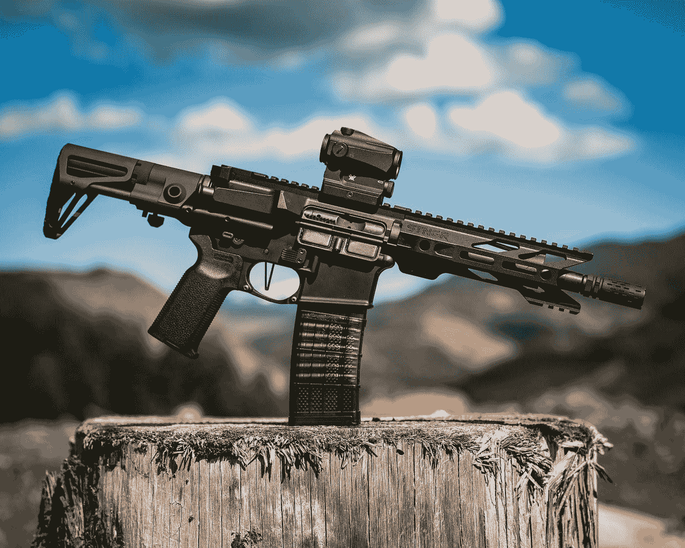
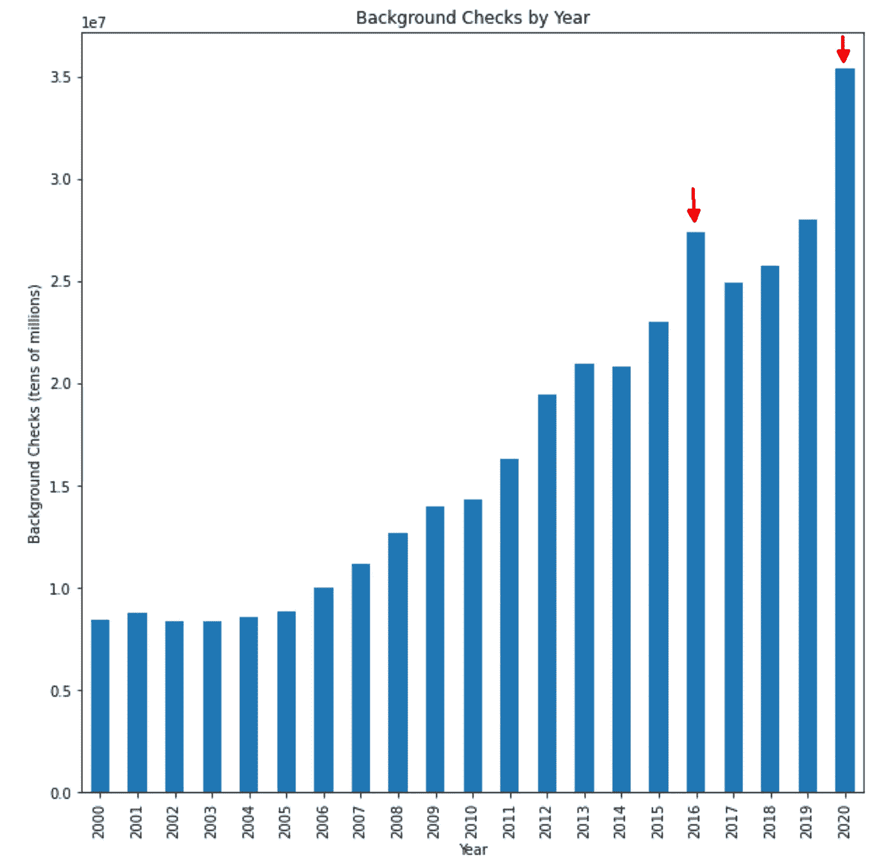
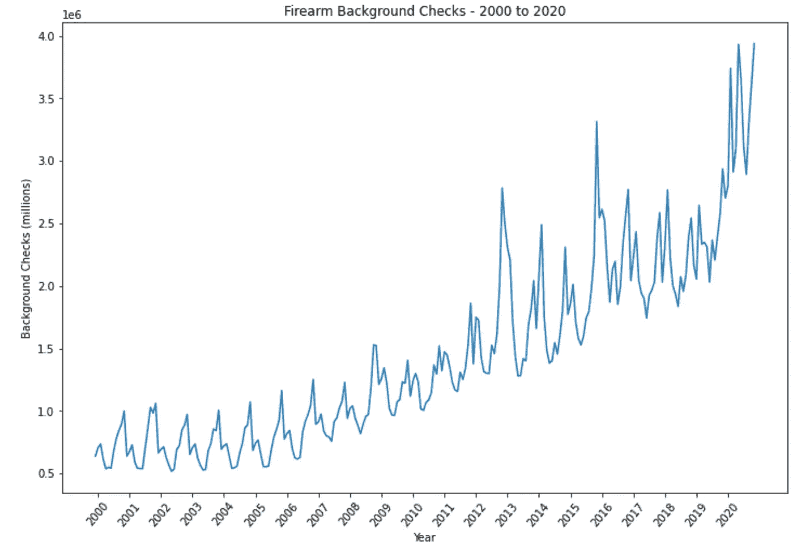
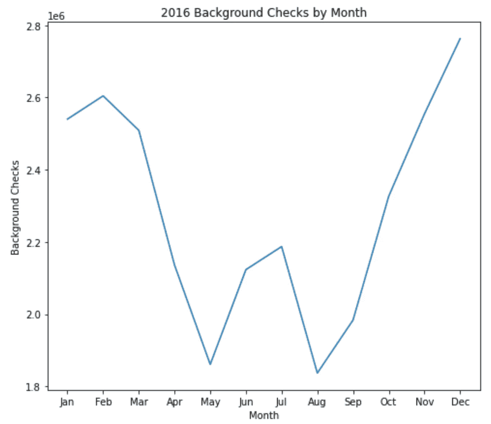
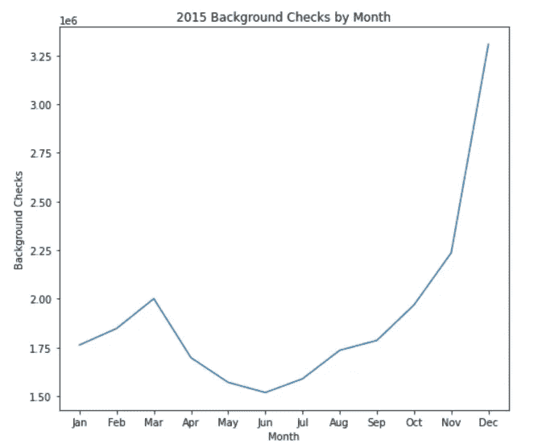
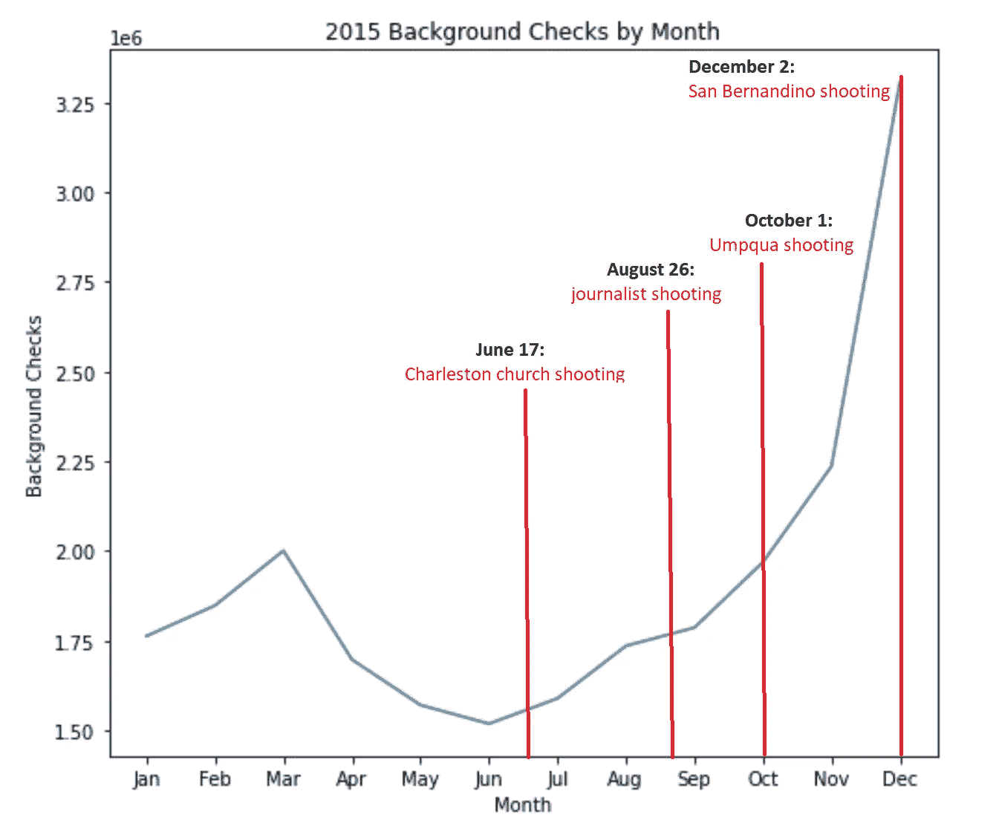
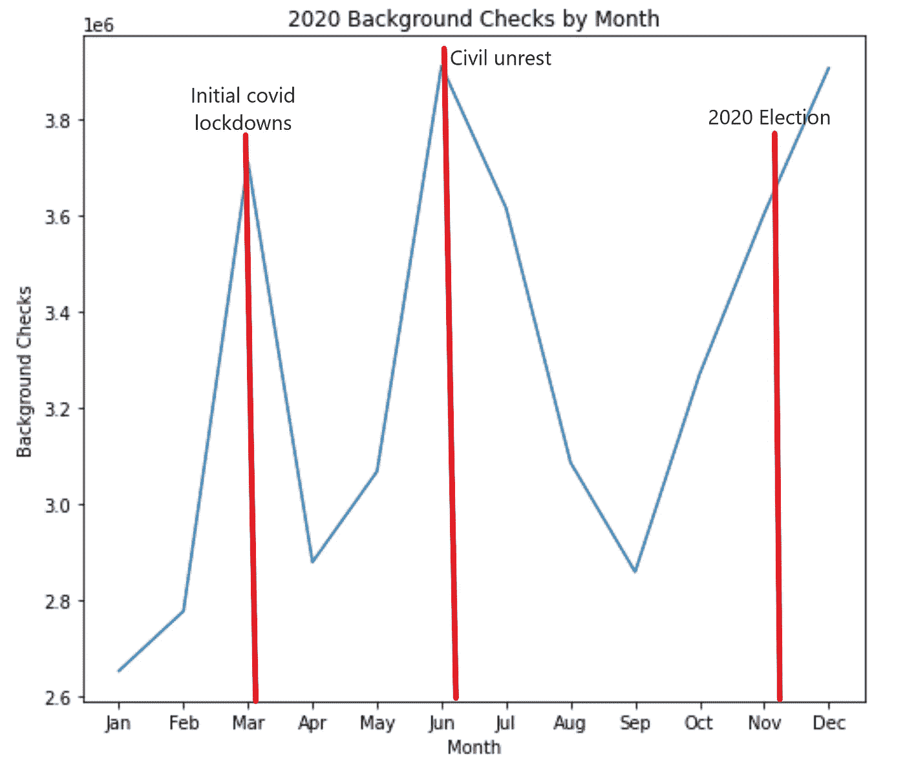
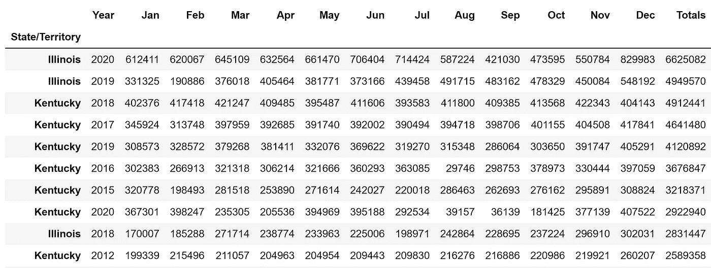
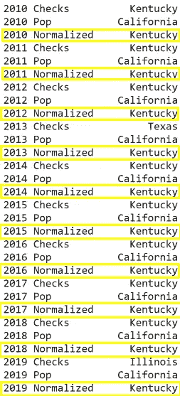
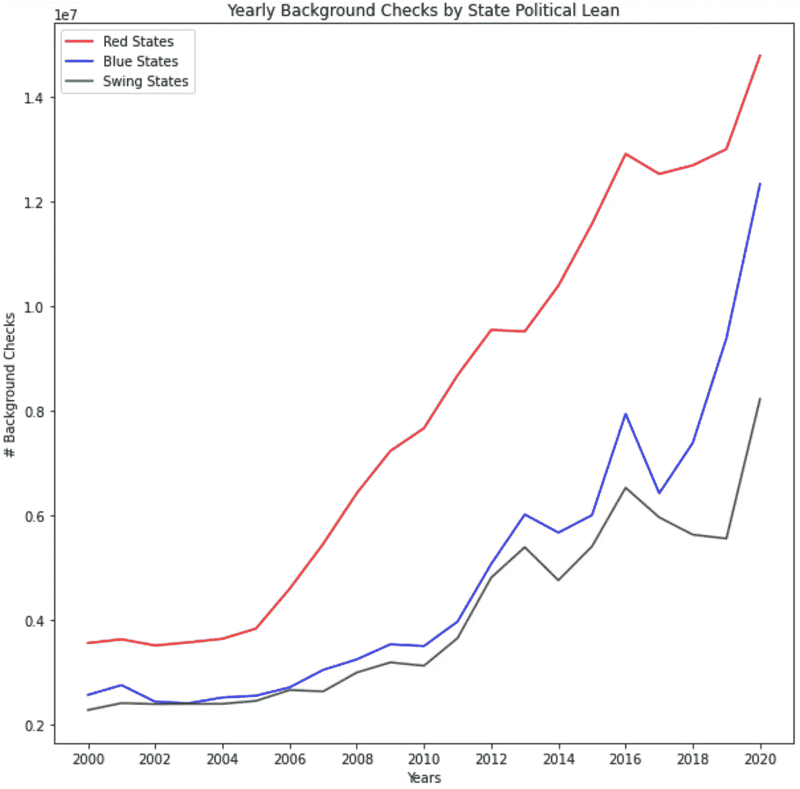

# 枪支背景调查的趋势

> 原文：<https://towardsdatascience.com/trends-in-firearm-background-checks-802a7c74734a?source=collection_archive---------45----------------------->

## 从 2000 年到 2020 年的背景调查数据可以洞察美国枪支的购买趋势



在 [Unsplash](https://unsplash.com?utm_source=medium&utm_medium=referral) 上由 [STNGR Industries](https://unsplash.com/@stngr?utm_source=medium&utm_medium=referral) 拍摄的照片

2020 年是美国相当多事的一年，其间有冠状病毒疫情、内乱、*和*混乱的总统选举。在这些事件和更多事件之间，一种共同的感觉在今年很突出——不确定性。不确定感似乎经常导致枪支销售的增加，今年不确定性的三重打击导致许多头条新闻讲述了全国各州枪支下架的情况。

这让我对美国的枪支销售趋势感到好奇。不幸的是，没有购买枪支数量的数据。然而，我们确实可以使用下一个最好的东西——购买这些枪支所需的背景调查。我将首先理解背景调查与购买的枪支不是 1:1 的关系，因为你可以完成背景调查，或者 1。)检查失败或 2。)通过检查，但决定不继续购买。

然而，我认为对于第一次刺伤分析来说，这是非常接近的，因为在某种程度上，这些数字可以被同一笔交易中购买的多支枪抵消(每笔交易只需要一次检查)。

使用的数据来自国家即时犯罪背景调查系统(NICS ),我使用了 2000 年至 2020 年的 20 年间的数据，这些数据按州和月份细分。让我们先看看每年的总数。



图片作者。

大约从 2006 年开始，我们看到一个相对稳定的增长，一直持续到 2016 年不成比例的峰值。不出所料，2020 年背景调查也会大幅增加。我认为假设选举年导致枪支购买激增是合理的。2012 年和 2016 年都比前几年增长了 19%，而 2020 年比 2019 年增长了令人难以置信的 26%。

为了给数据添加更多的粒度，让我们重现上面的图表，但是是每月一次。



背景调查记录的循环性质特别有趣。一般来说，较大比例的检查发生在下半年。图片作者。

让我们按月分解 2016 年，看看大部分增长是从什么时候开始的。



图片作者。

背景调查，以及随之而来的销售，在 8 月份真正开始回升。随着 2016 年总统选举日的临近，每位候选人都开始阐述自己的政策立场。在 2016 年 8 月 9 日的一次集会上，唐纳德·特朗普曾说:

“希拉里想要废除——实质上是废除第二修正案。”

虽然第二修正案是特朗普 2016 年竞选期间的一个常见平台优先事项，但特朗普后续声明的新闻周期中，这个特定片段的生命更长，因为它具有争议性而迅速传播:

“如果她能选择自己的评委，你们就无能为力了，伙计们。虽然第二修正案的人——也许有，我不知道。”

几天后的 8 月 10 日，全国步枪协会购买了 300 万美元的播放时间，用于希拉里·克林顿枪支管制政策的广告。似乎 8 月份是在选举前的一段时间里出现了一种占主导地位的“枪支权利处于危险之中”的叙事，对此，更高比例的美国人做出了购买更多枪支的回应。

让我们看看 2015 年，看看我们在 2016 年 1 月/2 月看到的增长是从哪里开始的。



图片作者。

年底支票数量激增，尤其是在 12 月。12 月发生了什么？加州圣贝纳迪诺枪击案。事实上，2015 年发生了不少枪击事件，其中许多事件(如下面确定的枪击事件)都是围绕增加枪支管制措施进行的讨论。



图片作者。

很有可能其他因素也在这一增长中发挥了作用，但这是我能注意到的最明显的趋势。对于去年的具体细分，让我们看看 2020 年的事件如何影响过去一年的背景调查。



火器背景调查显示 2020 年的过山车。图片作者。

背景调查的增加清楚地代表了 2020 年的三大事件(至少在恐惧和不确定性方面)。新冠肺炎最初的封锁始于 3 月中旬，随着乔治·弗洛伊德(George Floyd)于 5 月 25 日去世，6 月份爆发了大规模的民众骚乱。2020 年大选及其后的余波也导致背景调查和枪支购买的增加，从 10 月开始，一直持续到 12 月。2020 年总共有超过*3500 万*背景调查，比 2019 年增长 26%。

这种说法非常符合当前枪支和弹药购买条件的现实——弹药的购买速度超过了补充库存的速度，如果不支付令人难以置信的价格，很难买到枪支。2020 年 3 月，联邦调查局的 NICS 系统甚至被破纪录的枪支 sales⁴.数量淹没

# 国家级分析

为了查看州级分析，我想从查看哪些州在 20 年间记录的总数最高开始。



伊利诺伊州和肯塔基州的居民购买大量枪支！图片作者。

伊利诺伊州获得背景调查数量最多的奖项，2020 年记录了超过 660 万次调查！为了更好地理解与各州人口相关的数据，我加载了另一个数据集，其中包含 state⁵. 2010 年至 2019 年的人口估计数该数据集没有 2020 年的人口数据(因为一旦 2020 年人口普查数据发布，就会提供人口数据)，但让我们来看看按州人口统计的标准化数据。

通过将背景调查的次数除以该州当年的人口数，获得各州人口的标准化值。

这将产生一个新的数据帧，其中包含状态检查、填充和标准化值。通过找到每一列的最大值，我们可以看到哪个州的人口检查次数最多

```
maxValue = state_normalized.idxmax()
print(maxValue)
```



肯塔基买了很多枪！图片作者。

在 2010 年至 2019 年期间，肯塔基州对每个州人口的背景调查量最高。如果我们使用肯塔基州 2020 年的人口估计值 4，474，190，那么肯塔基州在 2020 年的人口比率也将是最高的。在这个范围内的 10 年中的 8 年里，肯塔基州也是独立于人口规模进行检查次数最多的州。2017 年和 2018 年，人口归一化比值大于 1，意味着肯塔基州每 100 人进行 104 次(2017 年)和 110 次(2018 年)背景调查。这个数据的一个缺陷是，我无法按年龄组定位估计的州人口。最终，只过滤大于或等于 18 岁的年龄(从经销商处购买枪支所需的最小年龄)是最理想的。

我没有一个假设来解释为什么肯塔基州在背景调查和每年购买枪支的数量上如此异常。虽然它被认为是一个枪支友好的州，但从 referenced⁶.的一些来源来看，它并没有打破前五名在 2018 年肯塔基州的归一化值为 110%时，得分次高的是西弗吉尼亚州，为 39.38%。

在州一级的分析中，我也对各州的政治倾向感到好奇，因为枪支是一个固有的政治话题。为了简单起见，我根据 2020 年的选举结果将各州分为红色、蓝色和摇摆州。这可以通过反映基于 20 年期间每次大选结果的倾向而变得更加准确。

然后，我根据这些值和背景检查总数进行分组，并绘制出结果。



图片作者。

虽然从 2011 年开始，所有州的背景调查都出现了更大的增长，但红州从 2005 年左右开始购买更多的枪支。虽然蓝色州和摇摆州的枪支年购买量波动较大，但红色州的居民一直在不断增加每年的枪支购买量(看看你，肯塔基州！).

根据这一分析，背景调查以及通过代理人购买枪支的情况似乎在不稳定和不确定时期有所增加。背景调查的数量每年都在增加，与选举年前后相比，选举年的背景调查数量更大。红州比蓝州或摇摆州购买更多枪支，平均而言，从 2005 年到 2017 年左右，购买率更高。自 2010 年以来，肯塔基州拥有每年进行最多背景调查的记录。

这个分析的代码可以在我的 github 这里找到:[https://github.com/jspitze](https://github.com/jspitze)。感谢阅读！

# 参考

1.  https://www.fbi.gov/services/cjis/nics
2.  [https://www . NBC news . com/politics/2016-election/trump-campaign-defense-2nd-amend-comment-n 626601](https://www.nbcnews.com/politics/2016-election/trump-campaign-defends-2nd-amendment-comment-n626601)
3.  [https://www . Washington times . com/news/2016/aug/10/NRA-takes-伪君子-希拉里-克林顿-new-tv-ad/](https://www.washingtontimes.com/news/2016/aug/10/nra-takes-hypocrite-hillary-clinton-new-tv-ad/)
4.  [https://www . Washington examiner . com/Washington-secrets/FBI-300-spike-in-gun-buy-checks-big-backlog-shut down-threated](https://www.washingtonexaminer.com/washington-secrets/fbi-300-spike-in-gun-buy-checks-huge-backlogs-shutdown-threatened)
5.  [https://www . census . gov/data/tables/time-series/demo/popest/2010s-state-total . html](https://www.census.gov/data/tables/time-series/demo/popest/2010s-state-total.html)
6.  [https://www . theburningplatform . com/2020/04/12/the-most-and-less-gun-friendly-States/](https://www.theburningplatform.com/2020/04/12/the-most-and-least-gun-friendly-states/)，[https://www . gunsandammo . com/editorial/best-States-for-gun-owners/369075](https://www.gunsandammo.com/editorial/best-states-for-gun-owners/369075)