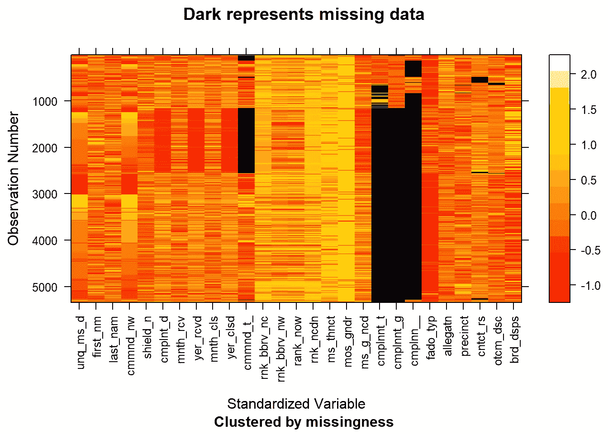
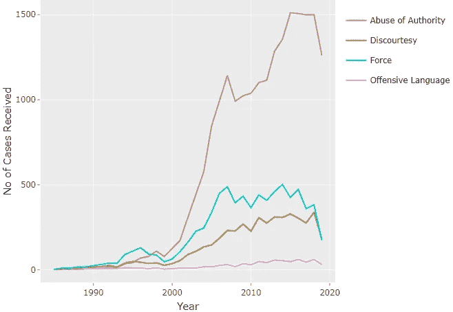
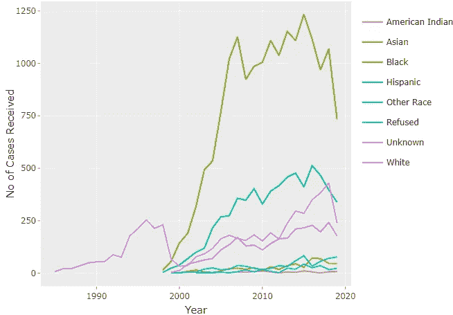
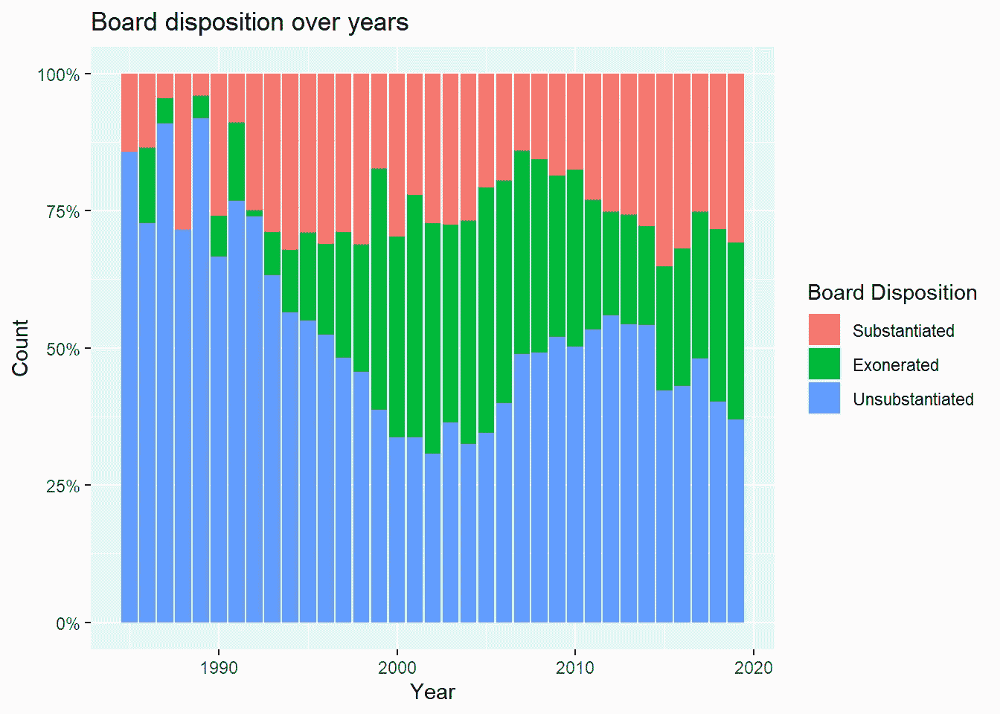
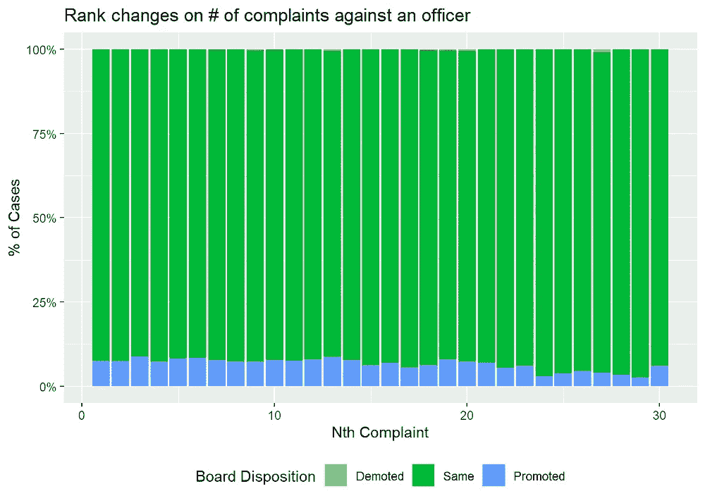
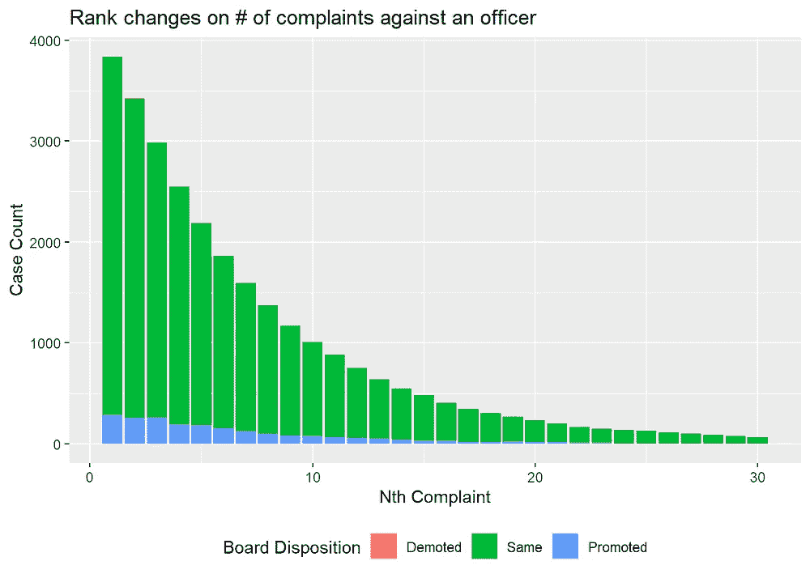
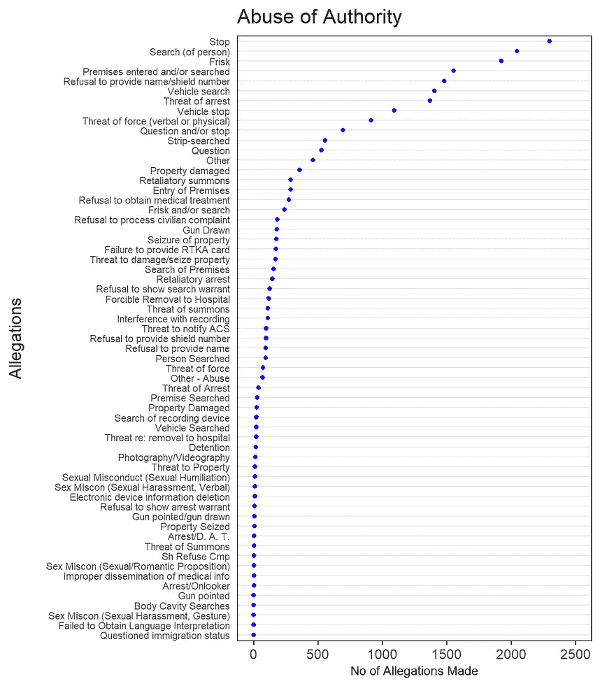
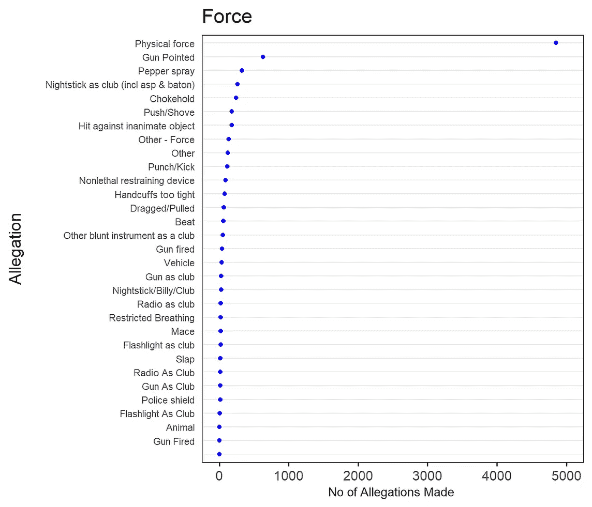
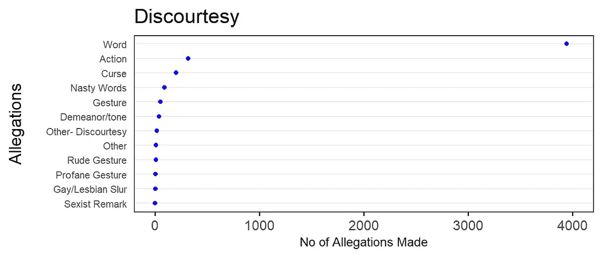
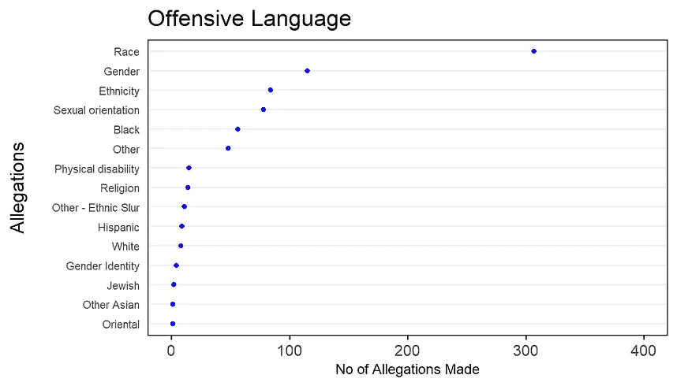

# 纽约市警察不当行为案件的趋势

> 原文：<https://towardsdatascience.com/trends-in-police-brutality-cases-in-nyc-f3c591731438?source=collection_archive---------32----------------------->

照片由[马太·亨利](https://burst.shopify.com/@matthew_henry?utm_campaign=photo_credit&utm_content=Browse+Free+HD+Images+of+Person+Holds+Sign+Over+Head+In+Protest&utm_medium=referral&utm_source=credit)从[爆出](https://burst.shopify.com/city?utm_campaign=photo_credit&utm_content=Browse+Free+HD+Images+of+Person+Holds+Sign+Over+Head+In+Protest&utm_medium=referral&utm_source=credit)

## ProPublica NYPD 平民不当行为数据集的可视化分析

1976 年实施的第 50-a 号立法拒绝向公众披露警方记录，以防止刑事辩护律师在交叉询问中使用这些记录。2020 年 6 月 12 日，纽约州废除了这项法律。**非营利组织 ProPublica** 提交了记录请求，并根据[条款和条件](https://www.propublica.org/article/nypd-civilian-complaint-review-board-editors-note)向公众提供了这些数据。

我们分析了这些数据，以捕捉纽约市多年来基于种族的警察暴力趋势以及此类案件对警察的相应影响。

# 数据集

我们使用了由 [**ProPublica**](https://www.propublica.org/datastore/dataset/civilian-complaints-against-new-york-city-police-officers) 提供的**市民对纽约市警察的投诉**数据集

*   该数据集于 2020 年 7 月发布。
*   该数据集包含 33 358 起文职人员不当行为案件的细节。
*   记录时间跨度从 1985 年 9 月到 2020 年 1 月。

**重要提示:**

> 这个数据库列出了 NYPD 36000 名现役军官中的 4000 名。数据库中的每一名警官都有过 ***至少一项经证实的指控*** *。我们排除了调查人员认为没有发生且被认为毫无根据的任何指控。”*[*ProPublica*](https://projects.propublica.org/nypd-ccrb/)

# 数据转换

我们利用 R tidyverse 进行此分析，重点关注`ggplot2` 和`dplyr`封装。

整个分析是作为一个 [bookdown](https://bookdown.org/) 完成的，它是一个[开源的 R 包](https://github.com/rstudio/bookdown)，便于编写带有 R Markdown 的长格式报告。

虽然主数据集很容易开始，但我们必须创建一些新的变量来揭示一些有趣的发现。

*   创建了新的变量`rank_after`,该变量是从针对同一名官员的下一次投诉中为每名官员计算的线索`rank_incident`。
*   由官员根据投诉的时间顺序创建`nth_complaint`变量。

# 缺失值分析

为了了解缺失值的任何趋势，我们使用了 r 中的`mi`包。该包允许用户了解并有效地估算缺失值。我们利用该包来生成缺失值聚类。

1.  在用于分析的列中，只有`complainant_ethnicity`、`precinct`、`complainant_age_incident`、`complainant_gender`的值缺失
2.  很明显，在大多数情况下，年龄、性别、种族的缺失值同时出现，这可能是由于记账效率低下造成的。

为了进行此分析，对数据进行了转换，所有缺失值都被标签“*未知*”所替代。

# 警察不当行为案件的时间趋势

我们首先根据不同的分类来看数据的时间趋势。

## **按指控类型分列的不当行为案件**

**按案件类型分列的不当行为案件**

针对 NYPD 警官的案件数量正在上升，滥用职权案件的增长速度令人担忧。

21 世纪初，各类警察不当行为案件激增。虽然 2010 年代这一增长趋于稳定，但病例总数仍然高得令人担忧。

**按投诉人族裔分列的不当行为案件**

**按投诉人族裔分列的不当行为案件**

当按投诉人的种族划分时，出现了一个明显的趋势，即少数民族社区(主要是黑人和西班牙人)的病例增加最多

尽管白人占纽约市人口的大多数，但报道的白人暴力事件的数量仍然可以忽略不计。

这表明纽约市警察不当行为案件中存在明显的种族偏见

**注:**数据集仅包括已结案的案件，并已宣布结果。我们在图的最后看到的数字下降可能是由于大量案件仍在审查中。

## 一年来董事会的处置情况

然后，我们查看了这些年来董事会成员的分布情况。

近年来，证据不足的案件在减少，而证据确凿和证明无罪的案件在增加。

这可能要归功于该市**民事投诉审查委员会** (CCRB)职能的改善

然而，一个令人担忧的观察结果是无罪案件的激增，约占近年来报告案件总数的三分之一。

当*调查人员断定一名平民所指控的事情确实发生了，但该行为被 NYPD 规则所允许时，该案件被归类为无罪。这通常在各种"使用武力"的案件中被利用，在这些案件中，官员有很大的酌处权。*

> 前 CCRB 调查员丹·博达(Dan Bodah)说，“我免除了数以吨计的案件，这些案件涉及的恶劣行为符合指导原则。”他现在在维拉司法研究所研究警察监督。“这有点令人难以忘怀。法律和政策给了警察很大的自由裁量权。”*来源:* [*ProPublica*](https://www.propublica.org/article/nypd-civilian-complaint-review-board-editors-note)

# 不当行为案件对警官的影响

为了了解这些不当行为案件对警察的影响，我们研究了随着指控案件数量的增加，至少有一项指控属实的警察级别的变化

1.  总体而言，随着针对该官员的案件数量增加，似乎没有对该官员的级别产生负面影响(以降级的形式)
2.  即使收到 20 多份投诉，仍有相当多的官员继续得到晋升。
3.  尽管我们注意到，随着针对他们的案件数量的增加，警察人数有所减少，但这些数字仍然不令人鼓舞。

2020 年，警察队伍中有 1000 多名警察在职业生涯中收到 10 次或更多投诉，他们继续以类似于收到一次投诉的警察的速度晋升。

# **结论**

尽管有一段黑暗的历史，但 NYPD 正显示出改善的迹象，从公开其记录开始。这有助公众评估警队需要改善的地方，以便为市民提供更佳服务。

有明显的迹象表明，NYPD 的各个阶层之间存在着巨大的差距。从固有的种族偏见，多年的疏忽，到支持甚至奖励这种行为的制度。需要从各个方面做大量工作来改善这种情况。

虽然前面还有很长的路要走，但通过采取积极的行动和保持开放的对话，就有希望实现更美好的未来。我希望这一分析将有助于在更深层次上理解这些问题，并促使决策者和其他利益相关者做出有影响力的决定。

我们使用 r 对这个数据集进行了更广泛的分析。读者可以在这里找到我们发布的[版本，在这里](https://smarthxg.github.io/police-brutality-nyc)找到代码

我要感谢我的同学 Aditya Koduri 对这一分析的重大贡献。没有他，这篇文章是不可能完成的。

如果您有任何问题，可以通过 smarth.g@columbia.edu[联系我。在](http://smarth.g@columbia.edu) [LinkedIn](https://www.linkedin.com/in/smarth-gupta/) 和 [Twitter](https://twitter.com/smurphyxg) 上关注我。

数据集可以在[这里](https://www.propublica.org/datastore/dataset/civilian-complaints-against-new-york-city-police-officers)找到

另一篇在地区层面探索数据集方面做得很好的中型文章:[可视化 ProPublica NYPD 文件](https://medium.com/@_blahblahblah/visualizing-the-propublica-nypd-files-41c0ccc8a156)

**谢谢！**

我给读者留下了一些显示指控类型收到的投诉的频率图。

> “[肉体力量](https://projects.propublica.org/nypd-ccrb/allegations/force-physical-force)指控近 5000 个，“[搜身](https://projects.propublica.org/nypd-ccrb/allegations/abuse-of-authority-frisk)指控近 2000 个，“[枪尖](https://projects.propublica.org/nypd-ccrb/allegations/force-gun-pointed)”指控 600 多个

“[肉体力量](https://projects.propublica.org/nypd-ccrb/allegations/force-physical-force)指控近 5000 个，“[搜身](https://projects.propublica.org/nypd-ccrb/allegations/abuse-of-authority-frisk)指控近 2000 个，“[枪尖](https://projects.propublica.org/nypd-ccrb/allegations/force-gun-pointed)指控 600 多个。”