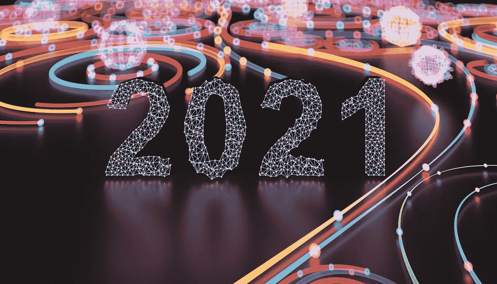
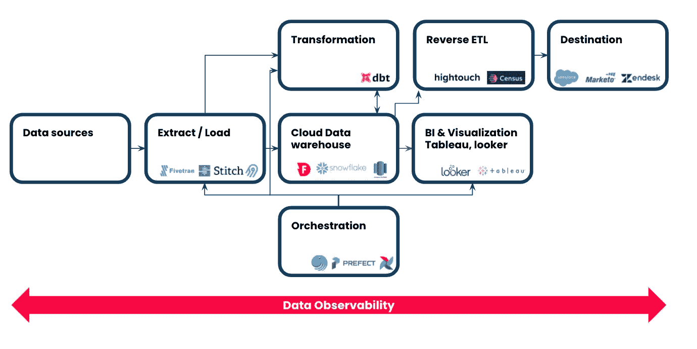

# 塑造 2021 年现代数据堆栈的趋势

> 原文：<https://towardsdatascience.com/trends-that-shaped-the-modern-data-stack-in-2021-4e2348fee9a3?source=collection_archive---------5----------------------->

## 数据集成 2.0、数据网格、数据仓库性能和数据可观察性。对于数据和分析来说，这是丰富的一年。

来源:盖蒂图片社 Istock

如果我要选择三个主题来描述现代数据堆栈的状态，以及 2021 年大多数数据领导者的首选，它们将是速度、自主性和可靠性。

*   **速度**:现在每个人都想访问数据。许多新技术使这成为可能，并允许组织在扩展时支持甚至最复杂的分析用例。
*   **Autonomy** :自助服务分析在 2021 年继续蓬勃发展，该领域出现的一些神奇工具使其变得更加可能。随着 ELT 成为新的 ETL，反向 ETL 使业务用户能够操作仓库中的数据，数据集成变得前所未有的简单。
*   **可靠性**:每家公司都希望成为数据驱动型公司，但几乎每家公司在处理数据时都面临着缺乏信任的问题。数据可靠性是一个总括术语，涵盖了从基础设施的可靠性到数据本身的可靠性等概念。虽然我们可能无法完全区分这两者，但后者在过去几年中获得了显著的曝光，并成为数据基础设施和工具领域中的一个新类别。

按照同样的思路，以下是我的观点，2021 年塑造现代数据堆栈的 5 个趋势，以及其中一些趋势将如何在 2022 年继续流行。

1.  **数据和数据堆栈的民主化**
2.  **数据集成变得更加简单:ETL 到 ELT 和反向 ETL**
3.  **性能和速度:每个人都想要数据，昨天**
4.  **数据网格**
5.  **数据可观察性**

## **1。民主化:数据和数据堆栈。**

根据定义，民主化是让每个人都能获得某些东西的行动。随着公司努力变得更加数据驱动，他们已经做出了相当大的努力来确保组织中的每个人都可以访问相关数据。强调“相关”。民主化始于在内部建立正确的流程，并确保每个人在涉及数据时使用相同的语言，这是臭名昭著的唯一真理来源。

数据素养在采用数据驱动的文化中扮演着重要角色。几十年来，在某些情况下，处理数据过去是、现在仍然是一小部分人的专利。今天，数据基础设施和工具领域出现了许多公司和技术，它们甚至允许最不专业的技术人员利用数据(稍后将详细介绍反向 ETL)。您不再需要成为一名 *SQL 忍者*来支持基本的运营分析用例。

## **2。数据集成变得更容易** : **ELT 是新的 ETL** 。

ETL 是 Extract Transform Load 的缩写，是根据 E、T 和 l 三个步骤通过 ETL 管道将数据从一个点移动到另一个点的过程。在实践中，首先，从一个或多个源(通常是 SQL 或 NoSQL 数据库)提取数据。然后对其进行转换，以符合目的地在格式、结构或形状方面的要求。最后，数据被加载到目标系统，通常是云数据仓库。

ELT 实际上是提取负载转换，这两个过程之间的关键区别在于转换阶段，确切地说是在何时何地完成的。

在传统的 ETL 管道中，转换发生在数据仓库之外的暂存环境中，在那里整个数据被“临时”加载以进行转换；然后将转换后的数据加载到仓库中。在 ELT 中，数据首先以原始形式加载到目标系统中，然后在数据仓库中进行转换，因此与 ETL 不同，它不依赖于任何远程环境。Qlik 的团队对此做了更多报道:[https://www.qlik.com/us/etl/etl-vs-elt](https://www.qlik.com/us/etl/etl-vs-elt)

我不会进一步详细说明为什么您应该选择一个过程而不是另一个，但简而言之:当处理原始形式的数据时，对速度、成本优化和整体更大灵活性的需求推动了从 ETL 到 ELT 的迁移。

**反向 ETL 是…新的 ETL？**

2021 年，我们见证了一种新的数据集成方法的发展:逆向 ETL。而且不，不是 LTE 尽管这很诱人，但反向 ETL 是将数据从数据仓库转移到其他基于云的业务应用程序(CRM、营销、财务工具等)的过程。)因此它可以用于分析目的。顾名思义，在某种程度上，反向 ETL 与传统的 ETL 管道相反，或者换句话说，它是一个 ETL，但用于数据仓库中数据堆栈的右侧。Hightouch 的团队提供了更多相关信息:[https://hightouch.io/blog/reverse-etl/](https://hightouch.io/blog/reverse-etl/)

尽管这个概念可能看起来很简单，但由于它能够支持运营分析用例并在组织内实现进一步的数据支持，reverse ETL 今年获得了显著的可见性。

## **3。性能和速度:大家都想要数据，昨天**。

在数据存储和处理方面，快速和良好并不一定等同于高成本，雪花通过分离存储和计算在这方面发挥了重要作用。随着大多数组织都可以进行通用分析，现在的重点是性能和速度。我们都很喜欢关注 Databricks vs. Snowflake saga，Rockset vs . Apache Druid vs . click house，然后 ClickHouse vs. TimescaleDB。但是，如果这些现代数据栈巷战有一个共同的主题，那就是速度；每个人都声称自己是速度最快、成本最优的工具。【https://ottertune.com/blog/2021-databases-retrospective/ 号

这种趋势在数据存储领域非常普遍，因为它更加成熟，用户期望和 KPI 也相对明确。这种趋势无疑将在未来扩展到现代数据堆栈的其他不太成熟的领域。

## **4。去中心化，数据作为产品，数据网状**。

如果我们没有提到席卷数据世界并成为无数辩论主题的趋势:数据网格，这就不是 2021 年的数据趋势概述。虽然从技术上讲，数据网格的早期概念是在 2020 年首次提出的；后者已经发展成为一种基本的数据架构范式转变，一些数据非常成熟的组织采纳了这种想法，并与更广泛的社区分享他们的经验。

对于外行来说，data mesh——正如它的创造者 Zhamak Dehghani 所解释的那样——是一种在组织内访问、管理和共享数据的分散的社会技术方法。

扎马克围绕四个关键原则构建了她的框架:

1.  领域驱动的设计，适用于数据或面向领域的所有权
2.  数据作为产品在组织内外共享
3.  自助式基础设施或 IaaS，允许进一步的自治和更广泛的数据民主化
4.  联合治理平衡每个团队的独立性，同时协调组织内的质量和控制标准。

一些有用的资源可以让你熟悉:

*   *Zalando 案例研究*:[https://data bricks . com/session _ na20/data-mesh-in-practice-how-europes-leading-online-platform-for-fashion-goes-beyond-the-data-lake](https://databricks.com/session_na20/data-mesh-in-practice-how-europes-leading-online-platform-for-fashion-goes-beyond-the-data-lake)
*   *摩根大通案例研究*:[https://wiki bon . com/breaking-analysis-how-JP-mor gan-is-implementing-a-data-mesh-on-the-AWS-cloud/](https://wikibon.com/breaking-analysis-how-jp-morgan-is-implementing-a-data-mesh-on-the-aws-cloud/)
*   *Zhamak 通过数据工程播客* [https://www . dataengineeringpodcast . com/Data-mesh-revisited-episode-250/](https://www.dataengineeringpodcast.com/data-mesh-revisited-episode-250/)对这个话题的最新看法

## **5。数据可观察性**

我先声明，我在这里是有偏见的。也就是说，数据基础设施和工具领域今年获得了巨大的发展势头，一些令人惊叹的新技术和公司试图解决这个复杂的问题。

最初是从 DevOps 世界借用的概念，数据可观察性正迅速成为任何现代数据堆栈的重要组成部分，确保数据团队可以使用可靠的数据推动业务计划。

在 DevOps 中，可观察性的概念以三个主要支柱为中心:跟踪、日志和指标，它们代表了任何基础设施和应用程序监控框架的[金三角](https://devops.com/metrics-logs-and-traces-the-golden-triangle-of-observability-in-monitoring/)。像 Datadog、NewRelic、Splunk 等解决方案已经为软件开发中的标准实践铺平了道路；只有他们的一些最佳实践转化为数据工程(软件工程的一个子集)才有意义。

数据可观测性、数据质量监控、数据可靠性、管道监控等。，都是经常互换使用的术语，而且使用不当。至于原因，我就不多说了；这是另一个辩论的主题，但是您可以通过将围绕数据的过程分解为跨企业数据管道的关键“可观察”步骤来使您的数据完全可观察。

当然，你的数据仓库作为“真实的单一来源”应该在任何数据可观察性框架的中心。然而，不应该就此止步。这就是现代数据堆栈概念非常强大的地方，因为它支持碎片化，同时允许使用代码和元数据记录流程的每个步骤。这就是为什么我认为贯穿整个数据管道的广泛的数据谱系是任何数据可观察性工具的一个基本特征。

像任何新事物一样，这一类别很吸引人，有很大的创新空间。你知道他们说什么:预测未来的最好方法就是去创造它！

资料来源:Salma Bakouk，Sifflet

## **结论**

过去几年对许多行业来说都充满了挑战。当公司被迫转向、缩小规模或创造新的收入来源时，数据驱动的决策成为生存的关键。

几十年来，我们不断听到组织希望成为数据驱动的；直到最近，我们才开始见证研究、实施和采用新技术以实现数据成熟的实际计划和工作。2021 年，数据和分析行业没有让人失望。

收集数据不再是一个挑战；将数据从源移动到存储，然后实际利用它进行运营分析，这是当今许多组织关注的焦点。虽然 ETL 并不是什么新东西，但进一步的性能增强和向 ELT 的转变允许进一步扩展，并支持更现代的分析用例。随着反向 ETL 越来越流行，操作分析变得简单了。

数据集成的发展也有利于进一步的数据和工具民主化，这仍然是大多数数据领导者的议程。

最后但同样重要的是，数据可观测性作为一个类别在 2021 年获得了巨大的动力；我们见证了它成为任何现代数据堆栈(或者更确切地说是堆栈顶部)的重要组成部分，并将继续增长，为 2022 年及以后数据驱动决策的采用做出贡献。

声明:我是 Sifflet 的首席执行官和联合创始人。