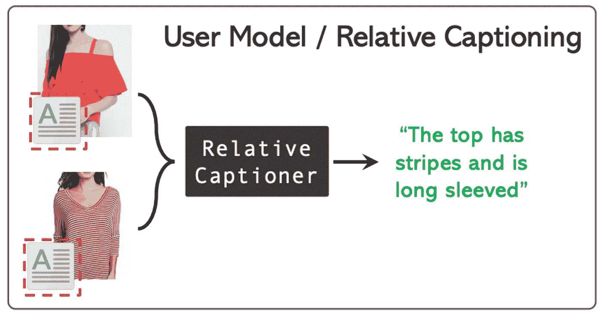
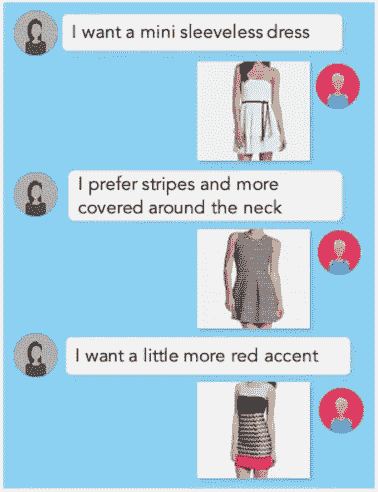
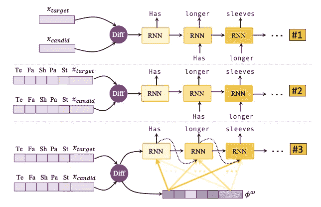
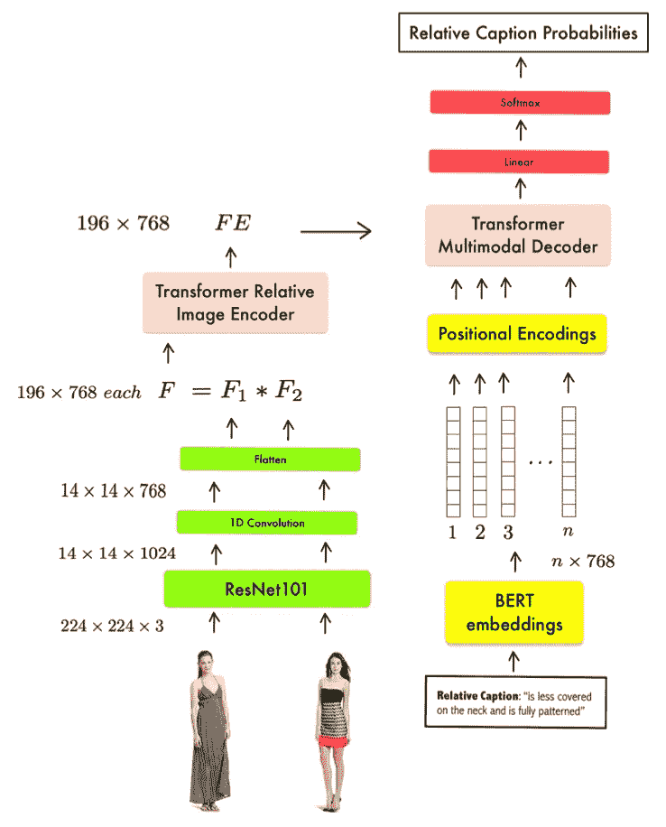
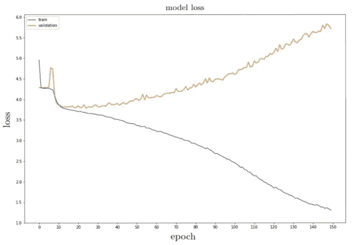
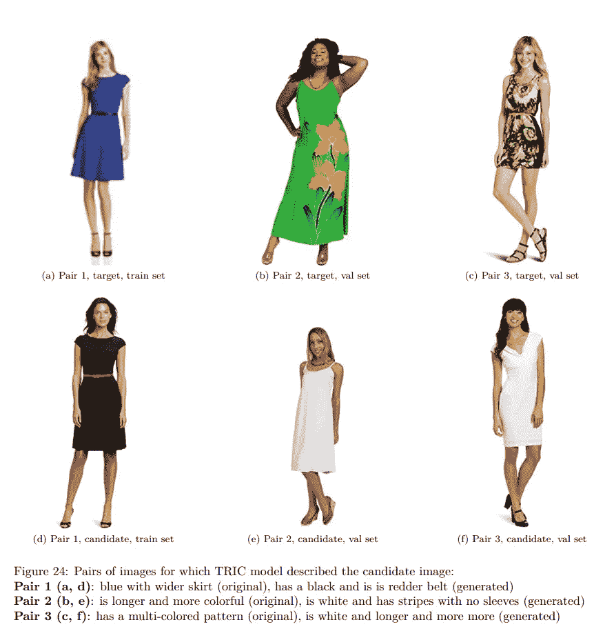
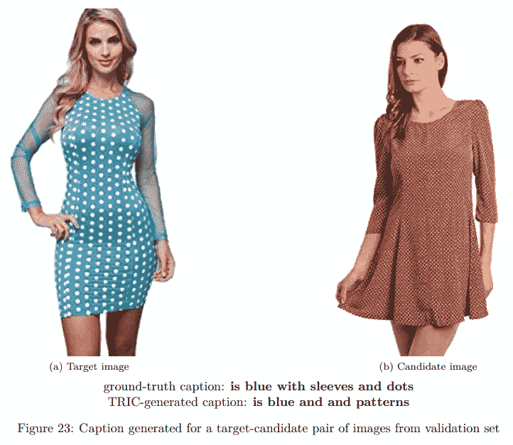

# TRIC —基于变压器的相对图像字幕

> 原文：<https://towardsdatascience.com/tric-transformer-based-relative-image-captioning-d0edac40e5df?source=collection_archive---------17----------------------->

## 给我两件连衣裙，TRIC 会告诉你它们之间的区别👗 👚

这篇博文描述了 TRIC 模型——一个相对图像字幕任务的架构，它是我硕士论文的一部分。下面你可以找到这篇文章将要回答的问题列表:

*   什么是相对图像字幕，它与图像字幕有什么不同，它可以用来做什么？
*   解决这个任务的原始方法是什么？
*   如何采用变压器架构作为相关图像字幕问题的解决方案？
*   训练这样一个系统的主要挑战是什么？

在开始阅读这篇文章之前，你应该先温习一下以下话题:

*   [CNN](https://www.coursera.org/learn/convolutional-neural-networks)
*   [RNNs](/illustrated-guide-to-lstms-and-gru-s-a-step-by-step-explanation-44e9eb85bf21)
*   [图像字幕](https://www.tensorflow.org/tutorials/text/image_captioning)
*   伯特
*   [变压器架构](http://jalammar.github.io/illustrated-transformer/)

我的论文以非常简洁的方式描述了所有这些，所以我强烈推荐——你可以在下面找到链接。但是，如果你想检查他们从其他来源也包括在内。对于上面列出的每个主题，我都附上了一个链接，指向我个人最喜欢的关于这个特定主题的资源。

这个项目的代码库可以在这里找到[代码报告](https://gitlab.com/user-modeling/transformer-based-user-modeling/-/tree/master)
和完整的论文可以在这里找到[论文](https://drive.google.com/file/d/1TtYCU_wY-GGv2cZsgh060GsfbCb6a758/view?usp=sharing)

## 介绍

这个月早些时候，我在华沙技术大学对我的计算机科学硕士论文进行了答辩。我的专业是人工智能，所以我很自然地在深度学习领域写作。当我开始深度学习时，有一项任务最吸引我的注意力——图像字幕。最初，这个模型能够生成描述图像内容的标题，这似乎有点不可思议。然后，我当然会更深入地探究它到底是如何工作的——仍然很神奇，但是魔力消失了。

我个人的目标是选择一个主题，这个主题可以为研究一个已经研究过的(在某种程度上)问题提供一些新的想法/方法。此外，我希望它以某种方式连接到图像字幕。因此，我选择了相对图像字幕。

## 什么是相对图像字幕，它与图像字幕有什么不同，它可以用来做什么？

相对图像字幕(Relative Image Captioning，RIC)任务是图像字幕的变体，由 IBM 研究人员于 2018 年建立([来源](https://arxiv.org/abs/1805.00145))。目标是生成描述目标图像和候选图像相对于目标图像的相对差异的标题。

相对字幕/用户建模，[来源](https://arxiv.org/abs/1805.00145)

查看上面的图像，可以看到模型生成了一个描述两件衬衫之间相对差异的标题-底部的是目标图像，顶部的是候选图像。与图像字幕相反，RIC 接收两个图像作为输入。在生成字幕时，模型不仅要捕捉这两幅图像的内容，还要能够告诉我们它们之间相对于目标图像的差异。

**好吧，但是我们为什么需要这样一个模型呢？**

答案与基于对话的检索直接相关。

几轮基于对话的检索聊天机器人，[来源](https://arxiv.org/abs/1905.12794#:~:text=Fashion%20IQ%20is%20the%20first,attribute%20labels%20for%20these%20images.)

基于对话的检索系统旨在通过对话与用户交流，并根据其话轮检索所需信息。在上图中，我们可以看到一个为时尚检索而设计的系统的例子。这个特定系统的目标是减轻购物助手的负担——想象一下，你可以与机器人聊天，简单地描述你正在寻找的东西，而不是浏览数百个页面，所有页面都有不同的过滤器。这个想法很好，但任务也很复杂。

为了训练这样一个系统，人们需要获得大量由人类进行的样本对话。收集这样数据集将会非常昂贵和耗时。IBM 的研究人员没有这样做，而是提出了在对话循环中充当用户的 RIC 模型([论文](https://arxiv.org/abs/1805.00145))。

## 那么最初解决这个问题的方法是什么呢？

解决这个问题的第一种方法是采用两种最流行的图像字幕模型:[显示并讲述](https://arxiv.org/abs/1411.4555)、[显示出席和讲述](https://arxiv.org/abs/1502.03044)。简而言之，该模型遵循编码器-解码器架构。

作为编码器，我们有某种 CNN，用于将图像信息编码为特征向量 X_target 和 X_candidate。对于两个图像有一个编码器，并且它独立地处理它们。

解码器是某种循环网络，所以它可以是香草 RNN，LSTM，GRU 等。在编码器和解码器之间，有一种连接两个输入图像的特征向量的方法——在原始作品中，这是一种元素方面的差异，但任何其他方法也类似地工作(连接、加法、乘法等)。).

下面你可以看到 RIC 的作者提出的架构的可视化。

相对图像字幕的原始方法，[来源](https://arxiv.org/pdf/1905.12794v2.pdf)

从上到下。第一种遵循上述编码器-解码器架构。第二个是将关于衣服属性的编码信息添加到图像的表示中(那些是纹理、织物、形状、部分和风格)。第三个与第二个相同，但增加了关注机制，如[展示出席和讲述](https://arxiv.org/abs/1502.03044)模式。

当我了解到这种方法时，我认为可以改进这种模式的一个方法是在 RNN 上使用 Transformer。一般来说，这样做有两个主要原因(如果你想更好地理解这个话题，我推荐这个[链接](https://ai.stackexchange.com/questions/20075/why-does-the-transformer-do-better-than-rnn-and-lstm-in-long-range-context-depen)):

*   rnn 是顺序的，当变压器完全可并行化时不能并行化，因此 GPU 的能力可以在这里得到充分利用->更快的训练。
*   变形金刚能够处理长距离依赖，因为它们利用自我注意机制将句子作为一个整体来处理。rnn 正在一个接一个地做这件事。

在与我的导师快速交谈后，我们得出了一个值得一试的结论，因此我为我的硕士论文提出了两个精确的目标:

*   针对相关图像字幕问题，提出、实施、培训和分析基于变压器的架构的性能。
*   确定关于训练相关图像字幕的关键挑战，并指出用户建模的进一步研究方向。

## 如何采用变压器架构作为相关图像字幕问题的解决方案？

基于 Transformer 的相对图像字幕模型的架构(图来自我的硕士论文)。

上图展示了 TRIC(基于变压器的相对图像字幕)的架构，它是我硕士论文的一部分。它采用变压器和伯特嵌入相关的图像字幕任务。

让我们从底部的两个图像开始。首先，通过预训练的 ResNet101 处理两幅图像，以产生大小为 196x768 的特征图 **F1** 和 **F2** 。然后这些表示被组合(通过逐元素乘法)成一个称为 **F = F1 * F2** 的表示。 **F** 被输入变压器相关图像编码器，该编码器是变压器架构的一部分。它接受 196 个向量，每个向量的大小为 768，因此输出 **FE** 的大小也是 196x768。 **FE** 是变压器多模式解码器(TMD)的输入之一。

另一个是相对字幕的表示。为了获得它，需要通过 BERT 模型处理相对字幕，并建立用于提取这种嵌入的策略。这是因为 BERT 为每个令牌生成了多个表示—每层一个表示。我使用了 12 层 BERT，所以有 12 个向量代表字幕中的每个标记。我采用了对每个令牌的最后 4 个向量求和的策略，这是基于 BERT 作者所做的各种实验。有 n 个向量，每个向量的大小为 768(其中 n 是字幕的长度，768 是 BERT 的隐藏尺寸)，必须添加关于字幕内记号位置的信息。这是因为 Transformer 并行处理所有令牌，因此不像顺序方法那样有关于位置的自然信息。位置编码层是直接复制粘贴从注意是你所需要的[论文](https://arxiv.org/abs/1706.03762)所以它是基于正弦和余弦函数(不像在其他方法中学习)。带有位置信息的字幕嵌入被传递到 TMD 中。

在 TMD 中我们有两个输入: **FE** 和**字幕的嵌入。**这是模型中结合文本和视觉信息的部分，因此被称为多模态。TMD 是变压器架构的解码器部分。最后，TMD 的输出通过线性层，然后是 Softmax，它为正在生成的令牌生成概率分布。

如果你对这个模型的细节感兴趣，你可以查看我的论文和代码库:

*   [论文](https://drive.google.com/file/d/1TtYCU_wY-GGv2cZsgh060GsfbCb6a758/view?usp=sharing)
*   [代码回购](https://gitlab.com/user-modeling/transformer-based-user-modeling/-/tree/master)

好，这就是模型架构。除此之外，我承诺在训练这样的系统时会对主要的挑战有一些见解。

## 训练这样一个系统的主要挑战是什么？

下面你可以看到我在培训 RIC 模型时发现的一系列挑战。现在，我将只列出它们——而且，每一点都将被详述。

*   培训费用
*   区分目标和候选图像的问题。
*   出现正确评估指标的问题。
*   字幕的表示。

**培训成本。训练基于变形金刚的模型并不便宜。为了利用并行化，必须利用 GPU 计算的能力。一般来说，你有两个选择:拥有强大的 GPU 或者使用云解决方案外包它们。我个人使用了第二种选择，采用谷歌云平台解决方案。下面你可以看到在 1000 兹免费 GCP 信用范围内我能得到的最好模型的损失函数。**

超过 150 个历元的训练和验证损失(图来自我的硕士论文)。

正如你所看到的，我能够使模型适应火车场景，但仅此而已。验证集上的性能非常弱。由于缺乏免费信用，我无法将正则化添加到模型中，并进一步改善验证集的损失。然而，在训练这样一个系统时，我能够识别关键的挑战。

**区分目标和候选图像的问题。**

图来自我的硕士论文。

我能够捕捉到的一个问题是模型不能区分候选图像和目标图像。如上图所示，模型能够生成有意义的标题，但是关系的方向是错误的。该模型正在生成一个描述候选图像相对于目标图像的标题，而不是像它所设想的那样反过来。这可能是由于在训练期间，仅向图像编码器提供图像的联合表示。这是由训练期间使用的有限 GPU 资源决定的。未来的研究方向之一可能是研究表示两个独立图像的方法，同时强调它们之间的相对差异的方向——目标图像和候选图像相对于目标图像的差异。

**出现正确评估指标的问题。** BLEU metric 最初是为了自动评估机器翻译任务而发明的，用于评估 origin RIC 模型。由于表现不佳，作者决定与一组评估者一起测试字幕模型，表明 BLEU 指标不能完全展示模型的能力。在 TRIC 模型评估中观察到类似的问题，当生成的标题在语义上是正确的，但是模型使用了不同于真实标题中呈现的词。

图来自我的硕士论文。

RIC 架构应该用基于语义的度量来评估，以便完全掌握模型的能力。然而，语义度量的使用进一步增加了训练整个架构的计算成本。人们可以尝试将基于语义的评估结合到 RIC 任务中，同时关注这种评估的合理计算成本。

**文字说明的表述。**在 TRIC 模型中，令牌的嵌入基于 BERT 语言模型，在大型文本语料库(图书语料库(800M 单词)和英语维基百科(2500M 单词))上进行训练。虽然这是一个很好的相对字幕的语境化嵌入的起点，但人们可以在时尚相关的语料库上预先训练或微调这样的语言模型。因此，可以更好地表示特定于领域的单词，例如，像“v 形领”、“灰白色”和其他用破折号分隔的表达可以基于适当的上下文获得更有意义的嵌入。我相信在这个领域的进一步研究可以真正推动 RIC 模型产生类似人类的相对字幕，从而为更高级的基于对话的图像检索系统打下坚实的基础。

## 结论

我相信基于对话的检索系统是电子商务的未来。虽然电子商务公司努力不断提高客户在线购物的质量，但他们的搜索引擎仍然主要基于关键字或过滤器，对用户搜索选项施加了许多限制。这些限制可以通过聊天机器人形式的对话界面来解除。这样的解决方案可以提供与机器人进行对话的能力，这将减轻与购物助理的现场对话。RIC 模型在训练这样一个系统中起着至关重要的作用，能够研究这个主题是非常令人兴奋的。

此外，我很高兴写这篇博客，因为这是我的第一篇博客，我一直想这样做。如果你对这个模型有任何疑问(或其他),请随时通过 [LinkedIn](https://www.linkedin.com/in/wojciech-pyrak/) 或评论联系我。

## 参考

[1]郭晓晓、、于成、史蒂文·雷尼和罗格里奥·施密特·费里斯。[基于对话的交互式图像检索](https://arxiv.org/abs/1805.00145)。CoRR，abs/1805.00145，2018。

[2]郭晓晓、、、高、史蒂文·雷尼和罗格里奥·施密特·费里斯。[时尚智商:通过自然语言反馈检索图像的新数据集](https://arxiv.org/abs/1905.12794v2)。CoRR，abs/1905.12794，2019。

[3] Jacob Devlin、张明蔚、Kenton Lee 和 Kristina Toutanova。[伯特:语言理解深度双向转换器的预训练](https://arxiv.org/abs/1810.04805)。CoRR，abs/1810.04805，2018。

[4] Ashish Vaswani、Noam Shazeer、Niki Parmar、Jakob Uszkoreit、Llion Jones、Aidan N. Gomez、Lukasz Kaiser 和 Illia Polosukhin。你所需要的只是注意力。更正，abs/1706.03762，2017。

[5] Oriol Vinyals、Alexander Toshev、Samy Bengio 和 Dumitru Erhan。[展示和讲述:一个神经图像字幕生成器](https://arxiv.org/abs/1411.4555)。更正，abs/1411.4555，2014 年

[6]凯尔文·徐、吉米·巴、瑞安·基罗斯、赵京贤、亚伦·库维尔、鲁斯兰·萨拉胡季诺夫、理查德·泽梅尔和约舒阿·本吉奥。[展示、参与和讲述:视觉注意的神经图像字幕生成](https://arxiv.org/abs/1502.03044)。更正，abs/1502.03044，2015 年。