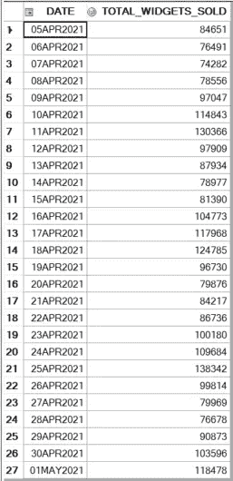
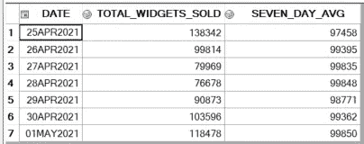
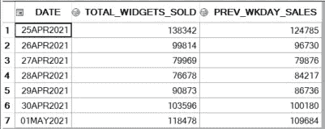

# 高级 SQL 查询技巧

> 原文：<https://towardsdatascience.com/tricks-for-advanced-sql-querying-a09766552155?source=collection_archive---------14----------------------->

## 利用 SQL 提供的所有优势可以改善和增强您的数据。


马库斯·斯皮斯克在 [Unsplash](https://unsplash.com?utm_source=medium&utm_medium=referral) 上的照片

我在零售领域的数据科学团队工作时使用的最有价值的技能之一是 SQL。遗留关系数据库系统和混合/云数据管理解决方案的用户可以使用 SQL 灵活地访问业务数据，并以创造性和创新性的方式转换或显示数据；参见参考资料中的精彩评论。对业务数据库结构的透彻理解，结合允许上游数据转换和聚合的巧妙解决方案，对于高效和可靠的 ETL 至关重要。下面是我在构建复杂管道时学到的一些技巧，这些技巧让我的工作变得更加简单和有趣。

**1)** **计算滚动平均值&通过将表格连接到自身来附加历史数据**

处理时间序列数据时，计算观测值的滚动平均值或附加历史值会很有帮助。假设我想获得一家公司每天销售的小部件数量。我可能想包括一个 7 天的移动平均线，或者附上上周的工作日小部件销售，看看上周的业务表现如何。我可以通过将数据集连接到自身上，并使用日期列上的操作来选择单个值或观察值范围。

首先，让我们从使用 Db2 库中名为 WIDGET_ORDER_HISTORY 的表中的以下代码获取按天销售的小部件开始:

```
select t1.date
  , sum(t1.widgets_sold) as total_widgets_sold
from db2.widget_order_history t1
where t1.date between ‘2021–04–05’ and ‘2021–05–01’
group by t1.date
```

如果我们想在表上的另一个变量上添加任何过滤条件，比如特定的商店，我们可以添加一个简单的 WHERE 语句:

```
select t1.date
   , sum(t1.widgets_sold) as total_widgets_sold
from db2.widget_order_history t1
where (t1.date between ‘2021–04–05’ and ‘2021–05–01’)
   and t1.store = 1234
group by t1.date
```

位于其他表上的其他条件(即 STORE_DATA)需要额外的内部连接:

```
select t1.date
   , sum(t1.widgets_sold) as total_widgets_sold
from db2.widget_order_history t1
inner join (
   select store
   from db2.store_data
   where state = ‘NY’
) t2
on t1.store = t2.store
where t1.date between ‘2021–04–05’ and ‘2021–05–01’
group by t1.date
```



示例时间序列数据，由提供的代码生成。作者图片

现在，如果我想附加 4/25/21–5/1/21 这一周的 7 天滚动平均值，我可以通过将表连接到自身来实现，并利用在 SUM()函数中插入 CASE()语句的优势。当您只想满足表中的特定标准时，可以使用这种技术来使用分组函数(即 SUM()、COUNT()、MAX())。它只会对符合 WHEN 子句中包含的规则的值求和。在下面的示例中，如果表 B 中的值在表 A 中当前观察日期的前 7 天内，我们可以将这些销售额相加，然后除以 7，得到表 A 中每行的滚动周平均值:

```
select a.date
, a.total_widgets_sold
   , sum(
   case when (b.date between a.date-7 and a.date-1) 
   then b.total_widgets_sold 
   else 0 
   end)/7 as seven_day_avg
from (
   select date
      , sum(widgets_sold) as total_widgets_sold
   from db2.widget_order_history
   where date between ‘2021–04–25’ and ‘2021–05–01’
   group by date
) a
left join (
   select date
      , sum(widgets_sold) as total_widgets_sold
   from db2.widget_order_history
   where date between ‘2021–04–05’ and ‘2021–05–01’
   group by date
) b
on a.date = b.date
group by a.date
   , a.total_widgets_sold
order by a.date
```



2021 日历年第 17 周的小部件销售额，采用 7 天滚动平均值。作者图片

如果您想为每个观察值附加一个历史值，那么您可以避免聚合，只需根据指定间隔数之外的日期连接表。下面的示例将表 A 中的表 B 联接起来，通过回溯 7 天来获取前一个工作日的小部件销售额:

```
select a.date
   , a.total_widgets_sold
   , b.total_widgets_sold as prev_wkday_sales
from (
   select date
      , sum(widgets_sold) as total_widgets_sold
   from db2.widget_order_history
   where date between ‘2021–04–25’ and ‘2021–05–01’
   group by date
) a
left join (
   select date
      , sum(widgets_sold) as total_widgets_sold
   from db2.widget_order_history
   where date between ‘2021–04–04’ and ‘2021–05–01’
   group by date
) b
on a.date -7 = b.date
```



2021 日历年第 17 周的小部件销售额，包括上周的工作日小部件销售额。作者图片

将表联接到自身是一种非常灵活的方式，可以将汇总列和计算列添加到数据集中。创造性地将 SUM()和 COUNT()等分组函数与 CASE()语句结合使用，为功能工程、分析报告和各种其他用例带来了巨大的机会。

实际上，如果一个查询通过子查询连接到自身，并且非常大，那么运行时间可能会很长。解决这个问题的一种方法是使用一个临时表来保存问题特定标准的初步结果；例如，在 SAS 的工作库中创建一个整个时间范围内的小部件销售表，并多次查询该表。高效的代码结构，如使用索引，也可以提高效率；参见参考资料中的一些想法。

**2)** **使用 CASE 语句处理复杂逻辑**

CASE 语句的语法不同于数据科学中其他常用编程语言的逻辑。通过使用伪代码对逻辑规则进行深思熟虑的设计可以帮助避免由于不正确/不一致的规则而导致的错误。理解如何在 SQL 中编码嵌套逻辑对于释放数据的潜力至关重要。

假设有一个购物者表，其中包含大量特征，如年龄、家庭所在州和给定时间范围内的销售额。一项有针对性的营销活动正被用来试图增加普通购物者的销售额(营销已经将普通购物者定义为花费在 100-200 美元之间的人)。一旦被识别，Z 世代/千禧一代的购物者将收到一张数字优惠券，所有其他购物者将收到一张打印优惠券，根据他们居住的州而有所不同。为了简单起见，购物者只居住在三个州。

下面是如何用 R 和 SQL 编码这个逻辑:

```
## Example of Nested Logic in Rif(shoppers$sales<=0){ print("Error: Negative/No Sales")}
else if(shoppers&sales<=100){ print("Shopper has below-average sales.")}
else if(shoppers&sales<=200){ 
   if(shopper$age<41){print("Shopper has average sales and is Gen Z/Millennial.")}
   else{
 if(shopper$state=='NJ'){print("Shopper has average sales, is Gen X/Boomer/Greatest Gen., and lives in New Jersey.")}
 else if(shopper$state=='NY'){print("Shopper has average sales, is Gen X/Boomer/Greatest Gen., and lives in New York.")
 else(shopper$state=='CT'){print("Shopper has average sales, is Gen X/Boomer/Greatest Gen., and lives in Connecticut.")}
   }
}
else{print("Shopper has above-average sales.")}*Example of nested logic in SQL. No need to actually nest statements!;, case when sales < 0
 then 'Error: Negative/No Sales.'
when sales <=100
 then 'Shopper has below-average sales.'
when sales <=200 and age <41
 then 'Shopper has average sales and is Gen Z/Millennial.'
when sales <=200 and state = 'NJ'
 then 'Shopper has average sales, is Gen X/Boomer/Greatest Gen., and lives in New Jersey.'
when sales <=200 and state = 'NY'
 then 'Shopper has average sales, is Gen X/Boomer/Greatest Gen., and lives in New York.'
when sales <=200 and state = 'CT'
 then 'Shopper has average sales, is Gen X/Boomer/Greatest Gen., and lives in Connecticut.'
else 'Shopper has above-average sales.'
end as shopper_classification
```

周到地使用 CASE 语句将允许您构建复杂业务逻辑的任意组合。然而，SQL 逻辑需要的思维方式与其他编程语言略有不同。结合分组功能，这些工具可以为数据科学家提供竞争优势，帮助他们获取和转换用于功能工程、商业智能、分析报告等的数据源！

# 资源

2021 年企业 DBMS 前景的大分解:

[](https://www.eweek.com/database/top-vendors-of-database-management-software-for-2021/) [## 2021 年数据库管理软件的顶级供应商| eWEEK

### 我们日常使用的所有业务和个人数据都存储在数据库管理系统或存储阵列中…

www.eweek.com](https://www.eweek.com/database/top-vendors-of-database-management-software-for-2021/) 

一些有用的 SQL 查询优化技术的总结:

[](https://www.sqlshack.com/query-optimization-techniques-in-sql-server-tips-and-tricks/) [## SQL Server 中的查询优化技术:提示和技巧

### 2018 年 6 月 19 日修复错误的查询和解决性能问题可能需要数小时(或数天)的研究和…

www.sqlshack.com](https://www.sqlshack.com/query-optimization-techniques-in-sql-server-tips-and-tricks/)