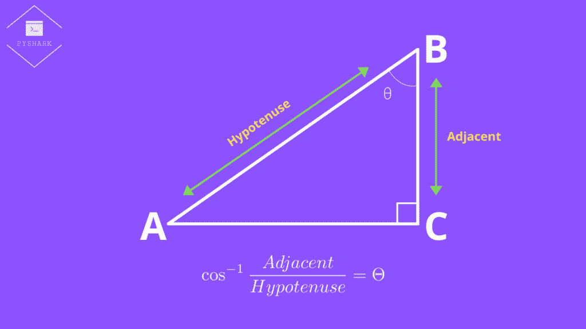
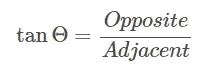

# Python 中的三角函数:完全指南

> 原文：<https://towardsdatascience.com/trigonometric-functions-in-python-complete-guide-62d80f0d136a?source=collection_archive---------29----------------------->

## 在本文中，我们将探索 Python 中的三角函数


作者图片

**目录**

*   介绍
*   正弦函数
*   反正弦函数
*   余弦函数
*   反余弦函数
*   正切函数
*   反正切函数
*   结论

# 介绍

由于本教程的重点是三角函数，我们需要一些重要的定义来更好地理解每个函数。

# 三角法

三角学是数学的一个分支，研究三角形的角度和边长之间的关系。

三角学中用到的三个主要三角函数是:[正弦](https://pyshark.com/trigonometric-functions-in-python/#sine-function)、[余弦](https://pyshark.com/trigonometric-functions-in-python/#cosine-function)、[正切](https://pyshark.com/trigonometric-functions-in-python/#tangent-function)，都是以直角三角形为基础的。

# 直角三角形

什么是直角三角形？是一个直角(或 90)的三角形)。

请参见下面的示例:


作者图片

这里角 C 是直角(角 C = 90)，现在形成直角三角形 ABC。

此外，我们应该知道直角三角形相对于某个选定的角θ的边的名称。

见下文:


作者图片

*   **相邻** —总是与角θ相邻的边，也形成直角(90°)。
*   **对面** —角度θ的对面。
*   **斜边** —直角(90°)的对边，也是直角三角形中最长的边。

# 弧度

几何学中另一个重要的概念是弧度。弧度是圆心的角度单位，它是由圆的半径与半径相等的圆弧连接而成的。

正式的定义听起来非常复杂，很难理解，所以直观地理解这个定义要容易得多。

见下文:


作者图片

逐步解释:

1.  从点 O 开始，画一条水平线到点 P，这样就产生了长度为半径(r)的线段 OP。
2.  从点 P 创建一条线段 PT，它垂直于线段 OP(角度= 90°)，并且与线段 OP 的长度相等，等于半径(r)。长度应该相等:OP=PT。
3.  接下来，想象你开始向左弯曲线段 TP，直到它适合圆周。一旦你这样做了，你就有了线段 TP 的投影，这是一个弧 VP。你应该有相等的长度:TP=VP。

在这些步骤之后，我们已经创建了一个角度(角度 VOP)，我们称之为 1 弧度:


作者图片

这个角度正好是 1 弧度，或者也可以用度数来计算，如下所示:


作者图片

或者，我们可以用弧度来计算度数:


作者图片

# 正弦函数

正弦函数是主要的三角函数之一。

# 正弦函数解释

角θ的正弦函数是角θ的对边与斜边之比:


作者图片

它也经常被称为 SOH:正弦与斜边相反。


作者图片

还有一个表格提供了标准角度的正弦值:


作者图片

# 正弦函数计算示例

我们有一个直角三角形 ABC，其中 AB = 20cm，角 A = 30，角 C = 90，如下图所示。我们需要找到公元前的长度。


作者图片

从上一节的表格中，我们知道 sin 30 = 1/2，我们可以用它来解决示例中的问题:


作者图片

在这个例子中，使用 sin 函数，我们能够找到 BC 边的长度，它等于 10 cm。

# Python 中的正弦函数 sin()

在这一节中，我们将尝试使用 Python 来解决上面的例子。

为了在 Python 中使用正弦函数 **sin()** ，我们需要从数学库(内置)中导入它。

让我们从导入所需的函数开始:

接下来，将度数转换为弧度:

并计算比例(注意要四舍五入到 2 位小数):

您应该得到:

```
0.5
```

这与我们在上一节中看到的 sin 30 比率完全相同。我们通过使用 Python 中的三角函数发现了相同的结果。

其余的计算是一样的，你将得到等于 10 厘米的答案。

# 反正弦函数

反正弦函数是反三角函数之一，通常称为反正弦。

# 反正弦函数解释

三角形与角θ相对的边与斜边之比的反正弦函数是角θ。

听起来没有实际看起来那么直观。

回想一下，正弦函数取角度θ，给出{对边}/{斜边}的比值。

现在，反正弦函数取{对边}/{斜边}之比，给出角度θ:


作者图片


作者图片

# 反正弦函数计算示例

我们有一个直角三角形 ABC，其中 AB = 20cm 厘米，BC = 10 厘米，角度 C = 90 度，如下图所示。我们需要找到角度 a。


作者图片

首先，我们会找到{对边}/{斜边}的比值:


作者图片

当我们知道比率时，我们可以使用任何计算器和**反正弦**函数很容易地找到角度θ。

您应该得到:


作者图片

# Python 中的反正弦函数 asin()

在这一节中，我们将尝试使用 Python 来解决上面的例子。

为了在 Python 中使用反正弦 **asin()** 函数，我们需要从数学库(内置)中导入它。

让我们从导入所需的函数开始:

接下来，求比值等于 1/2 的角的弧度:

您应该得到:

```
0.5235987755982989
```

然后最后将弧度转换为度数(并四舍五入):

您应该得到:

```
30
```

我们通过使用 Python 中的三角函数，发现 1/2 比的反正弦是角度等于 30。

# 余弦函数

正弦函数是第二常见的三角函数。

# 余弦函数解释

角θ的余弦函数是角θ的邻边与斜边之比:


作者图片

它也经常被称为 CAH:余弦值与斜边相邻。


作者图片

还有一个表格提供了标准角度的余弦值:


作者图片

# 余弦函数计算示例

我们有一个直角三角形 ABC，其中 AB = 20cm，角 B = 60，角 C = 90，如下图所示。我们需要找到公元前的长度。


作者图片

从上一节的表格中，我们知道 cos 60 = 1/2，我们可以用它来解决示例中的问题:


作者图片

在此示例中，使用 cos 函数，我们能够找到边长 BC 等于 10 cm 的长度。

# Python 中的余弦函数 cos()

在这一节中，我们将尝试使用 Python 来解决上面的例子。

为了在 Python 中使用余弦函数 **cos()** ，我们需要从数学库(内置)中导入它。

让我们从导入所需的函数开始:

接下来，将度数转换为弧度:

并计算比例(注意要四舍五入到 2 位小数):

您应该得到:

```
0.5
```

这与我们在上一节中看到的 cos 60 的比率完全相同。我们通过使用 Python 中的三角函数发现了相同的结果。

其余的计算是一样的，你将得到等于 10 厘米的答案。

# 反余弦函数

反余弦函数是反三角函数之一，通常称为反余弦函数。

# 反余弦函数解释

三角形与角θ相邻的边与斜边之比的反余弦函数是角θ。

回想一下，余弦函数取角度θ，给出{邻边}/{斜边}的比值。

现在，反余弦函数取{相邻} \ {斜边}的比值，给出角度θ:


作者图片



作者图片

# 反余弦函数计算示例

我们有一个直角三角形 ABC，其中 AB = 20cm 厘米，BC = 10 厘米，角度 C = 90 度，如下图所示。我们需要找到角度 b。


作者图片

首先，我们将找到{邻边}/{斜边}的比值:


作者图片

当我们知道比率时，我们可以使用任何计算器和 **arccos** 函数轻松找到角度θ。

您应该得到:


作者图片

# Python 中的反余弦函数 acos()

在这一节中，我们将尝试使用 Python 来解决上面的例子。

为了在 Python 中使用反正弦 **acos()** 函数，我们需要从数学库(内置)中导入它。

让我们从导入所需的函数开始:

接下来，求比值等于 1/2 的角的弧度:

您应该得到:

```
1.0471975511965979
```

然后最后将弧度转换为度数(并四舍五入):

您应该得到:

```
60.0
```

我们通过使用 Python 中的三角函数，发现 1/2 比值的反余弦是角度等于 60。

# 正切函数

正切函数是第三种流行的三角函数。

# 正切函数解释

角度θ的正切函数是三角形中与角度θ相对的边与三角形中与角度θ相邻的边之比:



作者图片

它也经常被称为 TOA:正切值与相邻值相反。


作者图片

还有一个表格提供了标准角度的正切值:


作者图片

# 正切函数计算示例

我们有一个直角三角形 ABC，其中 BC = 10cm，角 A = 30，角 C = 90，如下图所示。我们需要找到 AC 的长度。


作者图片

从上一节的表中，我们知道 tan 30 = {1}/{sqrt{3}}，我们可以用它来解决示例中的问题:


作者图片

在本例中，使用 tan 函数，我们能够找到 BC 边的长度，它等于 17.32 厘米。

# Python 中的正切函数 tan()

在这一节中，我们将尝试使用 Python 来解决上面的例子。

为了在 Python 中使用正切函数 **tan()** ，我们需要从数学库(内置)中导入它。

让我们从导入所需的函数开始:

接下来，将度数转换为弧度:

并计算比例(注意要四舍五入到 2 位小数):

您应该得到:

```
0.58
```

在这种情况下，该比率为 0.58，约等于{1}/{sqrt{3}}，与我们在上一节中看到的 tan 30 的比率完全相同。我们通过使用 Python 中的三角函数发现了相同的结果。

其余的计算将是相同的，您将得到等于 17.24 厘米的答案(而未经四舍五入的计算结果将是 17.32 厘米)。

# 反正切函数

反正切函数是反三角函数之一，通常称为反正切函数。

# 反正切函数解释

三角形中与角θ相对的边与角θ相邻的边之比的反正切函数。

回想一下，正切函数取角度θ，给出{对面}/{相邻}的比值。

现在，反正切函数取{对立}/{相邻}的比值，给出角度θ:


作者图片


作者图片

# 反正切函数计算示例

我们有一个直角三角形 ABC，其中 BC = 10 cm，AC = 17.32 cm，角 C = 90 如下图所示。我们需要找到角度 b。


作者图片

首先，我们会找到{对立}/{相邻}的比率:


作者图片

当我们知道比率时，我们可以使用任何计算器和**反正切**函数很容易地找到角度θ。

您应该得到:


作者图片

# Python 中的反正切函数 atan()

在这一节中，我们将尝试使用 Python 来解决上面的例子。

为了在 Python 中使用反正弦函数，我们需要从数学库(内置的)中导入它。

让我们从导入所需的函数开始:

接下来，求比值等于 0.58 的角的弧度:

您应该得到:

```
0.5255837935516101
```

然后最后将弧度转换为度数(并四舍五入):

您应该得到:

```
30.11
```

通过使用 Python 中的三角函数，我们发现 0.58 比率的反余弦是等于 30.11 的角度，如果我们没有将边 AC 的长度舍入到 17.32 cm，则该角度大约等于 30。

# 结论

在本文中，我们将使用来自[数学](https://docs.python.org/3/library/math.html)库中的函数，重点介绍 Python 中的三角函数。它包括正弦、余弦、正切、反正弦、反余弦和反正切。

如果你有任何问题或对编辑有任何建议，请随时在下面留下评论，并查看更多我的[统计](https://pyshark.com/category/statistics/)文章。

*原载于 2021 年 12 月 29 日 https://pyshark.com**[*。*](https://pyshark.com/trigonometric-functions-in-python/)*