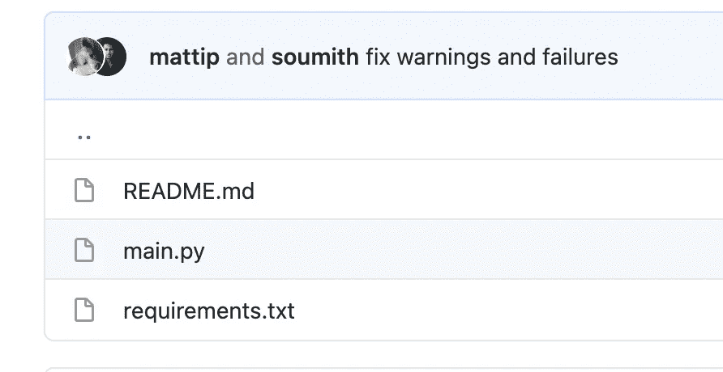
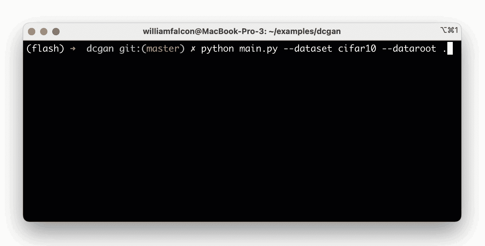

# AWS 上的普通比例 PyTorch

> 原文：<https://towardsdatascience.com/trivially-scale-pytorch-on-aws-4cfde16e6d37?source=collection_archive---------22----------------------->

## 在 AWS 上运行 PyTorch 工作负载，无需更改代码

来源[bestanimation.com](https://bestanimations.com/gifs/Large-Lightning-Bolt-Currents-Lace-Sky-Clouds-Over-City-Storm.html)(经许可)

[PyTorch](https://github.com/pytorch/pytorch) 是一个构建神经网络的惊人框架。很容易上手，也很快获得价值。但是对于实际的研究或生产用例，您的笔记本电脑或本地服务器就不行了。

在本教程中，我将向你展示如何在云上运行 **ANY** PyTorch 代码，而无需做任何代码更改。

# 模型

对于本教程，我将从 [PyTorch 示例库](https://github.com/pytorch/examples/tree/master/dcgan)中选择 dcgan。

这个文件夹有 3 个文件，main.py 和 requirements.txt。

这个模型是一个简单的[深度卷积 GAN](https://arxiv.org/abs/1511.06434) ，然而只要代码不崩溃，这个模型并不重要。

# 验证它不会在本地崩溃

第一步是验证它不会在本地崩溃。为此，我将把它克隆到我的本地机器上并运行它。

您现在应该会看到类似这样的内容:

# 在云上运行

为了在 AWS 上运行，我们将使用 Grid.ai ( [在这里创建一个免费帐户](https://www.grid.ai/pricing/))。网格人工智能的免费层提供了许多功能，包括更便宜的 AWS 成本的现货定价。你仍然需要支付计算费用，但是价格和 AWS 一样。

现在安装网格并登录

现在用**网格运行**改变单词 python，按回车键！

Grid 将在 AWS 上运行代码！查看作业类型的状态

这个模型生成图像(毕竟是 GAN)，我们来看看

(没错，Grid 制造了双关的名字)。

还有很多，探索用户界面吧！

# 在 GPU 上运行

在单 CPU 机器上运行…嗯，没什么大不了的。我们用同样的努力在(2x) 4 个 GPU 机器上运行怎么样？

这个 GAN 脚本实际上可以在 2 个 GPU 上运行…为了实现这一点，让我们添加脚本标志([这里的这些参数](https://github.com/pytorch/examples/blob/master/dcgan/main.py#L28-L30))。

现在我们需要告诉 grid 在 2 个 GPU 上运行该模型(我选择的是 4 个 v100s 的机器)。

但是等等……机器有 4 个 GPU，为什么不用 4 个 GPU？嗯，我实际上想用不同的学习率来尝试相同的模型…所以我将要求 grid 使用我想尝试的学习率(0.001、0.002、0.01、0.02)给我这个模型的 4 个版本

grid 有大量的特殊语法来简化扫描。网格状态显示了我的 4 个实验。

现在我的紧张的 anaconda 正在运行这个 GAN 的 4 个版本，每个版本在 2 个 GPU 上！

在引擎盖下，grid 启动了 2 台机器，并自动分发模型，如下所示:

# 可中断机器

云提供商提供节省成本的方法。在 AWS 上，您可以使用 **use_spot** 标志为您的计算支付高达 90%的折扣。

但是不利的一面是，您的机器可能会在任何时候被终止…然而，对于许多工作负载来说，这是可以的。您可以随时从网格中获取模型检查点，并再次运行模型以继续训练

完整的命令是:

# 就是这样！

网格不需要任何东西就可以扩展。对于具有大规模数据集和多节点模型的更严重的工作负载，grid 也已经覆盖了[！](http://docs.grid.ai/)

快乐训练！