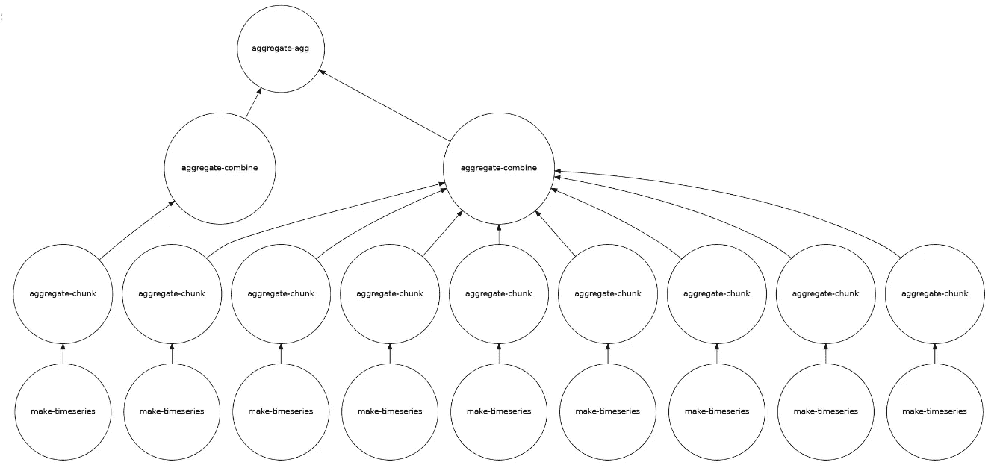
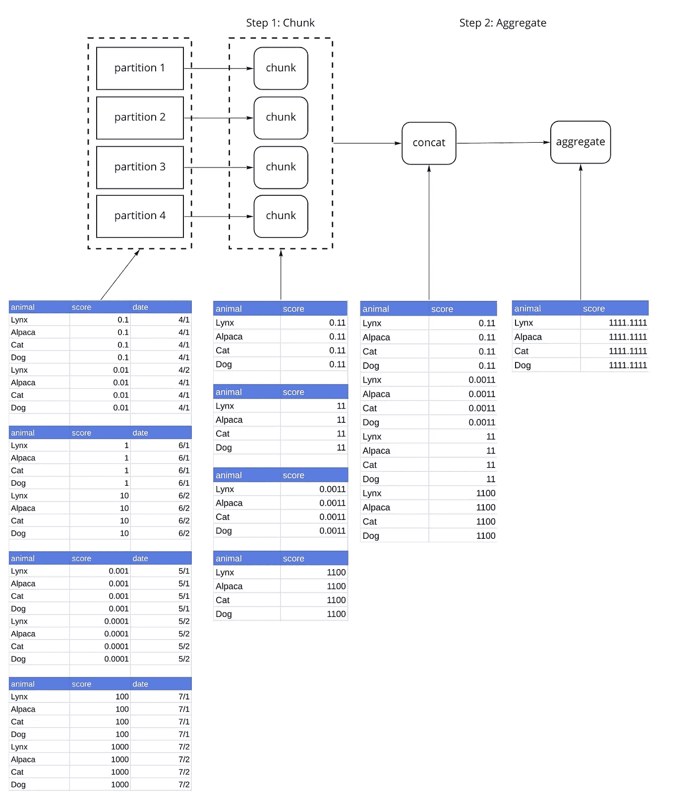
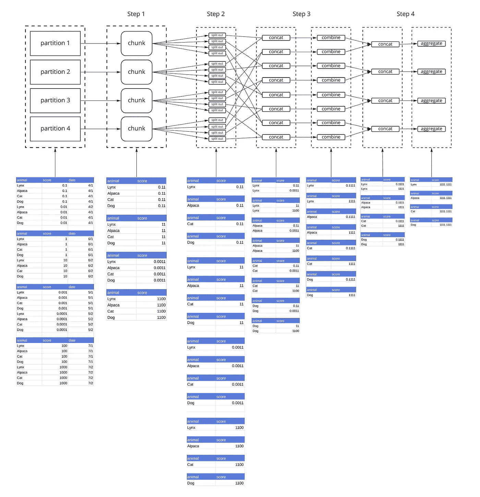

# Dask GroupBy 聚合性能故障排除

> 原文：<https://towardsdatascience.com/troubleshooting-dask-groupby-aggregation-performance-1c39599598c1?source=collection_archive---------27----------------------->

## 如何解决 Dask GroupBy 聚合的性能问题？对算法的深入研究。



示例分组任务图—Julia Signell[的 courtsey](https://medium.com/u/b865b2668619?source=post_page-----1c39599598c1--------------------------------)

在 Saturn Cloud，[我们管理着一个数据科学平台](https://www.saturncloud.io)，该平台提供 Jupyter 笔记本、Dask 集群以及部署模型、仪表盘和作业的方法。因此，我们经常帮助客户排除 Dask 操作故障。GroupBys 的问题经常出现。

Dask 数据框架对于交互式探索大型数据集来说是惊人的。然而，在大型数据集上使用它们可能有点棘手。您可能已经在尝试进行分组时遇到了一个`KilledWorker`异常。如果你还没有，你很快就会了！

本文的目标是为您提供一组选项，供您在 GroupBy 失败时尝试。首先，我们将深入了解数据帧分组聚合是如何实现的。这对于理解如何绕过你遇到的任何障碍是必要的。

# Dask GroupBy 聚合

Dask GroupBy 聚合使用`apply_concat_apply()`方法，该方法对`dask.DataFrame`应用 3 个函数，一个`chunk()`、`combine()`和一个`aggregate()`函数。这是一个非常强大的范例，因为它使您能够通过提供这些函数来构建自己的自定义聚合。我们将在示例中引用这些函数。

*   **chunk** :该方法应用于 Dask 数据帧的每个分区。
*   **合并**:来自`chunk()`步骤的输出被连接，然后与`combine()`合并在一起。
*   **聚合**:来自`combine()`步骤的输出被连接，然后用`aggregate()`聚合。这是最后一步。经过这个转换，你的结果就完成了。

# Dask GroupBy 聚合:最简单的例子

在这个例子中，我们将通过一个带有默认参数的 Dask GroupBy 来展示算法是如何工作的。我们使用一个虚拟数据集，它被分成 4 个分区。我们已经为`score`选择了具有独立小数位的数值，以便在汇总数据时更加明显。

此示例应用以下转换:

Dask GroupBy 聚合将算法分为`chunk()`、`combine()`和`aggregate()`步骤。在这种情况下(最简单的一种)，我们只使用`chunk()`和`aggregate()`步骤。这种特殊的聚集是优雅的，因为这些步骤中的每一个都以相同的方式实现，通过按动物分组并对分数求和(`df.groupby('animal')['zscore'].sum()`)。通过对分区求和，然后对这些和求和，我们可以计算出所需的结果。其他算法如`var()`在不同的阶段需要不同的操作。该图展示了相关的操作，并向我们展示了每一步的数据情况。



我们的样本数据集被分成 4 个分区。**步骤 1** 将`chunk()`函数应用于每个分区。这是一个重要的步骤，因为它的输出是一个缩减，比原始分区小得多。**步骤 2** 将**步骤 1** 的输出连接成一个数据帧，然后对结果应用`aggregate()`函数。

## 问题

简单的情况是返回一个分区，其中包含整个结果。如果你的`GroupBy`产生一个小的数据帧，这个方法很好。如果您的`GroupBy`导致一个大的数据帧(如果您有大量的组)，您将耗尽内存，这通常在`KilledWorker`异常中表现出来。

# 处理记忆:分裂

Dask 提供两个参数`split_out`和`split_every`来控制数据流。`split_out`控制生成的分区数量。如果我们设置`split_out=4`，group by 将产生 4 个分区，而不是 1 个。我们稍后会谈到`split_every`。让我们用`split_out=4`重做前面的例子。


**第 1 步**与上例相同。**步骤 1** (应用`chunk()`函数)的输出是每个分区 1 个数据帧。**步骤 2** 通过散列分组将这些数据帧中的每一个分成`split_out=4`个数据帧。查看图表，您会看到每个分区的第 n 个数据帧中有相同的动物。这种一致性是哈希的目标。我们将每个组称为一个分片(分片 1 包含每个分区的第一个数据帧，分片 2 包含每个分区的第二个数据帧，依此类推)。**步骤 3** 将组成每个碎片的所有数据帧连接起来(同样使用这种散列法),这样来自相同动物的数据就会出现在相同的数据帧中。然后应用`aggregate()`功能。结果现在是一个由`split_out=4`分区组成的 Dask 数据帧。

# 高级选项:分割 _ 每

在前面的示例中，**步骤 3，** Dask 为每个分区分片串接数据。默认情况下，Dask 会一次为多达 8 个分区分片连接数据。因为我们的数据集只有 4 个分区，所以所有的数据都是一次性处理的。让我们用`split_every=2`重新运行前面的例子。第二步之前的一切都是一样的。



使用`split_every=2`，我们一次连接两个数据帧，然后用**步骤 3** 中的`combine()`函数组合它们，而不是连接来自单个碎片的所有数据帧(在我们的例子中，每个碎片有 4 个数据帧)。**步骤 4** 将这些结果连接起来，然后调用`aggregate()`。用`combine()`最后用`aggregate()`的约简是一个树约简。因为我们只有 4 个分区，所以我们可以在 1 个`combine()`步骤和 1 个`aggregate()`步骤中完成这个操作。然而，如果我们有 8 个分区，将有 2 个`combine()`步骤和 1 个`aggregate()`步骤。`aggregate()`永远是最后一步。

# 我们该怎么办

真的只有两件事可以做。我知道这可能看起来有点反高潮，考虑到我们刚刚经历的关于算法如何工作的长度解释，然而理解算法对于理解如何调整它是重要的。

# 调整拆分

`split_out`参数可以传递给聚合函数。

这一部分将有点近似和手动波动。最终，您需要对您的数据集进行实验，并找出哪些参数有效。这一节可能会为你提供一些如何思考这个问题的指导。

## 了解您的数据

我将有几个小组？希望您对数据有足够的了解，能够大致估计出结果中的组数。如果不是，你可能需要以某种方式计算它。举个例子，我有一个包含 5000 万动物的数据集。我获取数据的一个子集，执行计算，观察到我的结果有 500 万只动物，占用 500 mb 内存。500 万只动物是我在数据集中拥有的 5000 万只动物的 1/10，所以我的最终结果大约是 5GB。

## 分区大小

分区大小是一个不同的主题，这里不讨论。一般来说，您应该调整分区的大小，以便一个工作线程可以容纳多个分区，但是理想的分区大小取决于您的工作线程有多少内存。

假设我有 8GB 的工人。如果我的最终结果是 5GB，我可以将`split_out`设置为 5，这样每个 1GB 的结果都适合这个工人。然而，默认的`split_every`参数被设置为 8。如果每个分区都是 1GB，在最坏的情况下，我可能会连接 8GB——这将耗尽我的 8GB 工作人员。相反，我选择`split_out`为 25，这样每个分区都是 200MB。

现实不会这么精确。确切的内存使用将取决于您的数据如何在不同的机器之间布置，以及实际的 pandas 计算本身使用了多少内存。如果您的数据是按照 groupby 列排序的，那么您的内存使用量将接近理想值。如果您在每台机器上都有来自每个组的数据，那么您的内存使用将接近最坏的情况。但是这种方法可以作为选择`split_out`的粗略指南。

我不建议调`split_every`。调整单个参数要容易得多，默认值 8 类似于您希望 Dask workers 有多少额外的内存空间。

# 请改用 map_partitions

`map_partitions()`是 Dask 数据帧上的一个方法(它也用于其他 Dask 集合),将一个函数应用于 Dask 数据帧的所有分区，然后在这些结果上构建另一个 Dask 数据帧。

如果您的数据已经按照您希望分组的字段排序，那么使用`map_partitions()`是一个好的策略。在这个示例数据集中，如果我的数据已经按动物排序，并且我知道所有的猫都在一个分区中，所有的狗都在另一个分区中，那么我知道我不需要来自其他分区的数据来计算每种动物的统计数据。这意味着我可以取代

```
ddf**.**groupby**(**'animal'**)[**'scores'**].**sum**()**
```

随着

```
ddf**.**map_partitions**(lambda** x**:** x**.**groupby**(**'animal'**)[**'scores'**].**sum**()**
```

## 不要对你的数据进行排序

如果我的数据没有排序，我可以使用`set_index()`或`shuffle`进行排序。然后我可以申请`map_partitions()`。这可能不值得。groupby 聚合中的数据移动应该少于`set_index()`中的数据移动，因为第一步的`chunk()`操作会显著减少数据量。

## 不要使用 GroupBy 然后应用

`map_partition`是在数据已经排序的情况下，如何实现带有 Apply 的 Dask GroupBy。这意味着我可以将我的聚合写成

这可能比原来的例子慢得多，纯粹是因为 pandas groupby applys 比 groupby aggregations 慢得多。

# 结论

为了在集群上实现 GroupBy 聚合，Dask 做了很多工作。在大多数情况下，它开箱即用。如果没有，可以调优`split_out`让 Dask 产生更小的块。如果您的数据已经排序，您可以使用`map_partitions()`更有效地实现操作。实际的算法可能有点难以理解，但是理解它可以帮助您获得关于如何调整参数的直觉。

声明:我是[土星云](https://www.saturncloud.io/s/home/)的 CTO。我们让您的团队轻松连接云资源。想用 Jupyter 和 Dask？部署模型、仪表板或作业？在笔记本电脑或 4 TB Jupyter 实例上工作？完全透明地了解谁在使用哪些云资源？我们做所有这些，甚至更多。

*最初发布于*[*https://www . Saturn cloud . io*](https://www.saturncloud.io/docs/reference/dask_groupby_aggregations/)*。*