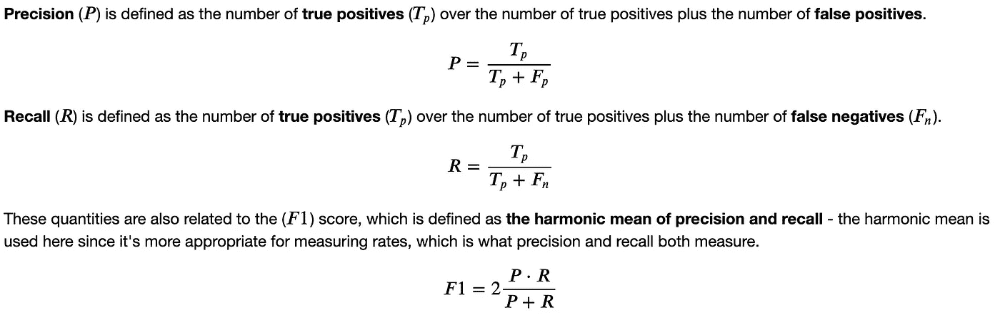
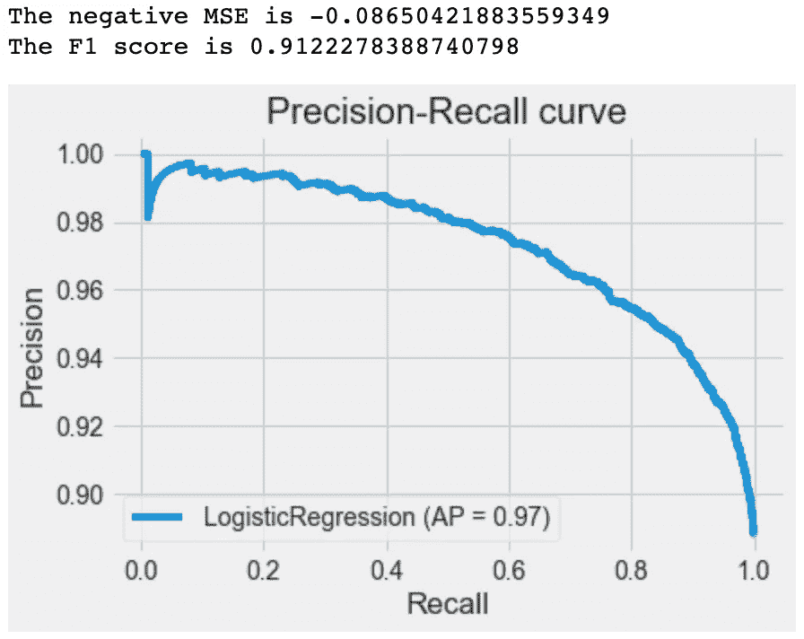
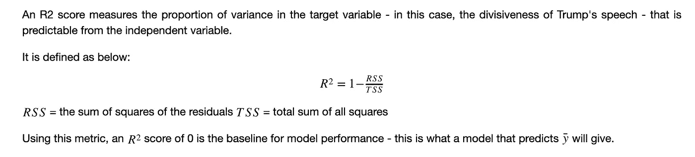
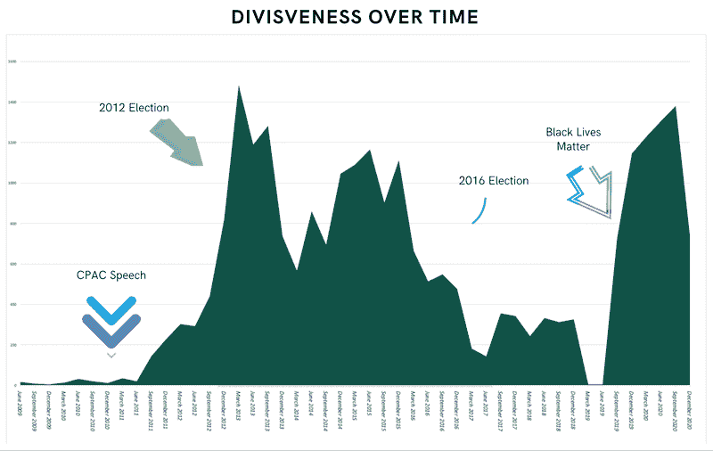

# 特朗普的推特网

> 原文：<https://towardsdatascience.com/trumps-twitter-network-7c59522ffe82?source=collection_archive---------34----------------------->

## 社交媒体:采取行动的挑战

信用:[查尔斯·德鲁维奥](https://unsplash.com/photos/9BXL-Vn22Do)

## 为什么预测会对现实世界造成伤害的内容这么难？

你可能已经读过了，并认为——不，它不是！如果你在 Parler 上留下骄傲男孩的内容，那么他们当然会冲击国会大厦。

可惜没那么简单。目前，我们每天产生 5 亿条推文，因此难以避免信息过载的问题，这是一个令人沮丧的问题，因为有太多的材料需要筛选。

让我用一个例子更详细地说明一下……骄傲的男孩只代表美国的一个极右团体，还有更多。假设骄傲的男孩已经从 Parler 和所有其他社交媒体平台上删除，他们仍然只是在社交媒体平台上创建内容的几乎无穷无尽的极右翼团体中的一根针。

所以，我想探索是否有办法通过数据科学来解决这个问题；我想看看是否有办法从所有的噪音中分离出信号。

## 假设:特朗普的对话者如何改变他的选词？

我认为，检验这一点的一个方法是将数据集限制在世界上最有权力的人:美国总统唐纳德·J·特朗普。

所以为了研究这个，我想出了上面的假设陈述，用简单的英语你可以理解为如下:

如果特朗普上周一直在转发肖恩·哈尼蒂，他是更有可能还是更不可能煽动一群暴徒闯入首都？或者，如果他一直在转发布莱巴特，并已陷入与南希佩洛西的推特战争？

## 数据源

为了探索这一点，我进行了一系列 twitter API 调用，以丰富 [Trump Twitter Archive](http://trumptwitterarchive.com/) 中已经非常有价值的数据集。

这一点尤其重要，因为这个数据集不包括特朗普推文中存在或不存在的 URL，而这正是我感兴趣的那种功能！

下面是我为此编写的代码:

要做到这一点，你需要一个 twitter 开发者账户，这样你就可以获得 API 证书。

我也只要求额外的信息，网址，报价，回复计数，但有一个公平的多一点，你可以检索。

我在这个项目中使用的另一个数据集来自 hatespeechdata.com，它更简单一点，由 reddit 和 gab 上的帖子组成，用户可以将这些帖子归类为可恶与否。

这样做的目的是提供一个独立于特朗普的数据集，在此基础上，我可以训练一个模型，将言论分类为仇恨或不仇恨，然后应用它来对特朗普的推文进行仇恨评分分类。

一旦解决了这个问题，我就可以着手建立一个模型，试图预测这个仇恨分数，看看哪些特征是重要的。

## 构建仇恨言论违反政策分类器

这背后有相当多的代码，你可以在这里看到完整的[；以下是主要步骤的快速总结。](https://nbviewer.jupyter.org/gist/osintalex/541b875800bdb8b564060e11b50e69fc)

仇恨的数据集包含 90%的仇恨样本和 10%的非仇恨样本，所以我必须做一些事情来缓解这种类别不平衡。

一个是选择合适的指标来解释这一点；除了查看均方根误差，我还根据 F1 分数评估了该模型，F1 分数结合了精度和召回指标，以说明误报率和漏报率。

精确度、召回率和 F1 分数的正式定义

我在这里采用的另一种方法是随机过采样非恶意数据；从下面的代码中可以看出，这相当简单。

这里，右侧的训练数据集由一个 y_train 数组和一个稀疏矩阵组成，y _ train 数组包含 0 或 1 个值，用于表示该语音是否令人讨厌，稀疏矩阵包含矢量化的自然语言数据和特征。

我使用 TfidfVectorizer 测试了几个模型，因为我认为脏话或其他辱骂性语言的存在比一般的字数统计更重要。

在这些模型中，支持向量机模型表现最好，但是加载非常慢。多项式朴素贝叶斯模型表现不佳，这可能是意料之中的，因为仇恨语言中的特征不太可能有条件地相互独立——许多数据由同一主题中的多个帖子组成。

所以最后我选择了一个简单的逻辑回归模型，它给出的 F1 值为 0.91，并且在一些随机抽样数据中表现良好。

这里有一段代码:

以及生成的输出…

然而，当我应用这个模型将特朗普的推文分类为仇恨或不仇恨时，我经历了一些重大的数据漂移。

特朗普的推文虽然具有煽动性，但实际上并不像 gab 或 reddit 上的非政治仇恨人物那样频繁地使用种族诽谤或脏话。

所以在一些重要的人工测试后，我得出结论，当应用于特朗普的推文时，我的模型获得了特朗普的*分裂*。我的模型给特朗普的一条推文打分，当它包含“朝鲜”、“移民”、“让美国再次伟大”等短语时，它更有可能是仇恨的。

为什么？因为这些短语经常与 gab 和 reddit 上用于训练模型的仇恨数据集中的仇恨言论同时出现。

给你举个例子:

> 民主党人更关心非法移民，而不是我们强大的军队或我们危险的南部边境的安全

根据我的模型，这个演讲有超过 70%的可能性是充满仇恨的。

> 这是我执政的第 500 天，我们取得了很多成就——许多人相信，这比任何一位总统执政的前 500 天都要多

而这条推文不到 30%是充满仇恨的。

当然，事实上他们都不仇恨，但你可以看到前一条推文更具分裂性，因为它与经常引发仇恨言论的言论有关。

## 模拟特朗普的分裂

因此，我现在可以将这一仇恨分数添加到我的特朗普推文数据集，从而创建一个目标变量。

但是，还有很多工作要做！除了正常的数据清洗和自然语言预处理工作，我还必须提取一些关键特征——特朗普的推文包含转发吗？如果有，给谁？或者它包含一个网址？如果有，根域是什么？

让我在这个领域暂停一下——如果我想了解川普在推特上与布莱巴特谈了一整天后是否变得更加分裂，那么我需要对像 https://www.breitbart.com/article-1 的这样的 url 进行编码，使其与 https://www.breitbar.com/article-2 的具有相同的值，因为他们都来自布莱巴特。

这一切都有点复杂；另一方面，这使它变得有趣。看看这个笔记本，看看它实际上是什么样子:

在清理了更多的数据后，我使用回归树来确定哪些特征是川普分裂性的预测因素，并用 R2 评分来衡量这一点。

为什么是 R2 分数？因为我想看看哪些特征预示了特朗普的分裂性。在这一点上，我并不太关心准确性，只是想看看特朗普转发或引用的人是否会影响他的分裂程度。

作为背景，这里有一个在我的项目中应用的 R2 分数的正式定义:

很难预测特朗普的分裂性，即使是用系综或随机森林模型，但我确实得到了 0.2 的 r2 分数，这至少比基线 r2 分数 0 有所改善，也就是说，你会得到的 r2 分数只是平均分裂性分数。

然而，更有趣的是，这些模型都显示一个特征比其他特征更重要。是肖恩·哈尼蒂吗？还是南希·佩洛西？福克斯新闻频道？

不要！是时候了…

## 特朗普随着时间的推移

战胜了长期的分歧。y 轴表示特朗普的平均整体分裂性得分，x 轴表示每年的一个季度。用简单的英语来说——这向你展示了特朗普在每个季度都有多么分裂。

这个图表是一个时间序列，显示了特朗普季度分裂性得分的指数加权平均值。相对于原始数据，这样绘制可以消除很多干扰，并揭示数据中的一些趋势。

这一点的迷人之处在于它在多大程度上追踪了特朗普的政治生涯和选举周期。

分歧首次出现在 2011 年，当时特朗普在保守派政治行动会议上发表讲话，开启了他的政治生涯。

从那时起，它还大致跟踪了 2012 年和 2016 年的选举周期，然后在 2020 年围绕黑人的命也是命抗议和新冠肺炎疫情向上攀升。

这一切背后的代码如下:

## 结论

那么，这对于防止社交媒体上的真实世界伤害以及机器学习和数据科学如何提供帮助有什么意义呢？

首先要说的是，我的假设是错误的。看起来特朗普的对话者不会影响他的用词——看起来他发推特的时间段绝对会影响他的用词。

但我认为这有助于达成一个更强大的解决方案。

从上面的图表可以看出，特朗普的分裂性语言具有难以置信的时间限制。这似乎是显而易见的，但它实际上提供了一种非常有用的过滤数据集的方法。

如果我们知道特朗普在 2020 年的言论与 2012 年的言论类似，这是有帮助的，因为我们已经知道 2012 年发生了什么。如果我们知道，根据我们关心的一个指标——美国总统的分裂程度——这些时期是相似的，那么我们可以在数据中探索那个时期，看看那里发生了什么。

有人在《继续》上发推文做了什么可怕的事情吗？特朗普持续转发的出版物是否传播了可怕的错误信息，它仍然活跃吗？

如果这些问题的答案是肯定的，那么我们就可以采取行动，知道有强有力的证据支持我们的决定。这些信息的价值很难被夸大——它是在为时已晚之前采取行动的力量。