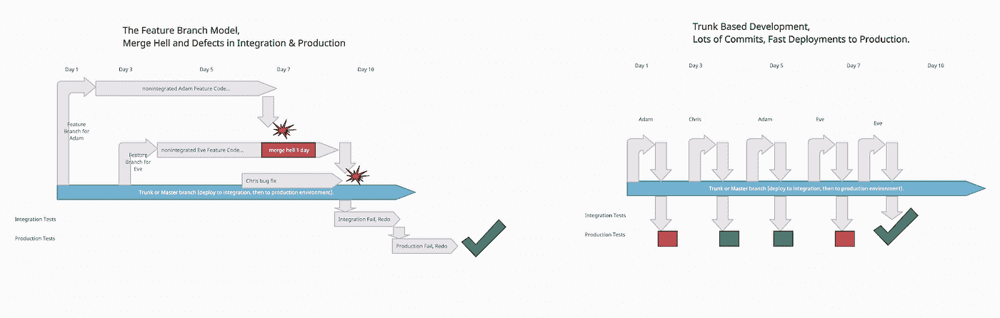
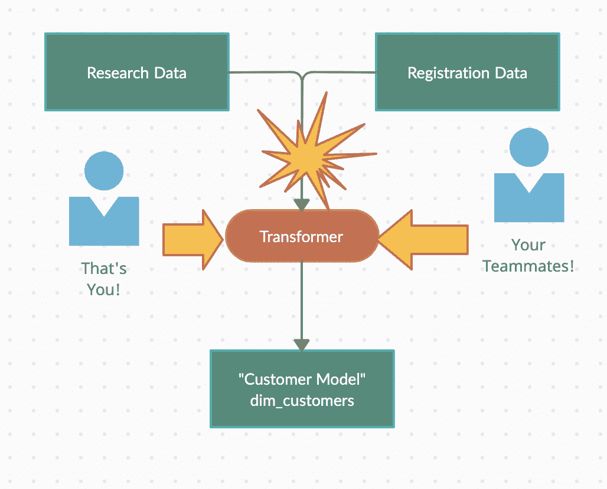
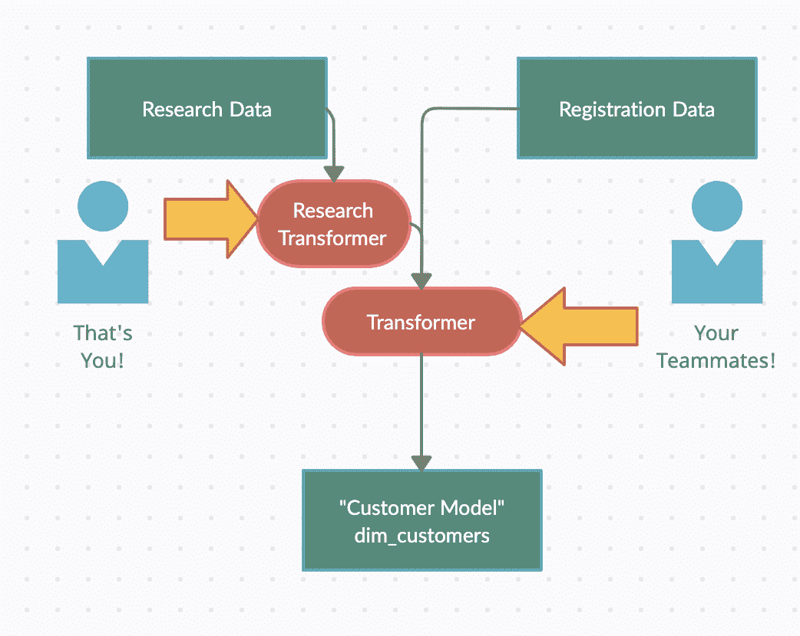
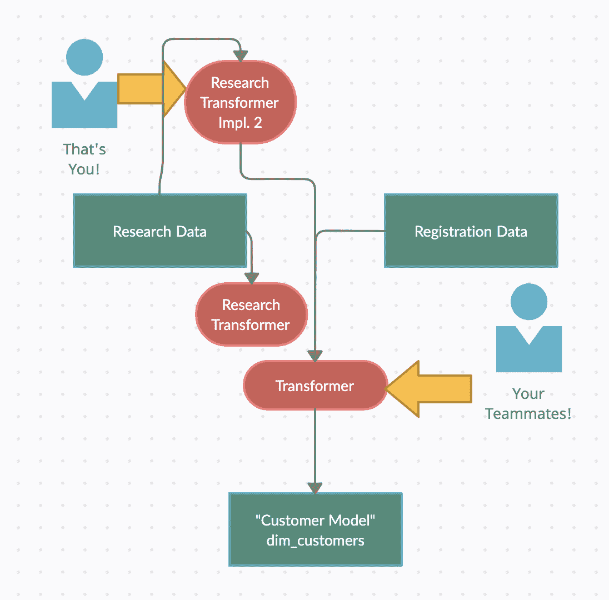

# 面向数据和分析工程师的基于主干的开发

> 原文：<https://towardsdatascience.com/trunk-based-development-for-data-analytics-engineers-cc8602115b55?source=collection_archive---------32----------------------->

## [入门](https://towardsdatascience.com/tagged/getting-started)

## 如何避免合并的地狱，加速商业价值的交付，减少缺陷，并从此幸福地生活在您的数据仓库中。



通过数据工作流中基于主干的开发，开发速度更快，部署到生产的缺陷更少。图片由作者提供。

【W*e 需要额外的一天时间将转化分支合并在一起*，*是的，但是当我们最终将数据用于生产时，出现了一个 bug，所以我们不得不在另外两天内重做一些东西*，…听起来熟悉吗？对我来说，数据和分析工程师似乎特别容易陷入“合并地狱”或“生产中的缺陷”场景。

但是有一个好的软件工程实践可以完全解决这些问题！它被称为“**基于主干的开发**”(TBD)。但出于某种原因，每当我与数据人员交谈时，他们都认为 TBD 不适用于数据管道、报告、立方体和所有这些数据东西。

在这篇文章中，我将试着解释一些基本知识，并希望用两个例子来说明 TBD 不仅适用**，而且实际上让数据人员的生活变得有趣！**

## **什么是基于主干的开发？**

*“一种源代码控制分支模型，在这种模型中，开发人员在一个称为‘主干’的分支中就代码进行协作，通过采用文档化的技术来抵制创建其他长期开发分支的任何压力。因此，他们避免了合并地狱，不破坏构建，从此幸福地生活。”*(保罗·哈曼特，*)*

尽管 TBD 有三种主要的变体，但我现在想降低复杂性，简单地想象一下: **TBD 意味着你总是将工作直接提交给 trun** k！

考虑一下:由于您可能设置了一个 CI 系统，并且每天提交 1-10 次，这将每天触发 CI 系统 1-10 次，运行所有测试，甚至可能将您所做的任何事情直接部署到生产中。当然，这取决于您的系统是如何设置的，以及您在 CI & CD 工作流程中的进度。

对于大多数习惯于创建一个特征分支，在其中工作几天，然后与其他人的工作合并的数据人员来说，这是一个可怕的想法。

此外，你不会无缘无故地创建一个功能分支，对吗？您创建它，所以您的工作不会影响生产，也不会影响可能处理相同表和管道的其他人的工作。你创造它，所以你不会把“垃圾”推向生产。

这听起来像一个巨大的混乱时，工作的主干所有的时间…

## **这如何转移到数据管道、ETL、报告等等？**

正如 Paul Hammant 所解释的，基于主干的开发使用了两种重要的技术，这两种技术将帮助您实际进行基于主干的开发:

1.  功能标志(或功能开关)
2.  抽象分支

如果您将这两种技术结合起来使用，您的数据管道工作将很快变得有趣，不会有任何合并冲突。我将分享两个例子来解释这两种技术，这也将表明为什么所有上述担心都是没有意义的。

但首先，让我回忆一下三个重要的规则:

1.  以非常小的块提交！理想的情况是每天几次。
2.  首先在本地运行您的“构建”，只签入“本地工作代码”。
3.  永远不要打破“构建”。如果是这样，在继续之前，使用所有资源来修复它。

现在让我们来看看这些例子。

## **例 1，特征标志**

功能标志是为了[快速、安全地交付新功能](https://martinfowler.com/articles/feature-toggles.html)。像这样:

> ` ` ` **python**
> 
> main(use _ old _ feature = True):
> if use _ old _ feature:
> 
> //运行旧代码
> 
> 否则:
> 
> // **切换到**运行 new_main 功能！
> 
> ```

特性标志如何帮助基于主干的开发？一个巨大的问题是，如果我们一直致力于主干，事情会被部署，并可能破坏生产系统。

那么，为什么不创建好的旧功能分支呢？因为那样的话，无论是我们的还是其他团队成员的代码都不会持续地相互集成。因此，功能切换来拯救我们，就像上面显示的那样。

我如何使用一个特性标志来集成代码？简单:我使用*“use _ old _ feature = False”*在本地和 CI 上运行我的测试，但是使用*“use _ old _ feature = True”*通过每个环境的配置文件部署到生产环境。

如果我们在 Tableau 做一个新的报告，包括

1.  通过一些 Python 脚本摄取一些新数据
2.  通过 dbt 转换数据
3.  在 Tableau 中显示数据

我们可以在运行时使用特性切换，通过使用许可系统向我们显示报告，也可以像上面那样在构建时切换，或者在转换阶段直接通过 dbts 排除特性([https://docs.getdbt.com/reference/node-selection/exclude](https://docs.getdbt.com/reference/node-selection/exclude)/

).

一个可能的配置文件如下所示:

> ` `` **config.txt**
> 
> 产品环境特征排除=
> 
> -蒂姆·itd 的特写 1 # 233
> 
> -Eve ITHD-23 中的功能 2 #
> 
> int-env-feature-excludes=
> 
> -蒂姆·itd 的特写 1 # 233
> 
> dev-env-feature-excludes=无
> 
> ```

## **例 1，续作金丝雀放飞&垂直切割任务**

通过权限系统切换功能的一个很大的好处是，我们可以将它们用作**金丝雀释放机制**。这意味着我们可以向最终用户展示粗略的版本(如第一稿和第二稿),让他们随意摆弄，从而获得非常早期的反馈，甚至是对测试数据的反馈。

在我看来，如果我们尝试“**垂直削减我们的任务**”，Canary releases 的效果最好。这意味着不再将上述任务分解为:

1.  进行摄取
2.  进行转换
3.  最后，做视觉上的东西

我们削减我们的工作:

1.  通过快速运行虚拟转换生成测试数据= >发布第一份报告并获得反馈(来自自动化测试和人员)
2.  使用实际获取的数据运行第二次迭代，并进行一些转换
3.  敲定事情。

在这个过程中，我们得到了 3 倍的反馈，并以更快的速度到达最终用户手中。我们有更高的测试覆盖率，并且可以一直集成我们所有的代码库。

## **示例 1，继续警告**

对于功能标志，Martin Fowler 显然有非常相似的观点，他说“它们是你应该做的最后一件事来隐藏一个已发布的功能”。相反，他认为你应该像上面那样削减(摄取、转换，最后是可视化的东西)，但是在完成之前不要打开终端用户端。

*两种方式都有效，特征标志也有效。您现在有了 3 种不同的工具来基于主干工作！让我们看看同样重要的最后一个工具。*

## **示例 2，通过数据管道上的抽象进行分支**

好了，这就是你如何将产品推向生产，并在生产中测试它，而不会给最终用户带来麻烦。但是如果你想做别人也在做的部分呢？

在数据团队中，这似乎经常发生，通常通过“你分支，我分支，然后我们合并”来解决。



*你和你的同事处理不同的任务，但是相同的代码库,“Transformer”=>合并冲突、同步等。图片由作者提供。*

一个解决方案是“**通过抽象进行分支**”，这意味着你在工作冲突的地方创建一个抽象，这样你就可以独立工作了。

让我们看一个例子。

假设您正在处理一个名为“dim_customers”的表，而您的团队成员也在不同的列上处理该表。您得到了一个转换工作，它获取“客户注册数据”和“研究数据”，执行一些操作，然后完成转换。您想要为研究数据添加几列，而其他人想要弄乱其他一些列。如果您不进行分支，就必须有人总是从主干中提取变更，本质上，您最终也会陷入合并地狱。

那你会怎么做呢？我们创造一个抽象概念。



一种允许彼此完全分离工作的抽象。图片由作者提供。

现在，您只需遵循抽象过程的[分支](https://trunkbaseddevelopment.com/branch-by-abstraction/):

1.  抽象出我们想要改变的= >添加第二个转换“研究转换器”，例如“选择*”以将其包含在“转换器”中；运行测试以确保你的重构如你所想。
2.  编写这个抽象的第二个实现，你的新实现(现在你的队友可以做他们想做的任何事情，尽可能多地释放和提交到主干！).
3.  用这个实现来测试你的东西(通过使用一个特性开关来打开它进行测试！)，甚至可能在为管理员打开特性开关的情况下将其投入生产。
4.  执行一个微小的提交来切换到新的转换。
5.  重构(如果需要的话)以包含转换！



*现在你添加了抽象的第二个实现——是的，为了可读性，我在图中去掉了实际的接口。之后，只是测试和重构，你就大功告成了！图片由作者提供。*

## **TBD 为数据团队带来的好处**

还看不出好处？TBD 本身就很棒，它允许你实际上既做 CI 又做 CD。不断致力于主干的好处意味着，当你的同事已经合并了一些东西时，你所做的工作与代码库的样子相差甚远。通过减少这种情况，您可以:

1.  意想不到地打碎更少的东西
2.  花更少的时间合并东西
3.  更快地看到重复代码，从而可以重用其他人的工作
4.  尽早发现不兼容性，从而加速开发

通过不断地将您的代码库与现有的代码库集成，并不断地将其交付到您的环境中，您可以通过与生产数据、测试框架等进行交互来获得大量的反馈。

## **我该如何选择款式？**

如果你仍然不相信基于主干的开发对数据团队是好的，那可能是因为你看到了一堆障碍。但是等等，大部分都可以很容易地移除。

基于主干的开发通常会遇到两件事，一是代码审查，这是很多团队对结对编程的替代或补充。团队可能会争论，没有特性分支，你就无法进行代码评审。多亏了现代编码系统，这种情况不再发生了。参见[解释&此处列出的最佳实践](https://trunkbaseddevelopment.com/continuous-review/)。

你可能想到的第二个想法是，如何具体解决这个问题，因为出于某种原因，提交到主干对你来说是不可行的。那样的话，我还是建议通读一下[这里讨论的三种不同的风格](https://trunkbaseddevelopment.com/styles/)。

## **延伸阅读**

*   如果你想深入了解特征标志/切换/开关这个话题，可以阅读马丁·福勒关于这个话题的文章:【https://martinfowler.com/articles/feature-toggles.html
*   Paul Hammant 创建并维护的网站是一个很好的资源，可以满足你对基于主干的开发的所有需求。

*对如何建立伟大的数据公司、伟大的数据密集型产品、成为伟大的数据团队感兴趣，还是对如何利用开源构建伟大的东西感兴趣？然后考虑加入我的* [*免费简讯《三个数据点周四》*](http://thdpth.com/) *。它已经成为数据初创企业、风投和数据领导者值得信赖的资源。*