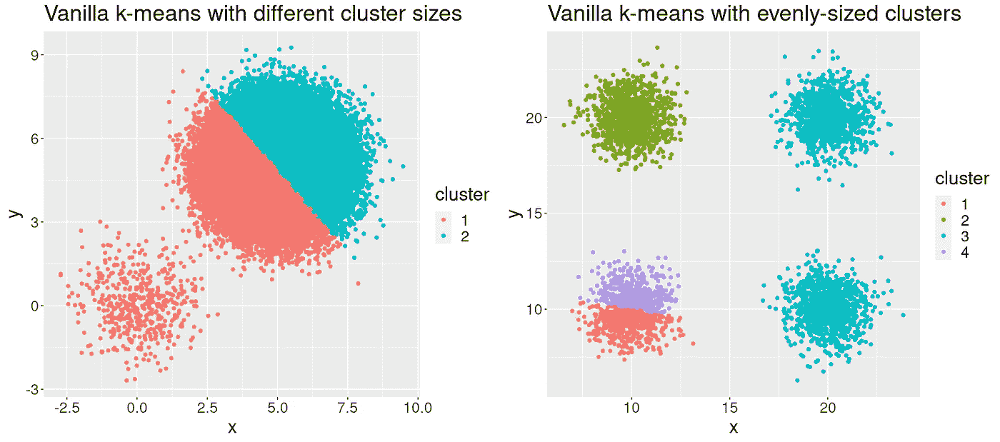
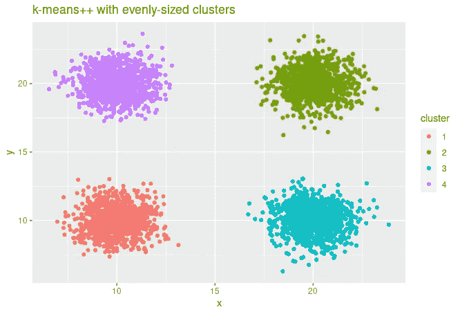

# 尝试这个简单的技巧来改善你的聚类

> 原文：<https://towardsdatascience.com/try-this-simple-trick-to-improve-your-clustering-b2d5d502039b?source=collection_archive---------15----------------------->

## [提示和技巧](https://towardsdatascience.com/tagged/tips-and-tricks)

## 开始初始化的 k-means++算法


照片由[布拉登·科拉姆](https://unsplash.com/@bradencollum?utm_source=medium&utm_medium=referral)在 [Unsplash](https://unsplash.com?utm_source=medium&utm_medium=referral) 上拍摄

k-means 是一种非常简单且普遍存在的聚类算法。但是通常它对你的问题不起作用，例如因为初始化不好。我最近遇到了一个类似的问题，我对我的数据集中的少量文件应用了 k-means，一切都很好，但当我对更多的样本运行它时，它只是没有可靠地获得良好的结果。

幸运的是，有一种改进的初始化方法，k-means++可以帮助缓解这个问题。在本文中，我们将涵盖以下内容:

*   [为什么初始化对 k-means 如此重要](#6fb7)
*   [对 k-means++算法的直观描述](#5d37)
*   [R 中 k-means++的实现](#2200)
*   [k-means ++的一个常见但错误的变体](#2350)

如果你还没有读过我关于 k-means 的文章，可以去看看，因为我会经常引用那里介绍的主题。像往常一样，你也可以在我的 [GitHub](https://github.com/MSHelm/algorithms-from-scratch) 上找到这篇文章的所有代码。

[](/a-deep-dive-into-k-means-f9a1ef2490f8) [## 对 k-means 的深入探究

towardsdatascience.com](/a-deep-dive-into-k-means-f9a1ef2490f8) 

# 问题是

正如我们在我之前的帖子中看到的，普通 k-means 受到随机初始化的影响。根据选择哪些点作为起始中心，
解决方案可能是一个非常糟糕的局部最小值。并且由于 k-means 具有严格的凹损失函数，它在训练期间没有办法逃离这个局部最小值。

考虑我上一个例子中的例子，我们有两个集群，但是每个集群中的点数非常不同(也就是说，集群基数不同)。由于起始中心是随机选择的，很有可能两个中心都是从大集群中选择的，这反过来导致
最终完全错误的集群。

但是对于大小均匀的集群，我们可能会得到错误的初始化，从而导致错误的结果:



# k-means++算法

这个问题的解决方案是 k-means++算法，它使用不同的初始化。这个想法非常简单:
我们只随机选择第一个中心，而不是随机初始化。所有的
随后的中心仍然被采样，但是其概率与它们离所有当前中心的距离的平方成比例。远离当前中心的点在下一次初始化迭代中成为中心的概率更高。

这试图更均匀地填充观察空间，同时仍然保留一些随机性。即使使用 k-means++，对相同数据的多次运行的结果也可能不同。虽然它在算法开始时确实需要更多的计算，但它会导致更快的收敛，使它在运行时方面比普通 k-means 更具竞争力。因此，许多常见的库使用 k-means++初始化作为它们的缺省值，例如 *sk-learn* 或 *MatLab* 实现。

请注意，此处仅隐式考虑了基础数据的分布，因为概率仅依赖于到其他中心的距离，而不依赖于到所有其他数据点的距离(与其他初始化算法相反，例如围绕 medoids 的分区)。
尽管如此，点数多的区域更有可能创建自己的
中心，因为更多的点数可以被选作下一个中心。

# R 中的实现

base R 附带的`kmeans`函数实际上没有 k-means++初始化选项。所以让我们实现它，重用上一篇文章中 k-means 算法的主干。我们将添加一个可选参数，让用户选择初始化，默认为我们刚刚讨论过的 k-means++初始化。

第一个中心是从数据中随机选择的。然后，我们创建一个中心数据框，从第一个中心开始，稍后我们将填充其余的中心。同时，我们需要跟踪哪些点不是中心，以防止我们再次选择同一个点作为中心。

```
next_center_id <- sample(seq_len(nrow(df)), 1)
centers <- df[next_center_id, ]
non_centers <- df[-next_center_id, ]
```

接下来，我们根据它们与
当前中心的距离迭代地选择新中心。我们可以使用上次的帮助函数`calculate_centers`(完整代码见下文)，我们只需要考虑到最近中心的距离，所以我们在每一行调用`min`。

```
distances <- calculate_distances(non_centers, centers)
distances <- apply(distances, 1, min)
```

在接下来的步骤中，我们根据距离选择下一个中心。
`sample`函数方便地让我们通过`prob`参数指定每个点的概率，它们甚至不需要在 0 和 1 之间！
因此，我们可以计算距离的平方，并简单地将它们传递到那里，但为了更紧密地遵循原始文件，我们还进行了归一化:

```
probabilites <- distances² / sum(distances²)
next_center_id <- sample(seq_len(nrow(non_centers)), 1, prob = probabilities)
```

最后，我们选择下一个中心，将其添加到我们的中心数据框中，然后
将其从非中心数据框中移除

```
next_center <- non_centers[next_center_id, ]
centers <- rbind(centers, next_center)
non_centers <- non_centers[-next_center_id, ]
```

我们现在只需要在一个`while`循环中这样做，直到我们选择了预期数量的聚类 *k* 的中心。这产生了我们的最后一个函数:

如果我们使用新的 kmeans++初始化，我们现在可以从数据中恢复正确的集群:



# 一个常见但错误的 k-means++变体

与许多数据科学工具一样，k-means++技术也有一些变体。通常，它选择与所有其他中心距离最大的点
作为下一个中心，而不是以与距离成比例的概率进行采样的
。如果你看一下
原始论文(文末链接)，这并不是真正的 k-means++
算法，它还有一个重大缺点:

如果总是选择具有最大距离的中心，则可以容易地选择一个异常值作为中心。由于人们通常选择 k 与数据集的大小相比非常小，少量的离群值就足以只选择离群值作为初始中心！
这不会对集群有太大的改善，因为你的数据主体没有很好的分布中心。但是，如果您想这样做，那么`while`循环中的代码应该如下所示:

```
distances <- calculate_distances(non_centers, centers)
distances <- apply(distances, 1, min)
# Choose point with maximum distance as next center
next_center_id <- which.max(distances)
# True k-means++ does the following:
# probabilities <- distances/max(distances)
# next_center_id <- sample(seq_len(nrow(non_centers)), 1, prob = probabilities)
next_center <- non_centers[next_center_id, ]
centers <- rbind(centers, next_center)
non_centers <- non_centers[-next_center_id, ]
```

# 摘要

正如我们所见，初始化是 k-means 性能的关键。
k-means++算法是一种简单且广泛应用的技术，可以缓解普通 k-means 算法存在的问题。还存在一些其他方法来进一步帮助解决这个问题，例如多次初始化中心，并选择具有最低惯性的初始化。例如， *sk-learn* 默认进行 10 轮初始化。

对于我的用例，不幸的是 k-means++还不够，我需要更好的方法。最复杂的初始化可能包含在 medoids 分区(PAM)中，我将在下一篇文章中讨论。敬请关注！

# 来源

*   描述 k-means++算法的原始论文:[Arthur&Cassilvitskii(2007):k-means ++精心播种的优势](https://dl.acm.org/doi/10.5555/1283383.1283494)
*   如果你没有论文，数学也在 [MATLAB 文档](https://de.mathworks.com/help/stats/kmeans.html#bues5gz)中描述
*   [对 k-means++的随机初始化的经验评估](https://scikit-learn.org/stable/auto_examples/cluster/plot_kmeans_stability_low_dim_dense.html#sphx-glr-auto-examples-cluster-plot-kmeans-stability-low-dim-dense-py)