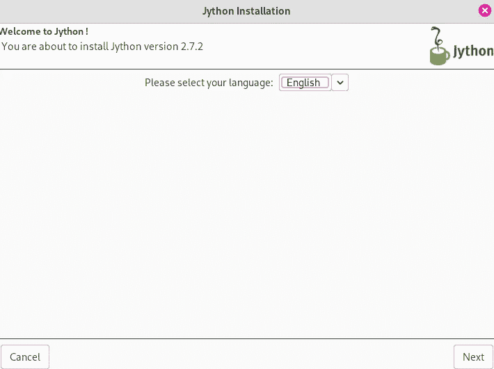

# 试用 Jython——Java 中的 Python

> 原文：<https://towardsdatascience.com/trying-out-jython-python-in-java-3efc76196a9e?source=collection_archive---------5----------------------->

## Jython 是什么，它还能用吗？


(图片由[雅各布·久巴克](https://unsplash.com/photos/XtUd5SiX464)在[Unsplash.com](http://unsplash.com/)上拍摄)

# 介绍

ava 是一种编程语言，已经很久不需要介绍了。这种语言无疑已经在各种软件行业中站稳了脚跟。从软件开发到 web 开发，甚至是 OpenGL 游戏开发，Java 已经成为这个行业的主流十多年了，它可以做很多事情。我们甚至可以认为 Java 在数据科学中也占有相当大的份额。当然，Scala 是一种不同的语言，它修改了 Java，试图去掉更多的缺点，使范例更加灵活，但是——Scala 是基于 JVM 的，当然非常接近 Java。Scala 绝对是数据科学领域的一项大工程，尽管这种语言的持久力可能随着它的 Java 亲戚在最近几年有所下降。实际上，我写了一整篇文章，讨论在您的数据科学之旅中，为什么您可能想或不想学习 Scala，如果您有兴趣在 2021 年学习更多关于数据科学和 Scala 的知识，这当然值得一读:

</should-you-learn-scala-for-data-science-in-2021-cf7810be7bfc>  

# Python 和 Java

为了理解 Python 和 Java 之间令人捧腹的关系，让我们首先回顾一下每种语言对数据科学和软件工程的整体影响。Java 并不是没有问题，即使是在它风靡全球的巅峰时期(明白吗，Eclipse 是一个旧的 Java IDE。也就是说，有一个替代版本的 Java 具有更多可扩展的特性和“更好”的总体设计。我强调越好，因为这些问题中有很多是个人偏好的问题。

人们不喜欢 Java 的一点是它的范式非常静态。这意味着，无论你在用什么语言编程，都必须以完全相同的方式完成。Scala 改变了这一点，它允许这种语言按照程序员希望的范式工作。经过多年的发展，我想我们已经意识到程序员不希望一门语言强迫他们以某种方式行事。我可以肯定地证明这一点。你可能会注意到，我写的主题经常在这个范围内——因为我喜欢泛型编程，我喜欢能够用非常适合问题的新方法来处理不同类型的问题。这是我认为朱莉娅很棒的部分原因。作为一种语言，它倾向于置身事外——这就把我们带到了组成这个*弗兰肯斯坦*编程会议的另一个语言主题…

> 计算机编程语言

> "大 P "

虽然没人管 Python 叫大 P，但是小解释语言做了很多事情。Python 的伟大之处在于它与 Java 有着相似的发展，同时也是一种基于 C 的开源语言，没有 Java 的问题。显著的区别是 Python 是 C 解释的，而 Java 运行在 JVM 专有的虚拟机上。

考虑到这一点，虽然看起来我对 Java 的评价很低，但事实并非如此。实际上，我对这门语言情有独钟，因为它是我在编程经历中很早就学会的一门语言。然而，我发现用任何标准来衡量，创建一个可以做任何事情的类都是令人沮丧的，我甚至发现这种语言比 C++更难使用，c++是我当时最喜欢的语言。这些年来，我与这种语言有过很多磨合，最终也写了相当多的 Scala 但不管怎样，尽管 Java 是一种很棒的语言，JVM 是一种很酷的虚拟化技术，我还是更喜欢使用不同的语言，比如 Python。

然而，我相信，鉴于 Java 是一个如此巨大的技术平台，使用 Java 的经验仍然是有价值的。也就是说，我认为 Java 平台有很多擅长的事情。以一种真正经典的“30 亿台设备运行在 Java 上”的方式，Java 可以应用于很多事情——甚至可能是数据科学。幸运的是，数据科学家可以使用 API 在多种语言中工作。今天，我想用 Jython 看看 Python 和 Java 之间潜在的协同作用。在 Java 中使用某种级别的 Python 语法运行一些非常棒的代码是可能的。

Python 和 Java 结合的真正迷人之处在于，它们来自两个完全不同的世界。Python 是用 C 语言编写的，在某种程度上，这种语言可以很好地使用的大多数代码都将驻留在同一个域中。另一方面，Java 是基于 Java 虚拟机或 JVM 的。与 Python 等价的 JVM 很可能是 JavaScript，尽管 JavaScript 通常与 Python 不同的计算领域相关联。事不宜迟，让我们看看能否让 Jython 工作起来。

# 安装 Jython

Jython 是一个发音非常奇怪的名字，但是这个名字的好处是我们都可以识别这个包可能做什么。如果您想亲自查看 Jython 网站，这里有一个链接:

  

这个包的酷之处在于它结合了 Python 和 Java。我认为这可能会给两种语言之间的某种程度的协同带来一些潜力。然而，这一切可能的长度目前对我来说是一个谜——所以我想最好的方法是跳进一个笔记本，尝试一下。我甚至没有在这台计算机上安装 openJDK，所以我要做的第一件事就是安装它。

```
[emmac@fedora ~]$ dnf search openjdk
Fedora 34 - x86_64                              2.8 MB/s |  74 MB     00:26    
Fedora 34 openh264 (From Cisco) - x86_64        4.1 kB/s | 2.5 kB     00:00    
Fedora Modular 34 - x86_64                      2.2 MB/s | 4.9 MB     00:02    
Fedora 34 - x86_64 - Updates                    3.2 MB/s |  29 MB     00:09    
Fedora Modular 34 - x86_64 - Updates            1.8 MB/s | 4.3 MB     00:02    
google-chrome                                   5.7 kB/s | 3.5 kB     00:00    
RPM Fusion for Fedora 34 - Free                  50 kB/s | 941 kB     00:18    
RPM Fusion for Fedora 34 - Free - Updates        12 kB/s | 395 kB     00:32    
RPM Fusion for Fedora 34 - Nonfree               19 kB/s | 246 kB     00:12    
RPM Fusion for Fedora 34 - Nonfree - Updates    3.8 kB/s |  81 kB     00:21    
======================= Name & Summary Matched: openjdk ========================
java-1.8.0-openjdk.x86_64 : OpenJDK 8 Runtime Environment
[emmac@fedora ~]$ sudo dnf update && sudo dnf install java-1.8.0-openjdk -y
```

> 哇，我想我正式成为 Java 开发人员了。

Jython 安装程序以. jar 文件的形式出现。当然，现在我有了 JDK，可以很容易地打开它。我必须承认，我通读了文档，看起来 Jython 确实是为 Python 2.7 设计的。考虑到这一点，如果这不起作用就不足为奇了，因为 Python2 已经被弃用了近一年，或者可能是两年……我不记得弃用是在 2021 年 1 月还是 2020 年 1 月。我跑题了，让我们试着执行 Jython。jar 文件，看看会发生什么。

> 随机边评，我已经好几年没见过. jar 文件了！

该文件也没有被执行的能力，所以您可能不得不像我一样对该文件进行 chmod +x。然后我跳进终端，用 java -jar 打开它。需要注意的是，如果您像这样使用终端，您实际上可能不需要更改它。我原本不打算这样做，但我没有在“打开方式”屏幕上显示 OpenJDK。



(图片由作者提供)

> 这并没有激发太多的信心。

安装过程非常简单。我确实，但是在安装这个的时候在终端上收到了很多警告…

```
(java:292940): Gtk-WARNING **: 20:00:34.120: Could not load a pixbuf from icon theme.
This may indicate that pixbuf loaders or the mime database could not be found.
WARNING: An illegal reflective access operation has occurred
WARNING: Illegal reflective access by org.python.core.io.StreamIO (file:/home/emmac/jython2.7.2/jython.jar) to field java.io.FilterOutputStream.out
WARNING: Please consider reporting this to the maintainers of org.python.core.io.StreamIO
WARNING: Use --illegal-access=warn to enable warnings of further illegal reflective access operations
WARNING: All illegal access operations will be denied in a future release
DEPRECATION: A future version of pip will drop support for Python 2.7.
Looking in links: /tmp/tmpqcWXlg
Collecting setuptools
Collecting pip
Installing collected packages: setuptools, pip
Successfully installed pip-19.1 setuptools-41.0.1
```

> 天哪

看起来我们确实在使用 Python 2.7，这实际上非常糟糕。或者更确切地说，我们可能使用的是 Python 3.9.9，但 Jython 认为我们使用的是 Python 2.7。这很可能会导致一些问题，但是我们真正能发现的唯一方法是编写一个新的 Java 应用程序。我要写的第一件事就是经典的《Hello world！是时候看看这是如何运作的了。坦白地说，我也很想做或看到一些基准测试，尽管实际工作的可能性很小，但是我不确定我们是否能成功编译一个应用程序，但是我们肯定会尝试！

# 书写 Hello World

另外，顺便说一下，我也确实发现了一些奇怪事情，这些事情可能会让我看起来很愚蠢。我想检查 Jython 现在是否被添加到我的路径中，并且…只是看一下…

```
[emmac@fedora ~]$ jython
bash: jython: command not found...
Install package 'jython' to provide command 'jython'? [N/y] n
```

所以你的意思是告诉我

*   安装 JDK
*   运行一个 jar 文件
*   通过 Jython 安装程序安装 Jython

它一直在我的包管理器里。幸运的是，dnf/yum 存储库中的版本与我刚刚安装的版本相同。

```
[emmac@fedora ~]$ sudo dnf list jython
Last metadata expiration check: 0:37:53 ago on Sat 18 Dec 2021 07:32:27 PM EST.
Available Packages
jython.noarch                        2.7.1-16.fc34                        fedora
[emmac@fedora ~]$
```

> 给维护者的提示。

事不宜迟，让我们试着编写 hello world 代码吧！

```
[emmac@fedora dev]$ mkdir jython_hello_world
[emmac@fedora dev]$ cd jython_hello_world
[emmac@fedora jython_hello_world]$ nano hello.java
```

这个过程的第一步是导入 PythonInterpreter 类。按照真正的 Java 方式，这被隐藏在其他 6 个别名之下。

```
import org.python.util.PythonInterpreter;
```

> System.out.println("这个上面怎么这么多包啊。")

正如我前面提到的，Java 是纯面向对象的，并且强迫用户在这个范例中操作。这既是一件好事也是一件坏事，但是不管我对它的看法如何，接下来我将不得不写一个具有 main 函数的类:

```
public class main {
  public static void main(String[] args) {

    }
  }
}
```

正如他们在 Jython 文档的例子中所做的那样，我将把我对 PythonInterpreter 类的调用包装在一个 try 中，这样如果这不起作用，我的计算机就不会崩溃——不崩溃意味着它不会抛出异常。

```
try(PythonInterpreter pyInterp = new PythonInterpreter()) {
      pyInterp.exec("print('Hello World! Wait is this Python or Java')");
```

我们将调用 pyInterp.exec()函数，以便将 Python 代码作为字符串执行，最终的类如下所示:

```
import org.python.util.PythonInterpreter;public class main {
  public static void main(String[] args) {
    try(PythonInterpreter pyInterp = new PythonInterpreter()) {
      pyInterp.exec("print('Hello World! Wait is this Python or Java')");
    }
  }
}
```

哇，我太爱面向对象编程了，为了编写一个多范型的面向对象编程语言，我在用面向对象语言。

```
[emmac@fedora jython_hello_world]$ java hello.java
hello.java:1: error: package org.python.util does not exist
import org.python.util.PythonInterpreter;
                      ^
hello.java:5: error: cannot find symbol
    try(PythonInterpreter pyInterp = new PythonInterpreter()) {
        ^
  symbol:   class PythonInterpreter
  location: class helloworld
hello.java:5: error: cannot find symbol
    try(PythonInterpreter pyInterp = new PythonInterpreter()) {
                                         ^
  symbol:   class PythonInterpreter
  location: class helloworld
3 errors
error: compilation failed
[emmac@fedora jython_hello_world]$
```

所以这产生了一些错误…看起来 PythonInterpreter 类不存在。我找到了这个类的文档，在这里:

  

奇怪的是，这并不在反对之列。我必须承认，Java 肯定不是我最喜欢的语言，也不是我经常编写的语言，所以我不确定这是被否决了还是我做错了什么——但是整个 org.python 包可能已经被完全否决了。我们可以通过尝试导入来测试这个工作理论:

```
GNU nano 5.8                                              hello.java                                                        
import org.python.util.PythonInterpreter;
import org.python;
public class helloworld {
  public static void main(String[] args) {
    try(PythonInterpreter pyInterp = new PythonInterpreter()) {
      pyInterp.exec("print('Hello World! Wait is this Python or Java')");
    }
  }
}
```

# 第二次尝试

这是一个非常老的软件，大约有十年了，所以为了让它正常工作，我们可能需要做一些不同的尝试。我注意到在我的安装目录中，有一个 README.md 文件。在该文件中，他们直接调用 Jython 可执行文件，而不是用 Java 编译所有这些文件。考虑到这一点，也许这就是我这次尝试的问题所在。考虑到这一点，我想从 DNF 安装 Jython，这样它就会在我的路径中，而不是通过努力找到可执行文件的位置并将该目录添加到我的路径中

```
sudo dnf install jython
[emmac@fedora jython_hello_world]$ jython --version
Jython 2.7.1
```

现在，如果我在终端中键入“jython ”,它实际上会启动一个 REPL！

```
[emmac@fedora jython_hello_world]$ jython
WARNING: An illegal reflective access operation has occurred
WARNING: Illegal reflective access by jnr.posix.JavaLibCHelper$ReflectiveAccess (file:/usr/share/java/jnr-posix/jnr-posix.jar) to method sun.nio.ch.SelChImpl.getFD()
WARNING: Please consider reporting this to the maintainers of jnr.posix.JavaLibCHelper$ReflectiveAccess
WARNING: Use --illegal-access=warn to enable warnings of further illegal reflective access operations
WARNING: All illegal access operations will be denied in a future release
Jython 2.7.1 (, Jan 12 1970, 15:34:24) 
[OpenJDK 64-Bit Server VM (Red Hat, Inc.)] on java11.0.13
Type "help", "copyright", "credits" or "license" for more information.
>>> print(" Hey look, it works")
 Hey look, it works
>>>
```

> 有人报警了，因为发生了非法反射访问操作。

```
jython hello.java
public class helloworld {
          ^
SyntaxError: no viable alternative at input 'class'
```

> 等等。

我认为这个 Jython 包实际上是为了阅读 Python，它可能实际上是一个 Java 绑定的 Python 解释器。让我们试着制作一个相当于这个 hello world 文件的 Python。

```
[emmac@fedora jython_hello_world]$ nano helloworld.py
```

这是我的 hello world 应用程序:

```
if __name__ == "main":
    print("Hello World")
```

> Python 永远不会让我相信‘是字符串。

```
jython helloworld.py
```

无论何时运行，什么都没发生——除了我们以前有过的同样荒谬的非法反射活动的打印输出。也许解释者不想让我做 Python

```
if __name == "main":
```

并且无法解释这样的代码？

```
print("Hello World")
```

既然我们的文件没有条件，让我们来试试看:

```
[emmac@fedora jython_hello_world]$ jython helloworld.py
WARNING: An illegal reflective access operation has occurred
WARNING: Illegal reflective access by jnr.posix.JavaLibCHelper$ReflectiveAccess (file:/usr/share/java/jnr-posix/jnr-posix.jar) to method sun.nio.ch.SelChImpl.getFD()
WARNING: Please consider reporting this to the maintainers of jnr.posix.JavaLibCHelper$ReflectiveAccess
WARNING: Use --illegal-access=warn to enable warnings of further illegal reflective access operations
WARNING: All illegal access operations will be denied in a future release
Hello World
```

> 成功了！

# 结论

这相当于试图在现代的 Windows 机器上运行 90 年代的游戏，除了有点糟糕。虽然这确实很可笑，但却很有趣。试图在 Java 中使用为 Python 2.7 设计的遗留代码可能行不通，但是现在我的机器有了一个基于 Java 的 Python 解释器——这非常有趣。然而，真正酷的是，我还注意到可能有一种方法可以将这些代码编译成. jar 文件。是的，我是认真的——用 Java 编译 Python 我不完全确定，但是无论何时我打电话

```
jython --help
```

在我的终端里，这个潜在的论点打动了我:

```
-jar jar : program read from __run__.py in jar file
```

不管它实际上意味着什么，它肯定是非常有趣的。我将不得不在以后的文章中花些时间来研究这个问题！还有一件事，如果你想查看这两个 hello world 文件，无论出于什么原因，你都可以在 Github 上我的“随机代码”存储库中查看它们:

<https://github.com/emmettgb/Random_Code/tree/main/jython>  

非常感谢您阅读这篇古怪的 Java-Python 疯狂冒险，它对我来说意味着一切！鉴于 Jython 仍在工作(不确定它是否仍在使用 Python 2.7 或 3.9.9)，我肯定会就此主题写一篇后续文章，在所述文章中，我可能会尝试用 Python 编译一个 jar 文件，如果这是那个论点实际做的，那么描述符确实不是最好的。如果有读者知道这是什么意思，也不知道这是什么意思，如果有人能告诉我，那就太好了。我也可能会尝试用旧的 C 编译器对 JVM 编译器进行基准测试。

一些结束语…如果这只是一个简单的 Java Python 解释器，那么 Python 2 被弃用可能没什么关系。也许事实就是如此，而 Python 根本没有参与其中。如果是这样的话，那么将基于 JVM 的编译器与基于 C 的编译器进行比较将会更加有趣。在那之前，我要感谢我的读者，我希望你们无论白天还是晚上都有一个美妙的休息！