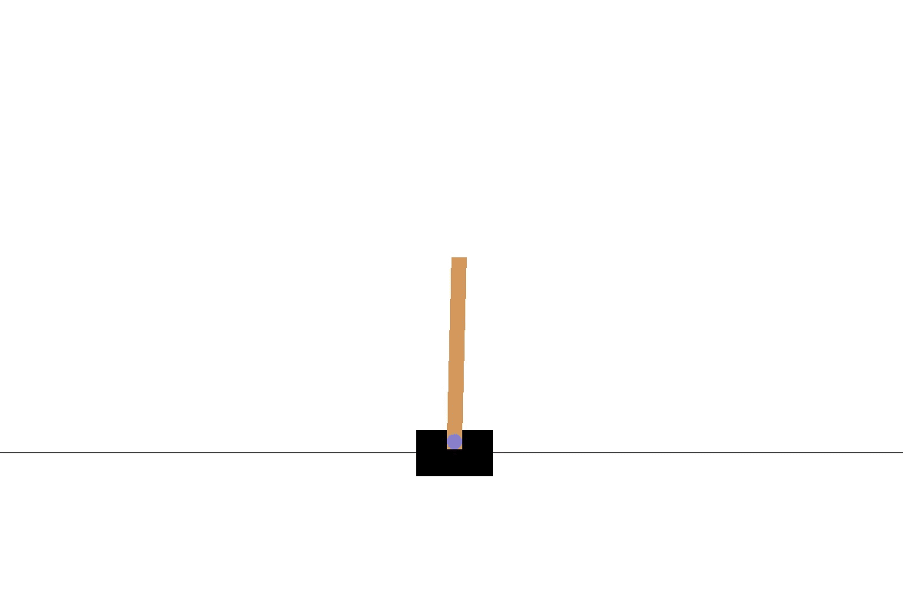

# 试图解决 CartPole 没有谷歌任何东西

> 原文：<https://towardsdatascience.com/trying-to-solve-cartpole-without-googling-anything-a296d79babb3?source=collection_archive---------37----------------------->

## 对自己的周末挑战

# 什么是横竿？

CartPole 是一个开放的环境问题，旨在测试你编写一个解决方案来平衡附着在车上的杆子的能力，如下图所示。如果旗杆偏离垂直方向超过 15 度，你就输了，如果手推车偏离屏幕，你就输了。我只有强化学习的理论知识，所以我试着看看能不能不用谷歌就想出解决方案。我是这么做的。

一个钢管舞的开始

# 状态和行动

在每一个时间步，你必须把车稍微向左或向右推。你必须从这两个选项中选择一个。这些选项被称为“动作空间”在每个时间步有 4 条信息给你做决定:小车位置，小车速度，极点角度，尖端的极点速度。这些信息统称为“状态”

# 建立基线

官方的说法是，当你支撑一根竿子 200 个时间步时，就认为这根竿子被打败了。我没有用这个标准来衡量自己，因为我试图在没有任何帮助的情况下解决整个问题。首先，我在 1000 个 cart pole 模拟中采取随机行动(每个模拟称为一集)。这产生了持续大约 21 个时间步长的平均模拟。然而，我不想只是比随机更好。我创造了一个“硬编码”的解决方案，如果杆子向右倾斜，它就向右移动，如果它向左倾斜，它就向左移动。这产生了 40 步的平均时间长度。这是我的基线。

# 解决方案尝试

## 首次尝试线性回归

这是一个非常简单的解决方案，但我想为什么不试一试。我是这么做的。

1.  从许多随机模拟中收集数据。
2.  使用状态和动作作为输入，预测杆子还能保持多长时间。
3.  在每个时间步运行 model.predict()两次，插入“left”和“right”进行操作，并选择剩余时间值较大的一个。

这样做的问题是，因为变量之间没有交互作用，一个动作值将*总是*产生更高的预测剩余时间。

## 第二次尝试随机森林

下一个解决方案与第一个非常相似，但是我意识到我必须考虑状态和动作之间的交互作用。一个随机森林就可以做到这一点，而且用一个随机森林替换掉代码，然后在线性回归中添加多项式和交互效应会更容易。

1.  从许多随机模拟中收集数据。
2.  使用状态和动作作为输入，预测杆子还能保持多长时间。
3.  在每个时间步运行模型两次，为动作插入“左”和“右”，并选择具有较大值的一个。

这种解决方案的主要问题是，这个动作的特性重要性如此之低，以至于在预测它停留的时间时没有用。这是因为它在糟糕的情节上进行了大量训练，这些情节不会持续很长时间，随机的行动根本没有帮助。毕竟大多数情节都是非常糟糕的例子。事实上，一遍又一遍地选择相同的动作会产生一个持续 9 个时间步长的情节，而 random 只会持续更长一点的时间。

## 第三次尝试神经网络

我决定在每集结束时训练/再训练一个模型，而不是收集大量模拟数据。我认为这将获得更好的训练数据，因为模型将迭代改进，我将获得越来越多的成功训练数据。

1.  从单个随机剧集中收集训练数据。
2.  在随机事件上训练神经网络，以预测杆子会竖立多久。
3.  运行另一集，其中神经网络预测它停留多长时间，偶尔采样一个随机动作。
4.  在每集结束时继续更新神经网络，最终采取随机行动的方式。

我用这种方法遇到的问题是，神经网络从偏好一个动作(由于随机权重)开始，因此它预测相同的动作。然后，网络开始变得非常准确，预测游戏将在 9 个步骤中结束，因为这就是当你总是做出一个决定时会发生的事情。这个模型本质上集中在有目的地立即结束游戏，这样它会非常准确。我见过其他人用这种方式成功地实现了一个解决方案，但他们无疑更擅长优化采取随机行动进行学习和使用模型之间的权衡，以及设计他们的神经网络结构。

## 第四次尝试逻辑回归

接下来，我决定改变我思考问题的方式。到目前为止，我基本上一直使用动作作为输入并运行 model.predict(state，action)两次，使用不同的动作值。所以我决定用状态来预测动作。这将问题从我预测连续结果(剩余时间步长)的回归型问题转化为二元分类问题(左或右)。如果我用随机数据进行训练，我会遇到一个问题，没有一个状态与动作相关联(因为它们是随机选择的动作。为了解决这个问题，我删除了持续时间不长的剧集。剩下的剧集，虽然是随机生成的，却有很好的行动范例。

1.  从许多剧集中收集随机数据。
2.  删除至少 100 个时间步长内电杆未保持直立的数据。其余数据仅显示了各州采取的良好行动。
3.  训练逻辑回归 X =状态，Y =行动。
4.  运行新模型并使用状态来预测动作，然后采取那些动作。

这种解决方案使模型持续了大约 60 个时间步。这比我的硬编码基线快了 20 步。这仍然有缺陷，首先我必须生成大量数据，然后扔掉其中的大部分，因为它们是糟糕的(即排序)剧集。鉴于有些人已经解决了几百集的问题，我做得不是很好。其次，鉴于它只持续了 60 步，其他人持续 200 步的解决方案也并不伟大。

# 外卖

以下是我从中学到的主要东西:

*   强化学习工作起来很有趣，而且比许多其他 ML 项目更有趣，因为你可以看到你的模型对一些“有形的”(尽管是数字的)东西的影响。在我看来，AI 和 ML 的区别在于，AI 有决策能力，而 ML 没有。AI 可以根据 ML 的输出做出那些决定(通常也是这样)。强化学习感觉是最接近人工智能的东西，并且将是人们在未来几年中认为的人工智能。
*   简单的解决方案有效！学习逻辑回归很容易，所以为什么不把它作为学生职业生涯中的早期学习练习呢？这当然比泰坦尼克号分类更吸引人。
*   我需要了解更多关于深度学习的知识。虽然我只是说“简单的解决方案有效”,但随着我处理的问题变得越来越复杂，我需要更好的方法。除了其他问题，人们有更好的神经网络解决方案，所以这肯定是我应该加倍努力以获得更好的解决方案的事情。