# 尝试使用 30GB 的数据库进行情感分析

> 原文：<https://towardsdatascience.com/trying-to-use-a-30gb-database-for-sentiment-analysis-137d5f5c5fc5?source=collection_archive---------37----------------------->

## 使用 Python、SQL、AWS understand 和 Tableau 的学习过程


照片由 [Unsplash](https://unsplash.com/s/photos/machine-learning?utm_source=unsplash&utm_medium=referral&utm_content=creditCopyText) 上的 [h heyerlein](https://unsplash.com/@heyerlein?utm_source=unsplash&utm_medium=referral&utm_content=creditCopyText) 拍摄

这学期，我在查尔斯博士的指导下选修了一门名为“开发有意义的指标”的课程。当他提到他正在尝试对 Reddit 评论的庞大数据集进行一些自然语言处理时，我受到了启发。事实上，我的两个同学(Nicole 和 Min Yi)也曾在 Excel 上使用微软 Azure AI 对 Twitter 推文进行情感分析。

所以我和我的同学合作，他的目标是真正改变世界，[惠玲](https://ling9hui1.medium.com/)，并试图为我们自己做这件事。我们最初假设，Reddit 上的人们通常会以积极的态度发表评论，因为毕竟，Reddit 是一个社区平台，人们可以在这里相互分享他们的想法和故事。我们还认为情绪得分和分数之间存在某种正相关关系(更高的分数=更高的情绪得分)。然而，在我们讨论了寻找错误和批判性思维之后，我们意识到我们可能是错的……这让我们更加渴望投入进去。

# 技术部分

第一个挑战是下载数据集。我们在 2015 年 5 月的所有 Reddit 评论上发现了一个 30GB 大小的[海量数据集](https://www.kaggle.com/reddit/reddit-comments-may-2015)！(是的，我知道 Kaggle 上写着 20GB，但证据在下面)

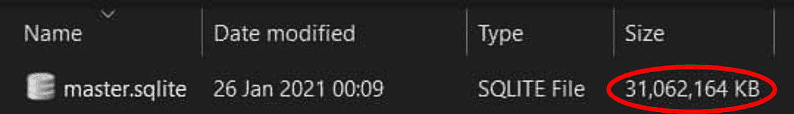

(图片来自作者)

下一步是弄清楚如何打开文件。令人惊讶的是，我这个计算机专业的学生以前从未使用过 SQL，所以在 SQLite 上下载并打开文件对我来说是一种全新的体验。在大量的谷歌搜索和一个关于 SQL 的小型在线速成班之后，我发现 SQL 比我学过的大多数其他语言都要简单得多。数据集的大小也让我大吃一惊，它高达 5400 万行。

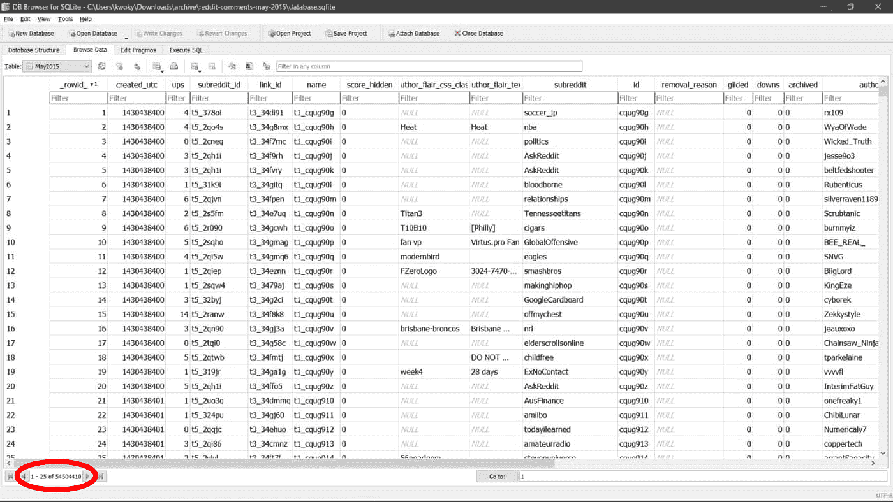

数据集的简要视图(图片来自作者)

我们制定了非常非常粗略的计划，但是对于大多数技术细节，我不知道该怎么做。想法是首先过滤数据，然后上传到亚马逊网络服务(AWS)。然后，我会编写一个 Python 脚本来读取数据，将数据发送到[Amazon understand](https://aws.amazon.com/comprehend/)进行情感分析，然后再次编译数据。我们将再次下载数据，然后在 Tableau、Excel 或其他可视化工具上执行数据可视化。事情开始看起来不错了…

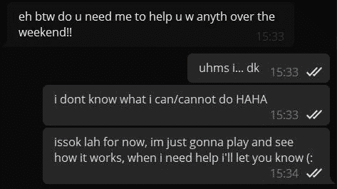

我知道但也不知道该做什么(图片来自作者)

不对。当我开始过滤数据集(过滤我不需要的列)时，我的下一个挫折出现了。我试图创建表和删除列，结果导致了大规模的崩溃。

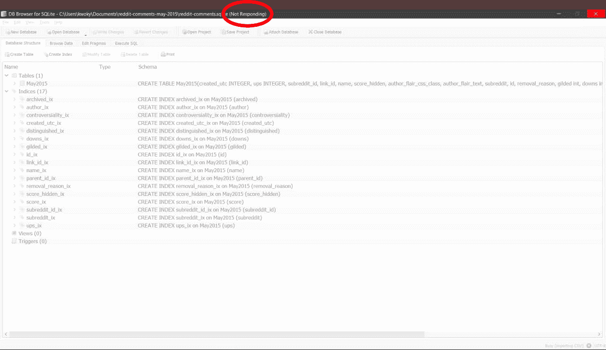

许多崩溃中的第一个(图片来自作者)

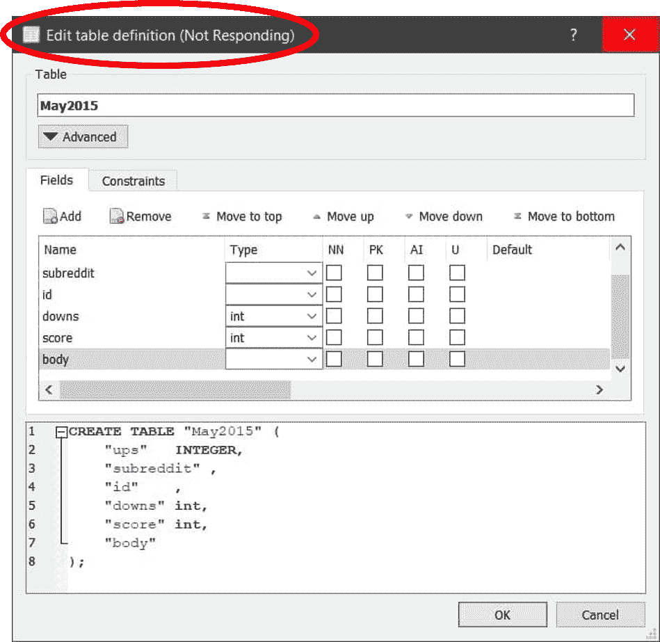

我存在的祸根(图片来自作者)

作为一个不耐烦的人，我会强制关闭 SQLite。然而，正如我(非常)慢慢了解到的，这将损坏 SQL 文件(或者可能不会，但我没有精力找出原因)。然而，这让我感到困惑和极度沮丧。

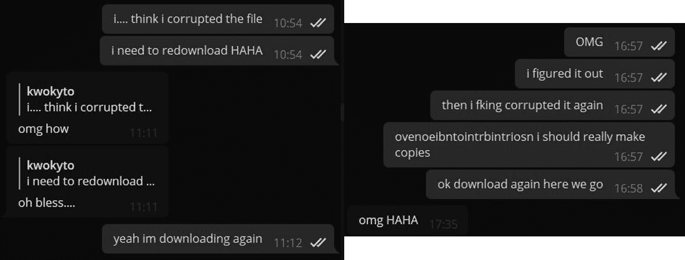

我向惠玲发泄我的不满(图片来自作者)

经过几次尝试后，我放弃了过滤数据的尝试，并想知道是否可以直接将文件上传到 AWS 中。不过， [AWS RDS](https://aws.amazon.com/rds/) 似乎只支持 MySQL、PostgreSQL、MariaDB 等。酪不是。SQLITE。我花了几天时间在谷歌上搜索替代品，但大多数似乎太复杂了。

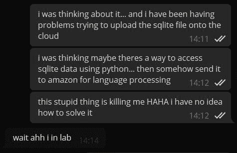

我在糟糕的时候打扰惠玲(图片来自作者)

并非所有的希望都破灭了。转折点出现在我参加的另一个模块的一次(非常无聊的)讲座中。我意识到我不需要把数据集上传到 AWS，但是我可以把 AWS 带给我。相反，我可以使用 Python 来访问 SQLite 数据库和 AWS understand，然后将结果写入一个新的(干净的)CSV 文件，我们可以用它来进行可视化。

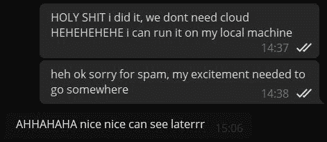

(图片来自作者)

幸运的是，我有使用 Python 的经验，所以编写 Python 脚本相当顺利。首先是连接到 AWS。我有一个现有的 AWS 教育帐户，我用来发送请求到 AWS 理解。在我的机器上本地配置了凭证和 AWS SDK 之后，我能够编写一个函数，它接收一个文本，发送给 intensive，并返回结果。代码的说明很容易从[文档](https://docs.aws.amazon.com/comprehend/latest/dg/get-started-api-sentiment.html#get-started-api-sentiment-python)中找到。

```
## script for sentiment analysisdef get_sentiment(text):
    comprehend = boto3.client(service_name='comprehend', region_name='us-east-1')
    response = comprehend.detect_sentiment(Text=text, LanguageCode='en')
    response = dict(response) result = {}
    result["sentiment"] = response["Sentiment"]
    result["positive"] = response["SentimentScore"]["Positive"]
    result["negative"] = response["SentimentScore"]["Negative"]
    result["neutral"] = response["SentimentScore"]["Neutral"]
    result["mixed"] = response["SentimentScore"]["Mixed"]
    result["sentiment_score"] = (result["positive"] - result["negative"]) / 2return result
```

连接到 SQLite 需要更多的研究。这个[链接](https://www.sqlitetutorial.net/sqlite-python/)几乎涵盖了我需要知道的所有内容，我强烈推荐任何在 Python 上尝试 SQLite 的人。

```
## connect to sqlite databaseconnection = sqlite3.connect("master.sqlite")
print("opened database successfully")
data = connection.execute("SELECT id, subreddit, body, ups, downs, score FROM comments_cleaned")
```

下一段代码处理了大部分进程。我从编写这部分代码中得到的最大收获是错误处理。在几次执行代码之后，我发现了许多我没有预料到的错误，因此必须适当地处理错误，并重新运行代码。最终，我想到的解决方案是允许用户输入决定跳过(过滤掉)那一行，或者在再次处理那一行之前在本地修复问题，而不中断/终止程序。

```
with open("comments_with_scores_" + str(NUMBER_OF_ROWS) + ".csv", 'w', newline = '') as file: writer = csv.writer(file) ## create headers
    writer.writerow(["id", "subreddit", "body", "ups", "downs", "score", "sentiment", "positive", "negative", "neutral", "mixed", "sentiment_score"])
    count = 1
    skipped = 0 for row in data: ## get sentiment results
        body = row[2]
        try:
            result = get_sentiment(body) except botocore.exceptions.ClientError as e:
            print(e)
            result = 'no-go'
            while (result != "ok" and result != 'skip'):
                print("type 'ok' or 'skip' to continue")
                result = input()
            if (result == 'skip'):
                skipped += 1
                print("error occurred with sentiment analysis, skipping row")
                continue
            result = get_sentiment(body) except:
            skipped += 1
            print("error occurred with sentiment analysis, skipping row")
            continue ## write to csv
        try:
            writer.writerow([count, row[1], row[2], row[3], row[4], row[5], result["sentiment"], result["positive"], result["negative"], result["neutral"], result["mixed"], result["sentiment_score"]])
            print("scanned and accessed data index", count)
        except:
            skipped += 1
            print("bad data, cannot write to csv, skipping row")
            continue ## maintain count
        if count == NUMBER_OF_ROWS:
            break
        count += 1
```

最终，代码产生了数据集。我已经指定了初始大小，以防将来出现问题，因此数据集为 50、500、5000。我们雄心勃勃，希望达到 100 万行，但不幸的是，创建和运行代码太耗时了，而且我的 AWS 会话一直超时并产生更多错误。因此，我们决定处理大约 8000 行，这是我的计算机能够产生的最大行数。在产生 CSV 数据集之后，我把它们发送到惠玲，这样我们可以一起进行可视化工作。

# 可视化位

有了如此庞大的数据集，我们可以做很多事情。不得不承认，一开始我们有点迷茫。由于只有十几种不同的工具可供我们使用，另外还有十几种表示数据的方式，惠玲和我认真思考了表示数据的最佳方式。我们决定使用 Tableau，并意识到将变量设置为属性/维度/度量将有助于显示不同的含义。

我们绘制的第一张图是情绪对平均分数的曲线图。每条评论的得分是通过从该评论的赞成票数中减去反对票数来计算的。从图中可以看出，情绪消极的 Reddit 回复平均得分最高。也许，人类普遍存在负面偏见，情绪积极的 Reddit 回复也有最低的平均分！我们猜测，我们人类天生消极。我们倾向于更多地关注不好的事情，而忽略好的事情，这可能是进化的结果。批评通常比赞美有更大的影响，坏消息通常比好消息吸引更多的注意力，这可能解释了为什么得分较高的帖子有负面情绪。事实上，经过一些研究，我们发现这种现象被称为“消极偏见”，并且已经被心理学家广泛地[研究](https://www.verywellmind.com/negative-bias-4589618)。

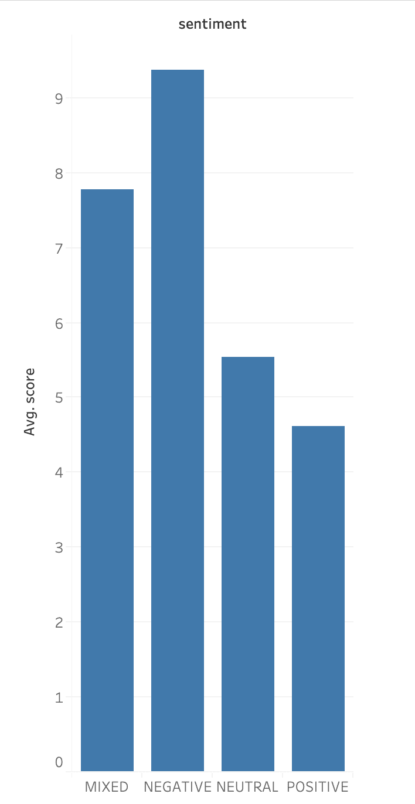

对情感的平均分(图片来自[惠玲](https://ling9hui1.medium.com/)

我们决定使用 Tableau 中的函数，而不是按平均值排序，我们决定按最大值排序。这张图证明了我们对第一张图的分析，因为负面情绪的评论得分最高，正面情绪的评论得分最低。

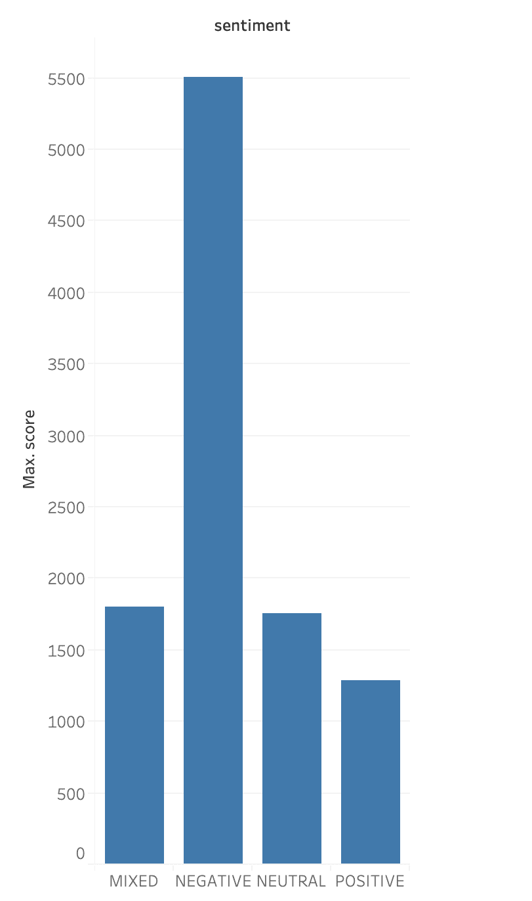

反对情绪的最高分(图片来自[惠玲](https://ling9hui1.medium.com/)

接下来，我们想找出哪个子编辑包含得分较高的评论。因此，如果一个人想在 Reddit 上增加他们的因果报应，也许他们应该尝试回复意想不到的帖子。然而，我们意识到，以这种方式对我们的数据进行排序可能不是最好的，因为“意外”的子编辑在我们的数据集中只有 1 个帖子。不幸的是，使用“平均”测量比使用“总和”测量更好，因为总和通常会因人口规模而产生误导。除了意料之外，subreddit cringepics 的平均分最高。在我们一起浏览了 subreddit 之后，我们意识到，因为大多数帖子应该是有趣的，因此回复是讽刺和幽默的，这可能会导致很多赞成票。

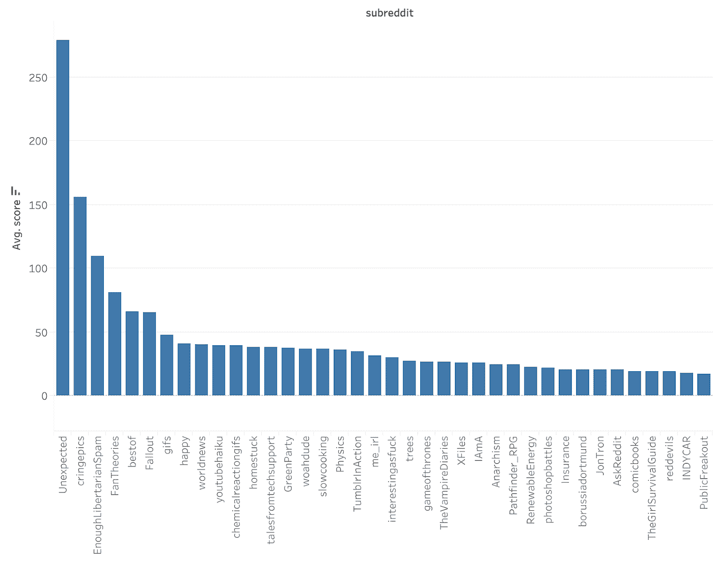

相对于 subreddit 的排序平均分(图片来自[惠玲](https://ling9hui1.medium.com/)

接下来，我们想要绘制平均情绪分数与平均分数的散点图，看看这两者之间是否有关联。计算情感分数，使得负面帖子的分数接近-1，而正面帖子的分数接近 1。我们希望看到平均情绪得分和平均得分之间的关系，但我们在绘制之后意识到，大多数评论的支持票数很低，因此得分很低，所以得分都集中在 0 分左右。我们意识到，大多数评论不会得到很高的评分，但如果一个人想获得高分，如果他们的话通常带有负面情绪，并发布非传统的东西，他的机会就更大。

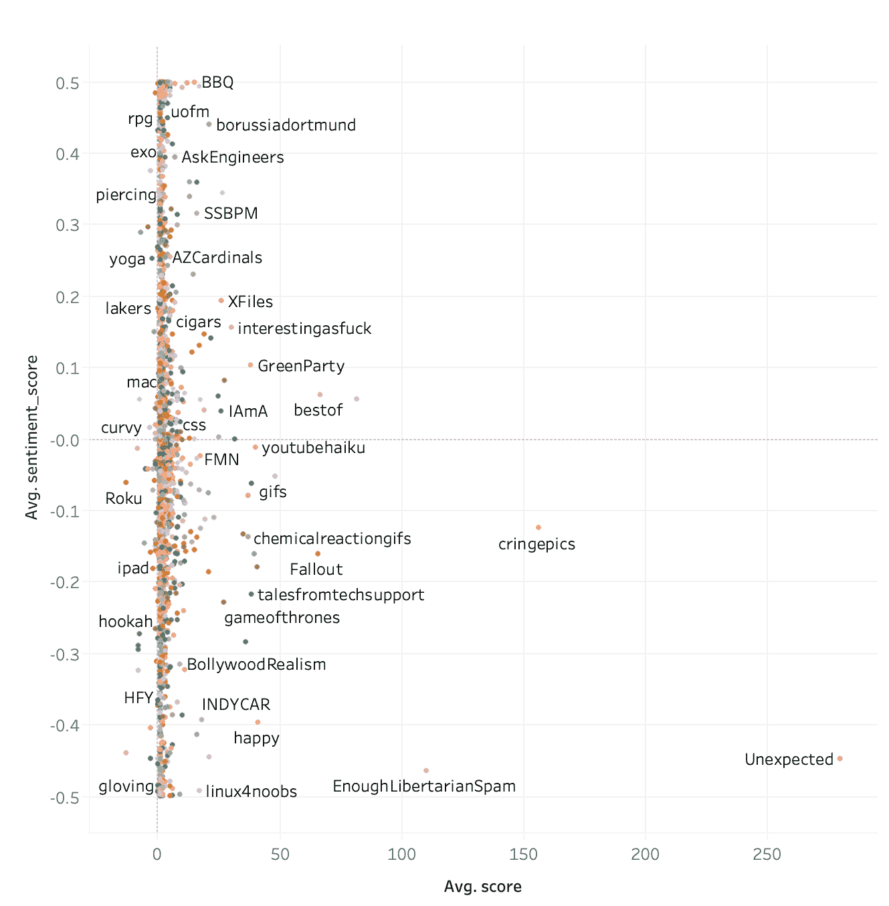

相对于平均分数的平均情绪分数(图片来自[惠玲](https://ling9hui1.medium.com/))

在下一张图中，我们希望看到哪个子漩涡得分最高。在前面的图表中，我们使用了 measure 函数，因此 Tableau 将为我们提供平均值、总和、最大值、我的值等选项。这一次我们想玩一下维度函数。对于那些不确定两者之间区别的人来说，度量是数学函数处理的数值。另一方面，维度是定性的，并不是总和。我们过滤了分数，这样分数轴将从 300 开始(实际上是试图整理出前几条评论)。如图所示，subreddit AskReddit 的得分最高。

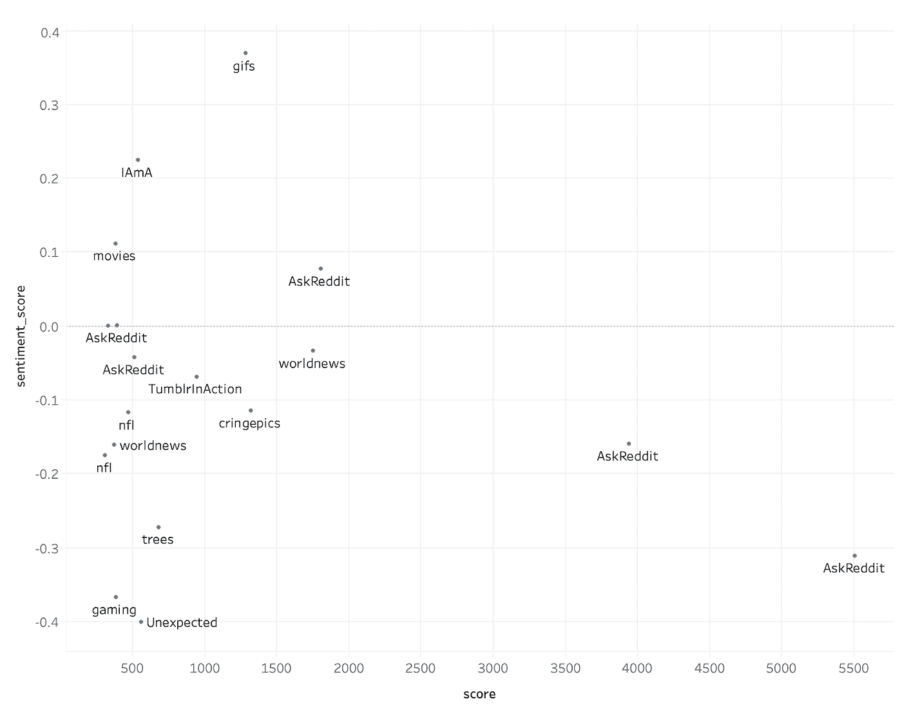

情感得分对比得分(图片来自[惠玲](https://ling9hui1.medium.com/))

我们仍然不确定为什么情感分数会是负的，但是我们意识到了情感分析中的一个小缺陷，我们将在后面详细说明。无论如何，AskReddit 会有最高分是可以理解的，因为人们通常会在这个子网站上提出问题，以获得其他 Redditors 的回应。所以得分最高的帖子一定是对别人有帮助的回复。出于好奇，我们找到了评论的正文，它是这样说的:

> “我六年级的时候，有个孩子。我会叫他丹尼。丹尼是最优秀的白痴。那孩子整天坐在那里，一脸茫然。有一天我们正在复习人体和消化系统，老师决定给丹尼出一个简单的问题来激励他。她问他我们如何让液体进入我们的身体。丹尼坐在那里，一脸茫然，说“我不知道”。她再次提示他，问他口渴时如何让液体进入体内。丹尼回答，“我不知道。她对这一点感到非常沮丧，甚至问“丹尼，当你口渴时，你是如何让水进入你的身体的？”他回答说，“我不知道。可能，穿过你的皮肤？"
> 
> 她吓坏了，失去了她的狗屎。他坐在那里，看起来像往常一样茫然，老师夫人冲到房间的后面，抓住了他的胳膊。她把他从座位上拉起来，拖到教室前面，那里有一个水槽。水开了，她把他的胳膊推进河里，不停地对他喊“穿过皮肤？？透过皮肤！？你现在感觉怎么样？你吃饱了吗？你得到足够的水了吗？你用嘴喝水！”
> 
> 我现在快 40 岁了，在我的余生中，我会带着恐惧和娱乐的混合情绪记住那个场景。"

不是我们想的那样，但事后看来，这是一个非常有趣的故事。我们意识到了社交媒体的力量:它有能力将全球各地的人们聚集在一起，打造一种友爱感，甚至只是让孤独的人感到不那么孤独。

这是我们在玩 Tableau 时获得的另一个图表，我们设法获得了前 10 条评论，并查看它们来自哪个子编辑，这是意料之中的，AskReddit。

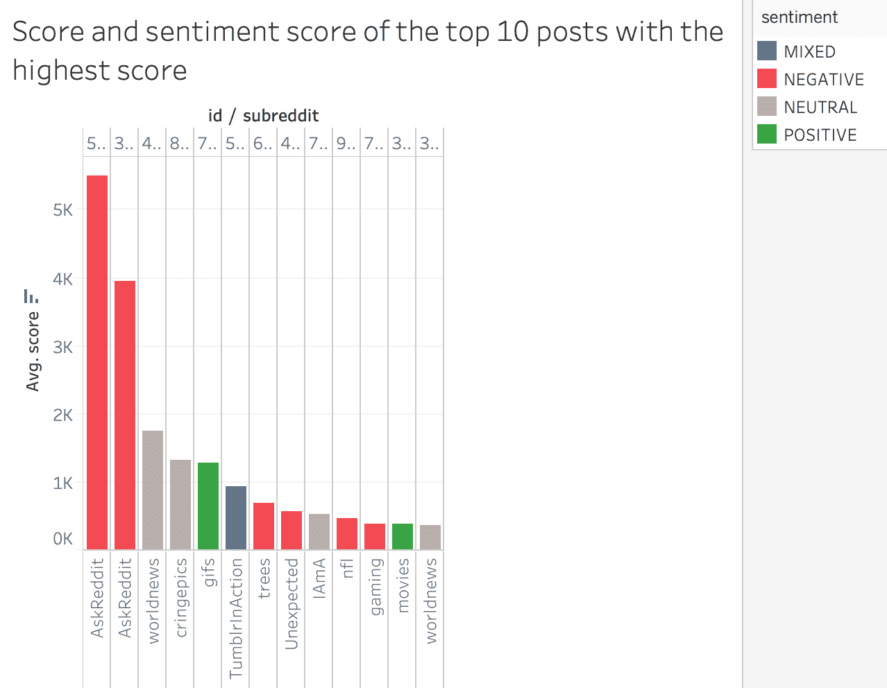

针对 subreddit 的前 10 名平均分(图片来自[惠玲](https://ling9hui1.medium.com/)

然而，一般来说，使用情感分析的一个缺陷是，软件扫描单个单词本身，但是两个单独的负面含义的单词放在一起实际上可以表达正面含义。以 id 446 为例:

> 这个介绍真他妈恶心。

“恶心”和“混账”是两个带有负面含义的词，但当放在一起时，它实际上意味着 Redditor 认为该内容很酷，很有趣。然而，情绪分析认为这是负面的，有 99.68%的信心。因此，我们意识到，虽然情感分析通常有助于获得更广泛的公众意见的概览，但从某种意义上说，它也有缺陷，因为它很难获得短语的总体情感。

# 结论

我们在 Reddit 上的情感分析终于结束了！那么我们的发现如何作为 ***有意义的指标*** ？我们能够理解 Reddit 用户的态度——大多数人都有负面情绪。这可以帮助刚接触 Reddit 的人在加入之前看看子编辑的极性，这样他们就会知道总体情绪以及他们可以在子编辑中期待什么。我们认为这一点尤其重要，因为 Reddit 是一个社交分享网站。这与我们的下一个观点有关，因为 Reddit 的用户基数如此之大，它可以用来衡量更重要的话题如政治的普遍情绪。或者仅仅用来衡量消费者对投放市场的新产品的体验。

从更宏观的角度来看，我们相信它让我们更好地理解了社交媒体是如何工作的。随着 Reddit 成为一个更具接受性和社会性的平台，我们可以预期社区会更加积极或者更加快乐。然而，我们的研究结果清楚地表明，人们会因为消极或者消极的经历而联系在一起。这从整体上给了我们一个全新的视角来看待人类和社会互动，甚至我们(惠玲和瑞安)是如何成为朋友的。也许我们需要世界上更多的消极。

另外，我们还对 r/dataisbeautiful 只在我们的数据集中出现过一次感到失望:(很遗憾，由于技术限制，我们不能利用整个数据集，因为看到 r/dataisbeautiful 的情感分析肯定会很有趣。

由[瑞恩](https://kwokyto.medium.com/)和[惠玲](https://ling9hui1.medium.com/)共同撰写