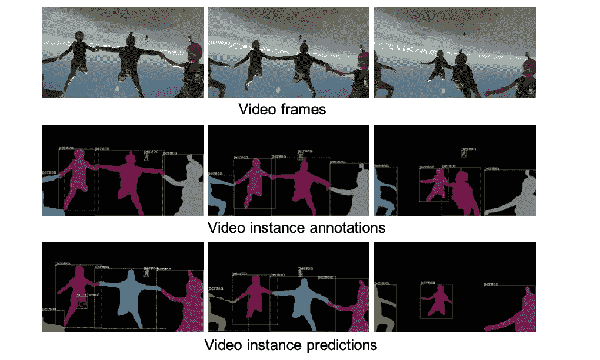
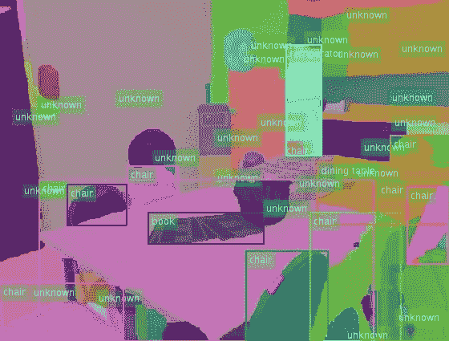
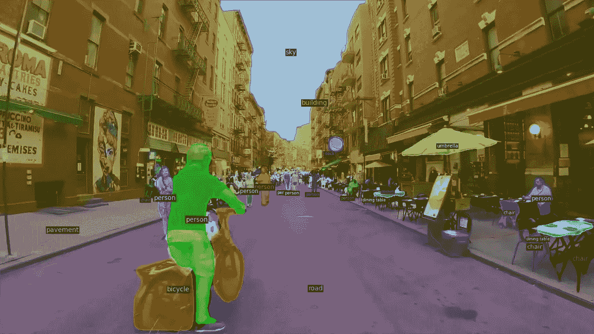
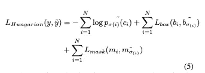
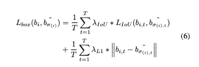
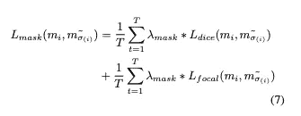

# TT-SRN:基于变压器的视频实例分割框架

> 原文：<https://towardsdatascience.com/tt-srn-transformer-based-video-instance-segmentation-framework-part-i-ae9964126ac0?source=collection_archive---------19----------------------->

## [思想和理论](https://towardsdatascience.com/tagged/thoughts-and-theory)

## **视频领域中的联合目标检测、实例分割、目标跟踪和分类**

任意试验视频上 TT-SRN 的示例预测。我们打算指出遮挡、视点变化、重叠对象上的系统伪像以及实例的规模。从左上角到右下角，视觉效果是我们模型的连续预测。(图片由作者提供)

**你有 5 秒钟，告诉我 TT-SRN 是什么？**

> " F *ast，基于变形金刚的简单而精确的视频实例分割模块"*

# TT-SRN 和 VIS 到底是什么？

视频实例分割(VIS)是最近引入的计算机视觉研究，旨在对视频领域中的实例进行联合检测、分割和跟踪。最近的方法提出了实际上无法使用的高度复杂的多级网络。因此，在实践中需要使用简单而有效的方法。为了填补这一空白，我们提出了一种端到端的基于变压器的正弦表示网络(SRN)视频实例分割模块，即 **TT-SRN** ，以解决这一问题。TT-SRN 认为视觉感知任务是一个单阶段的直接序列预测问题，使我们能够将时间信息与空间信息结合起来。一组视频帧特征由双变换器提取，然后传播到原始变换器以产生一组实例预测。这种产生的实例级信息然后通过修改的 srn 传递，以获得最终实例级类 id 和边界框，以及自参与 3d 卷积，以获得分段掩码。在其核心，TT-SRN 是一个自然的范例，通过相似性学习处理实例分割和跟踪，使系统能够产生快速准确的预测集。TT-SRN 使用基于集合的全局损失进行端到端训练，通过二分匹配强制进行唯一预测。因此，在不牺牲分段掩码质量的情况下，流水线的总体复杂度显著降低。由于双变压器是最快的方法之一，第一次在没有隐式 CNN 架构的情况下解决了 VIS 问题。

我们的方法可以很容易地分成子组件，以产生单独的实例遮罩和边界框，这将使它成为许多视觉任务的统一方法。我们通过比较竞争基准在 YouTube-VIS 数据集上对我们的结果进行了基准测试，并显示 TT-SRN 以显著的优势优于基本 VIS 模型。

**代码&纸张可从**获得

<https://github.com/cankocagil/TT-SPN>  

**图像级目标检测&图像分割版 TT-SRN:**

<https://github.com/cankocagil/TT-SPN---Object-Detection>  

# 行动（或活动、袭击）计划

1.  **简介**
2.  **相关工作**
    2.1 *图像级实例分割*
    2.2 *视频对象检测*
    2.3 *视频对象跟踪*
    2.4 *视频实例分割*
3.  **建议方法:TT-SRN**
    3.1 *双变形金刚*
    3.1.1 局部分组自注意(LSA)
    3.1.2 全局亚采样注意(GSA)
    3.2 *经典变形金刚*
    3.2.1 时空位置编码
    3.2.2 变形金刚编码器
    3.2.3 变形金刚解码器
    3.3【T33
4.  **结果** 4.1 实现细节
    4.2。评估指标
    4.3。主要结果
5.  **结论**
6.  **参考文献**

**1。视频实例分割简介**

图像和视频中基于实例的分割和对象检测是计算机视觉领域中的基本问题。与图像实例分割不同，新问题旨在同时检测、分割和跟踪视频中的对象实例[31]。它首先是在视频实例分割论文[31]中用一种称为掩模轨迹 R-CNN 的新算法介绍的。视频实例分割是视频领域时空理解的关键任务，应用于视频编辑、自动驾驶、行人跟踪、增强现实、机器人视觉等等。由于它需要分割和跟踪，因此与图像级实例分割相比，这是一项更具挑战性的任务。此外，它有助于我们将时空原始数据与视频一起编码成有意义的见解，因为与视觉空间数据相比，它具有更丰富的内容。通过在解码过程中增加时间维度，我们可以进一步从视频帧中获得关于运动、视点变化、光照、遮挡、变形和局部模糊的信息。因此，视频实例分割作为一个研究领域越来越受欢迎，并且最近它吸引了沿着视频理解研究路线的社区。

TT-SRN 样本预测(图片由作者提供)

最先进的方法开发了具有多个网络的非常复杂的体系结构..非最大抑制)以产生高质量的分段掩码和边界框。通常，基于检测跟踪(自上而下方法)[31，3，5]或时空嵌入聚类[6](自下而上)的方法被提出来处理 VIS 任务。在自上而下的方法中，产生图像级实例分割掩模，然后通过复杂的手工制作的规则在时间维度上关联，以将空间预测推进到时空预测，这使得解码过程变得复杂并导致实际上不可用。而在自下而上的方法中，地层中的实例级像素聚集在时空嵌入空间中，具有不重叠的区域，这些区域严重基于密集预测质量[6]，并需要多个网络来产生最终 VIS 结果。因此，简单而有效的、单阶段的、实际可用的和端到端可训练的方法是非常需要的。

TT-SRN 的整体管道。给定视频帧，一组图像特征由双变换器提取，然后传递到经典变换器架构以获得实例级预测。然后，这些预测被传递到单独的 SRN 分支，以产生一组类别 id、置信度、边界框和自参与卷积，从而获得分段掩码。整体预测遵循视频帧顺序。(图片由作者提供)

在本文中，我们提出了一种新的方法，即 TTSRN，以降低整体流水线的复杂性，而不影响预测的速度和质量，以产生 VIS 结果。整个流水线如图 1 所示。给定视频帧，一组图像特征由双变换器提取，然后传递到经典变换器架构以获得实例级预测。然后，这些预测被传递到单独的 SRN 分支，以产生一组类别 id、置信度、边界框和自参与卷积模块，从而获得分段掩码。实际上，VIS 的所有子任务(分类、检测、分割和跟踪)都是相关的任务。因此，一个任务的输出可以向另一个任务提供重要信息，这将相互促进所有子模块。通过认识到这一点，在一个模块中处理子任务的范例也促进了 TT-SRN。同时，由于没有人为设计的规则用于 VIS 的所有单个任务，实例级特征质量是 TT-SRN 的另一个重要部分，它由 twin transformer 模块完成。Twin transformer 是一种基于面向空间的视觉转换器的最新架构，最近在论文[9]中提出。从 NLP [28]上下文中的经典 transformers 出版物来看，transformers 实际上是用于各种 NLP 任务的方法(例如，机器翻译和序列间问题)。

论文[11]首次提出了视觉变形金刚，展示了变形金刚在计算机视觉领域的强大功能。然而，问题是计算复杂度是图像大小的平方。为了抑制，提出了各种视觉变压器，并证明了精心设计的全局和局部注意机制可能在密集预测任务中胜过经典 CNN 架构[11，27，9]。一种解决方法是局部分组的自我关注(或在非重叠窗口中的自我关注，如最近的 Swin Transformer [20])，其中输入在空间上分组为非重叠窗口，并且仅在每个子窗口中计算标准自我关注[9]。即使 Swin 变换器降低了总的计算复杂度，它也不能通过注意力在非重叠区域之间建立连接。为了克服这一点，在论文[9]中提出了双变压器，其引入了空间可分离的自我注意(SSSA)来缓解这一挑战。SSSA 由局部分组自我注意(LSA)和全局亚采样注意(GSA)组成[9]。我们发现由双变压器产生的实例级特征相对于它们在传统 CNN 中的对应物是高度优化的。

这里，我们还介绍了用于分类和对象检测任务的改进的正弦表示网络。在论文[25]中提出了正弦表示网络，并证明了由神经网络参数化的隐式定义的、连续的、可微分的信号表示已经成为一种强大的范例，提供了超过传统表示的许多可能的好处[25]。他们为隐式神经表示引入了杠杆周期激活 2 函数，并证明了这些被称为正弦表示网络或塞壬的网络非常适合表示复杂的自然信号及其衍生物[25]。在本文中，我们调整了 SIREN 架构以用于密集预测任务，并对其进行了修改以重新用于包围盒和类 id 预测。我们改进的 SRN 网络由多个具有漏失的 SIREN 层组成。作为 SRNs 的最后一层，放置具有 GELU 非线性的全连接层[15]以产生最终结果。SRNs 的拟议架构如图 2 所示。实例分割和跟踪是 VIS 任务的其他重要方面。

“为了执行自然、有效且相互包容的分割和跟踪”，我们改编了来自 VisTR [29]的实例序列匹配和跟踪模块。“实例序列匹配在输出实例序列和基本事实实例序列之间执行二分图匹配，并监督唯一分配预测及其注释的序列”[29]。

因此，TT-SRN 可以直接保持预测的顺序[29]。“实例序列分割通过自关注在多个帧中累积每个实例的掩模特征，并通过 3D 卷积分割每个实例的掩模序列以获得最终结果”[29]。

我们的主要贡献总结如下。

*   *我们提出了一种高效的视频实例分割模块，该模块基于视觉和具有正弦表示网络的经典变压器，将视觉任务视为端到端的集合预测问题。*
*   *据我们所知，这是第一次在没有任何隐式 CNN 架构的情况下解决视频实例分割问题，而是使用视觉变压器(例如，双变压器)作为实例级特征生成器。*
*   *在没有任何编织的情况下，TT-SRN 是最快的方法之一，可以以 55.3 FPS 的速度运行，并在 YouTube-VIS 上实现了 39.3 %的竞争精度，远远超过了 VIS 基线模型。*

# 2.视频实例分割的相关工作

在文献中有各种方法用于解决视频实例分割的任务，因为它通常被认为是多阶段问题，即分割/检测和跟踪组件在不同阶段被处理。然而，最近的研究提出了单阶段、简单、计算有效的方法来处理该问题，尽管单阶段方法的性能并不比多阶段方法好。因此，计算机视觉研究社区通过提出掩模轨迹 R-CNN 的变体或视频实例分割任务的新方法，扩展了论文[31]中所做的工作。STEm-Seg 是针对此任务的另一种新算法，特别是，他们将视频剪辑建模为单个 3D 时空体，并提出了一种在单个阶段中跨空间和时间分割和跟踪实例的新方法[1]。

VIS 数据注释和预测[31]

然后，Chung-Ching Lin 等人提出了一种用于视频实例分割任务的基于变分自动编码器的分割跟踪算法，因为它构建了一个共享编码器和三个并行解码器，产生了用于预测未来帧、对象检测框和实例分割掩模的三个不相交分支[16]。为了促进对该问题的研究，曹等人提出了另一种称为 SipMask 的单阶段新算法，该算法通过将实例的掩模预测分离到检测到的边界框的不同子区域来保留实例特定的空间信息[6]。然后，VisTR 被提议为基于单级变压器的 VIS 架构，其将 VIS 任务视为直接的端到端并行序列解码/预测问题[29]。我们的一些工作改编自 VisTR 模块。具体来说，我们集成了他们的实例序列匹配和分段模块，以监督和分段完整的实例。实例序列匹配在输出实例序列和实际实例序列之间执行二分图匹配，并监督 TT-SRN，因此 TT-SRN 学习实例之间的相似性[29]。实例序列分割模块执行自参与 3-D 卷积来学习像素级相似性。因此，有各种不同的方法来解决时间域实例级分割问题，在本文中，我们提出了解决视频实例分割问题的方法，因为我们认为它是预测问题的直接集合。即使视频实例分割的概念可以被归类为新的任务，在文献中也有研究者解决的各种类似问题，例如图像级实例分割、视频对象检测、视频对象跟踪和视频对象分割。我们将类似问题简述如下。

**2.1。图像级实例分割**

实例分割不仅将像素分组到不同的语义类中，还将它们分组到不同的对象实例中[12]。通常采用两阶段范式，首先使用区域提议网络(RPN)生成对象提议，然后使用聚合 RoI 特征预测对象边界框和遮罩[12]。在我们的例子中，我们不仅为个体生成分割模板，还将它们在视频序列中关联起来。

实例分割示例([https://www . researchgate . net/figure/Instance-Segmentation-in-a-open-set-environment-Our-method-segments-all-image-regions _ fig 1 _ 325557020](https://www.researchgate.net/figure/Instance-segmentation-in-a-open-set-environment-Our-method-segments-all-image-regions_fig1_325557020))

**2.2。视频对象检测**

视频对象检测旨在检测视频中的对象，这是作为 ImageNet 视觉挑战的一部分首次提出的[24]。即使关联和提供身份提高了检测质量，这种挑战也仅限于用于每帧检测的空间保留的评估度量，并且不需要联合对象检测和跟踪[31]。然而，在我们的情况下，我们的目标是联合检测、分割和跟踪，而不是视频对象检测任务。

视频对象检测示例([https://miro . medium . com/max/840/1 * TQ 9 potwer 93 jwfte 56 u8 aa . gif](https://miro.medium.com/max/840/1*tQ9PotwEr93jwFte56U8aA.gif))

**2.3。视频对象跟踪**

视频目标跟踪任务通常被认为是基于检测和无检测的跟踪方法。在基于检测的跟踪算法中，联合检测和跟踪对象，以便跟踪部分提高检测质量，而在无检测方法中，我们给出一个初始边界框，并尝试跨视频帧跟踪该对象[26，31]。由于基于检测的方法类似于我们的情况，视频实例分割需要时间分割掩模。因此，与以前的基本计算机视觉任务相反，视频实例分割需要多学科和综合的方法。

视频对象跟踪示例([https://I2 . WP . com/github . com/yehengchen/video _ demo/raw/master/video _ demo/TownCentreXVID _ output . gif？w=450 & ssl=1](https://i2.wp.com/github.com/yehengchen/video_demo/raw/master/video_demo/TownCentreXVID_output.gif?w=450&ssl=1)

**2.4。视频实例分割**

由于视频实例分割任务是受监督的，因此它需要面向人的高质量注释，用于边界框和具有预定义类别的二进制分割遮罩。设 Ci 是属于数据集 D 的对象类别，i = 1，…，K，其中 K 是 D 中包括背景的唯一类别的数量。然后，设 B ti j 和 S ti j 是视频帧 ti ∈ T 中第 j 个 C1，…，CK 对象的第 j 个边界框和二进制掩码，其中 T 表示给定视频序列中的帧数。假设在推理阶段，VIS 算法产生 N ∈ C1，…，CK 实例假设，使得 H ti Nj 表示 VIS 产生的第 N 个 j 实例和第 t 次的预测。因此，H ti Nj 包括置信度得分 s ti j ∈ [0，1]作为识别具有预定义类别、B ti j 和 s ti j 的实例的概率。

视频实例分割示例(图片由作者提供)

# 3.提议的方法:TT-SRN

我们提出了一个端到端的基于变压器的视频实例分割模块与正弦表示网络(SRN)，即 TT-SRN，以解决视觉感知任务。我们的方法，TT-SRN，将 VIS 任务视为单一状态下的直接预测问题集，使我们能够将时间信息与空间信息聚合在一起。一组视频帧特征由双变换器提取，然后传播到原始变换器以产生一系列实例预测。这些由变换器产生的实例级信息然后通过修改的正弦表示网络，以获得最终的实例级类 id 和边界框，以及自参与的 3-D 卷积，以获得分段掩码。在其内部机制中，TT-SRN 是一个自然的框架，它通过相似性学习来处理跟踪和分割，使系统能够产生一组快速而准确的预测。实例序列匹配算法改编自[29]以跨视频帧跟踪实例。TT-SRN 使用基于集合的全局损失进行端到端训练，通过二分匹配强制进行唯一预测。因此，在不牺牲分段掩码质量的情况下，流水线的总体复杂度显著降低。由于双变压器是最快的方法之一，第一次在没有隐式 CNN 架构的情况下解决了 VIS 问题。我们的方法可以很容易地分成子组件，以产生单独的实例遮罩和边界框，这将使它成为许多视觉任务的统一方法。在本节中，TT-SRN 被划分为子模块，并对其进行了详细描述。

**3.1。双变压器**

最近，在论文[9]中提出了 twins，并证明了空间定向视觉变换器可以优于经典的 CNN[9]。这里，我们将 Twins-SVT 网络集成到我们的案例中，以产生实例级的特性。他们的孪生转换器基于空间可分离的自我注意(SSSA)网络，该网络由局部分组自我注意(LSA)和全局子采样注意(GSA)组成[9]。由于其空间上可分离的模块，功能的质量大大提高。在小节中，我们将详细描述 SSSA 模块。

3.1.1 局部分组自我注意(LSA)

在 LSA，2-D 特征地图被分成子窗口，使得能够在每个子窗口内自我关注。特征图被分成 m×n 个子窗口，这导致每 4 个窗口由 HW mn 元素组成，其中 H，W 表示图像维度。通过将图像划分成 m×n 个区域，计算成本从 O(H * W * d)降低到 O( H *W /(m*n) *d)，其中 d 是自我注意维度。在这一点上，我们没有对窗口中不重叠的区域做任何进一步的关联。因此，GSA 模块开始发挥作用。

正弦表示网络的体系结构。它由两个警笛层和一个额外的全连接层组成，具有 GELU 激活功能。(图片由作者提供)

**3.1.2 全局子采样注意(GSA)**

因为我们需要在自我注意机制中进一步定位，所以需要全局自我注意来在非重叠区域中建立连接。在 GSA 模块中，来自本地参与窗口的单个代表性关键信息被用于计算全局注意力。然而，随着全局注意的计算，计算成本将增加到 O(H *W *d)。为了防止这种情况，通过平均池、深度方向的步长卷积和规则步长卷积对局部参与特征进行子采样。结果表明，规则步长卷积性能最佳[9]。数学上，SSSA 模块执行以下计算。

对于 i = 1，…，m 和 j = 1，…，n 其中 LSA 表示局部分组自我注意，GSA 表示全局子采样注意，FFN 表示前馈网络，LayerNorm 表示层归一化层[2]。两个注意力模块都以多头方式进行。

双变压器的架构[9]

**3.2。经典变形金刚**

具有 6 个编码器层、6 个解码器层以及 GELU 激活[15]的经典变换器架构适于执行基于实例的查询生成。传统转换器的输出是实例的建议加上额外的无对象查询。该转换器的使用非常类似于对象检测模型 DETR [7]中的转换器。在训练期间，执行二分匹配，通过唯一地将预测与基础事实分配来监督模型。没有匹配的预测应该产生“无对象”类预测，因此实例查询的数量应该大于视频帧中实例的数量。转换器的核心由编码器和解码器结构组成，这将在下面的小节中讨论。

**3.2.1 时空位置编码**

由于变换器架构是置换不变的，因此时空位置编码对于精确位置信息的建模是必要的。时空位置编码基于正弦波，并且是经典位置编码的 3d 版本。我们的位置编码有 3 个不同的维度，即时间、水平和垂直。设 d 为最终级联的信道位置编码维数，那么我们独立地使用具有不同频率的 d/3 正弦函数如下

其中 w_k = (1/10000)^(2*k/ (d /3))，pos 是该维度中的位置。与传统的位置编码一样，这些三维位置编码被添加到输入中。

**3.2.2 变压器编码器**

大小为 6 的变换器编码器层适于学习实例方面的相似性，该相似性稍后将被传播到解码层以产生最终的实例级查询。从双变换器提取的特征被传递到具有 256 个输出潜在大小的单个卷积层。因此，到变换器编码器的输入是 R^(NxLxHxW 的形状，其中 n 是批量大小，l 是潜在大小，h 和 w 是单个卷积层输出的高度和宽度。请注意，时间顺序是根据输入顺序保留的。每个编码器层像常规一样执行多头自关注机制。

**3.2.3 变压器解码器**

然后，编码特征序列通过变换器解码器层，以产生实例查询预测序列。在这一层，一系列可学习的实例查询也被传递到解码器层。实例查询是固定数量的输入嵌入，以表示实例预测的总数。为了安全起见，实例查询的数量总是大于映像中实例的数量。二分匹配独特地执行实例式分配，暴露的预测被称为“无对象查询”。例如，假设我们在帧 t 中产生 n_t 个实例预测，那么让 q 是一般实例查询的大小，使得在所有帧中 q > n_t。

**3.3。正弦表示网络**

正弦表示网络是最近在论文[25]中提出的表示学习方法。正弦层由完全连接的层组成，其独特的初始化在具有正弦激活层的论文[25]中介绍。整体架构如图 2 所示。在这项工作中，我们针对我们的情况修改了它们的架构，在具有端 GELU 非线性的正弦层之间添加内部压差层[15]，以产生实例级端特性。这些最终特征然后被传播到分类、包围盒检测和实例分割分支。我们意识到隐式神经表示的周期性激活，并证明这些网络，被称为正弦表示网络或塞壬，非常适合密集的预测任务。我们的消融研究表明，末端预测层的周期性激活函数可以适用于密集预测任务。

**3.4。实例序列匹配**

TT-SRN 的一个重要方面，即实例序列匹配，改编自文献[29]，通过二分匹配将实例预测与基础事实唯一地分配，以监督模型。此外，该模块使我们能够推断出预测实例的精确顺序，该顺序随后能够跨视频跟踪实例。匹配损失既考虑了类别预测，也考虑了预测值和实际值的相似性[7]。设 y 表示地面真实盒子对象集，y∞= ˜y^n_i=1 n 个预测集。我们的损失产生了预测和基本事实之间的最佳二分匹配。为了计算两个集合之间的二分匹配，计算以下最小化。

其中 L_match(y_i，y _σ\\( I))是基础事实和预测之间的实例匹配成本。这个分配问题是用匈牙利方法计算的，匈牙利方法是一种组合优化算法，在多项式时间内解决分配问题[7]。匹配过程考虑了类别预测以及预测和基本事实框的相似性。设注释的每个元素 I 由 y_i = (c_i，b_i)表示，其中 ci 是目标类，bi 是向量，表示基本事实归一化坐标。这些坐标被组织为中心、高度和宽度，并且它们与图像大小相关。然后，对于索引为σ(i)的预测，设\u p _σ(I)(ci)表示类别概率，\u b _σ(I)为预测盒。因此，我们可以定义 Lmatch(y_i，y _σ\\( I))如下。

这个过程监督一个模型，并在启发式分配过程中发挥重要作用。在经典的对象检测或实例分割任务中(如 Mask RCNN [13])，这些程序是匹配建议的对应物或基础事实的锚。与经典方法显著不同的是，二部匹配唯一地分配。在这一点上，我们分配了预测和它们的基本事实，所以我们需要计算损失，在我们的例子中，所有匹配对的匈牙利损失。给定一对一分配，匈牙利损失将损失计算为类预测的负对数似然、盒和实例序列的掩膜损失的线性组合，如下所示。

其中σ\是之前计算的最佳分配。该损失用于以端到端的方式训练模型。接下来，我们需要定义 L_box 和 L_mask。L_box 的计算类似于 DETR [7]中的计算，如下所示。

其中，λ_IoU 和λ_L1 是超参数。请注意，损失随着框架内实例的数量而标准化。

**3.5。实例序列分割**

TT-SRN 的另一个重要方面，即实例序列分割模块，改编自论文[29]以产生末端分割掩模。在内部，该模块累积帧的实例特征，然后对这些累积的特征执行分割。对于每个帧，由变换器的末端解码器层收集的实例预测和由变换器的末端编码器层收集的变换器编码特征通过自关注模块。这些被关注的特征然后与由双变换器收集的特征和从变换器的末端编码器生成的编码特征融合。这个过程与维斯托[29]和 DETR [7]的情况非常相似。然后，具有不同大小的实例级特征被馈送到可变形卷积层[10]，该可变形卷积层利用额外的偏移来增加模块中的空间采样位置，并从目标任务学习偏移，而无需额外的监督[10]。然后，呈 R^(1xCxTxtHxW 形状的融合图(其中 c 是通道维度，t 是时间维度，h 和 w 是空间特征维度)被馈送到具有组归一化[30]和 GELU 非线性[15]的 3d 卷积层中。在末端层，单个卷积层具有 1 个输出信道维度，用于获得分段掩码。最后，我们需要定义 Lmask 来完成损失函数。L_mask 通过组合 dice [22]和聚焦损失[18]计算如下。

# 4.TT-SRN 结果

在本节中，我们在 YouTubeVIS 数据集上展示了我们的结果[31]。YouTube-VIS 是一个大型可扩展数据集，包含 2，883 个高分辨率 YouTube 视频、2，238 个训练视频、302 个验证视频和 343 个测试视频。类别标签集包括 40 个常见对象，如人、动物和车辆，总共有 4，883 个独特的视频实例，产生 131k 高质量的面向人的注释。因为测试集的评估是封闭的，所以评估结果基于验证集。4.1.

**4.1 实施细节**

我们继承了 TT-SRN 第一级双变压器[9]中使用的超参数。因此，嵌入维数被选择为 64，块大小为 4，局部块大小为 7，深度为 1。同样，双变压器第二级的超参数是 128，2，7，1。对于第三阶段，选择 256，2，7，5 作为第三阶段的超参数。在最后阶段，嵌入大小为 512，块大小为 2，局部块大小为 7，深度为 4。这里，深度是指“双变压器”部分描述的变压器模块数量。请参考图？？。单个卷积层的隐藏大小被选择为 256。在经典变压器中，有 6 个编码层和 6 个解码层，多头大小为 8。在所有编码器-解码器中，变压器模块的内部激活是 GELU [15]。在 SRN 阶段，退出概率选择为 0.2。所有 SRN 层都使用论文[25]中描述的专用初始化方案进行初始化。那么，YouTube-VIS 中带注释的视频长度的最大数是 36 [31]，我们选择这个值作为输入视频长度。因此，不需要后处理来关联来自一个视频的不同剪辑。通过这种方式，我们的模型可以在单个阶段中进行端到端的训练。因为我们的模型预测每个视频帧有 10 个对象，所以我们将查询数设置为 360。TT-SRN 是通过 PyTorch 1.8 实现的[23]。由于其简单的构建模块，TT-SRN 可推广和扩展到其他框架和视觉任务。我们还在我们的项目页面上提供单独的 TT-SRN 实例分割和对象检测版本。

表 1:YouTube-VIS 上的视频实例分割图(%)结果[31]。结果是从他们的论文中获得的。

在训练阶段，我们使用 AdamW [21]优化所有层，从 1e-4 的学习速率开始，每 3 个时期衰减 0.1。TT-SRN 用 18 个历元进行训练，批量大小选择为 16。传统的变压器权重由 COCO [19]中预先训练的 DETR [7]初始化。所有视频帧都按照每个通道的方式用 ImageNet 平均值和标准偏差值进行标准化。然后，将所有视频帧的大小调整为 300 x 540，以适合 GPU。我们仅使用概率为 0.5 的随机水平翻转作为视频数据增强。TT-SRN 在一个 8GB RAM 的 Tesla K80 GPU 上训练 5 天。

在推理阶段，TT-SRN 结构没有变化。因此，我们的模型的训练和推理形状是完全相同的。此外，不需要手工制作的后处理来跨视频帧关联实例。我们将阈值设置为分数高于确定阈值的保留实例，以获得最终结果。我们将这个阈值设置为 0.6。在视频帧中有一些实例被识别为不同的类。那时，我们使用最频繁预测的类别。

**4.2 评估指标**

使用图像实例分割中的标准评估指标进行评估，并根据我们的新任务进行修改[31]。具体来说，指标 8 是各种条件下的平均精度(AP)和平均召回率(AR) [31]。AP 被定义为精确度-召回曲线下的面积[31]。置信度得分用于绘制曲线。AP 是多个交集合并(IoU)阈值的平均值[31]。平均回忆描述了回忆-IoU 曲线下加倍的区域。作为有条件的 AP 和 AR，我们遵循 COCO 评估程序，因为它需要 10 个 IoU 阈值，从 50%到 95%，在步骤 5%。由于我们在视频领域，我们需要在评估中包括时间一致性，例如，即使模型产生成功的分割，如果它未能跟踪实例，则表明性能不佳。因此，我们的 IoU 计算不同于图像实例分割，因为每个实例都包含一个掩模序列[31]，因此 IoU 计算通过在视频帧之间累加 IoU 而扩展到一批视频帧。IoU 计算如下。在这里，m^i_t 代表基本事实，m˜^i_t 代表假设。

**4.3 主要结果**

我们在 YouTube-VIS 上比较了 TT-SRN 和 VIS 中其他最新方法的速度和准确性。由于我们的方法是单阶段和端到端可训练的，我们优先将我们的方法与单阶段和端到端可训练的方法进行比较。我们将 TTSRN 与 Mask Track R-CNN [31]、MaskProp [3]、VisTR [29]和 STEm-Seg [1]进行了比较。结果总结见表 1。在没有任何编织的情况下，TT-SRN 是最快的方法之一，在单个 GPU 中以 55.3 FPS 的速度运行，并通过大幅超越 VIS 基线模型，在 YouTube-VIS 上实现了 39.3 %的竞争精度。就速度而言，TT SRN 在最先进的 VIS 模型中名列第二。就速度而言，目前的赢家是 VisTR [29]，因为它使用 ResNet-101 [14]主干网运行速度为 57.7，使用 ResNet-50 主干网运行速度为 69.9。在速度方面，TT-SRN 比当前的 VIS 基线模型 Mask Track R-CNN(运行速度为 20.0 FPS)快很多。这种差异源于 TTSRN 的简单的基于注意力的机制，该机制需要最少的步骤来产生 VIS 预测。另一种竞争方法 STEm-seg 以 2.1 FPS 运行，这对于实时目的来说是非常不可用的。他们的论文中没有提到 MaskProp 的速度[3]。请注意，数据加载和预处理步骤时间不包括在上述结果中。在准确性方面，TT-SRN 远远优于掩模轨道 R-CNN，因为我们的模型在 YouTube-VIS 的验证集上获得了 39.3 %的地图分数，而掩模轨道 R-CNN 获得了 30.3 %的地图分数。这一显著优势源于 TTSRN 的结构，该结构由所有组件中最先进的方法组成。此外，TT-SRN 也大幅超过 STEmseg，因为 STEm-seg 在 ResNet-101 主干上获得了 34.6 %的 mAP 分数。由于 TT-SRN 与 VisTR 相似，具有 ResNet-101 骨架的 VisTR 比 TT-SRN 多 0.8 %的图谱分数，而 TT-SRN 比具有 ResNet-50 骨架的 VisTR 多 3.1 %的图谱分数。目前的获胜者，MaskProp 获得了 46.6 %的 mAP 评分，远远超过了 TT-SRN。TT-SRN 和 MaskProp 之间的差距源于 MaskProp 的多网络设计，它由时空采样网络[4]、特征金字塔网络[17]、混合任务级联网络[8]和高分辨率掩模细化后处理[3]组成。作为最简单的 VIS 架构之一，TT-SRN 在所有竞争对手中取得了最快和最准确的结果。此外，TT-SRN 可以很容易地划分为子组件，以执行单独的 VIS 任务，即对象检测、实例分割和分类。这使得我们的方法简单、统一和实时，而不牺牲实例掩码的质量。

**5。结论**

在这篇文章中，我们提出了一个端到端的基于正弦表示网络(SRN)的视频实例分割模块，即 TT-SRN，以解决视频实例分割任务。TT-SRN 将 VIS 任务视为单一状态下的直接序列预测问题，使我们能够将时间信息与空间信息聚合在一起。为了产生从视频帧中提取的高质量特征，我们利用了双变压器。经典变换器用于产生一系列实例预测，这些预测随后通过改进的正弦表示网络得到最终结果。TT-SRN 是一种自然范式，通过相似性学习处理跟踪，使系统能够产生快速准确的预测集。利用基于集合的全局损失来端到端地训练 TT-SRN，该全局损失通过二分匹配来强制进行唯一的预测，从而在不牺牲分段掩码的质量的情况下降低流水线的总体复杂度。由于双变压器是最快的方法之一，第一次在没有传统 CNN 架构的情况下解决了 VIS 问题。我们的方法可以很容易地分成子组件，以产生单独的实例遮罩和边界框，这将使它成为许多视觉任务的统一方法。我们认为，视频实例分割是视频理解领域的一项关键任务，将革新计算机视觉研究社区。我们的项目页面位于[https://github.com/cankocagil/](https://github.com/cankocagil/)TT-SRN，TT-SRN 的单独检测/分割版本位于[https://github.com/cankocagil/](https://github.com/cankocagil/)TT-SRN—-对象检测。

# 参考

[1] A. Athar、S. Mahadevan、A. Osep、L. Leal-Taix ˇ e 和 B. Leibe。Stem-seg:视频中实例分割的时空嵌入，2020 年。

[2]巴、基罗斯和辛顿。图层归一化，2016。

[3] G. Bertasius 和 L. Torresani。分类、分割和跟踪视频中的对象实例与掩模传播，2020。

[4] G. Bertasius、L. Torresani 和 J. Shi。时空采样网络视频中的对象检测，2018。

[5] A .比雷、z .格、l .奥特、f .拉莫斯和 b .乌普克罗夫特。简单的在线和实时跟踪。2016 年 IEEE 图像处理国际会议(ICIP)，2016 年 9 月。

[6]曹国伟、安维尔、乔拉卡尔、汗、庞和邵。Sipmask:快速图像和视频实例分割的空间信息保存，2020。

[7] N .卡里翁、f .马萨、G. Synnaeve、N. Usunier、a .基里洛夫和 S. Zagoruyko 利用变压器进行端到端物体检测，2020 年。

[8]陈光诚、庞俊杰、王俊杰、熊毅、李、孙、冯、刘志军、史俊杰、欧阳俊杰、刘春春和林。用于实例分割的混合任务级联，2019。

[9]朱晓东、田志军、王永庆、张、任、魏、夏、沈春华。双胞胎:重新审视《视觉变形金刚》中空间注意力的设计，2021。

[10]戴军、齐、熊、李、张、胡、魏。可变形卷积网络，2017。

[11] A. Dosovitskiy，L. Beyer，a .，D. Weissenborn，X. Zhai，T. Unterthiner，M. Dehghani，M. Minderer，G. Heigold，S. Gelly 等.一幅图像抵得上 16x16 个字:大规模图像识别的变形金刚.arXiv 预印本 arXiv:2010.11929，2020。

[12] B. Hariharan，P. Arbelaez，R. Girshick 和 J. Malik。同时检测和分割，2014 年。

[13] K. He，G. Gkioxari，P. Dollar 和 R. Girshick。面具 r-cnn，2018。

[14]何国光、张晓松、任少宁和孙军。图像识别的深度残差学习，2015。

15d .亨德里克斯和 k .金佩尔。高斯误差线性单位(gelus)，2020。

[16]林振中、洪耀桢、费里斯和何立波。基于改进的 vae 架构的视频实例分割跟踪。IEEE/CVF 计算机视觉和模式识别会议(CVPR)的会议录，2020 年 6 月。

[17]林光宇、杜大伟、吉希克、何、哈里哈兰和贝隆吉。用于对象检测的特征金字塔网络，2017。

[18]t-y Lin、P. Goyal、R. Girshick、K. He 和 P. Dollar。密集物体探测的焦点损失，2018。

[19] T.-Y .林、m .梅尔、s .贝隆吉、l .布尔德夫、r .吉尔希克、j .海斯、p .佩罗娜、d .拉马南、C. L .兹尼克和 p .杜尔达。微软 coco:上下文中的常见对象，2015。

[20]刘振中，林永安，曹永安，胡海红，魏永安，张振中，林绍林，郭。Swin transformer:使用移位窗口的分层视觉转换器。arXiv 预印本 arXiv:2103.14030，2021。

[21] I. Loshchilov 和 F. Hutter。解耦权重衰减正则化，2019。

[22] F .米莱塔里、n .纳瓦布和 S.-A .艾哈迈迪。V-net:用于体积医学图像分割的全卷积神经网络，2016 年。

[23] A. Paszke、S. Gross、F. Massa、A. Lerer、J. Bradbury、G. Chanan、T. Killeen、Z. Lin、N. Gimelshein、L. Antiga、A. Desmaison、A. Kopf、E. Yang、Z. DeVito、M. Raison、A. Tejani、S. Chilamkurthy、B. Steiner、L. Fang、J. Bai 和 S. Chintala。Pytorch:命令式风格，高性能深度学习库，2019。

[24]鲁萨科夫斯基、邓、苏、克劳斯、萨特西、马、黄、卡帕西、科斯拉、伯恩斯坦、伯格和。2015 年 Imagenet 大规模视觉识别挑战赛。

[25] V. Sitzmann、J. N. P. Martel、A. W. Bergman、D. B. Lindell 和 G. Wetzstein。具有周期性激活功能的隐性神经表征，2020。

[26] J. Son、M. Baek、M. Cho 和 B. Han。基于四元组卷积神经网络的多目标跟踪。2017 年 IEEE 计算机视觉和模式识别大会(CVPR)，第 3786–3795 页，2017。

[27] H. Touvron、M. Cord、M. Douze、F. Massa、A. Sablayrolles 和 H. Jegou。训练数据有效的图像转换器&通过注意力进行提炼。arXiv 预印本 arXiv:2012.12877，2020。

[28] A. Vaswani、N. Shazeer、N. Parmar、J. Uszkoreit、L. Jones、A. N. Gomez、L. Kaiser 和 I. Polosukhin 你只需要关注，2017。

[29]王延东、徐志勇、王晓东、沈春华、程炳良、沈海涛和夏。《变形金刚》端到端视频实例分割，2021。

[30]吴彦祖和何国光。群体常态化，2018。

[31]杨立群、范友林和徐。视频实例分割，2019。