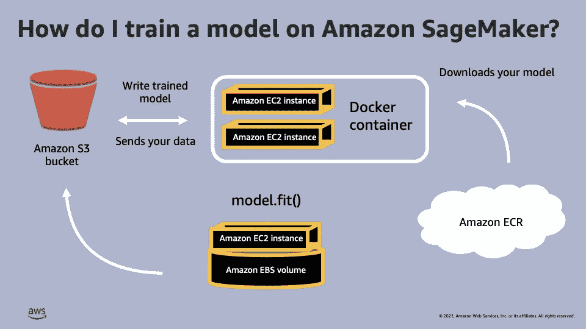
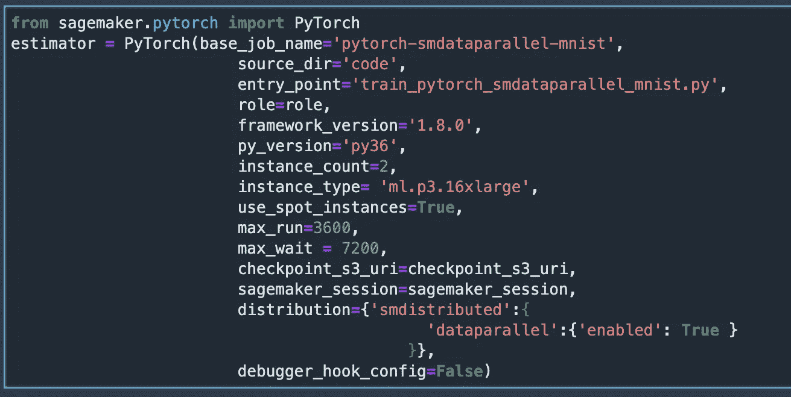

# 在 Amazon SageMaker 上，通过完全的可见性和控制，将您的深度学习模型调整到最高精度

> 原文：<https://towardsdatascience.com/tune-your-deep-learning-models-to-the-highest-accuracy-on-amazon-sagemaker-with-complete-bb38d1e96b5f?source=collection_archive---------21----------------------->

这篇文章是 AWS 的 SageMaker 月的一部分！我们的日历可在此处获得 —浏览以找到实践研讨会、专用工具和入门资源，从而提高您的数据科学团队的工作效率。这篇文章也是我即将在六月—[AWS ML 峰会上进行的关于模型调优的会议的同伴，现在已经开始注册了！](https://pages.awscloud.com/ml-summit-2021.html)

郁金香“花园郁金香”

春天的芳香——当我们星球的北半球迎来更长更温暖的春天时，园艺成为 7000 万美国家庭的主要活动。对于好奇的种植者来说，花园提供了试验的机会。从新的种子类型到施肥策略、养护和修剪，园艺在某种意义上是科学过程的缩影。园丁们发展出一种假设，关于他们如何思考或希望他们的植物会如何发展，然后在观察实验存活或死亡时改进这些假设——毫不夸张。拥有更大庭院空间的房子提供了充分的机会来发展一个人的园艺技能，最终的限制是简单的地理条件。你的院子只有这么大，你的室友只能处理这么多新植物。

在机器学习中，我们应用类似的过程，在尝试解决现实世界或理论用例时探索计算和统计模型。我们对模型、方法和过程进行实验，以将尽可能多的关于用例的知识*注入模型本身*，随着我们的迭代，开发出越来越好的执行模型。

超参数调整是一个经典步骤，数据科学家和 ML 工程师可以用它来尝试提高他们模型的性能。与园艺一样，数据科学团队的一大优势是实验能力。但是这里是类比的终点——你只能在你的院子里有多少物理空间就种多少种子，而你可以在云中运行你能想象的多少实验。
这对于重新训练和重新调整管道特别有吸引力。当您有一个部署的模型为您的应用提供预测响应时，确保该模型保持最新的一个简单方法是首先 [**监控该模型的数据、质量和偏差漂移**](https://docs.aws.amazon.com/sagemaker/latest/dg/model-monitor.html) 。一旦您被警告您的模型是最新的，您就可以自动地重新训练和调整您的模型，使用与原始工件相同的 ETL 和训练脚本，但是使用更新的数据集来更新它。

在这个例子中，我们将在经典的 MNIST 数据集上调整我们自己的 PyTorch 模型。我们将启用新推出的[数据并行包](/scale-neural-network-training-with-sagemaker-distributed-8cf3aefcff51#2cc3-c0981d346422)，在高级 GPU 上运行，通过使用 spot 实例节省 70%，并通过使用[自动模型调整](https://arxiv.org/pdf/2012.08489.pdf)找到我们可以找到的最佳模型。

我们潜进去吧！

# 评估 ML 模型的多种方法

显而易见，有许多方法可以评估机器学习模型。当严格考察我们的模型产生的预测的质量时，第一步是将我们的模型的预测与来自我们的真实数据集的预测进行比较。当然，通常这些实际上是在来自更大数据集的不同样本或分割上完成的。

虽然准确性是一个吸引人的术语，一个容易被我们的非专业业务利益相关者联系和理解的术语，*准确性本身可能是高度误导的。*这是因为上面显示的精确度公式很容易受到等级不平衡的影响。

**这意味着，如果你的数据集正面数据比负面数据多得多，你的模型可能会偏向其中一个方向。这也意味着准确性不适合你。**

这在金融交易诈骗案件中尤为明显。假设你正在解决一个信用卡诈骗案。你每天有数百万到数十亿笔交易，其中不到 1%的交易是欺诈性的。如果您调整您的模型并选择准确性，您可能最终达到 99%的准确性，但仍然没有发现欺诈案例。那是因为你的真实负利率太大了，以至于抵消了精度方程中分子的大部分影响。如果您只将准确性作为您的评估标准，您将错过这一关键步骤，并可能部署一个提供零价值的模型。

在构建超参数调优作业时，确保选择对您的用例最有意义的调优指标。如有疑问，选择一个中性指标，如 AUC 或 F1。

# 作为 AWS 结构的培训工作

在 AWS 上，我们喜欢为客户提供*弹性计算。*这意味着您不必等待数周甚至数月，等待高级 GPU 的到来，或者等待数据中心资源来安装、堆叠和配置服务器，或者等待您的模型在笔记本电脑上完成培训。您只需打开 web 浏览器，启动一个实例，然后开始行动。

在机器学习中，这变得有价值的一个很大的方式是**用于运行训练工作。**培训作业是 SageMaker 服务系列中的一个专用实例或实例集群，用于托管您的代码和数据。

使用 SageMaker 中的培训作业运行大规模分布式作业，如高分辨率计算机视觉、3D 点云分类、基于多模态转换器的模型、文本生成、强化学习和无数其他应用。

您可以插入我们新推出的[分布式训练工具包、](/scale-neural-network-training-with-sagemaker-distributed-8cf3aefcff51#2cc3-c0981d346422)如模型并行，训练数百亿参数的模型。通过使用 EFA 将基于 NCCL 的通信协议替换为针对 AWS 网络拓扑优化的协议，您可以使用数据并行将这些模型的运行时间加快 20–40%。

更好的是，您可以通过使用托管 spot 实例*[*为每个作业节省高达 90%的成本。*只需在您的工作配置中添加一些额外的参数，如`use_spot_instances=True`、`max_run`、`max_wait`和`checkpoint_s3_uri`。这些使 SageMaker 能够在现货市场上执行您的作业之前等待最大允许时间，运行完整的`max_run`时间框架。只要保证`max_wait`比`max_run`大就行！](/a-quick-guide-to-using-spot-instances-with-amazon-sagemaker-b9cfb3a44a68)*

确保在`checkpoint_s3_uri`参数中填入您希望保存检查点的 S3 点——然后 SageMaker 可以在训练循环中断时自动从同一点恢复您的作业。

# 在 Amazon SageMaker 上调整自己模型的 4 个步骤

在 SageMaker 上调整您的模型很容易！让我们在这里演练一下。

1.  **将你的脚本打包到 SageMaker 估算器中。**现在的情况是*您正在使用 SageMaker Python SDK 的软件抽象来访问一个预建的 Docker 映像*，一个针对您正在使用的框架版本的映像集。如果您需要另一个版本，只需在`requirements.txt`参数中指定。

这是一个相当复杂的估算器，因为我们有如此多的活动部件。我们正在使用 Sagemaker 数据并行分发工具包，并启用 spot 实例。

**2。定义您的客观指标，并在脚本中打印出来。**SageMaker 的工作方式是*我们搜索你的 CloudWatch 日志*以找到你从脚本中发出的客观指标。想想“打印”只需打印出您希望 SageMaker 用于自动模型调优的测试或验证集的性能。

从您的培训脚本中打印您自己的测试指标，以使用自动模型调整

有了这个集合之后，实际上需要定义希望我们在搜索 CloudWatch 时使用的 regex 字符串。最简单的方法就是[选择一个例子](https://github.com/aws/amazon-sagemaker-examples/tree/master/hyperparameter_tuning)，让它工作，然后修改。

配置您调优作业构造函数，以搜索来自您的培训 sctip 的测试指标

**3。配置您的优化作业。接下来，你要为你的工作设定规格。调优 API *实际上是在寻找您预先构建的估计器。*这意味着一旦你为你的工作定义了一个评估器，对它进行调整应该不会太难。**

创建一个类似字典的对象，除了范围之外，还包含您想要优化的超参数。*注意—* 您真的可以传入任何想要的超参数，只要确保您的训练脚本可以从 argparser 中读取。再次，[看例子](https://github.com/aws/amazon-sagemaker-examples/blob/a4cc30423702dee518d3dac5d6462ea86b30936d/hyperparameter_tuning/pytorch_mnist/mnist.py#L173)，从那里开始。

一旦定义了超参数范围，将它们传递给`[HyerparameterTuner](https://sagemaker.readthedocs.io/en/stable/api/training/tuner.html)` [对象。](https://sagemaker.readthedocs.io/en/stable/api/training/tuner.html)

**4。按 go！**一旦你用`tuner.fit()`执行了这个，调优 API *将像一个管弦乐手*一样工作。它将运行你告诉它用`max_jobs`运行的多少个作业，就运行多少个与`max_parallel_jobs`并行的作业。

**亲提示—启用** `**early_stopping**` **。**尽早停止是一个明显的性能改进——一旦服务停止看到损失减少，它将杀死您的作业，包括子训练作业和父调优作业。您可以定义停止策略，也可以只使用`Auto`参数。

# 就这样结束了！

有了训练有素的模型，您只需几行代码就可以[部署到 RESTful API](https://youtu.be/KFuc2KWrTHs?list=PLhr1KZpdzukcOr_6j_zmSrvYnLUtgqsZz) 。你可以[用 Neo](https://aws.amazon.com/sagemaker/neo/) 编译那个模型，用[前哨](https://aws.amazon.com/outposts/)包装它用于混合部署，或者[用批处理转换离线运行它。我们的工作表现如何？和我一起](https://www.youtube.com/watch?v=Z9FtrRq0rc0)[参加 ML 峰会](https://aws.amazon.com/events/summits/machine-learning/)寻找答案！或者，你可以在这里观看我的个人 YouTube 视频系列的原始视频。

*作者制作的所有照片*